4.4：数据处理与特征工程总结 🎯

在本节中，我们将回顾并总结数据处理与特征工程的核心工作流程与技能要点。

恭喜你完成了MATLAB数据处理与特征工程部分的学习。你现在掌握了一套新技能，这套技能不仅可用于数据科学，也能应用于任何你遇到杂乱数据的场景。让我们花点时间回顾一下，凭借这些新技能，你现在能够完成哪些工作。

大多数现实世界的数据处理问题都会涉及分布在多个文件中的数据。

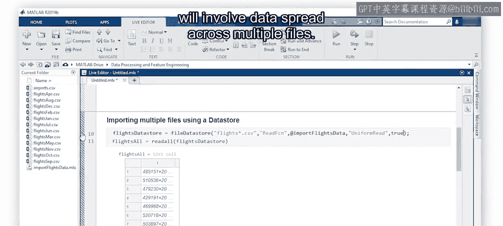

这些文件可能以相同的方式组织，但按日期分隔，例如航班数据。

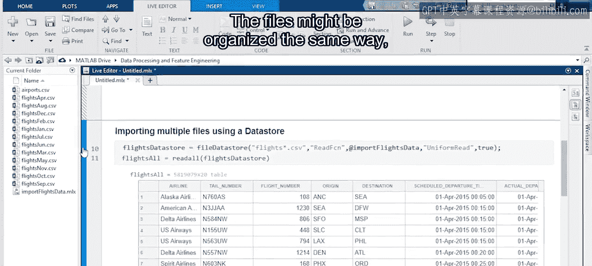

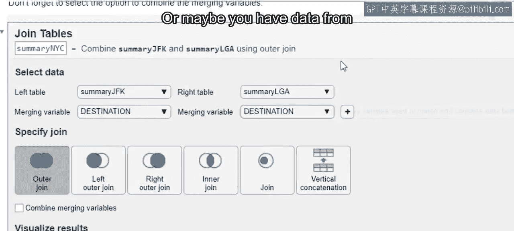

或者，你可能拥有来自不同来源但共享关键变量的数据。

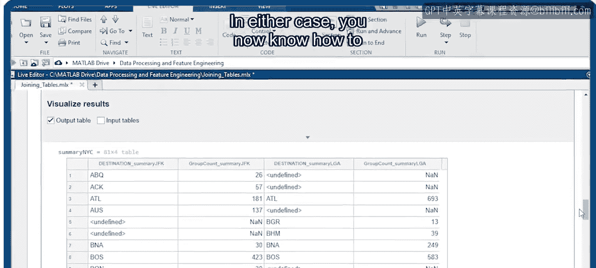

无论是哪种情况，你现在都知道如何为后续分析合并与组织你的数据。

然而，如果你不先清理数据，分析可能会很困难。缺失数据和异常值可能会使可视化结果产生偏差。

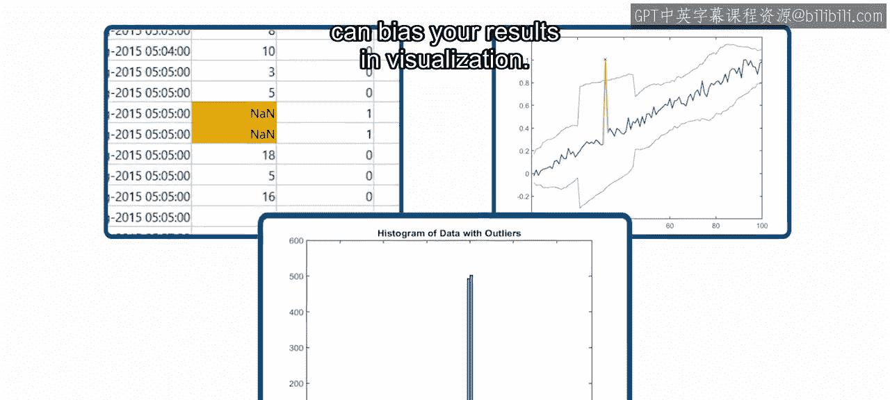

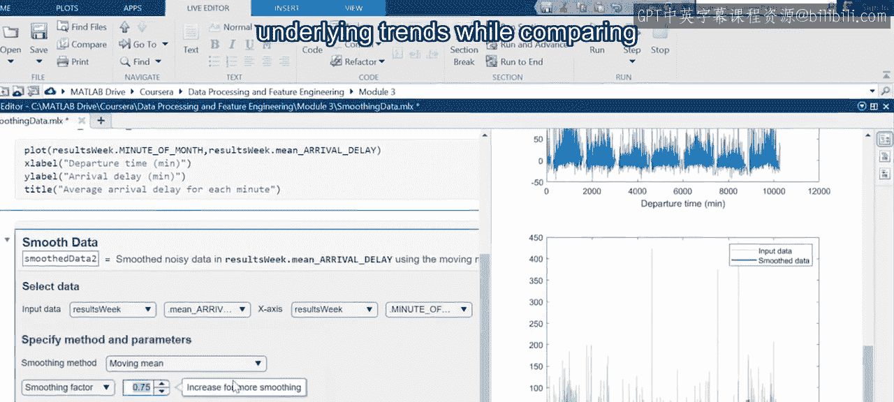

噪声数据可能掩盖潜在的趋势。

同时，比较具有不同尺度的变量的重要性也具有挑战性。

清理数据可能非常耗时，因为你通常需要测试许多不同的方法。你现在可以使用诸如实时编辑器任务、应用程序和专用函数等工具来快速迭代，并选择最适合你应用场景的方法。

清理数据之后，你就可以开始创建新特征了。你现在知道如何应用不同的方法来做到这一点。例如，你可以对现有变量应用一个**公式**。

或者使用无监督聚类算法对数据进行分组。

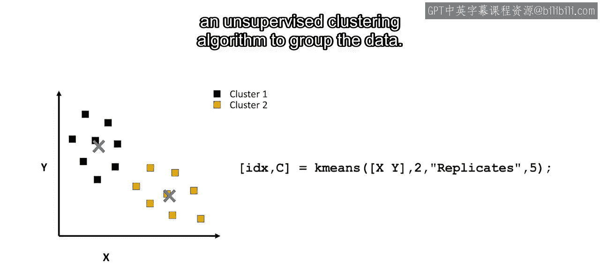

无论采用哪种方法，你都在寻找能更好地解释观测值方差的新特征。有用的特征可以减少构建预测模型所花费的时间，并有助于理解某些特征为何重要。

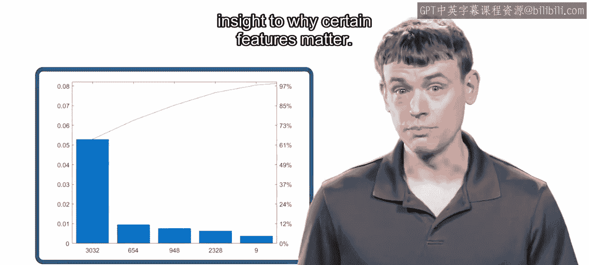

最后，你看到了所有这些概念在几个特定领域的示例中的应用。

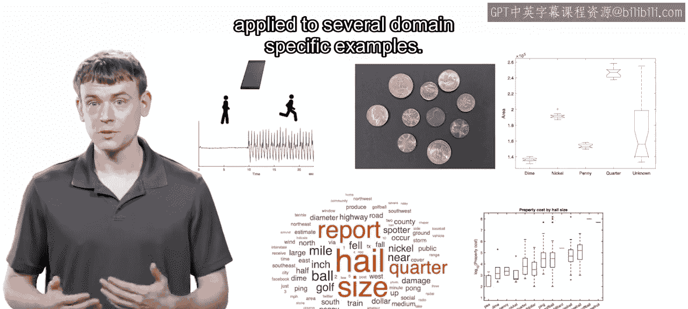

尽管处理信号、图像和文本的细节有所不同。

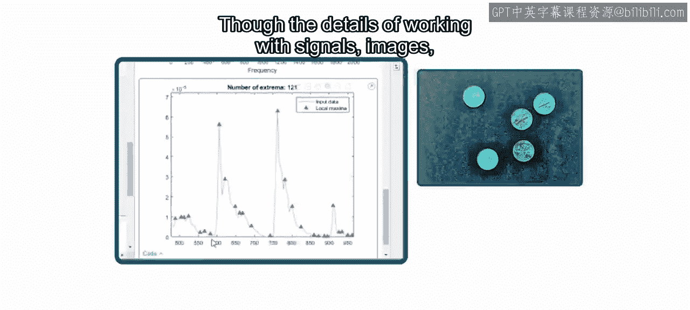

但你看到，整体的特征工程工作流程保持不变。

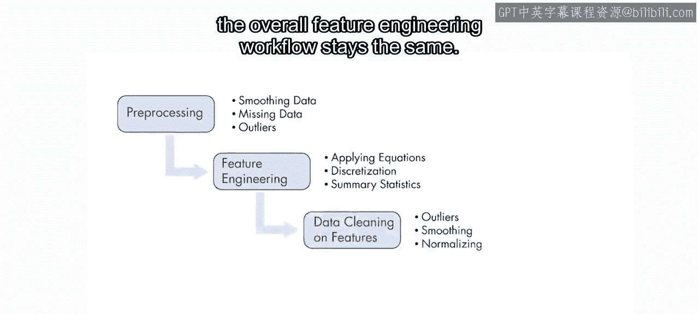

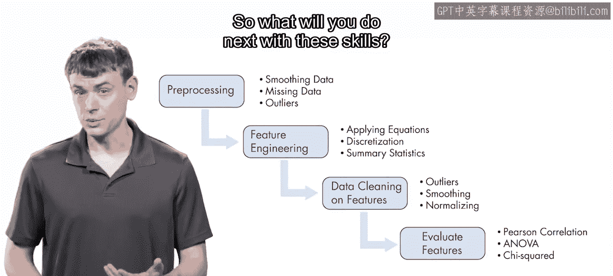

那么，接下来你将如何运用这些技能呢？

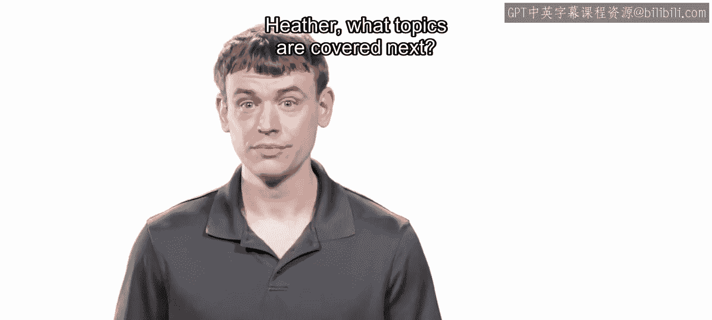

让我们问问Heather，她将带领你学习第三门课程。Heather，接下来涵盖哪些主题？

谢谢，Adam。现在你已经清理了数据并创建了特征，是时候将这些特征用于机器学习了。😊 在这门课程中，你将使用K均值和其他算法将数据聚类成组。

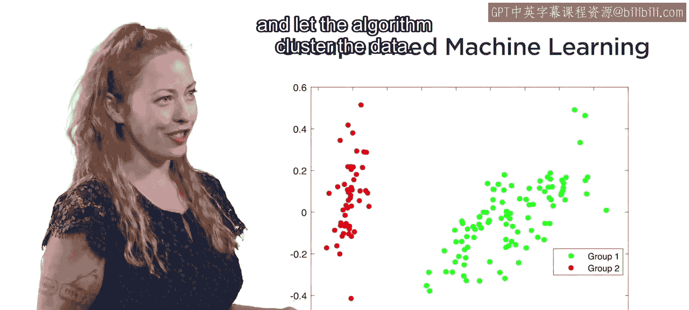

这被称为**无监督机器学习**，因为你只提供输入数据，让算法对数据进行聚类。

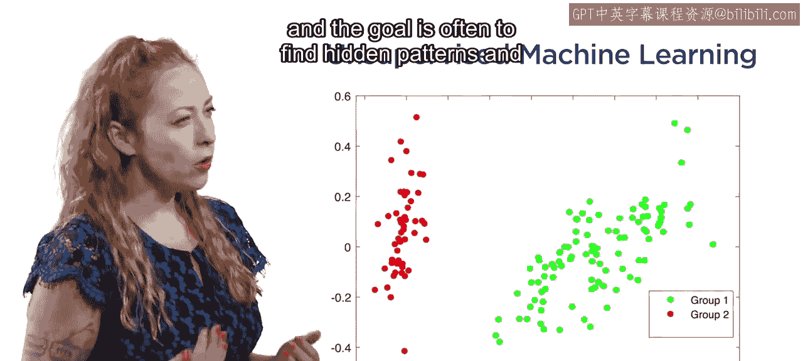

在无监督学习中，没有正确或错误的答案，其目标通常是发现隐藏的模式，并更多地了解数据的底层结构。

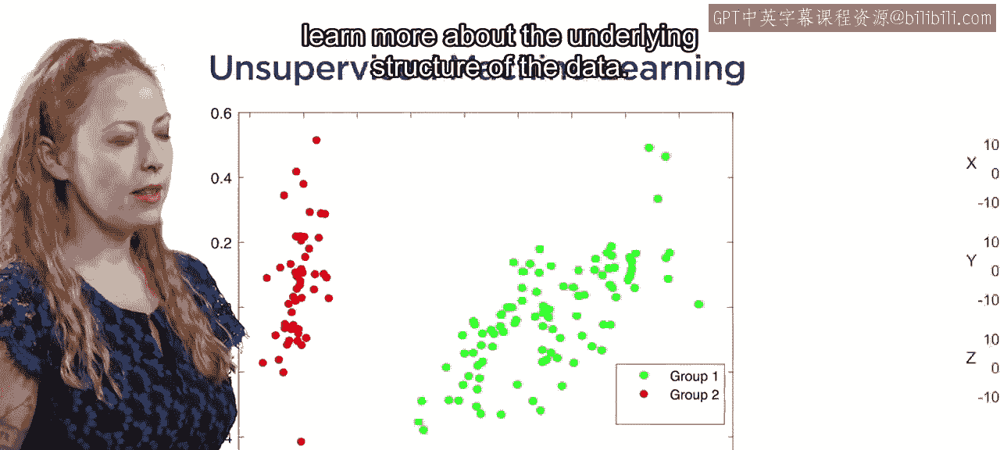

但考虑这样一种情况：你已知结果，例如手机传感器数据。在这种情况下，你希望利用已标记数据中的信息来训练一个能够正确识别活动的模型。

这被称为**监督机器学习**。在这个例子中，最终目标是将模型部署到人们可以用来跟踪其活动的设备上。

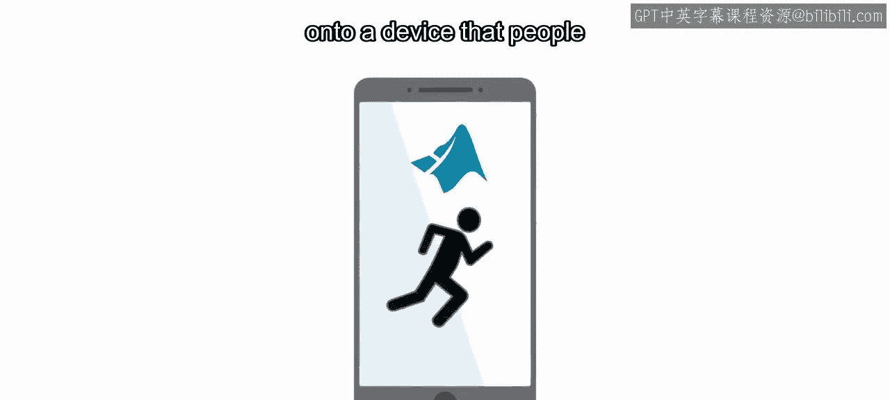

加入我们的第三门课程，学习如何将监督机器学习应用于你的数据。你将使用应用程序快速应用不同的机器学习算法，然后评估结果并优化你的模型。你还将学习如何解决常见问题，例如你的模型无法泛化到新数据。

我期待在那里见到你。

---

**总结**

在本节课中，我们一起学习了数据处理与特征工程的完整工作流程。我们回顾了如何合并多源数据、清理数据中的缺失值与异常值、处理噪声与尺度问题，并掌握了创建新特征（如应用公式或使用聚类算法）的方法。最后，我们了解到这些技能是通往机器学习（包括无监督与监督学习）的关键基础。