# 0：课程概述 🎼

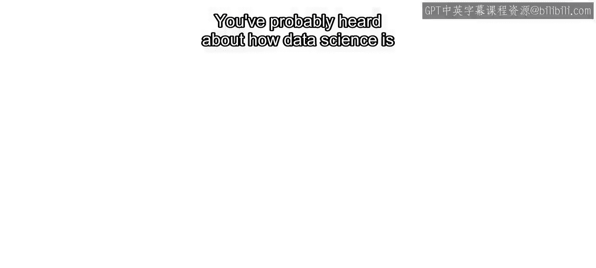

在本节课中，我们将要学习《实用数据科学与MATLAB》专项课程的总体介绍。您将了解数据科学如何改变世界，以及本课程如何帮助您掌握将原始数据转化为有意义结果的技能。

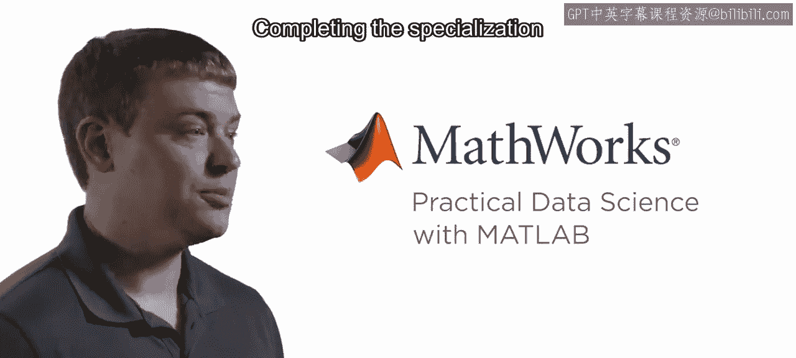

您可能听说过数据科学正在彻底改变医疗保健、汽车、消费电子等众多领域。实际上，几乎每个行业都受到了影响。如果您正在考虑学习这个专项课程，您很可能已经看到了数据科学在您自己领域的潜力。

无论您身处哪个领域，拥有强大的数据科学技能都能让您脱颖而出，并帮助您将原始数据转化为有意义的成果。这就是MathWorks创建《实用数据科学与MATLAB》专项课程的原因。完成此专项课程将为您提供快速取得实际成果所需的技能和信心。

在整个专项课程中，您将使用MATLAB。

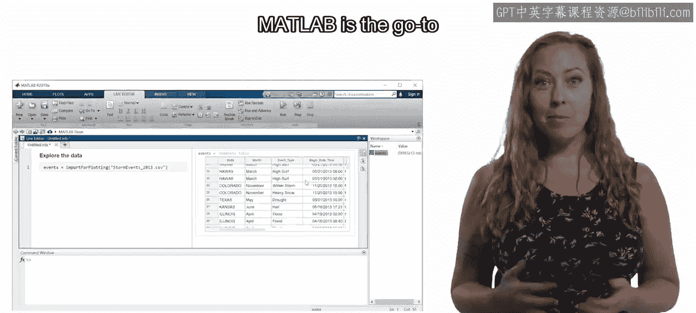

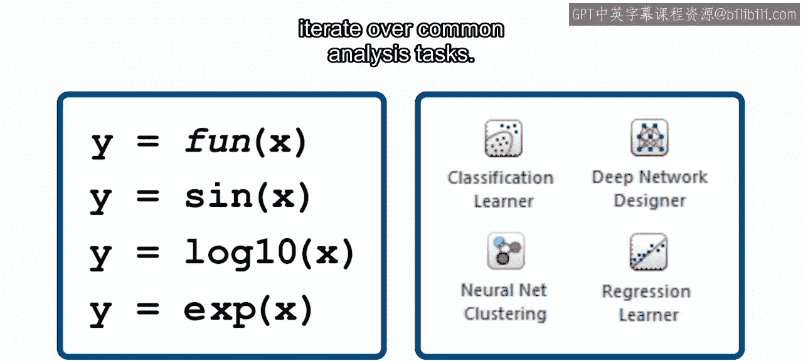

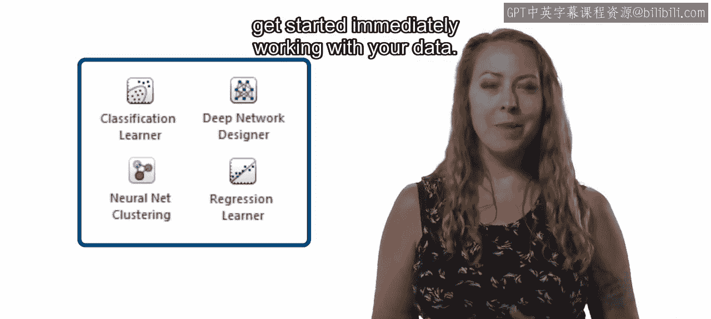

MATLAB是数百万工程和科学专业人士的首选工具，它提供了完成数据科学任务所需的能力。MATLAB使用熟悉的数学符号，并附带图形化应用程序，帮助您快速迭代常见的分析任务。这些应用程序减少了进行有意义的数据科学工作所需的时间，并帮助您立即开始处理数据。

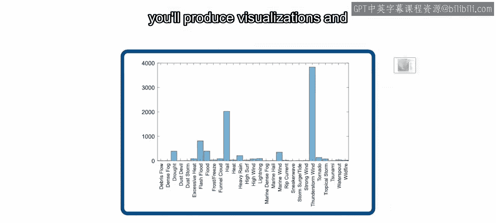

您了解您的领域，也了解您的数据。借助正确的工具和一些实践，您可以构建能够基于数据模式进行准确预测的模型。这些技术对于任何希望保持竞争力的公司都至关重要。

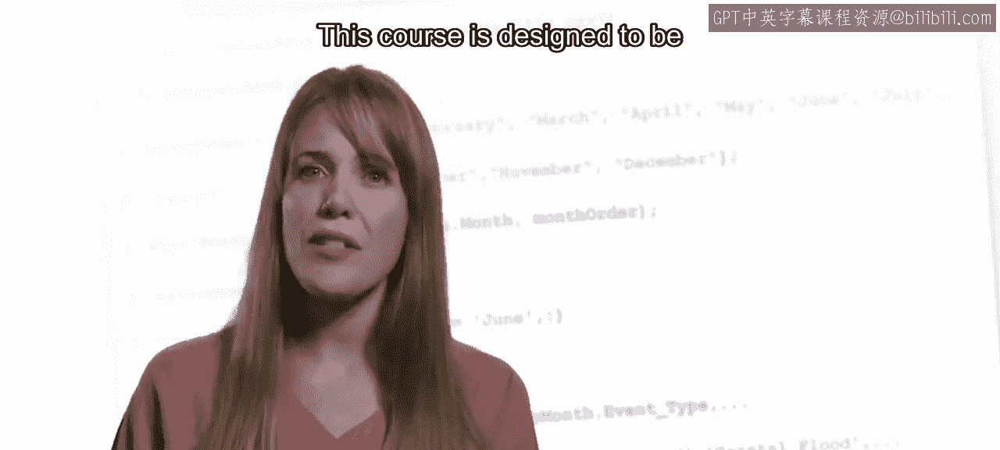

完成此专项课程后，您将能够使用自己的数据构建预测模型。这是当今雇主最需要的高需求职业技能之一。

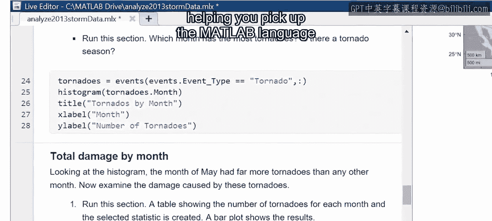

## 课程结构 📚

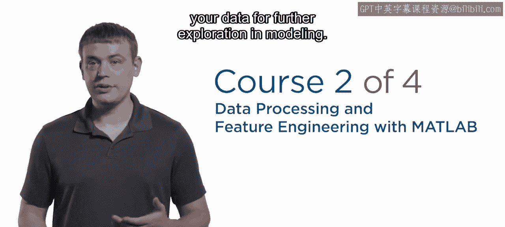

上一节我们介绍了课程的整体目标，本节中我们来看看这个四门课程的专项课程具体包含哪些内容。

以下是本专项课程四个核心课程的简要介绍：

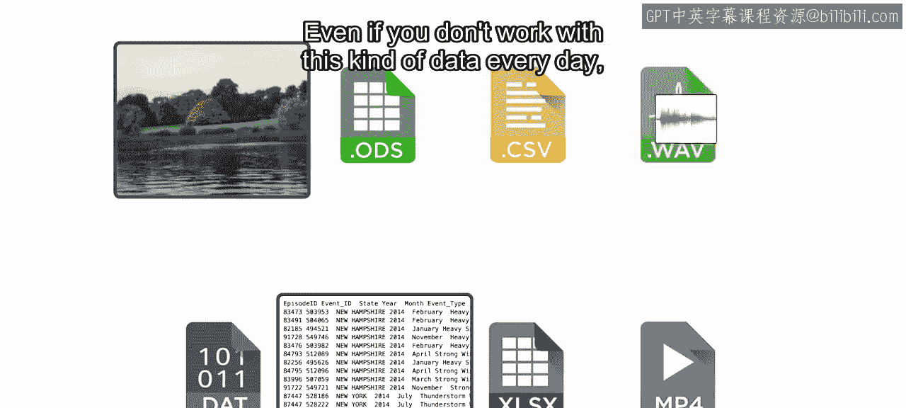

*   **第一门课程：数据探索**
    在这门课程中，您将学习如何使用MATLAB中的图形化工具探索数据。您将生成可视化图表并执行常见的统计分析。这门课程设计为适合所有技能水平的学习者入门。图形化工具使您能够快速尝试不同的技术和可视化方法。您执行的操作所对应的代码会显示在屏幕上，帮助您学习MATLAB语言并开始自己编写完整的脚本。

*   **第二门课程：数据预处理与特征工程**
    在第二门课程中，您将在第一门课的基础上，增加为后续探索和建模而对数据进行预处理的关键技能。完成这门课程后，您将能够整合来自不同来源的数据，去除异常值和缺失数据点等不需要的干扰，并开始构建用于分类和回归的基本模型。这门课程还探讨了您可能会遇到的特定类型数据，例如音频信号、图像和文本。即使您不每天处理这类数据，当需要时，您仍然可以应用相关的概念和应用程序。

*   **第三门课程：机器学习建模**
    当您进入第三门课程时，您将准备好开始使用MATLAB应用程序构建机器学习模型。您将尝试多种不同的建模技术和参数。当找到满意的组合时，您将构建模型并用它进行预测。与任何新技能一样，数据科学成功的关键在于实践。

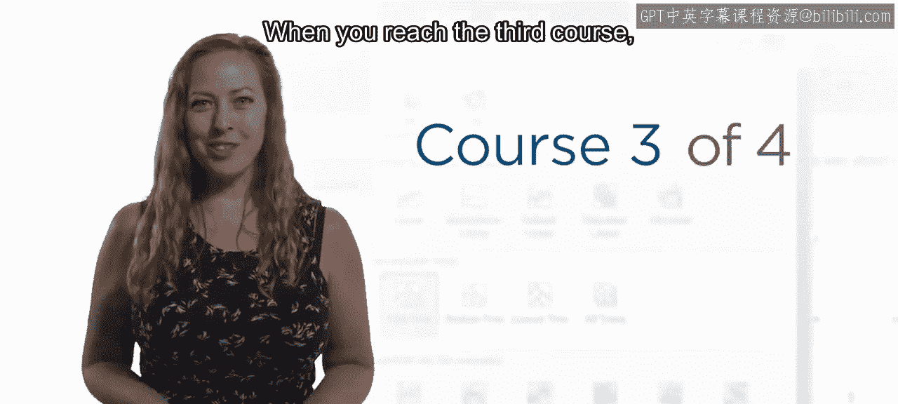

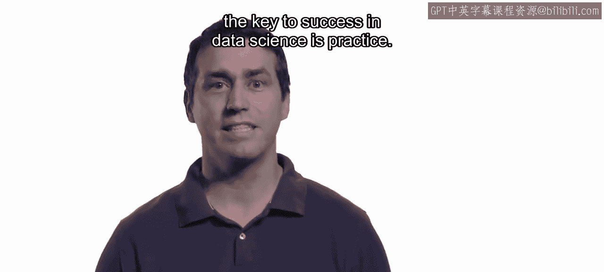

*   **第四门课程：毕业项目**
    最后的毕业项目涵盖了完整的数据科学工作流程。您将应用专项课程中所有课程学到的技能来构建一个预测模型。您将与同伴合作评估模型，更重要的是，从他们独特的视角中学习。

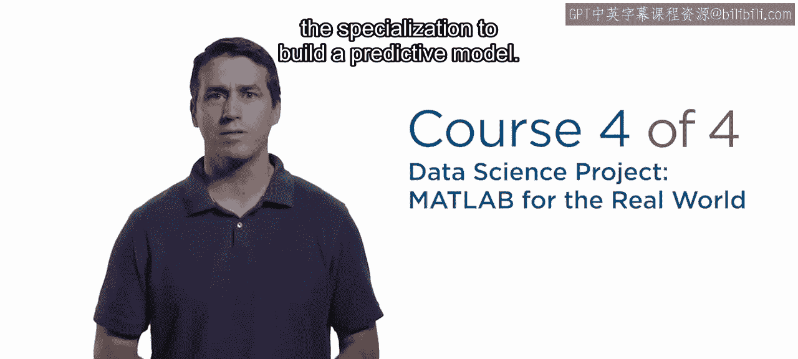

## 总结 🎯

本节课中我们一起学习了《实用数据科学与MATLAB》专项课程的概览。我们了解到数据科学在各行各业的重要性，以及MATLAB作为强大工具如何帮助我们从数据探索、预处理、机器学习建模到完成毕业项目，走完一个完整的数据科学工作流程。准备好开始构建实用的数据科学技能，为您所在的组织和行业带来改变了吗？让我们开始吧。