1：教师介绍 👨‍🏫

在本节课中，我们将认识本系列课程的讲师团队。每位讲师都将分享他们的背景、与MATLAB的渊源以及个人兴趣，帮助你了解他们丰富的行业经验和教学热情。

大家好。我是Adam Philllian。我是Heather Gore。我是Brendan Armstrong。我是Er Burnne。

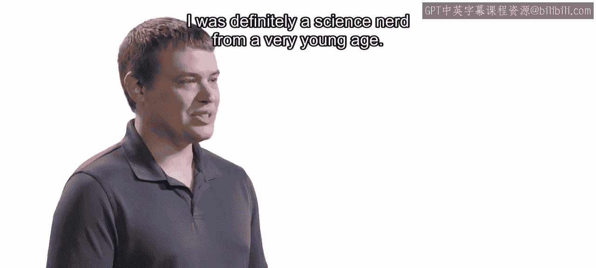

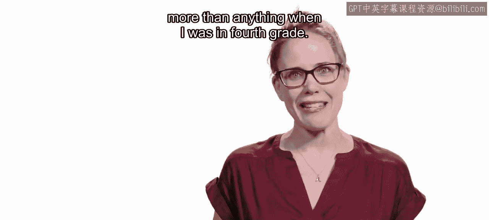

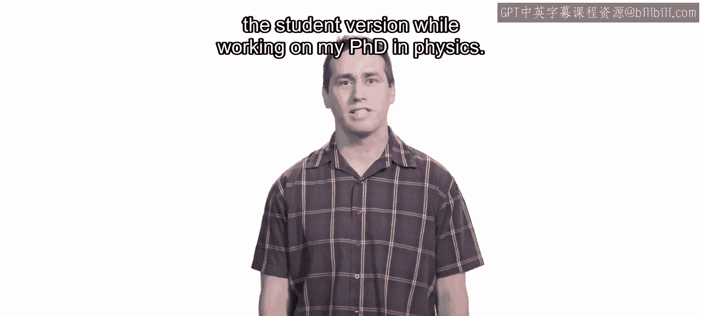

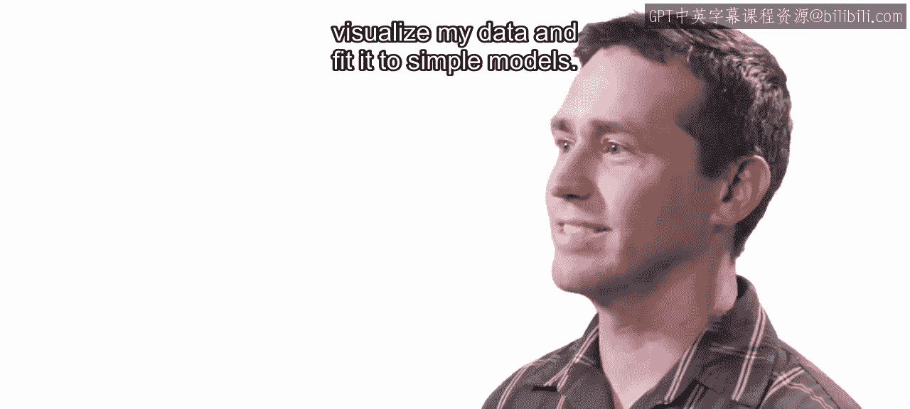

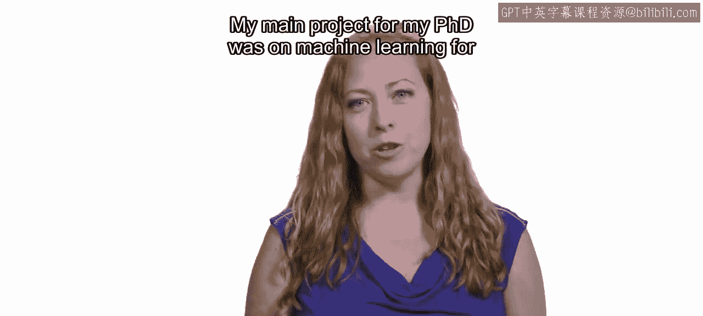

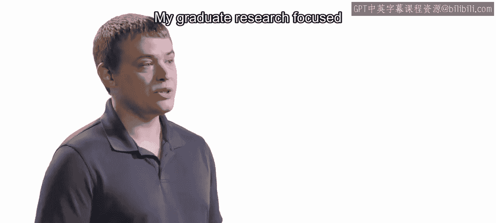

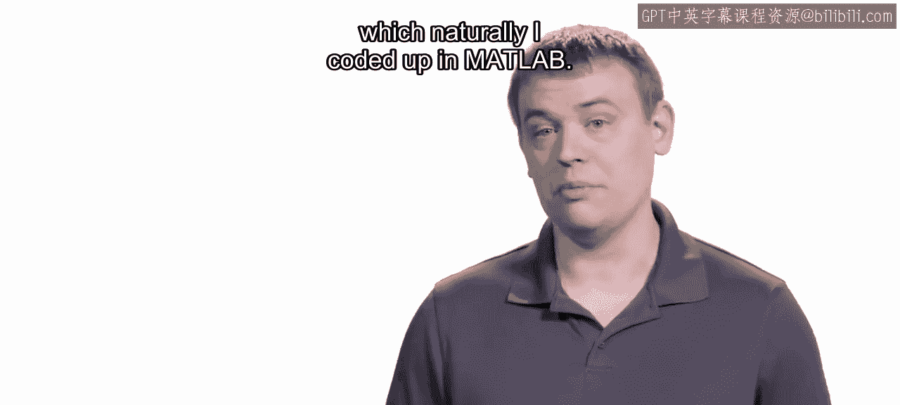

我是MathWorks的在线课程开发人员。我是MathWorks的产品经理。我是MATLAB和数据科学的技术产品营销经理。我是MathWorks的在线内容开发人员。

我从小就是一个科学爱好者。我在四年级时最大的梦想是成为一名迪士尼幻想工程师。我早在2004年就开始使用MATLAB，当时我在弗吉尼亚理工大学攻读航空航天工程学士学位。我在研究和教学中使用MATLAB已超过10年。我第一次接触MATLAB是在攻读物理学博士学位期间购买了学生版。我主要使用MATLAB来可视化数据并拟合简单模型。我第一次使用它是在哈维穆德学院攻读工程学期间。我博士期间的主要项目是关于生物流体模式识别的机器学习。那非常有趣。我的研究生研究集中在一种称为“晕轨道”的领域。我在这个领域的研究涉及寻找从低地球轨道到这些晕轨道的最优转移轨迹，自然地，我用代码实现了它。

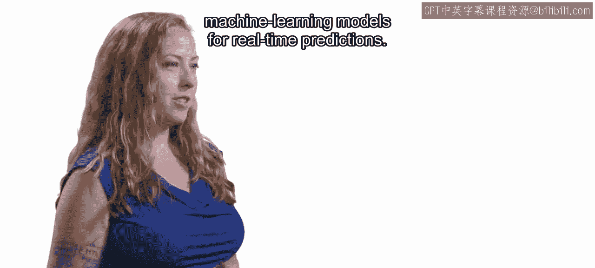

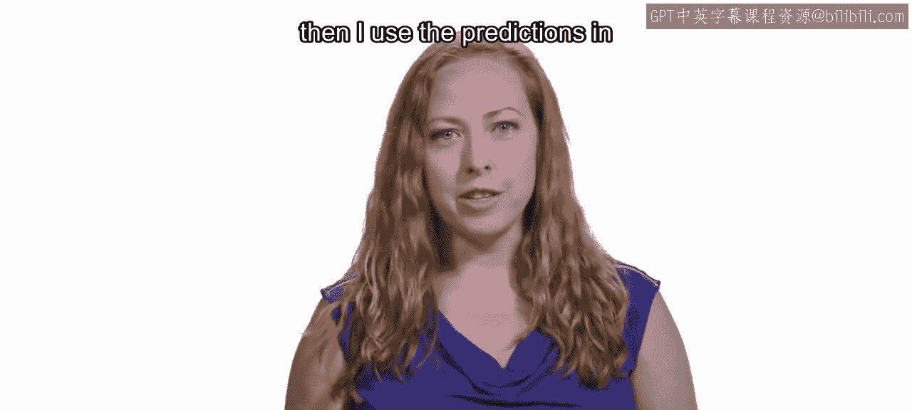

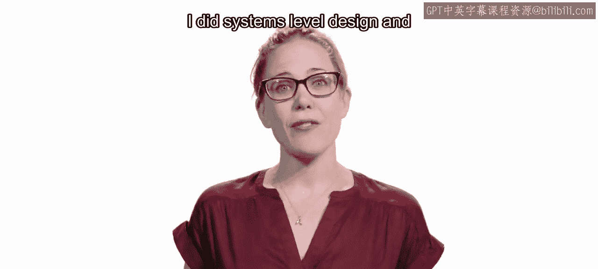

在MATLAB方面，最近一个很酷的项目是部署用于实时预测的机器学习模型。我在MATLAB中创建了信号处理和机器学习算法，然后在云上的流式架构中使用这些预测。我的职业生涯始于航空航天工程师。我为卫星和星际任务（包括火星探测漫游者）进行系统级设计和分析。在MathWorks，我的职责是帮助其他人学习如何将机器学习、深度学习和数据科学应用到他们的工作中。我与我们的开发组织合作，确定接下来要构建哪些新的数据科学工具。基本上，我的全部工作就是帮助像你这样的人开始并熟练地将MATLAB用于你的应用。我曾经是一名职业摇摆舞者。我是一名音乐家。

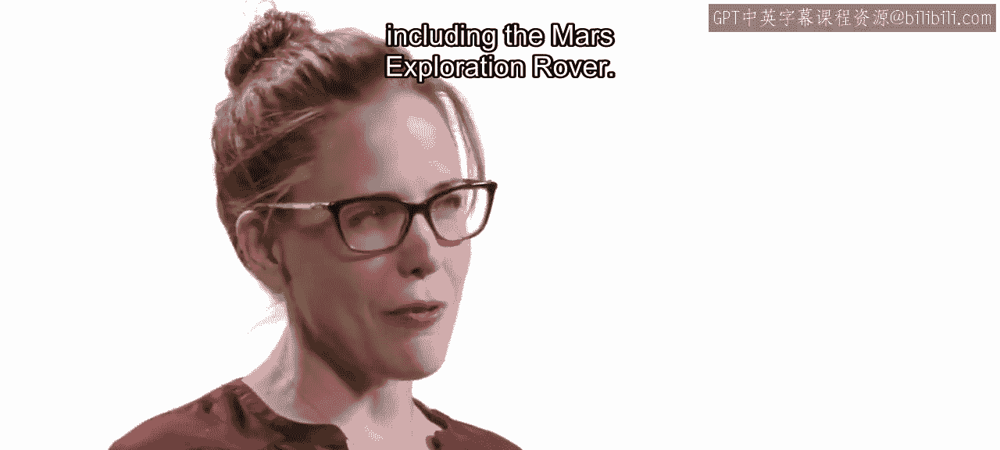

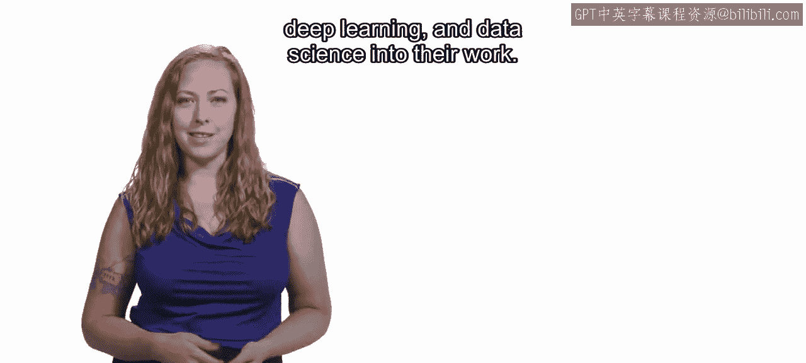

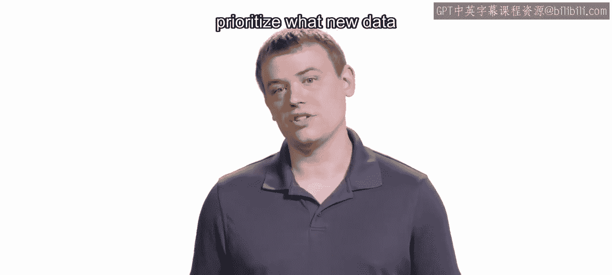

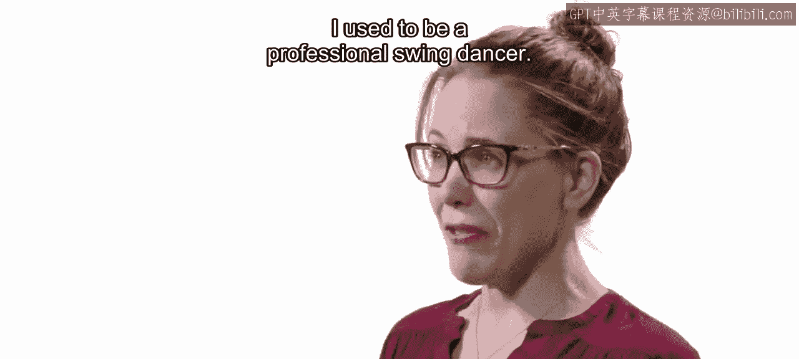

我弹吉他、打鼓，也喜欢唱歌和创作音乐。我认为我对音乐的热情确实对我的职业生涯有所帮助，因为我很有创造力，并且能从不同角度思考问题，这在数据科学中很重要。我开始涉足一些天文摄影。我最喜欢的一张是从邻居家车道上拍摄的猎户座星云照片，因为我家院子里的树挡住了视线。实际上，我在业余时间也会使用MATLAB，我就是喜欢摆弄数据。我每天早上第一件事就是打开MATLAB，甚至在查看邮件之前。在开始一天的工作之前，我会有一段小小的MATLAB时间。我非常高兴能在这个系列课程中与大家分享我的一些经验和来之不易的教训。我希望你能看到MATLAB如何帮助像你这样的领域专家在数据科学领域表现出色。

---

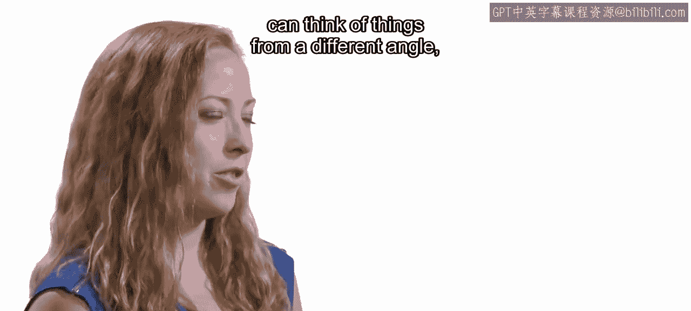

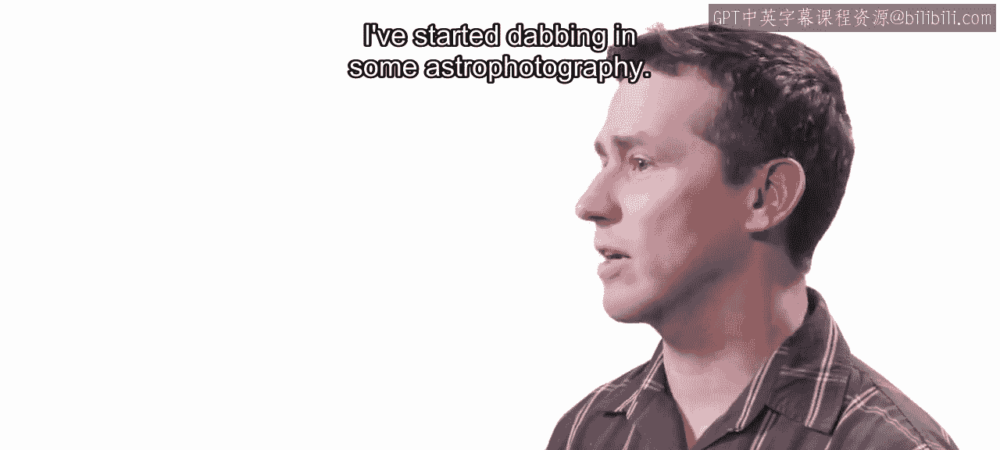

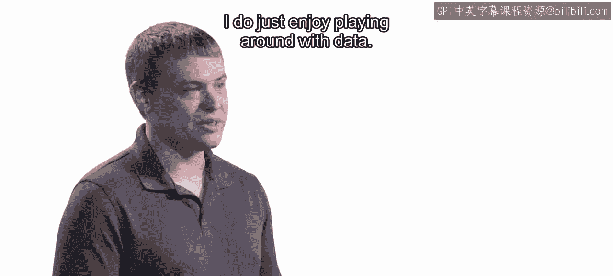

本节课中，我们一起认识了本系列课程的四位讲师：Adam、Heather、Brendan和Er。他们来自MathWorks的不同岗位，拥有从工程研究到产品开发与教学的丰富背景，并且都长期使用MATLAB解决实际问题。他们分享了各自的专业历程、与MATLAB结缘的故事以及工作之外的兴趣爱好。通过他们的介绍，我们了解到MATLAB在学术研究、工业应用以及新兴的数据科学和机器学习领域都扮演着重要角色。在接下来的课程中，他们将带领大家深入探索实用数据科学的各个方面。