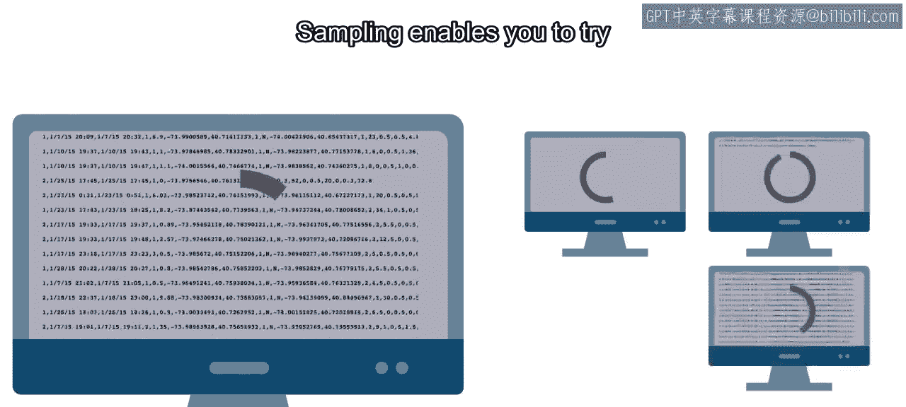
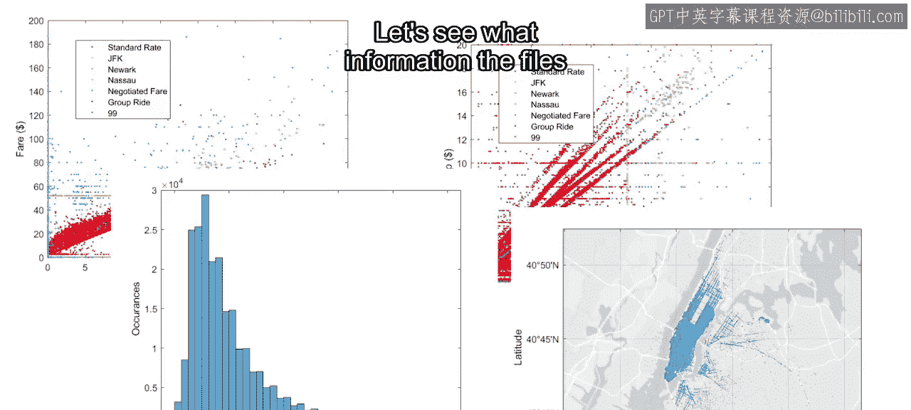
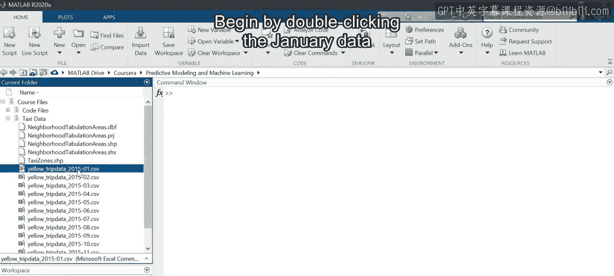
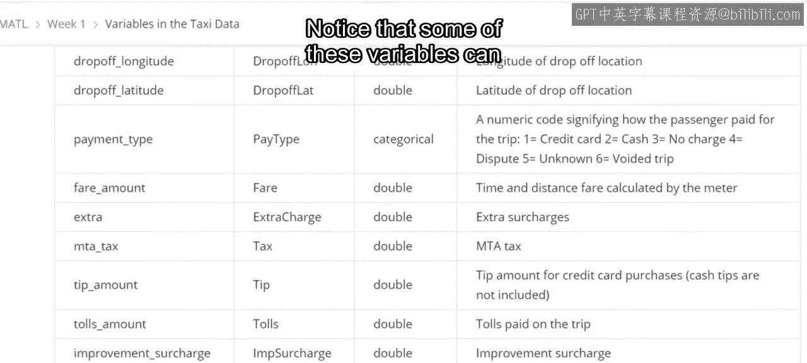
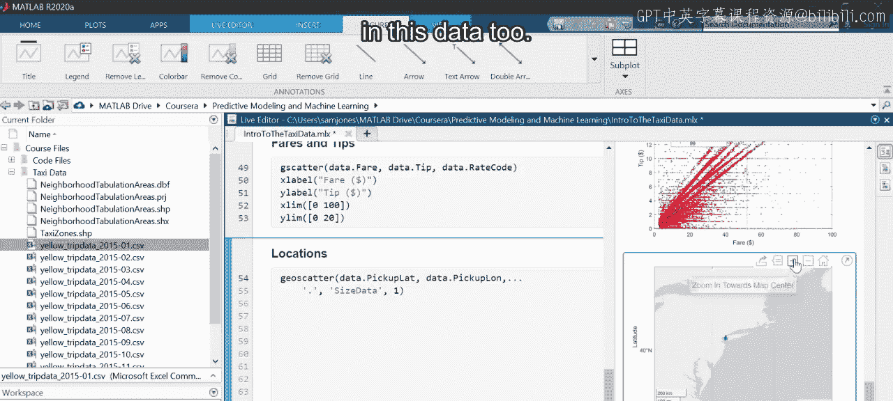

# 3：出租车数据介绍 🚖

在本节课中，我们将学习数据科学项目的第一步：理解数据。我们将以2015年纽约市黄色出租车行程的抽样数据集为例，介绍如何将数据文件导入MATLAB，如何通过可视化探索变量间的关系，以及如何识别数据中需要清理的问题，为后续构建预测模型做准备。


## 理解数据集

任何数据科学项目的第一步都是理解数据。在本课程中，主要数据集来自纽约市出租车和豪华轿车委员会提供的2015年纽约市黄色出租车行程抽样数据。


## 数据抽样与规模

2015年，纽约市的乘客进行了近3亿次黄色出租车行程。处理所有这些行程的完整数据集将需要大量的时间和计算资源。在这种情况下，通常的做法是使用一个较小的样本数据集。抽样使您能够快速尝试许多不同的模型和测试参数。





随后，完整的数据集可用于微调模型。提供的12个数据文件代表了从每个月随机抽取的总行程的2%。


## 导入数据到MATLAB

让我们通过将数据导入MATLAB来查看文件包含哪些信息。







首先，双击一月份的数据文件以打开导入工具。


每次行程都提供了许多详细信息，包括上车和下车的地点与时间、行程距离和车费。现在重命名一些冗长或不方便的变量名，将使后续输入更容易且不易出错。例如，`tpep_pickup_datetime` 可以缩短为 `pickup_time`。


请注意，您可以通过在导入工具中单击变量名来更改它。让我们也给其他变量起更短、更具描述性的名称。本视频后的阅读材料列出了数据文件中的原始名称以及您将在本课程中使用的名称。





请注意，其中一些变量只能取少数几个值。例如，`rate_code` 只能取值1到6。将 `rate_code`、`vendor` 和 `payment_type` 的数据类型更改为 `categorical`。


看起来不错，让我们生成一个脚本并探索数据。运行脚本将一月份的出租车数据导入到一个表中。大多数变量，如上车和下车的日期时间，都已准备就绪可以使用。然而，分类变量都以数字作为类别名称。例如，费率代码“1”不如“标准费率”这个类别直观。


让我们使用实时编辑器来更改这些。单击变量名旁边的三角形并选择“编辑类别”。然后将类别名称从数字更改为实际的费率代码。您可以在本视频后的阅读材料中找到费率代码列表。


现在对 `payment_type` 和 `vendor` 变量重复此过程。单击“更新代码”按钮，使这些更改成为实时脚本的一部分。别担心，您不需要每次都执行这些步骤，课程中会为您提供函数来使用。


## 数据可视化探索

可视化数据是快速了解变量的好方法。直观上，您会期望行程距离和车费之间存在关系。让我们通过创建车费随距离变化的散点图来验证一下。


```
scatter(taxiData.trip_distance, taxiData.total_amount)
```

嗯，这个330万英里的行程似乎不太可能，因为这大约是往返月球六次的距离。而且许多负车费值也很可疑。这些异常值主导了整个图表。


纽约市从北到南大约40英里，从图表来看，大多数车费似乎低于200美元。让我们将x轴限制在0到40英里之间，y轴限制在0到200美元之间。


这很有趣。图中似乎存在三种线性关系。一种是水平的，表明是固定车费，与距离无关。这些是否与不同的费率类型有关？使用以 `rate_code` 作为分组变量的分组散点图应该能回答这个问题。


```
gscatter(taxiData.trip_distance, taxiData.total_amount, taxiData.rate_code)
```

固定费率线对应于JFK机场费率代码类别。看起来另外两条线性关系对应于标准费率和纽瓦克机场费率。仅仅一个图表就让我们对数据集的趋势有了相当深入的了解。


## 分析变量分布

散点图显示了车费如何随行程距离变化，但这两个变量的分布情况如何？直方图将显示每种距离和每种车费的行程发生的频率。


```
histogram(taxiData.trip_distance)
```

好吧，那个前往外太空的300万英里行程再次主导了图表。处理直方图中异常值的一种方法是将箱边缘指定为第二个输入参数。任何落在箱外的点都将被排除在绘图之外。


```
histogram(taxiData.trip_distance, 0:0.25:10)
```

将箱边缘设置为从0到10英里，以0.25英里为间隔，能更好地揭示分布情况。大多数行程少于两英里，但许多较长的行程使数据向右偏斜。


车费是否显示出相同的趋势？让我们制作一个直方图看看。


```
histogram(taxiData.total_amount)
```

数据中存在一些非常高的车费。大多数车费相当小，但在远离主群的地方有一个大的尖峰。指定箱边缘，确保包含那个尖峰。使用从0到60美元的1美元增量应该可以捕捉到它。


```
histogram(taxiData.total_amount, 0:1:60)
```

车费显示出与距离直方图类似的偏态分布，但在52美元处有一个近5000美元车费的尖峰。这对应于分组散点图中JFK费率代码的水平线。


## 探索小费模式

车费只是出租车行程成本的一部分，小费应该是多少？让我们看看小费随车费变化的情况。


```
scatter(taxiData.total_amount, taxiData.tip_amount)
```

看起来有一些非常慷慨的付小费者。还有一些负值，这些肯定是记录错误的数据。从图表来看，似乎20美元的小费和100美元的车费将涵盖大部分数据。让我们将这些用作坐标轴限制。


```
xlim([0 100])
ylim([0 20])
```

有趣的是，您可以看到许多对应于固定金额的水平和垂直线，以及对应于小费占车费百分比的斜线。让我们再次尝试按 `rate_code` 分组，看看这个变量是否能解释这种行为。


```
gscatter(taxiData.total_amount, taxiData.tip_amount, taxiData.rate_code)
```

大多数标准费率车费落在图的左侧，而特殊费率代码构成了更多的高车费行程。


## 可视化上车地点

到目前为止，您只关注了出租车行程的成本。黄色出租车可以在城市的任何地方接载乘客。上车地点是否存在某种模式？使用地理散点图来可视化这些位置。


```
geoscatter(taxiData.pickup_latitude, taxiData.pickup_longitude)
```



看起来这些数据中也有一些极端的异常值。


将地图中心定位在纽约并放大。哇，您可以看到中央公园的轮廓。单击“更新代码”并将这些新的边界保存到实时脚本中。


## 总结与下一步

在本节课中，我们一起学习了如何导入和初步探索出租车数据集。您已经发现了数据集中的几种趋势和模式，同时也找到了许多异常值和错误值，例如负成本和不可能的大距离。在使用数据进行预测之前，需要清理这些数据。后续课程中，您将运用目前所学的知识来清理数据并生成一些有用的特征。