# 4：创建和清理特征

在本节课中，我们将学习如何为预测模型创建和清理特征。我们将以纽约市出租车数据为例，探索如何从原始数据中提取有用的信息，并处理其中的错误和异常值，为后续的机器学习建模做好准备。

## 数据准备与特征提取

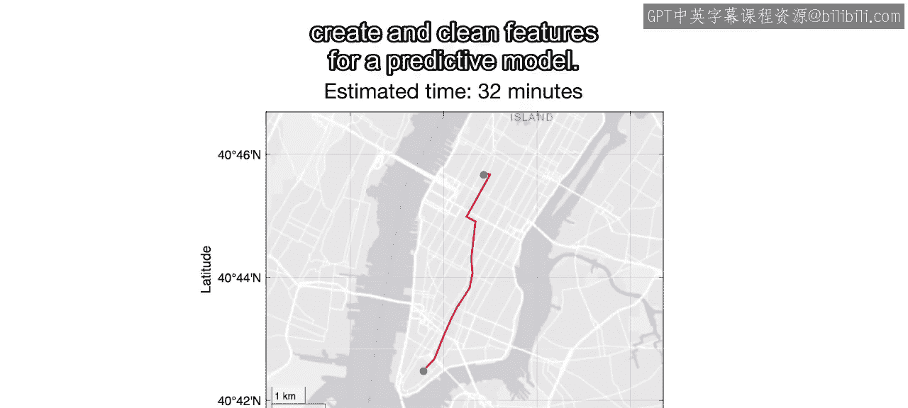

上一节我们介绍了数据科学项目的基本流程，本节中我们来看看如何从原始数据中提取核心特征。

现代导航软件的核心功能之一是根据历史数据预测行程时间。对于出租车数据，我们需要计算行程时长，并从记录的上车时间中提取一天中的具体时刻。

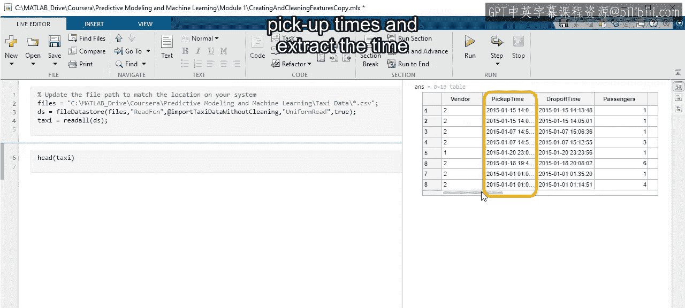

以下是我们可以从现有数据中直接计算或提取的特征：
*   **行程距离**：数据中已记录。
*   **上车/下车地点**：数据中已记录。
*   **行程时长**：通过计算下车时间与上车时间的差值获得。
*   **上车时刻**：从记录的上车时间中提取。

## 数据清理的必要性

然而，真实数据总是杂乱的。错误和异常值会干扰分析并导致计算偏差，因此在生成新特征前，必须对数据进行清理。

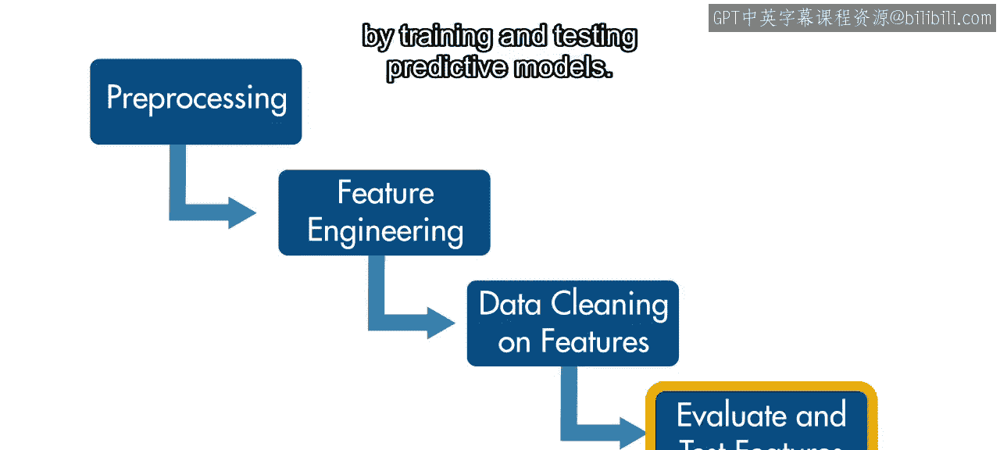

清理完成后，我们可以生成所需的新变量或特征。在对新特征进行任何必要的额外清理后，就可以通过训练和测试预测模型来评估它们的有效性了。

## 开始数据清理

首先，让我们检查原始数据中存在多少未定义的条目。我们可以使用 `ismissing` 函数返回的非零索引数量进行计数。

```matlab
% 检查缺失值数量
numMissing = sum(ismissing(rawData));
```

在这个案例中，没有未定义的值，但这并不意味着没有错误。

使用 `summary` 函数，可以看到距离数据中存在为零的条目。我们知道这些是错误，因为行程距离为零没有意义，可以将它们视为缺失数据。

计算受这些错误影响的数据百分比，发现它非常小，不到1%。此外，这些条目似乎是随机出现的，因此可以安全地删除它们，而不会使分析产生偏差。

利用领域知识，可以对其他应为正值或非负值的变量进行相同的基本合理性检查，例如乘客数量、车费、附加费和总费用。

## 识别和处理异常值

查看变量的分布是识别异常值的好方法。让我们从剩余的距离数据开始。直方图显示，一些非常大的异常值使可视化产生了偏差。

箱线图证实存在少数极端异常值，并且大部分数据集中在更低、更合理的数值上。还可以看到分布严重偏斜，这使得许多基于分位数的异常值去除方法并不理想。

例如，基于标准四分位距的边界会切掉6.5英里以上的所有数据。如果删除这些数据，将会丢失大量完全合理的行程。

相反，让我们使用 `prctile` 函数来检查去除顶部0.01%数据的边界在哪里。

```matlab
% 计算去除顶部0.01%数据的距离边界
upperBoundDistance = prctile(cleanedData.trip_distance, 99.99);
```

结果显示大约是40英里，考虑到纽约市的地理范围，这似乎是一个合理的上限。使用 `rmoutliers` 函数执行此清理后，得到了更合理的分布。

## 清理地理位置数据

现在让我们看看上车和下车地点。回顾 `summary` 结果，会注意到上车地点的坐标为 (0, 0)，位于赤道和本初子午线上。下车地点也存在同样的情况。这些一定是错误，因为出租车不可能穿越海洋。

让我们在纽约市周围定义一个宽泛的区域，只包含合理的坐标，例如北纬40度到42度，西经75度到73度。

为了消除该区域之外的所有位置，使用一个逻辑向量，然后用这个向量索引表格。

以下是创建逻辑向量的步骤：
1.  上车纬度必须大于等于下限，且小于等于上限。
2.  下车纬度必须满足相同条件。
3.  上车经度必须满足类似条件（注意经度值为负）。
4.  下车经度也必须满足相应条件。

```matlab
% 定义初始地理边界
latMin = 40; latMax = 42;
lonMin = -75; lonMax = -73; % 西经为负值

% 创建逻辑向量筛选合理的地理位置
validLocations = (data.pickup_latitude >= latMin) & (data.pickup_latitude <= latMax) & ...
                 (data.dropoff_latitude >= latMin) & (data.dropoff_latitude <= latMax) & ...
                 (data.pickup_longitude >= lonMin) & (data.pickup_longitude <= lonMax) & ...
                 (data.dropoff_longitude >= lonMin) & (data.dropoff_longitude <= lonMax);

% 应用筛选
cleanedData = data(validLocations, :);
```

现在使用 `geoplot` 函数在地图上可视化该区域内的数据，首先从上车地点开始。

```matlab
geoplot(cleanedData.pickup_latitude, cleanedData.pickup_longitude, ‘.’, ‘MarkerSize’, 1)
```

基于上车地点，看起来可以进一步缩小区域范围。为了可视化下车地点，复制并粘贴上面的代码，将表格变量更改为下车纬度和经度。同样，围绕市中心的一个更小区域似乎就能捕获所需的数据。

为了找到更精确的边界，让我们使用直方图来可视化下车纬度的分布，然后将上车纬度添加到同一图中，并添加图例作为参考。北纬40.6度到40.9度似乎可以涵盖几乎所有数据。

让我们将清理边界更新为这些新值。现在，对经度重复这个过程。复制刚刚使用的代码，并将表格变量编辑为经度变量。结果非常相似。这次，西经-74.2度到-73.6度的范围基本上涵盖了一切。因此，让我们也更新这些边界。

使用这些新边界重新运行清理和地图可视化代码，可以看到上车地点和下车地点现在看起来合理多了。

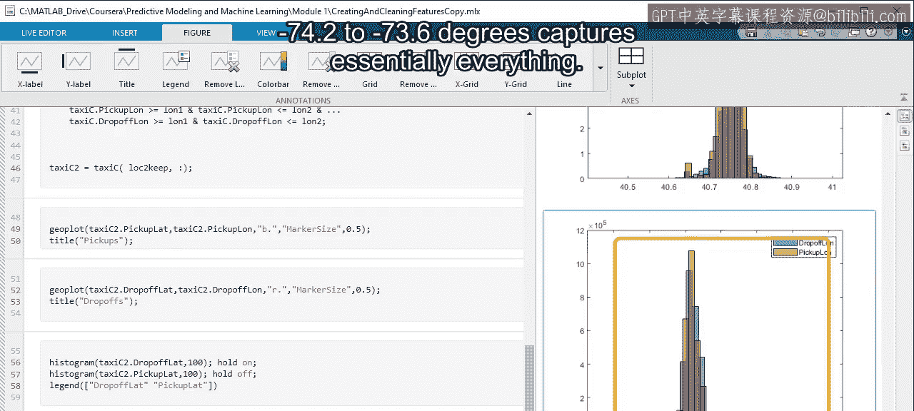

最后，为了谨慎起见，让我们验证被移除的位置数据百分比是否不太高。结果小于2%，看起来不错。

## 创建并清理衍生特征

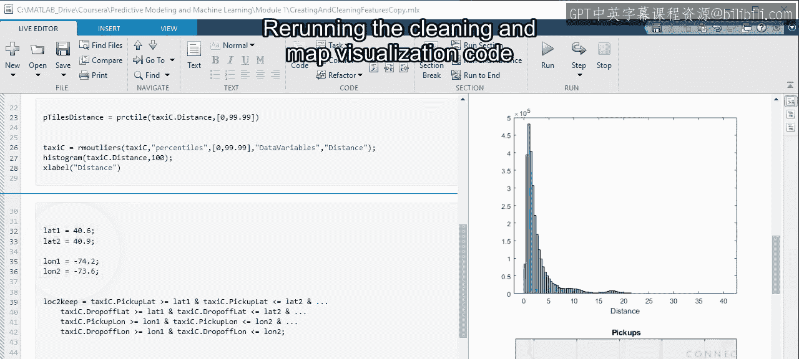

现在我们已经清理了距离和位置数据，接下来需要查看的变量是行程时长和上车时刻。由于这些在原始数据中不存在，我们需要创建它们，并且可能也需要清理它们。

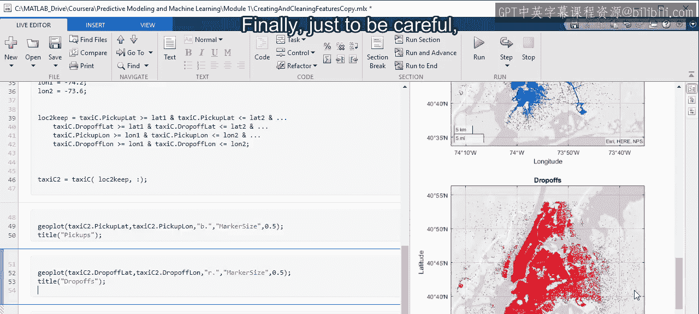

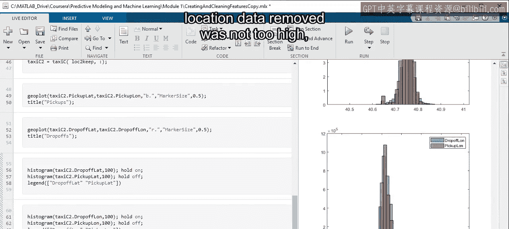

使用 `timeofday` 函数从上车日期时间中提取一天中的时刻非常简单。

```matlab
% 提取上车时刻
cleanedData.pickup_timeofday = timeofday(cleanedData.tpickup);
```

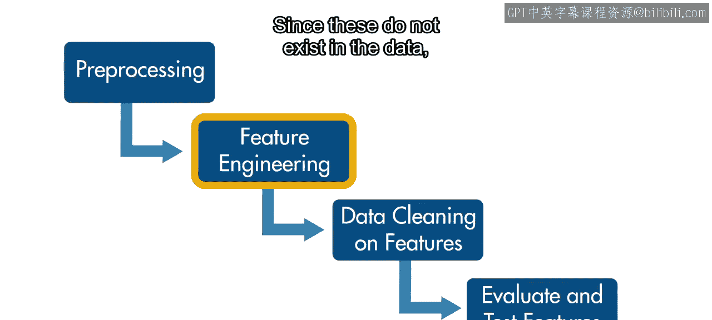

查看其分布没有发现任何不合理之处，因此这个特征似乎不需要额外清理。让我们使用 `hours` 函数将这个持续时间变量转换为数值变量，因为这是机器学习算法所需要的。

接下来，通过计算下车时间与上车时间的差值来计算行程时长。使用 `minutes` 函数将其从持续时间数据类型转换为数值型的分钟数。

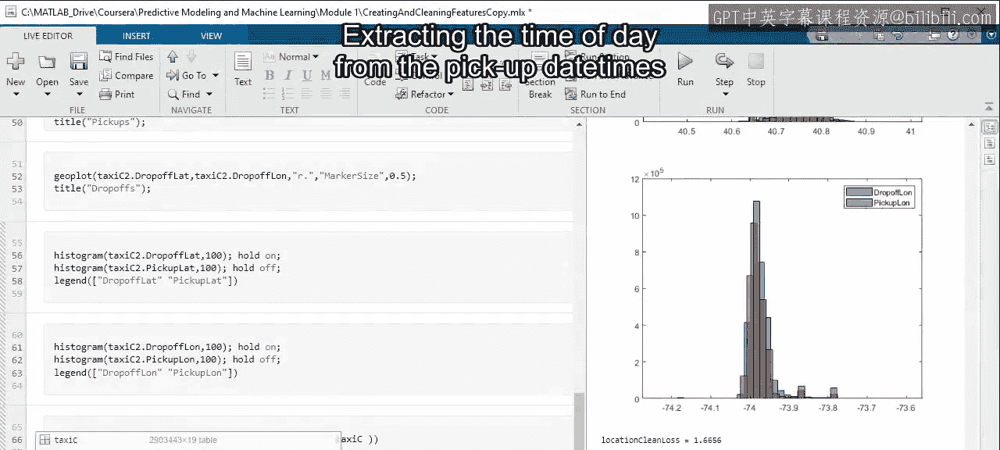

```matlab
% 计算行程时长（分钟）
cleanedData.trip_duration_min = minutes(cleanedData.tdrop - cleanedData.tpickup);
```

现在，让我们查看这个特征的直方图。这次，分布清楚地表明需要进行一些清理。没有人会乘坐超过10,000分钟的出租车。

## 清理行程时长特征

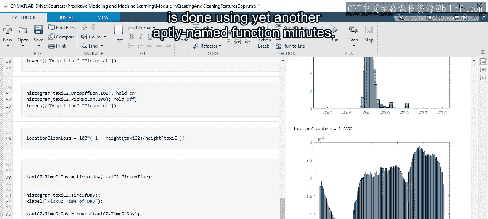

基于这些结果，下一步是清理这个特征。通常，清理一个新特征通常是必要的，即使用于计算它的变量本身似乎没有异常。

再次从一些基本的合理性清理开始。行程时长必须为正数，并且肯定远小于一整天。

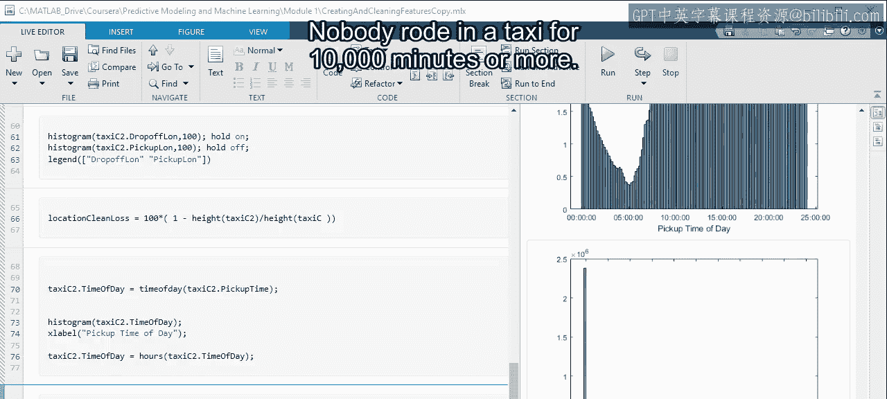

```matlab
% 基本合理性清理：时长大于0且小于24小时（1440分钟）
validDuration = (cleanedData.trip_duration_min > 0) & (cleanedData.trip_duration_min < 1440);
cleanedData = cleanedData(validDuration, :);
```

双重检查清理掉的数据百分比，发现这基本上没有移除任何数据。然而，从零分钟到一整天仍然是一个不合理的大范围。

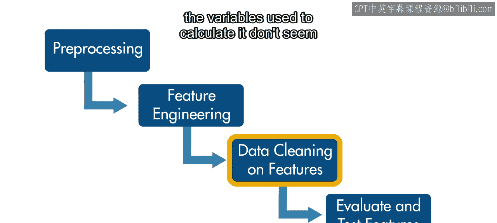

尝试使用 `prctile` 函数计算从顶部和底部均匀移除1%数据的边界。

```matlab
% 计算移除底部0.5%和顶部99.5%的边界
lowerBound = prctile(cleanedData.trip_duration_min, 0.5);
upperBound = prctile(cleanedData.trip_duration_min, 99.5);
validDuration2 = (cleanedData.trip_duration_min >= lowerBound) & (cleanedData.trip_duration_min <= upperBound);
cleanedData = cleanedData(validDuration2, :);
```

大约1.5分钟到接近70分钟的范围似乎是合理的。最后，重新可视化分布，现在看起来现实多了。

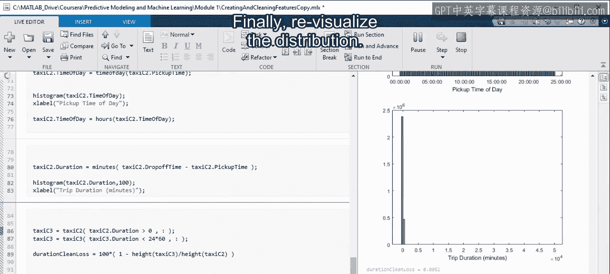

## 总结与下一步

至此，我们已经准备好通过训练和测试预测模型来开始评估所选特征的效果了。

请记住，特征工程是一个迭代过程。可能需要返回前面的步骤执行额外的清理或计算新的特征，以增强模型。

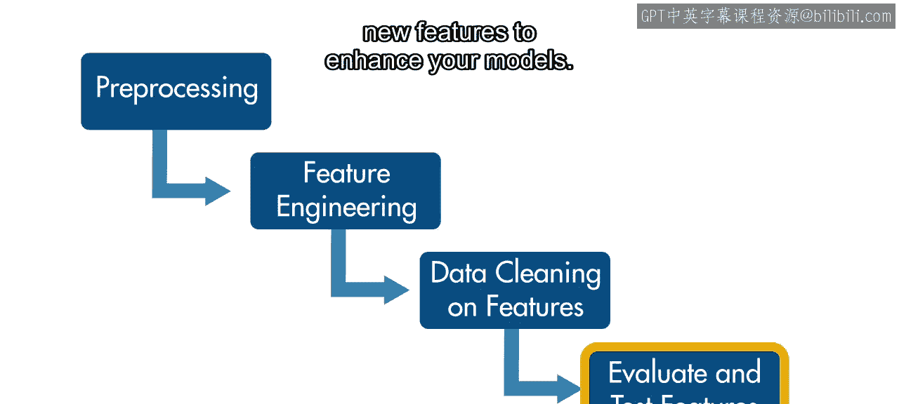

在本节课中，我们一起学习了如何从原始数据中创建核心特征（如行程时长和时刻），并系统地清理数据中的错误和异常值（包括零值、不合理的地理坐标和极端的行程时长）。这些步骤是构建可靠预测模型的重要基础。