# 6：使用回归学习器应用程序 🚖

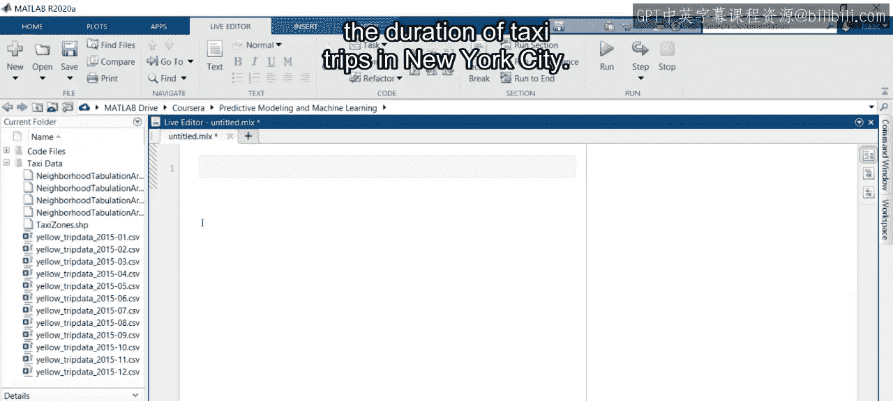

在本节课中，我们将学习如何使用MATLAB的回归学习器应用程序，通过迭代地选择、训练和评估多种回归模型，来预测纽约市出租车行程的时长。

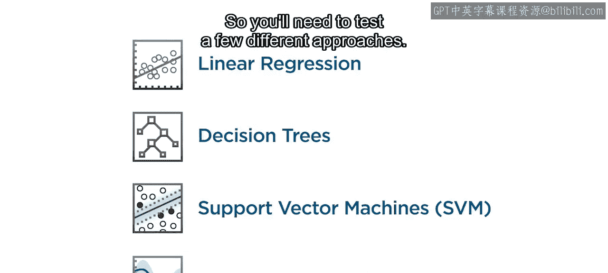

---

有多种回归模型可供选择，但通常无法预先知道哪一种最合适。因此，需要测试几种不同的方法。

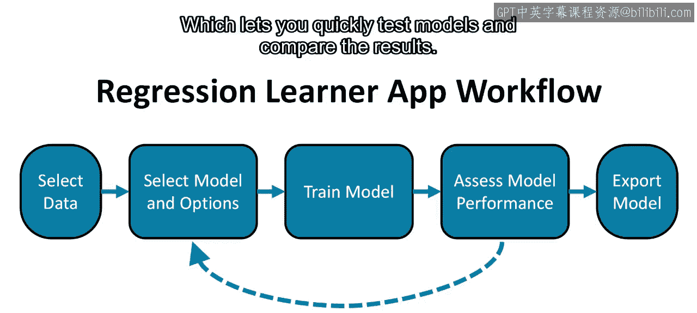

回归学习器应用程序可以帮助你快速训练模型。它协助完成从选择数据到导出训练模型的整个过程。选择、训练和评估模型的任务是迭代进行的。这种探索过程是该应用程序工作流程的优势，它让你能够快速测试模型并比较结果。

为了跟上进度，首先需要将出租车数据导入MATLAB。使用数据集附带的定制导入函数来导入五月份的数据。行程时长很可能与一天中的时间有关。因此，我们添加“time_of_day”作为一个新特征，以考虑交通状况的潜在变化。课程文件中提供的名为`add_time_of_day`的函数可以为你完成此特征提取。它会创建一个名为`time_of_day`的新变量，这是一个介于0到24之间的连续数字，代表行程开始的小时数。现在，你已准备好使用回归学习器应用程序对出租车数据进行建模。

---

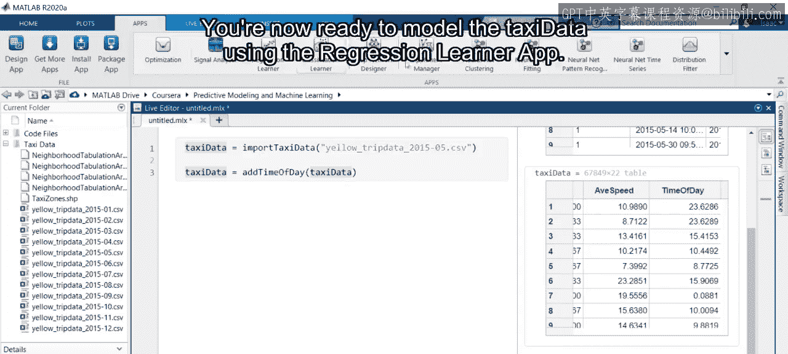

### 选择数据

应用程序工作流程的第一步是选择要建模的数据。

首先点击“新建会话”按钮。这会打开一个窗口，提示你选择要使用的数据集。从第一个下拉列表中选择出租车数据。接下来，需要指定哪个特征是你要预测的响应变量，在本例中是行程时长。然后，选择预测变量。

有许多变量可供选择，但并非所有变量都对预测响应变量有用。例如，行程时长不太可能取决于乘客数量。让我们从简单开始，选择两个可能的预测变量：`distance`和`time_of_day`。最后，通常在训练期间会使用验证，但你将在课程后面学习这项技术，所以现在选择“无验证”，然后点击“开始会话”返回应用程序。

现在你已经加载了出租车数据并选择了预测变量和响应变量，可以开始探索模型并比较它们的结果了。

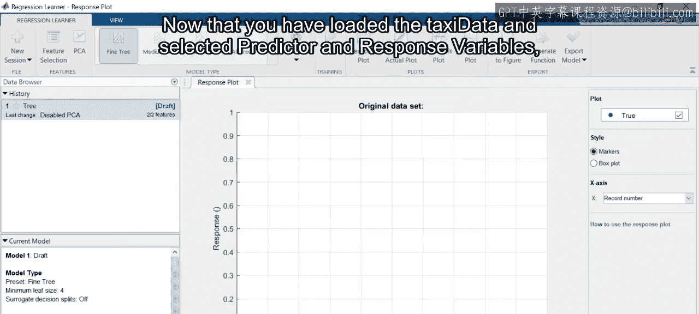

---

### 熟悉应用程序界面

首先，花点时间熟悉一下应用程序界面。有几个工具将用于训练和评估模型，包括顶部的工具条、包含模型历史和详细信息的数据浏览器，以及位于中心的可视化窗口。

默认的可视化称为“响应图”，它将响应变量（本例中为`duration`）绘制在Y轴上。请注意，默认情况下，X轴是记录号，即每个数据点在原始表格中的行号。你可以使用绘图右侧的下拉列表将X轴更改为预测变量，例如`distance`。在探索过程中的任何时候，都可以使用特征选择选项指定不同的预测变量组合以包含在模型中。此外，如果你有许多特征，可以在应用程序内执行主成分分析，以测试降维后的特征集。

对于这个应用，让我们看看仅使用单个变量`distance`是否足以准确建模行程时长。现在，你已准备好开始迭代选择、训练和评估模型的过程。

---

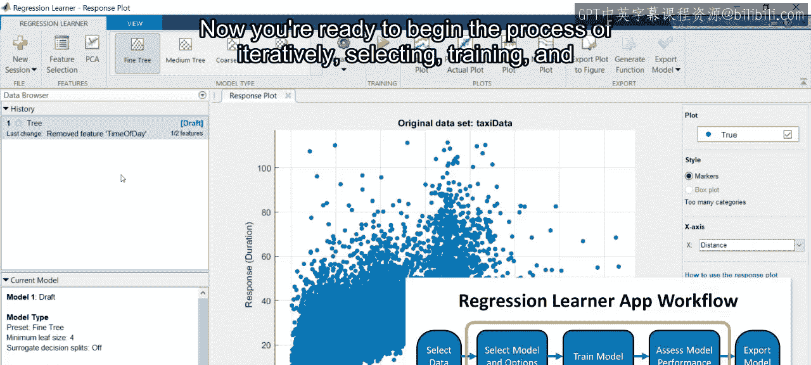

### 训练第一个模型

在工具条中，你可以选择要训练的回归模型。模型按类型分组，每种类型提供多个默认选项。

基本的线性回归通常是一种快速且简单的训练模型。因此，从列表中选择“线性”。然后点击“训练”按钮来生成你的第一个回归模型。

请注意，图中添加了黄色标记，代表模型对时长的预测值。你还会注意到，关于新模型的信息已出现在左下角的当前模型浏览器中。此区域显示有关模型的重要信息，例如性能指标、使用的模型特定选项以及包含的特征。

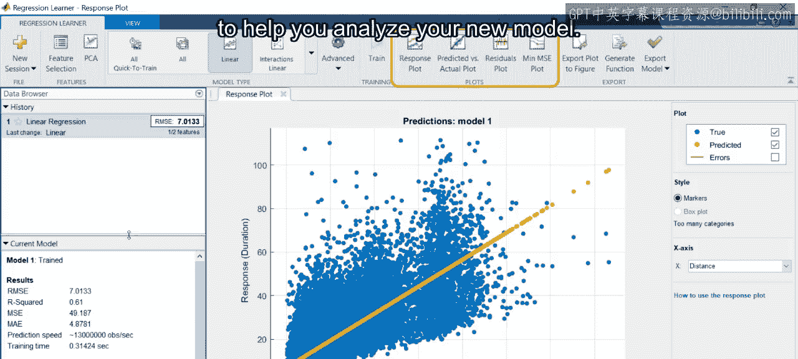

工具条中还有其他几种可视化工具可帮助你分析新模型。

---

### 分析模型性能

下一个可视化称为“预测值与实际值图”，它有助于确定是否有任何响应值建模不佳。在这里，行程时长的响应变量显示在两个轴上。X轴代表数据集中的真实值，而Y轴代表模型的预测值。因此，每个数据点的残差是到黑线的垂直距离。

但如果你想知道模型的残差如何依赖于每个变量呢？为了找出答案，选择下一个可视化：“残差图”。默认情况下，X轴与上一个图相同，而Y轴现在代表每个观测值的残差。然而，也可以将X轴更改为不同的预测变量，以可视化残差如何依赖于它们。例如，通过选择X轴为预测变量并选择`time_of_day`，你可以看到残差对行程出发时间有一定的依赖性。最明显的是，清晨时段的时长往往被高估。

因此，让我们看看通过使用特征选择按钮将`time_of_day`变量添加到模型中，结果是否能得到改善。

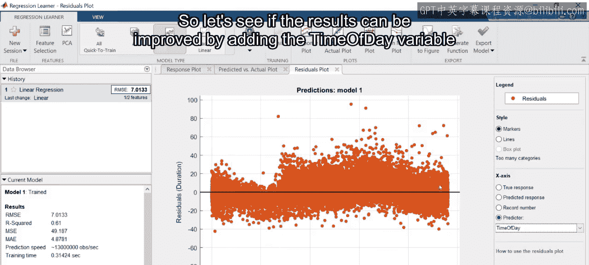

---

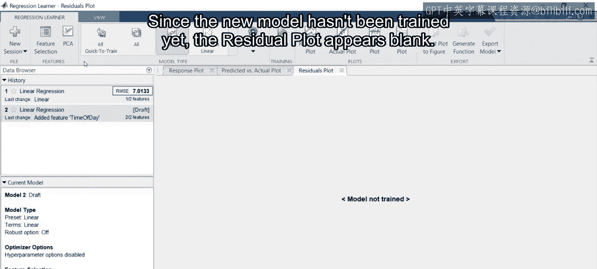

### 添加特征并训练多个模型

由于新模型尚未训练，残差图显示为空白。现在，返回到响应图。之前，你只训练了一个线性回归模型，但应用程序也允许你一次训练多个模型。在模型菜单中，前两个选项是“全部快速训练”和“全部”。“全部”训练此列表中的每个模型，这包括更高级的算法，如支持向量机和高斯过程回归，因此对于大型数据集，训练所有模型可能需要数小时才能完成。“全部快速训练”选项仅训练最快的模型，特别是线性回归以及一些回归树。选择此选项并点击按钮开始训练。

整个过程可能需要几分钟才能完成，具体取决于你的计算机。

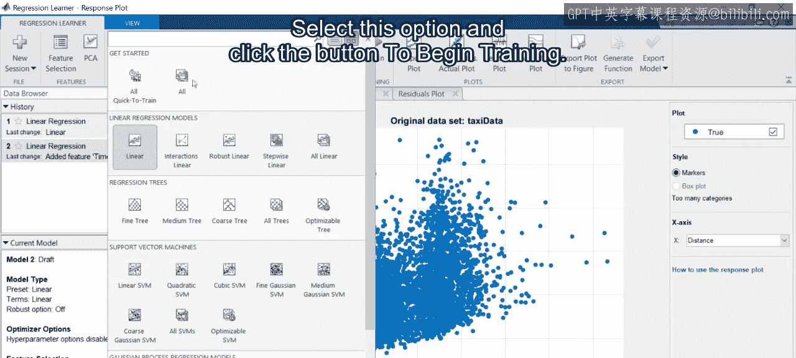

那么，添加`time_of_day`是否改进了你之前的模型？为了进行比较，你可以查看当前模型浏览器中显示的几项指标。

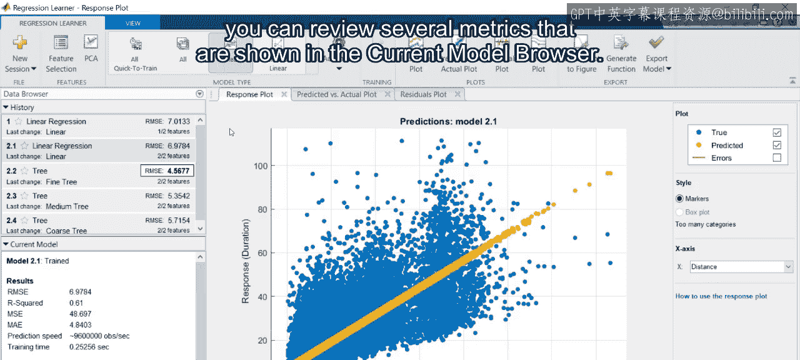

---

### 评估和比较模型

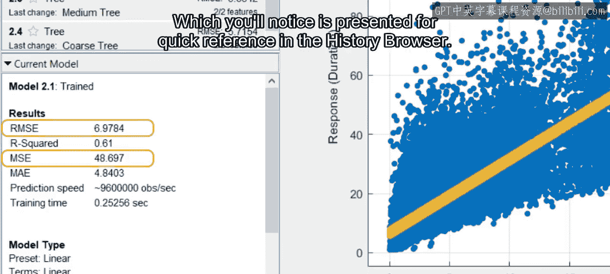

例如，有均方误差，它在线性回归的训练过程中被最小化。通常也会比较该值的平方根，称为均方根误差。你会注意到，为了快速参考，历史浏览器中会显示RMSE。

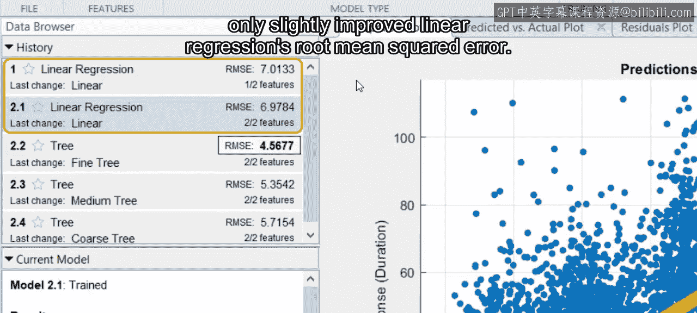

最终，看起来添加`time_of_day`变量仅略微改善了线性回归的均方根误差。

然而，树模型的表现明显更好。每个树模型都遵循相同的过程：基于预测值迭代地进行分割，以便将数据划分为具有相似响应值的组。精细、中等和粗糙树之间的区别是预定义的单个叶节点中的最小观测值数量。你可以在当前模型浏览器中看到这个值。对于精细树，最小叶节点大小为4，而对于粗糙树是36，这意味着总的叶节点更少。

但如果你需要制作一个比默认粗糙选项更粗糙的树呢？所有模型都有可以自定义的高级选项。对于回归树，这些选项包括设置你自己的最小叶节点大小。

---

### 导出模型

在回归学习器应用程序中交互式地创建回归模型后，你可以通过导出来保存最佳模型。有两种方法可以做到这一点：你可以导出训练好的模型，也可以保存用于训练模型的算法。

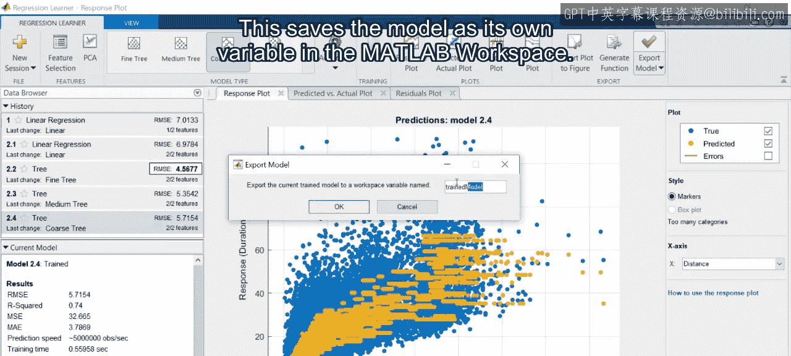

首先，让我们导出训练好的模型。这种方法允许你从脚本访问模型以进行预测。选择精细树回归模型并选择此选项。这会将模型作为自己的变量保存在MATLAB工作区中，因此你需要给这个变量起一个名字。

现在你可以在MATLAB工作区中看到该模型。它在这里被列为结构体类型。这是一种可以使用点号表示法像表格一样访问的数据类型。例如，如果你键入模型的名称，你会看到一个自动完成的可用变量列表。标记为`regression_tree`的变量是导出模型的存储位置。然后，你可以用第二个点号深入模型。本质上，应用程序中的所有数据现在都存储在这个MATLAB工作区变量中。例如，如果你选择变量`X`并执行脚本，你将看到回归树的预测变量表，在本例中是`distance`和`time_of_day`。同样，变量`y`保存行程时长的响应值。

稍后你将学习如何使用训练好的模型对新数据进行预测。但现在，如果不想保存训练好的模型，而是想使用不同的数据集重新训练一个新模型，而不重复在应用程序中执行的所有步骤，该怎么办？

---

### 导出训练函数

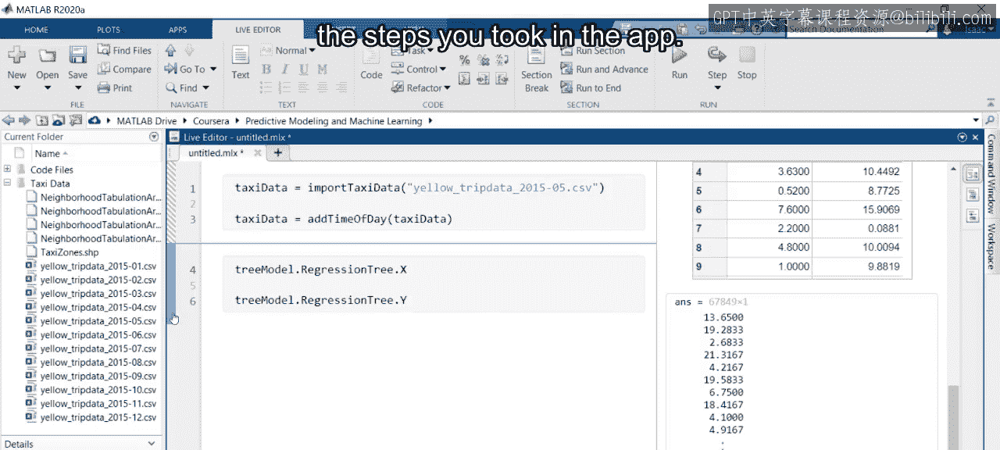

这时，应用程序的第二个导出选项就很有用了。通过此选项，你可以生成一个函数，该函数保存模型的训练过程，而不是训练好的模型本身。现在选择此选项以创建一个新函数。

这将在MATLAB中打开一个新文件。这里会自动提供注释来记录函数的使用方法，而代码部分则重新创建了应用程序训练模型所采取的精确步骤。

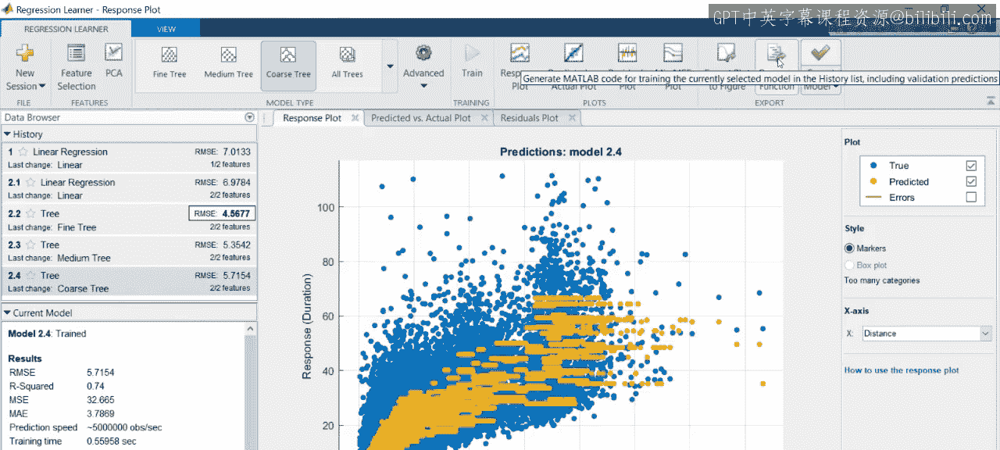

---

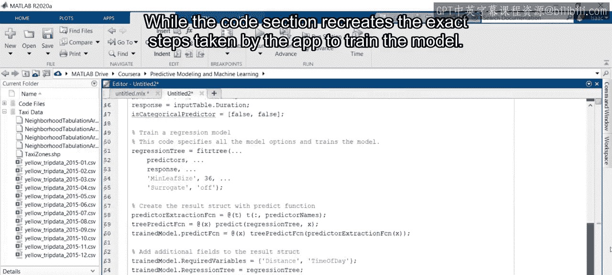

### 总结

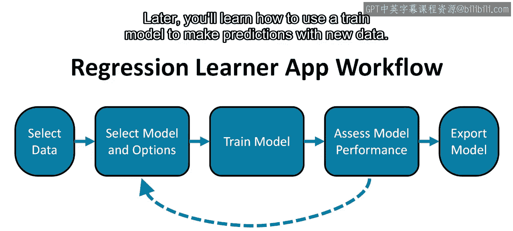

在本节课中，我们一起学习了如何使用回归学习器应用程序的工作流程，迭代地选择、训练和评估多个回归模型，以预测出租车行程的时长。稍后，你将学习如何使用训练好的模型对新数据进行预测。