# 7：自定义模型参数 🛠️

在本节课中，我们将学习如何通过编写代码来自定义回归模型的参数，以提升模型性能。我们将以线性回归和回归树模型为例，介绍从数据导入、模型训练、结果预测到参数调整的完整工作流程。

---

## 概述

上一节我们介绍了在回归学习器应用中尝试不同模型。本节中，我们来看看如何通过编写代码来自定义模型参数，例如为线性回归模型添加高阶多项式项，以获得最佳性能。

---

## 导入数据与特征工程

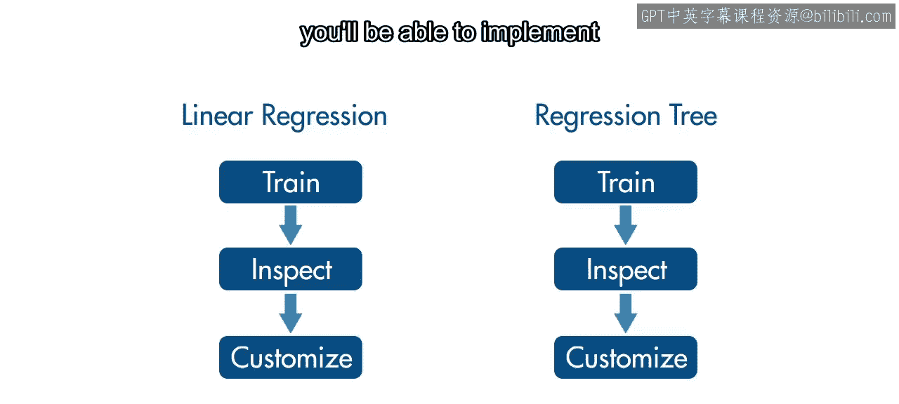

首先，导入一个月的出租车数据，并添加一些额外特征，例如行程发生的时间段。目标是训练一个能够预测行程时长的模型。

```matlab
% 示例：导入数据并添加特征
% taxiData = readtable('taxi_data.csv');
% taxiData.TimeOfDay = hour(taxiData.PickupDateTime);
```

---

## 训练线性回归模型

要拟合线性回归模型，请使用 `fitlm` 函数。

以下是训练模型的基本步骤：
1.  将出租车数据表作为第一个参数。
2.  将模型类型指定为第二个参数，这里先使用字符串 `'linear'`。
3.  使用名称-值对指定响应变量和预测变量。

```matlab
linearModel = fitlm(taxiData, 'linear', 'ResponseVar', 'Duration', 'PredictorVars', {'Distance', 'TimeOfDay'});
```

运行此代码后，将看到大量关于模型的信息。顶部是一个描述模型的表达式，其中包含变量名称。下面的部分提供了关于拟合系数和统计信息的更多详情。例如，距离的系数估计值为正，这意味着距离和时长呈正相关。

---

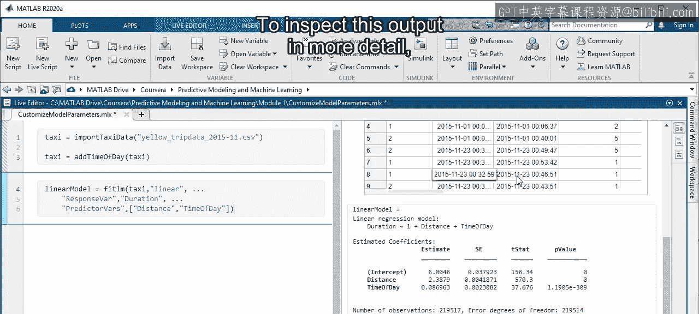

## 检查模型与进行预测

要更详细地检查输出，可以在工作区中双击模型变量。您将看到具有不同类型信息的多个属性。您可以在脚本中使用点表示法访问这些属性。

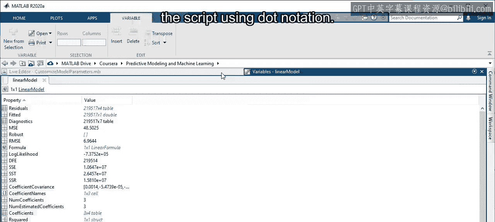

例如，要查看拟合系数的信息，可以输入：
```matlab
coeffInfo = linearModel.Coefficients;
```

这是一个表格，包含与 `fitlm` 输出中显示的相同的估计值和统计信息。

虽然可以使用这些系数来计算预测的时长值，但使用名为 `predict` 的函数更为简便。第一个输入应为训练好的模型，第二个输入应是一个列名与训练数据匹配的数据表。目前，我们先使用训练数据本身。

```matlab
predictedDuration = predict(linearModel, taxiData);
```

输出是一个响应预测向量，在本例中即行程时长（分钟）。

---

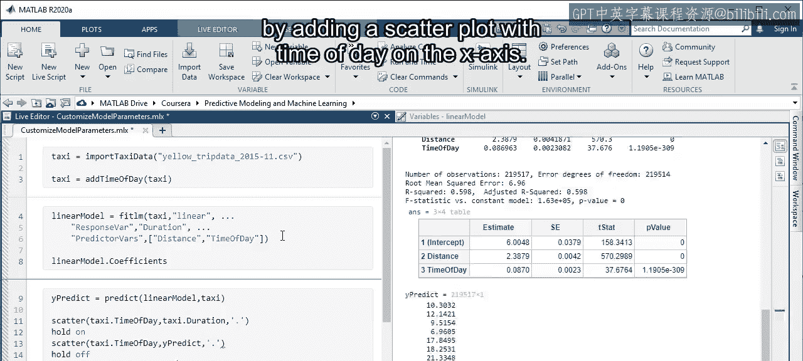

## 评估初始模型性能

让我们通过添加一个散点图来查看这些预测值与实际响应的比较情况，其中X轴为时间段。

```matlab
scatter(taxiData.TimeOfDay, taxiData.Duration, 'b.');
hold on;
scatter(taxiData.TimeOfDay, predictedDuration, 'r.', 'MarkerFaceAlpha', 0.3);
xlabel('Time of Day');
ylabel('Trip Duration (minutes)');
legend('Actual', 'Predicted');
```

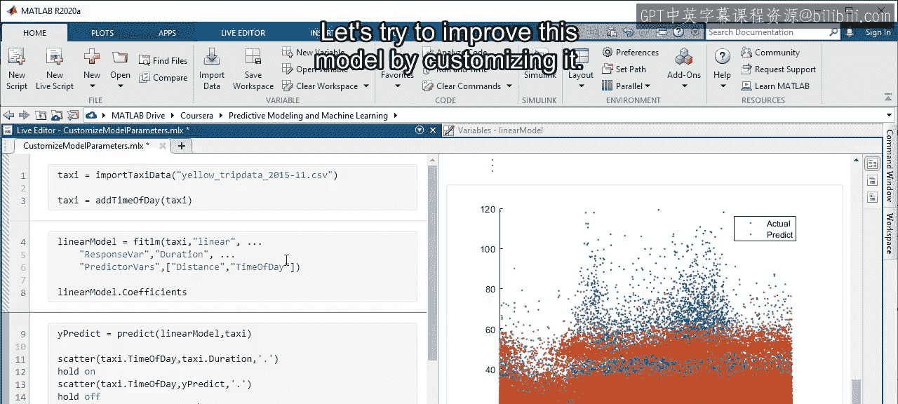

可以看到预测点和实际点之间存在显著的重叠。但是，中午时分的预测时长与一天中其他时段的预测时长差异不大，而实际上它们应该更低。这表明模型有改进空间。

---

## 自定义线性回归模型

除了 `'linear'` 选项，`fitlm` 还有其他选择，例如 `'interactions'` 或 `'quadratic'`。由于时长在一天中可能上下波动，进一步自定义模型以包含高阶项可能是个好主意。

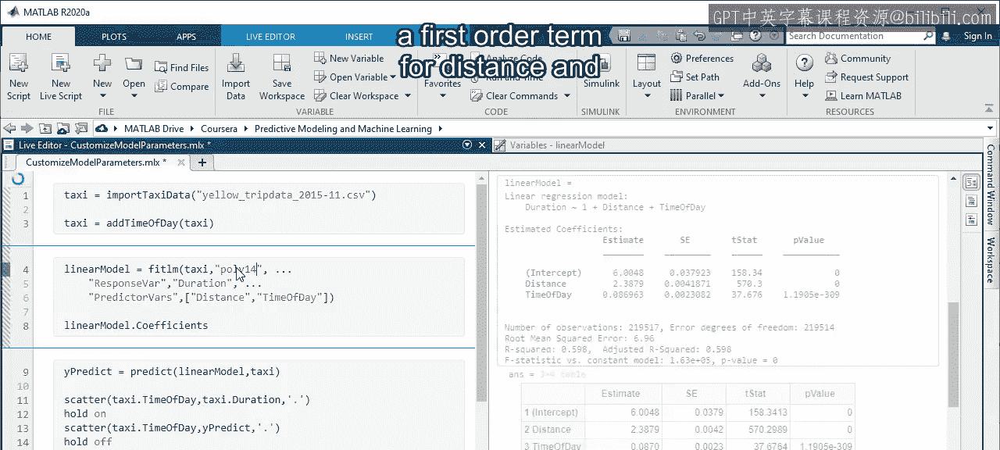

对于多项式回归，使用字符串 `'poly'`，后跟一系列整数，用于指定每个预测变量的多项式阶数。

例如，输入 `'poly14'` 可以为距离设置一阶项，为时间段设置最高四阶的项。

```matlab
polyModel = fitlm(taxiData, 'poly14', 'ResponseVar', 'Duration', 'PredictorVars', {'Distance', 'TimeOfDay'});
```

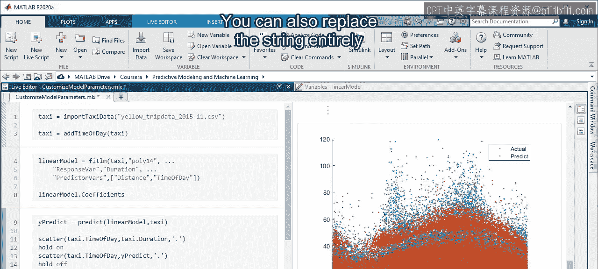

现在可以在输出中看到四阶项，以及低阶项和交互项。当您重新运行包含散点图的代码段时，可以看到预测结果有所改善。现在，模型预测清晨和深夜的行程时长较短。

您也可以完全用 Wilkinson 表示法格式的表达式替换此字符串。由于变量在表达式中已明确指定，因此不需要包含响应和预测变量选项。

例如，您可以通过将时间段提升到四次方，然后将两个变量相乘，来重建具有交互作用的多项式模型。

```matlab
customModel = fitlm(taxiData, 'Duration ~ Distance * TimeOfDay^4');
```

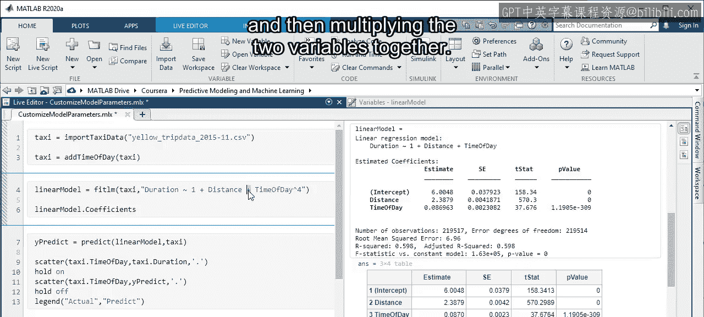

请注意，输出中的几个项带有冒号，在 Wilkinson 表示法中用于表示交互作用。您可以在输出顶部的完整展开表达式中看到这些带冒号的项是如何包含的。

---

## 训练回归树模型

接下来，让我们重复训练过程，使用回归树模型，以便了解 `fitrtree` 函数与 `fitlm` 的异同。

与 `fitlm` 类似，数据表应是 `fitrtree` 的第一个参数。然而，第二个参数是响应变量名称 `'Duration'`。最后，使用名称-值对指定预测变量。

```matlab
treeModel = fitrtree(taxiData, 'Duration', 'PredictorNames', {'Distance', 'TimeOfDay'});
```

请注意，训练模型可能需要很长时间，具体取决于数据集大小和模型类型等因素。回归树的默认选项将创建一个具有大量叶子的树，这比之前的线性回归模型训练时间更长。

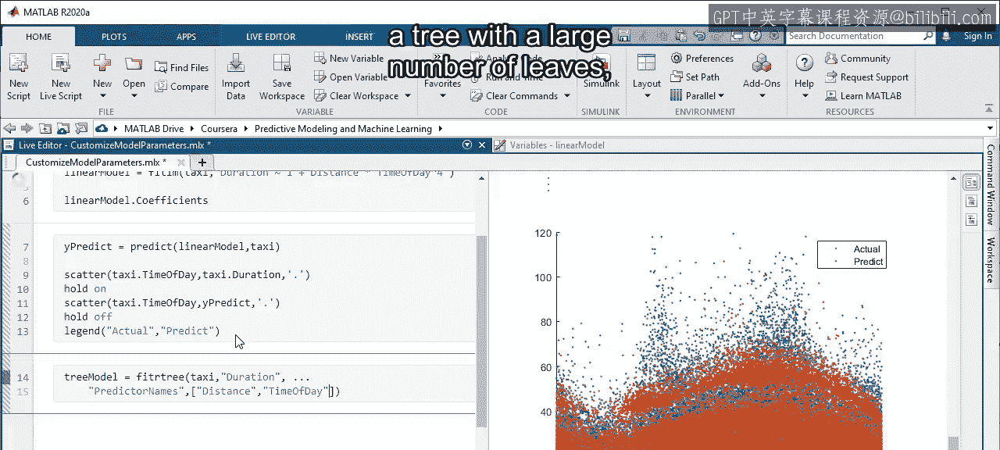

---

## 检查回归树模型

`fitrtree` 的输出是一个模型变量，具有其独特的属性。让我们从工作区打开模型来查看它们。例如，`NumNodes` 属性是树大小的度量，它是决策节点（或分割）数量与终端节点（或叶子）数量之和。

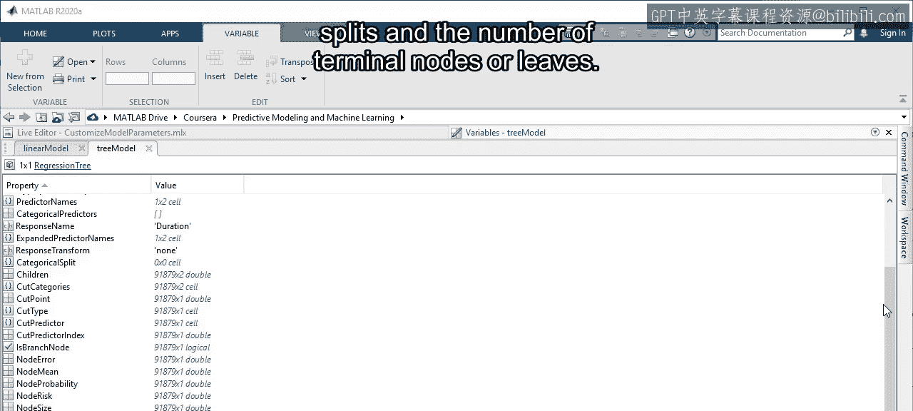

要查看树本身，请使用 `view` 函数。输出是定义树结构的决策规则列表。

```matlab
view(treeModel, 'Mode', 'text');
```

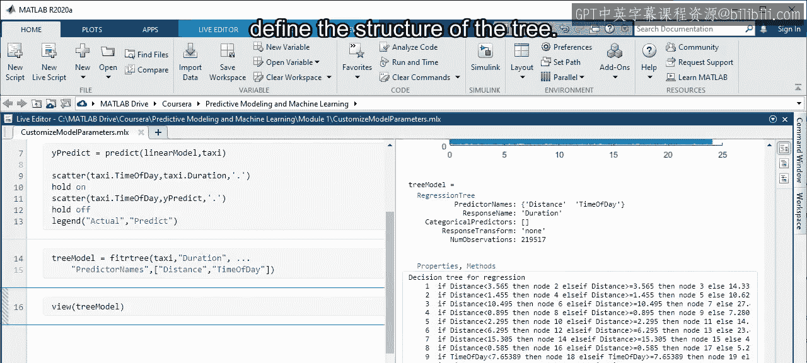

可以看到顶部节点都使用距离变量，这表明距离是该模型中最重要的预测变量。

---

## 评估回归树预测

让我们通过另一个散点图来查看此模型如何预测时长。像之前一样，使用 `predict` 函数和树模型，然后绘制预测响应与时间段的关系图。

```matlab
treePredicted = predict(treeModel, taxiData);
scatter(taxiData.TimeOfDay, taxiData.Duration, 'b.');
hold on;
scatter(taxiData.TimeOfDay, treePredicted, 'g.', 'MarkerFaceAlpha', 0.3);
xlabel('Time of Day');
ylabel('Trip Duration (minutes)');
legend('Actual', 'Predicted (Tree)');
```

实际值和预测值之间显然有更多的重叠。但这是好事吗？出租车数据与大多数现实世界的数据一样，存在噪声。这个模型似乎在拟合主要趋势之外，还拟合了噪声。因此，简化树结构以减少节点数量可能更好。

---

## 自定义回归树参数

那么，如何自定义回归树呢？`fitrtree` 有许多选项，但两个重要的选项是 `MinLeafSize` 和 `MaxNumSplits`。

`MinLeafSize` 参数设置每个叶子必须包含的数据点数量的阈值。`MinLeafSize` 的默认值为 1。让我们将此值增加到 50。这种自定义将使树更小或更粗糙，类似于在回归学习器应用中从精细树更改为粗糙树。

```matlab
treeModelCustom1 = fitrtree(taxiData, 'Duration', 'PredictorNames', {'Distance', 'TimeOfDay'}, 'MinLeafSize', 50);
```

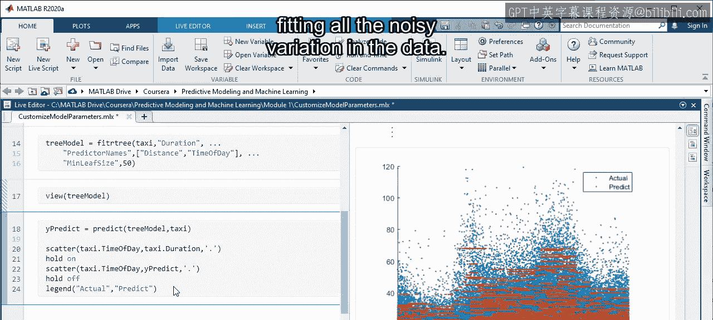

再次查看散点图，看看这如何影响预测。现在，实际值和预测值之间的重叠减少了。但这可能是件好事，因为模型没有拟合数据中的所有噪声变化。

另一个 `fitrtree` 选项 `MaxNumSplits` 将明确设置树的决策规则数量。尝试将此值设置为 20 并再次训练模型。

```matlab
treeModelCustom2 = fitrtree(taxiData, 'Duration', 'PredictorNames', {'Distance', 'TimeOfDay'}, 'MaxNumSplits', 20);
```

现在模型的节点比以前更少，因为树中只有 20 次分割。您可以通过将 `mode` 选项设置为 `'graph'`，使用 `view` 函数以图形方式可视化树。

```matlab
view(treeModelCustom2, 'Mode', 'graph');
```

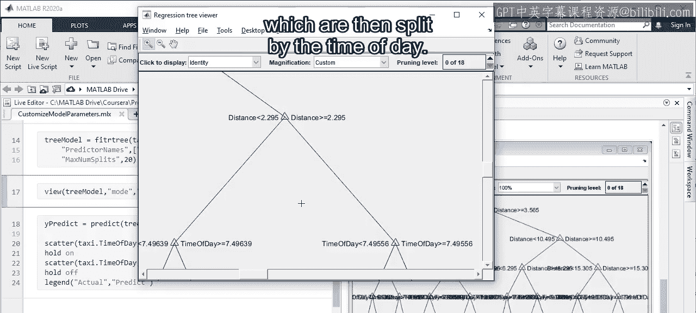

将出现一个单独的图，显示树的可视化表示。您可以放大以检查各个分支。例如，此节点使用距离创建两个分支，然后根据时间段进行分割。

请记住，当有成千上万个节点时，这种类型的可视化会非常混乱。

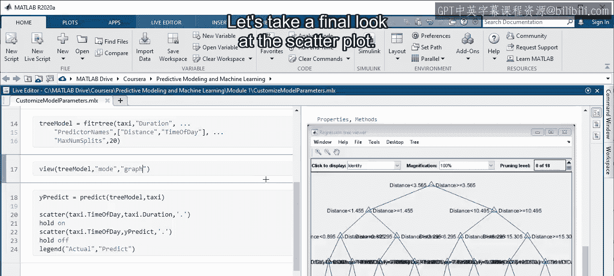

让我们最后看一下散点图。

```matlab
treePredictedCustom2 = predict(treeModelCustom2, taxiData);
scatter(taxiData.TimeOfDay, taxiData.Duration, 'b.');
hold on;
scatter(taxiData.TimeOfDay, treePredictedCustom2, 'm.', 'MarkerFaceAlpha', 0.5);
xlabel('Time of Day');
ylabel('Trip Duration (minutes)');
legend('Actual', 'Predicted (Custom Tree)');
```

您现在可以看到预测数据点的明显条带，这是决策规则较少的结果。换句话说，这种自定义使模型过于简单，可能会损害性能。

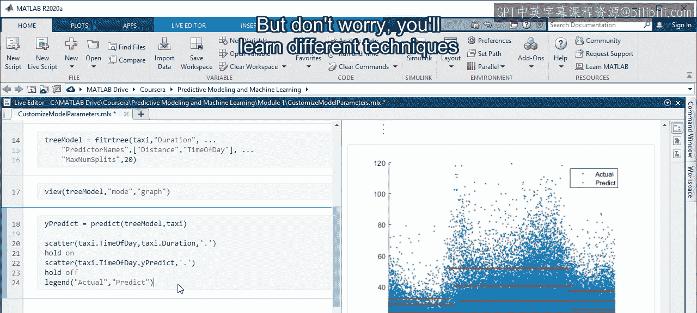

为所有不同参数选择一个好的值是一个难题，但别担心，您将在后续模块中学习有助于选择参数的不同技术。

---

## 总结

本节课中，我们一起学习了如何通过编写代码来训练、检查和自定义几种类型的回归模型。自定义选项将帮助您从模型中获得最佳性能。

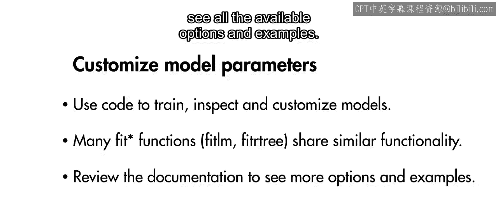

请记住，MATLAB 中的许多拟合函数共享相似的功能和选项，但对于不同的模型类型存在细微差别。在自定义模型时，请花些时间查阅文档，以查看所有可用的选项和示例。