# 8：评估回归模型 🎯

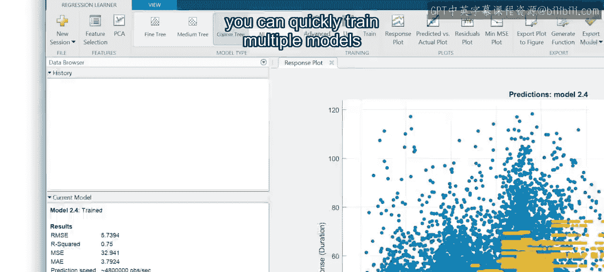

在本节课中，我们将要学习如何评估回归模型的性能。我们将了解几种不同的评估指标，学习它们的计算方法，更重要的是，掌握如何解读这些指标，以便比较不同模型并选择最佳的一个。

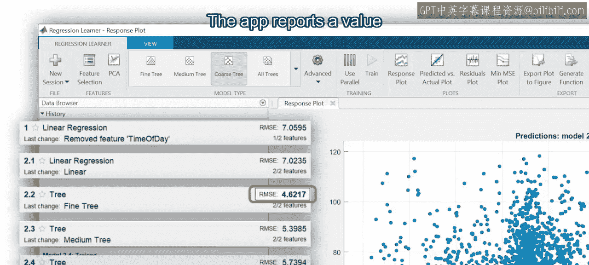

你已经学习了不同类型的回归模型，以及如何使用回归学习器应用快速训练多个模型。

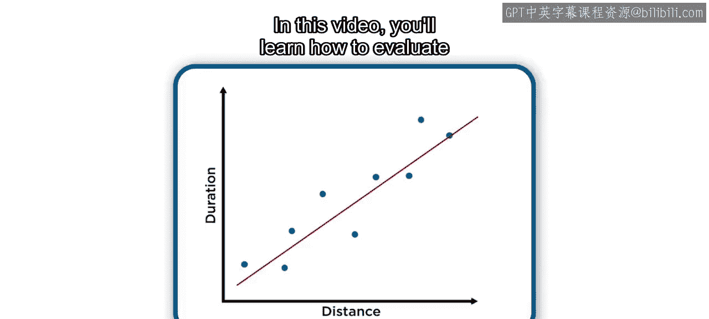

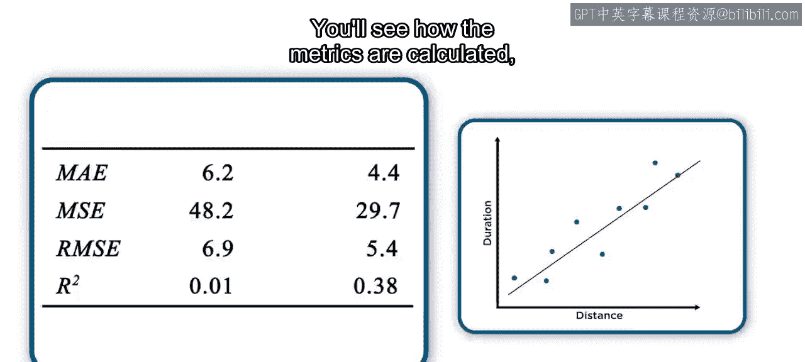

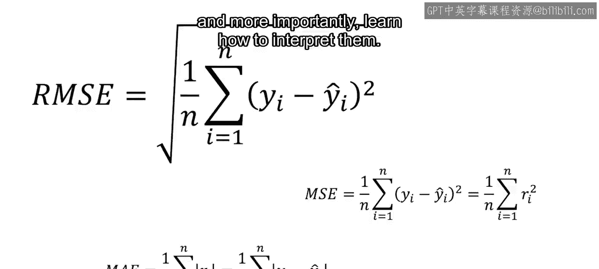

但是，如何比较不同的模型以选择性能最佳的那个呢？

应用会报告一个名为均方根误差的值。

但这个数字究竟意味着什么？是否有其他衡量回归模型性能的方法？

本节中，我们将探讨几种关键的评估指标。

### 理解残差与误差指标

所有本节介绍的指标都是基于模型的**残差**来计算的。残差是实际数据点与模型预测值之间的差值。

如果模型能很好地预测响应值，残差将接近0；反之，残差则会较大。衡量残差的一种方法是计算它们的平均大小。

以下是基于残差计算的核心误差指标：

*   **平均绝对误差**：首先取每个残差的绝对值，然后计算其平均值。这个指标称为MAE。MAE非常实用，因为它简单且易于沟通。例如，MAE与响应变量具有相同的单位。如果一个预测出租车行程时长（分钟）的模型MAE为5，那么可以说预测时长平均偏差5分钟。
    *   **公式**：`MAE = mean(abs(实际值 - 预测值))`
*   **均方误差与均方根误差**：回归模型在训练时通常使用残差的平方而非绝对值，因此基于平方残差的指标也很常见。将所有残差平方的面积相加，得到**误差平方和**。计算这些平方面积的平均值，则得到**均方误差**。MSE的优点是会放大较大的误差。但MSE的单位是响应变量单位的平方。因此，更常报告的是MSE的平方根，即**均方根误差**。
    *   **公式**：
        *   `MSE = mean((实际值 - 预测值)^2)`
        *   `RMSE = sqrt(MSE)`

MAE和RMSE对于模型间的比较非常有用。例如，可以比较线性回归模型与回归树模型的误差值。通常，误差值较低的模型性能更好。

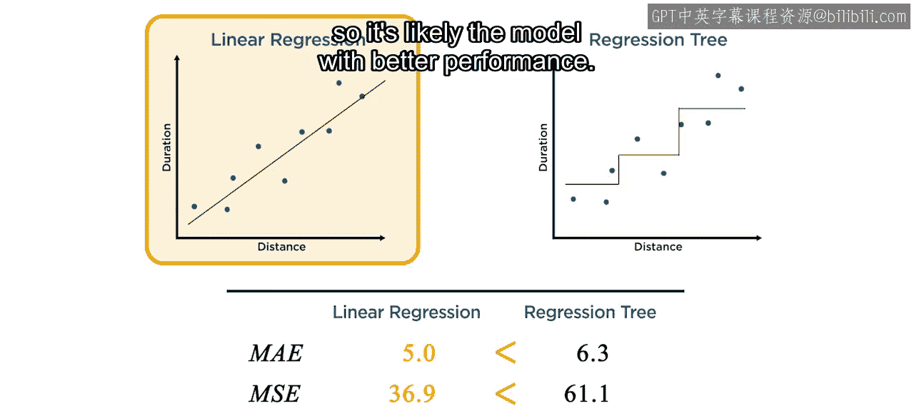

### 引入基准模型：R平方

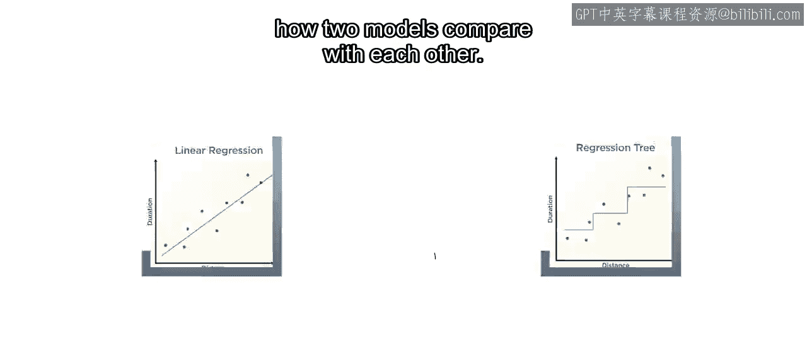

然而，上述误差指标只能告诉你两个模型相比如何，无法判断一个模型是否客观地对数据拟合良好。

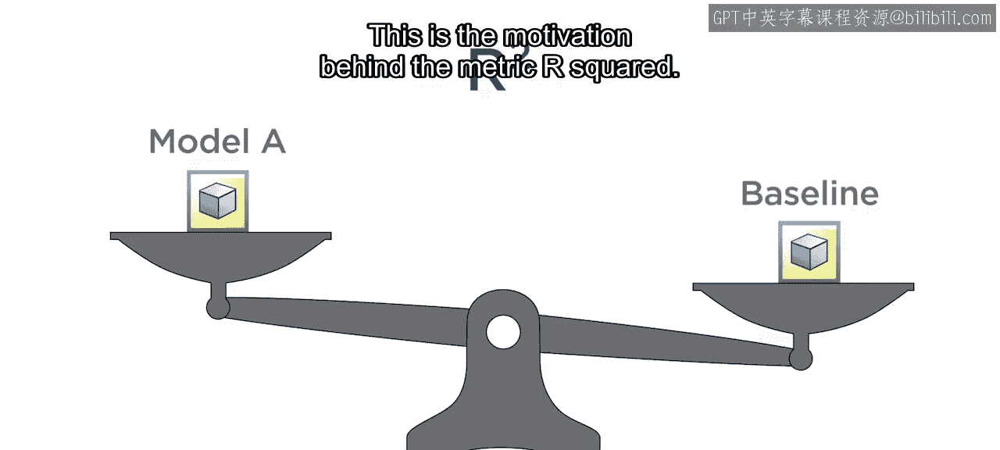

不同的思路是将模型与一个简单的基准模型进行比较。这就是**R平方**指标背后的动机。

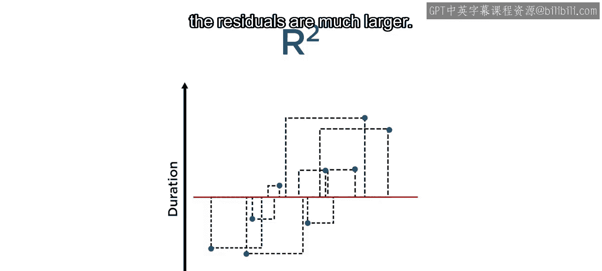

最简单的基准模型是什么？一个选择是位于响应值平均值处的一条水平线。

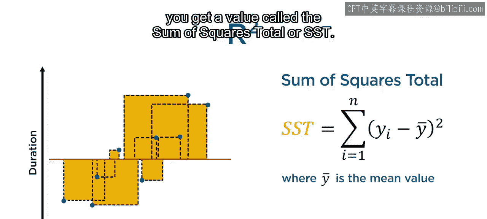

计算这条基准线的预测残差平方和，得到**总平方和**。R平方值就是回归模型的SSE相对于SST的相对减少量。可以将其理解为，通过拟合更复杂的模型所消除的总误差比例。

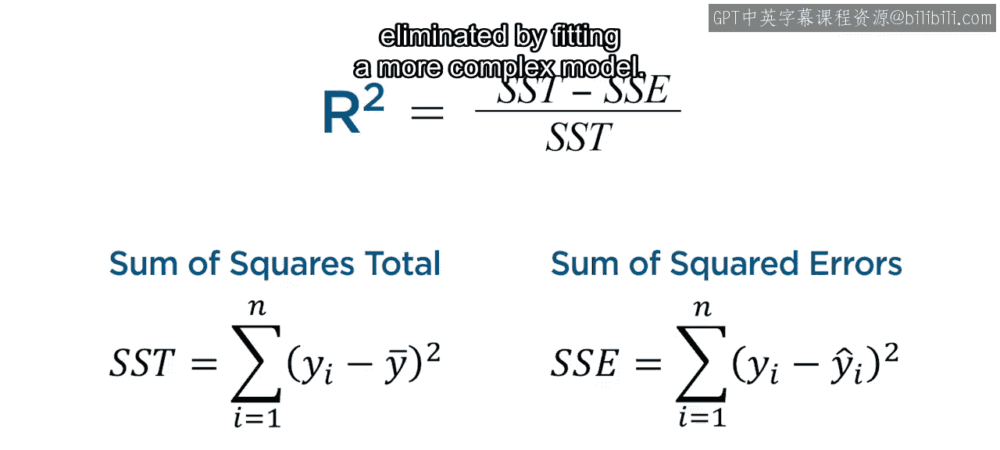

*   **解读**：
    *   如果模型预测准确，SSE值相对于SST会很小，使得R平方值非常接近1。
    *   如果预测不准确，SSE和SST值相似，R平方值则接近0。
    *   **公式**：`R² = 1 - (SSE / SST)`

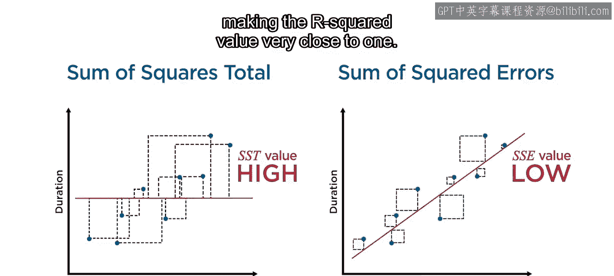

R平方值还有一个有用的特性：与误差指标不同，它不依赖于数据的尺度。无论响应变量的单位或数值范围如何，R平方都在0到1之间，更高的值表示更好的性能。

### 综合运用指标进行模型选择

回到之前的例子，线性回归模型的R平方值更高，这支持了它是更好选择的结论。然而，回归树的R平方值也接近1，表明它也是一个可行的模型。

当比较两个新模型时，即使MAE和RMSE值与之前的例子相似，但若两者的R平方值都很低，则表明这两个模型的表现都不佳。

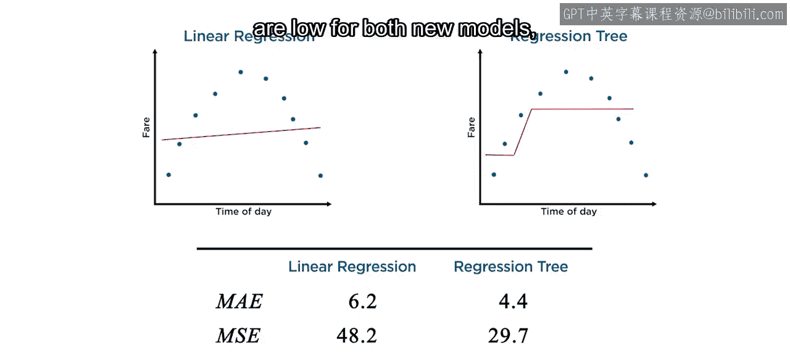

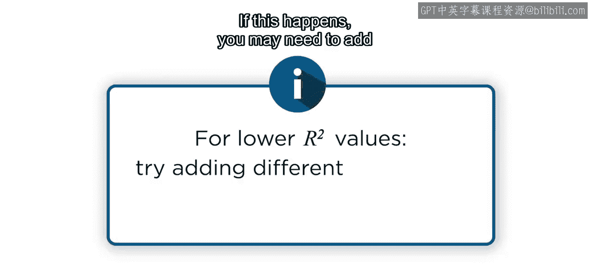

如果遇到这种情况，可能需要添加不同的特征或重新考虑模型的选择。数据可能具有某种潜在结构，而不同的模型或许能够捕捉到它。更好的选择将带来更低的误差指标和更高的R平方值。

### 总结

本节课中我们一起学习了评估回归模型的几种指标。

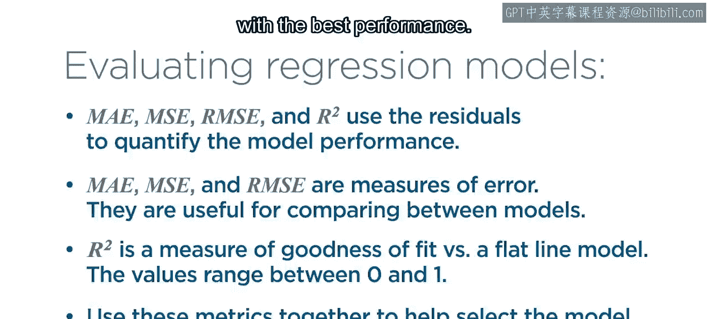

1.  所有指标都使用模型残差来量化模型性能。
2.  **MAE、MSE和RMSE是误差度量**，数值越低越好。这些度量对于模型间的比较很有用。
3.  **R平方衡量的是模型相对于简单基准模型的表现**，其值介于0到1之间，数值越高表示性能越好。
4.  最后，**综合使用这些指标**，可以帮助选择性能最佳的回归模型。