# 9：在MATLAB中评估模型 🧮

在本节课中，我们将学习如何在MATLAB中评估回归模型的性能。我们将通过计算关键指标和创建可视化图表，来深入理解模型的表现，并判断其是否适用于实际场景。


你已经学习了如何通过解释RMSE和R平方等指标来评估回归模型的性能。你也看到了在回归学习器应用中可视化模型性能的一些方法。在本视频中，你将看到如何在MATLAB中可视化预测模型的结果并计算回归指标。你将学习如何回答以下问题：模型在哪些地方表现良好？在哪些地方表现不佳？这些指标有什么实际意义？考虑到模型的应用场景，其性能是否合理？

## 计算回归指标

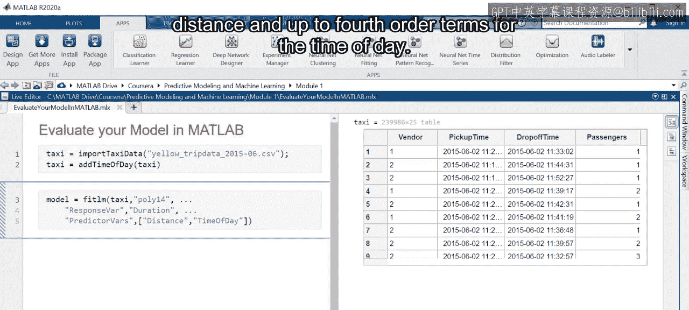

上一节我们介绍了评估模型的重要性，本节中我们来看看如何具体计算这些指标。

让我们从一个之前见过的线性回归模型开始，该模型使用出租车数据预测行程时长。使用距离和一天中的时间作为预测变量，并将模型类型设置为`poly14`。这意味着模型将包含距离的一阶多项式项，以及一天中时间的高达四阶的项。

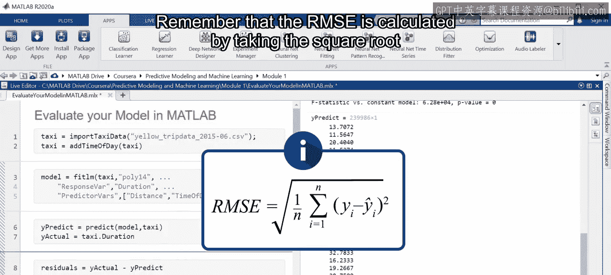

记住，你可以使用`predict`函数来获取预测的时长。将这些预测值分配给一个名为`y_predict`的变量。然后将实际的时长值分配给一个名为`y_actual`的变量。这些是你计算回归指标所需的变量。

首先，使用这些变量计算残差，通过从`y_actual`中减去`y_predict`得到。

让我们使用残差来计算均方根误差。记住，RMSE是通过取残差平方的平均值的平方根来计算的。

在MATLAB中，这可以通过将每个残差进行平方，然后应用`mean`和`sqrt`函数来轻松计算。

```matlab
residuals = y_actual - y_predict;
RMSE = sqrt(mean(residuals.^2));
```

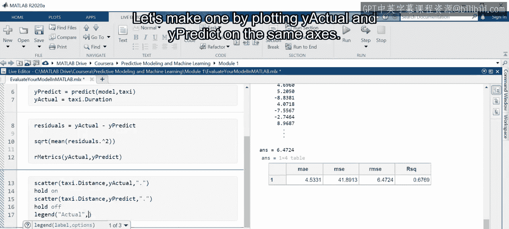

该模型的RMSE约为6.5。

你可以对其他指标重复类似的过程，但为了帮助你，这里提供了一个名为`R_metrics`的函数，可以同时计算多个值。该函数将返回一个包含以下指标的表：平均绝对误差、均方误差、均方根误差和R平方。

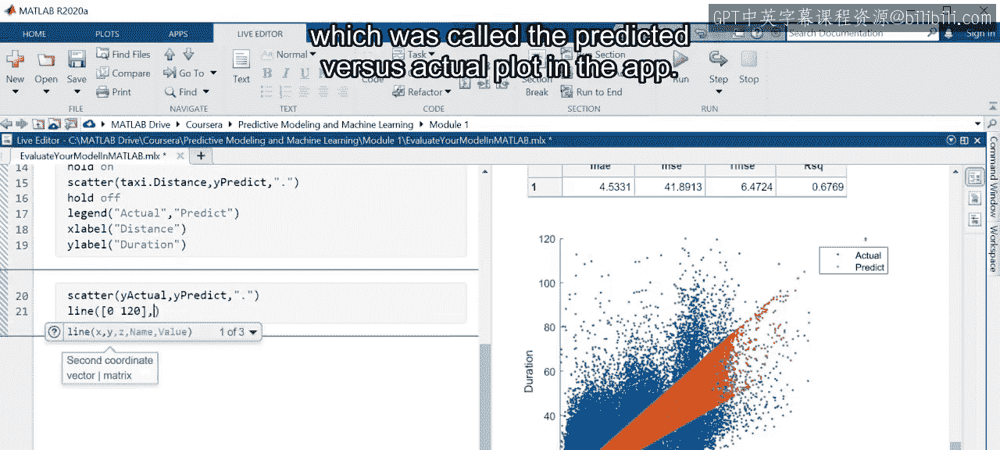

当前模型的MAE约为4.5，这意味着预测的行程时长平均偏差约4.5分钟。考虑到一些出租车行程可能超过一小时，这似乎是合理的。然而，R平方值约为0.68。记住，接近1的值表示更好的性能，所以这个模型肯定不完美。

## 可视化模型性能

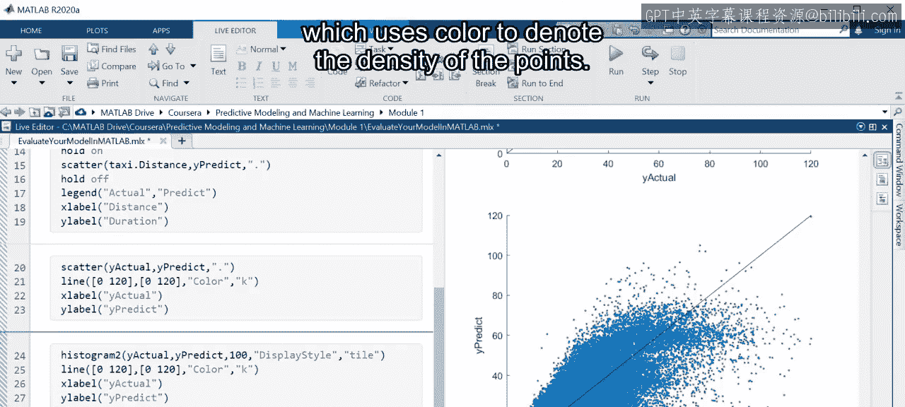

如果模型表现不佳，那么可以在哪些方面改进？误差对于任何行程时长是否一致？为了回答这些问题，让我们创建一些可视化图表。

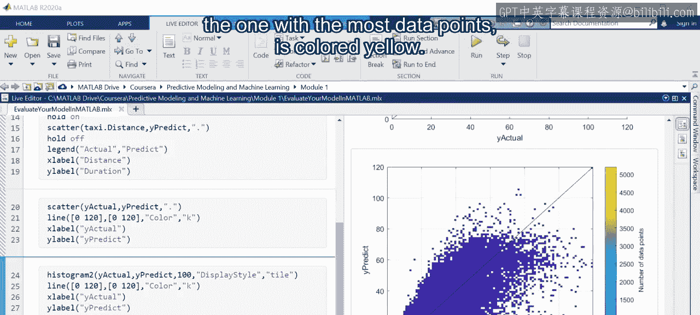

你在回归学习器应用中看到的一个可视化是响应图。让我们通过在同一坐标轴上绘制`y_actual`和`y_predict`来制作一个。

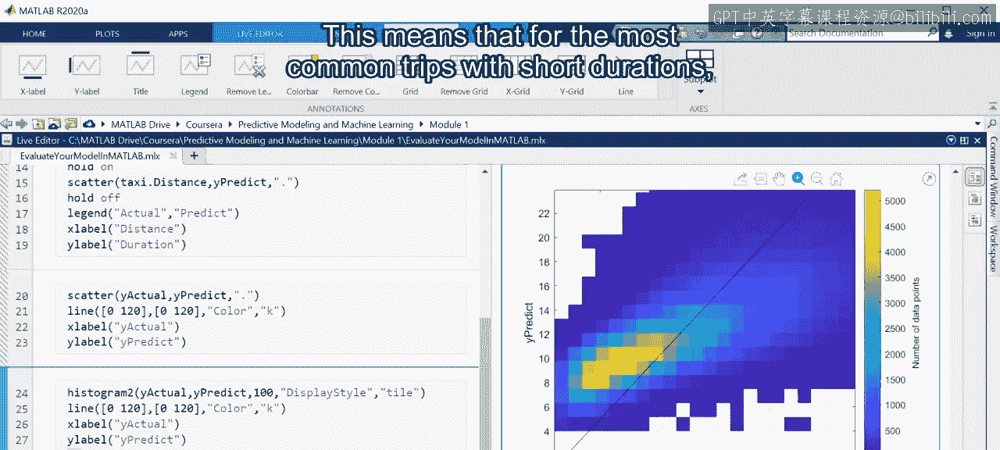

预测值捕捉到了一些时长与距离的趋势。但请注意，存在一些值不重叠的区域。这可能表明模型在这些地方表现不佳。

另一种比较预测值和实际值的方法是使用散点图，这在应用中被称为“预测值与实际值”图。

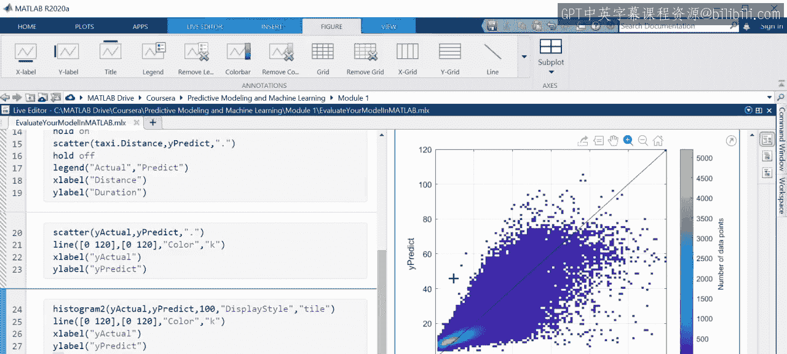

这里的黑色对角线标记了值相等的点。因此，在这种情况下，点大致围绕对角线分布是好的。但似乎低于对角线的点比高于对角线的点多。这表明预测值往往低于实际值。当然，很难看出大多数数据点的位置，因为很多点相互重叠。

另一种可视化是二维直方图，它使用颜色来表示点的密度。

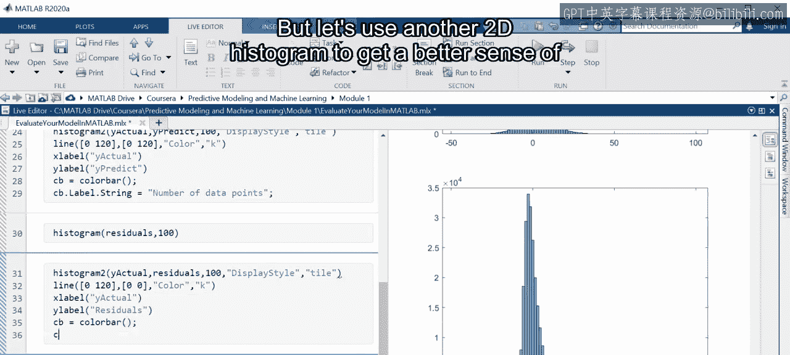

直方图中最密集的区域，即数据点最多的区域，用黄色表示。

当你放大黄色区域时，可以看到它实际上位于对角线上方。这意味着对于最常见的短行程，模型倾向于高估时长值。这与放大前看到的趋势相反，意味着模型对于不常见的较长行程会低估时长。

现在，你已经确认误差并非对所有时长都一致。但是预测中是否存在整体偏差？

为了回答这个问题，让我们制作一个残差的直方图。它们应该围绕0中心分布，对于这个模型来说，这似乎大致正确。无论如何，从X轴的范围可以看出，一些残差相当大。看起来最差的预测偏差超过一个半小时。考虑到MAE不到五分钟，这是一个相当大的值。

为了更详细地查看这个分布，让我们重新创建应用中的残差图，该图显示了残差相对于响应值的分布。但让我们使用另一个二维直方图来更好地理解数据点的密度。

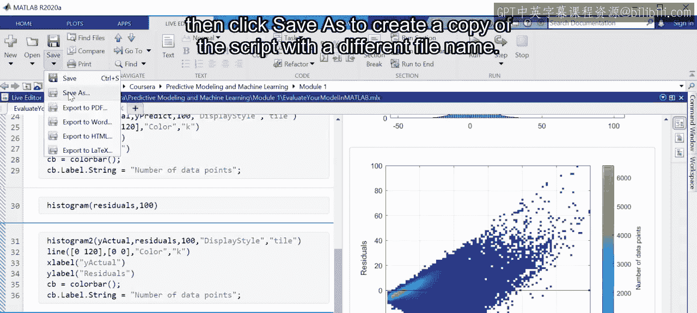

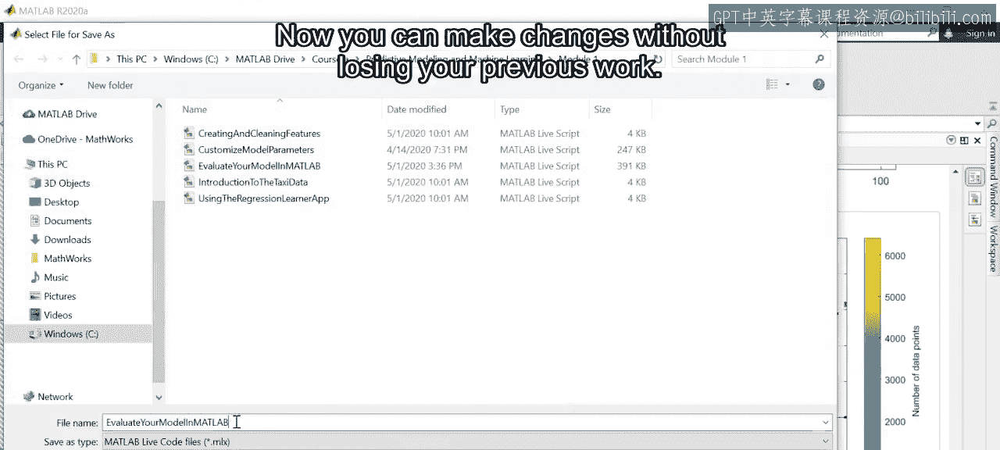

你再次可以看到，短行程往往被高估，因为数据点最多的黄色区域略低于0。然而，还有另一个趋势需要指出。残差的散布在响应值范围内发生变化，意味着残差的方差不是均匀的。这表明模型对某些时长的预测比其他时长更准确。理想情况下，这不应该发生，但对于预测出租车行程时长来说，这可能是可以接受的。你可能不关心短行程偏差5分钟，但长行程偏差20分钟或更多。这回答了关于模型偏差的问题。误差在响应范围内并不一致，但预测中似乎没有整体偏差。

## 比较不同模型

接下来，让我们看看回归树模型是否表现出类似的行为。首先，在此脚本中保存你的工作，然后单击“另存为”以创建脚本副本并使用不同的文件名。

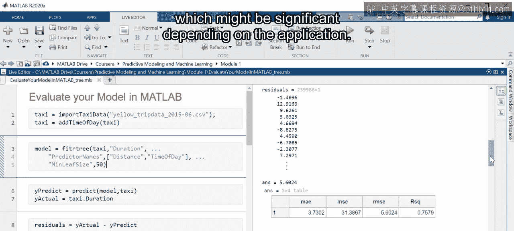

现在你可以进行更改而不会丢失之前的工作。

滚动回脚本顶部，将`fitlm`函数调用替换为`fitrtree`。为了公平比较，使用相同的预测变量，并设置最小叶节点大小为50。然后单击“运行到结束”按钮以运行整个脚本（加载数据部分除外）。让我们滚动浏览脚本以查看模型的性能。

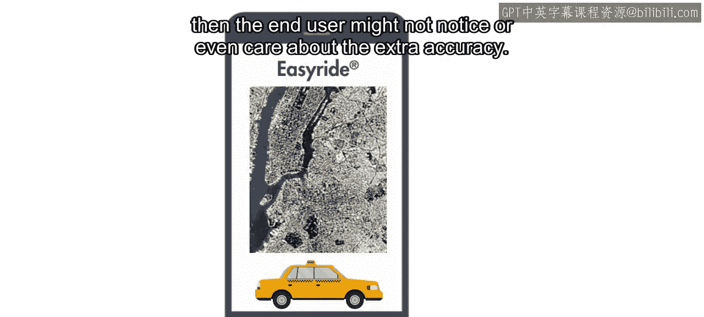

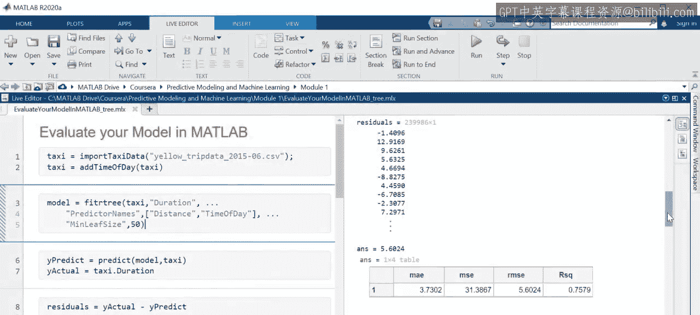

`R_metrics`输出显示该模型的MAE为3.73，RMSE为5.6，R平方为0.76。这些值都比线性回归模型好，误差指标更低，R平方更高。因此，回归树模型具有更好的指标。但这在实际中意味着什么？平均误差改善了大约一分钟，根据应用场景，这可能很重要。

例如，使用此模型做出财务决策的出租车公司可能会喜欢更好的性能，因为即使准确性的微小提高也可能带来显著的成本节约。然而，如果手机应用程序使用该模型提供行程估算，那么最终用户可能不会注意到甚至不关心额外的准确性。

让我们继续看可视化图表。时长与距离的散点图表明，树模型捕捉到了更多随距离变化的趋势。当你将此图与之前的版本进行比较时可以看到这一点。线性回归图显示预测值和实际值之间的重叠较少。

预测值与实际值的二维直方图也显示了准确性的提高，因为密集的黄色区域更接近对角线。然而，黄色区域仍然略高于对角线，表明树模型也高估了短行程的时长。

最后，残差的二维直方图表明，残差的散布仍然不均匀。当你将所有信息汇总在一起时，你可以说回归树的性能优于线性回归模型，但仍然存在类似的问题，例如长行程的误差较大。尽管如此，对于某些应用来说，它可能足够准确。

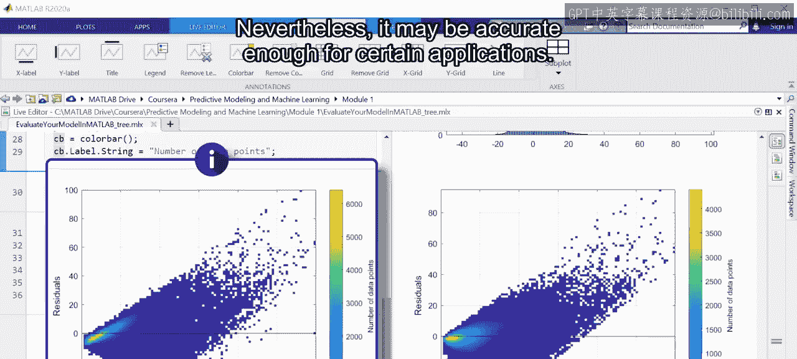

## 总结

本节课中我们一起学习了如何在MATLAB中使用可视化和指标来评估回归模型。

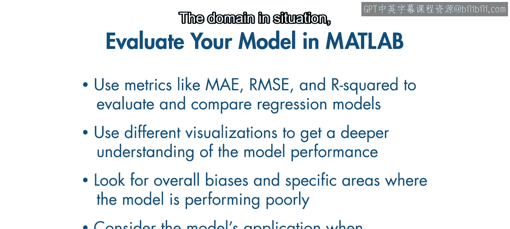

总结如下：
*   使用如MAE、RMSE和R平方等指标来评估和比较回归模型。
*   然而，由于这些值不能说明全部情况，因此使用可视化来更深入地理解模型性能。
*   寻找预测中的偏差，以及模型表现不佳的具体区域。
*   最后，在评估时考虑模型的应用场景。领域和具体情况在判断模型性能时应发挥重要作用。