10：回归总结 🎯

在本节课中，我们将对回归分析模块进行总结，回顾核心概念与工作流程，并指导你如何应用所学知识进行实践。

---

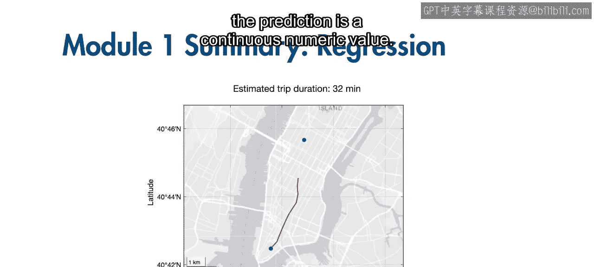

你已经成功完成了本模块的学习。回归模型用于预测连续的数值型结果。

在本课程中，我们以预测出租车行程时长为案例，但相同的工作流程适用于许多其他应用场景。

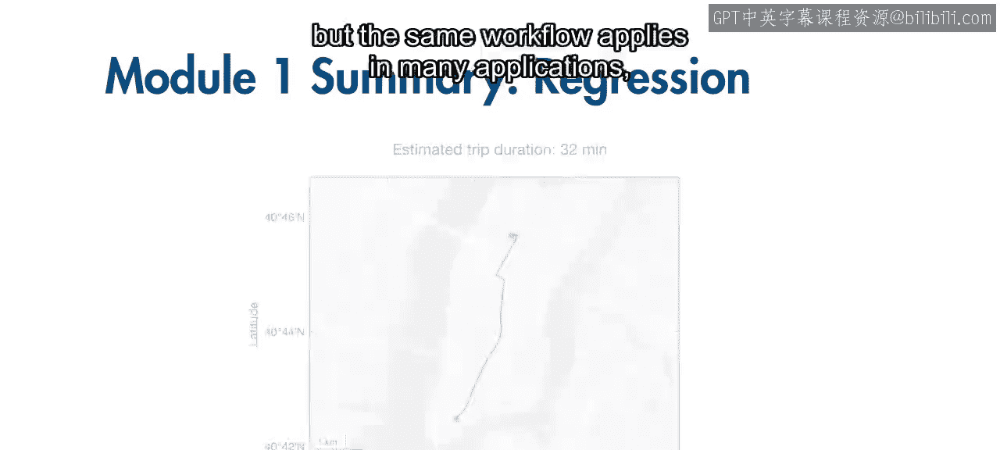

以下是几个典型的回归应用示例：
*   预测电力需求
*   预测温度
*   估计股票价格

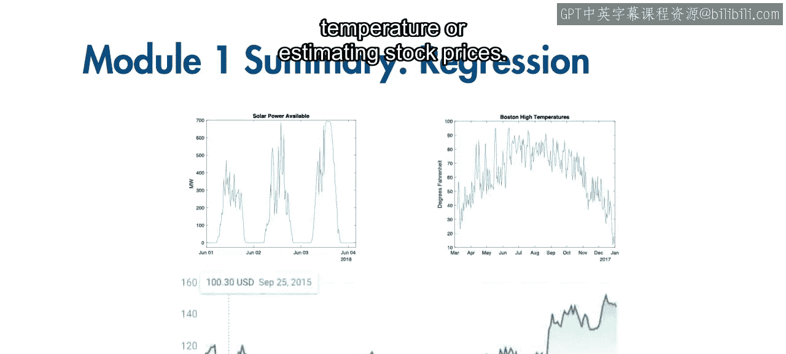

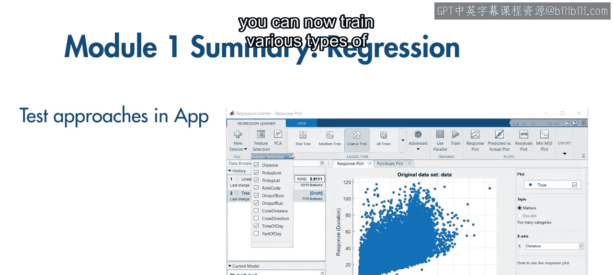

---

上一节我们介绍了回归的应用场景，本节中我们来看看所掌握的工具。现在，你可以使用回归学习器应用程序来训练多种类型的模型。

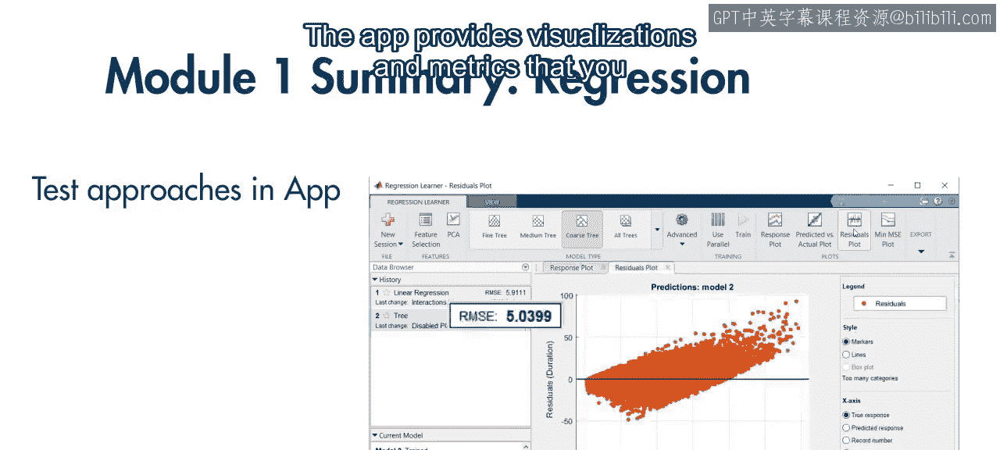

以下是使用该应用程序的关键步骤：
*   尝试使用不同的预测变量组合。
*   利用应用程序提供的可视化图表和评估指标，来确定最适合你应用场景的建模方法。

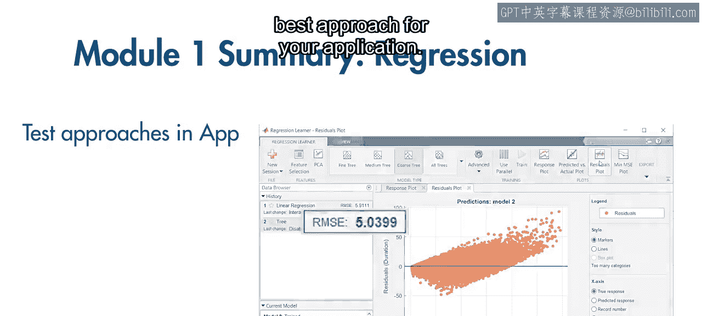

---

在应用程序中比较和测试模型后，你很可能需要更详细地探索其他模型选项和参数。现在，你可以使用代码来进一步定制和训练模型。

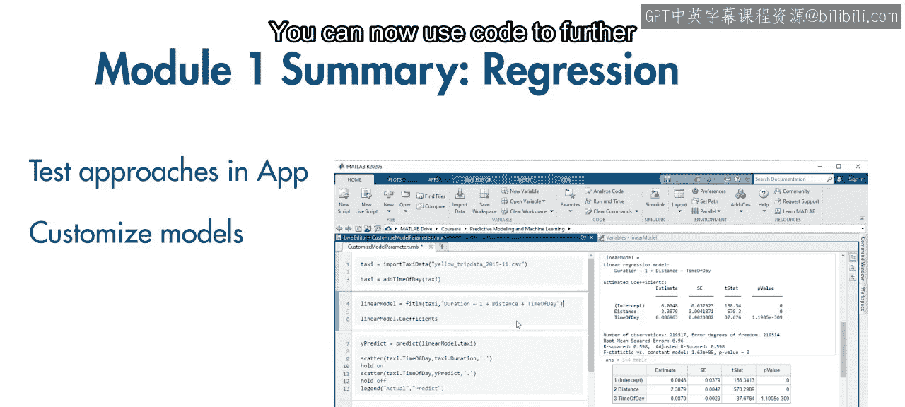

同时，你也学会了如何解释均方根误差和R平方等关键指标。一个好的模型应同时具备较低的RMSE和接近1的R平方值。

核心评估指标公式如下：
*   **均方根误差**：`RMSE = sqrt(mean((y_true - y_pred).^2))`
*   **R平方**：`R² = 1 - (SS_res / SS_tot)`

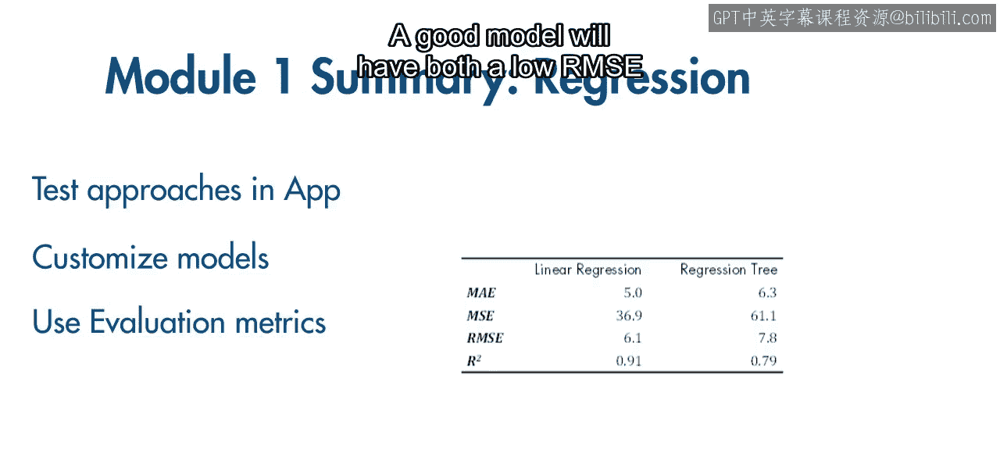

---

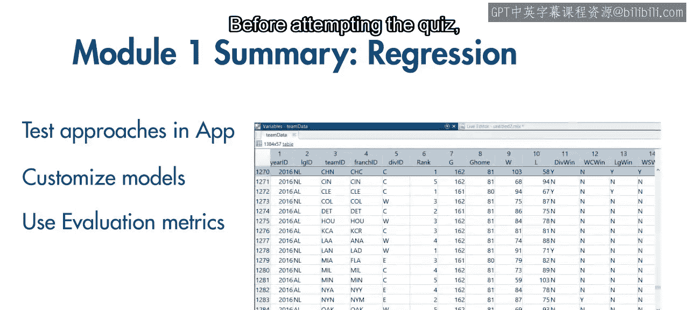

在尝试测验之前，建议你动手实践创建一些回归模型。

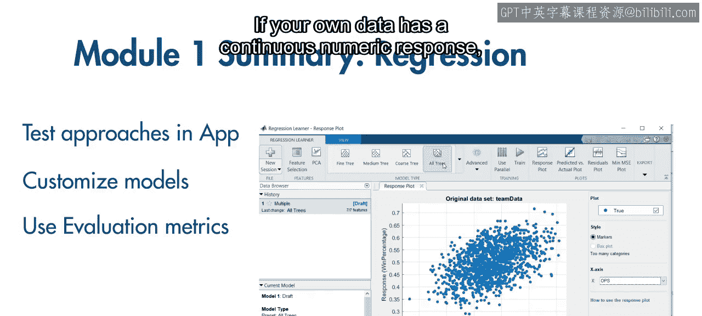

如果你有自己的数据集，并且其响应变量是连续数值，可以尝试构建一个有效的模型。

以下是进行实践的建议：
*   使用对你有实际意义的数据集是极佳的练习方式。
*   在查看模型评估指标时，运用你的领域知识来解读这些值，并判断模型是否按预期工作。

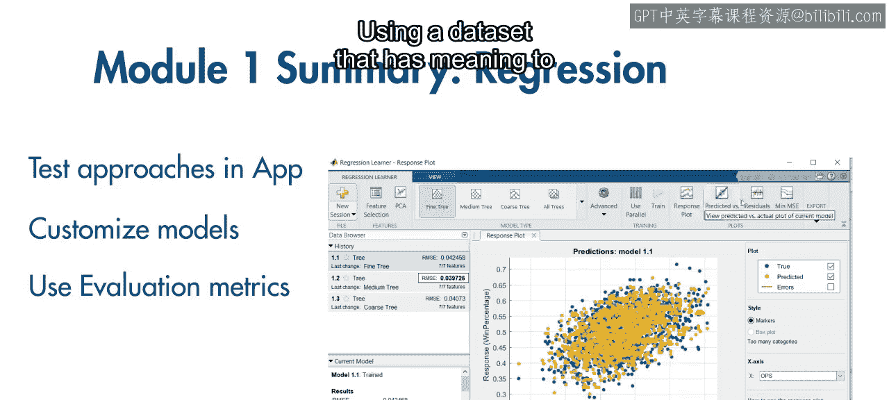
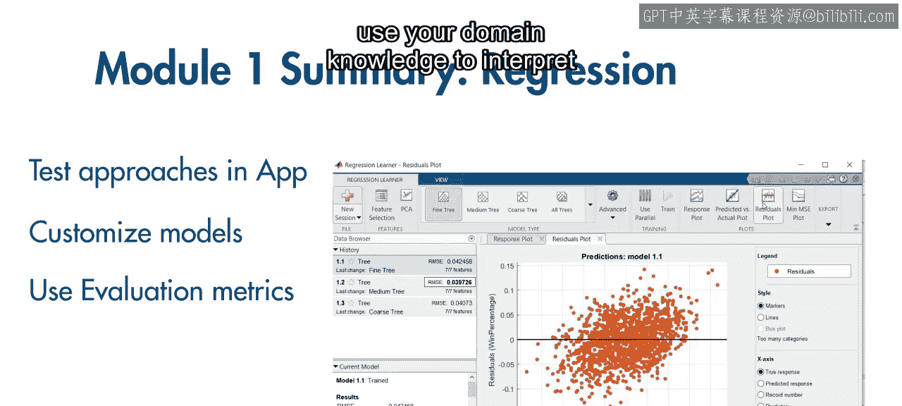
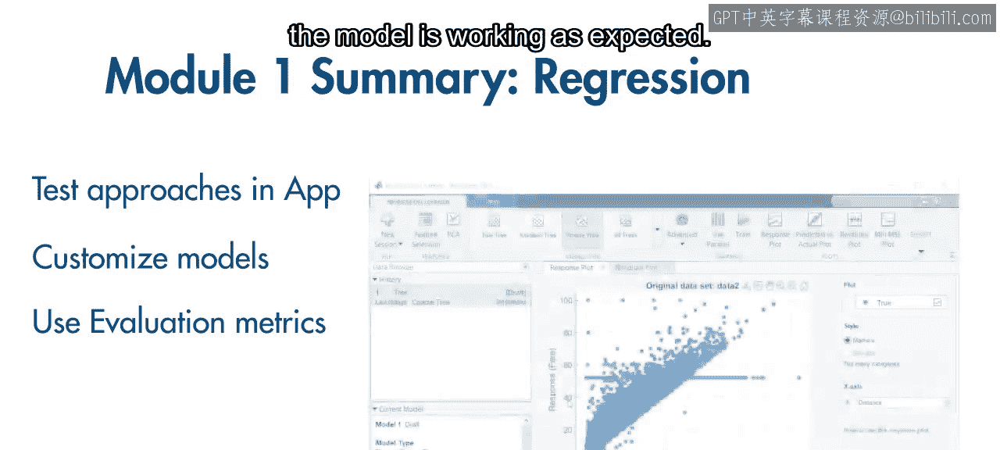

如果你没有现成的数据集，也无需担心，你可以利用课程中的出租车数据探究许多问题。

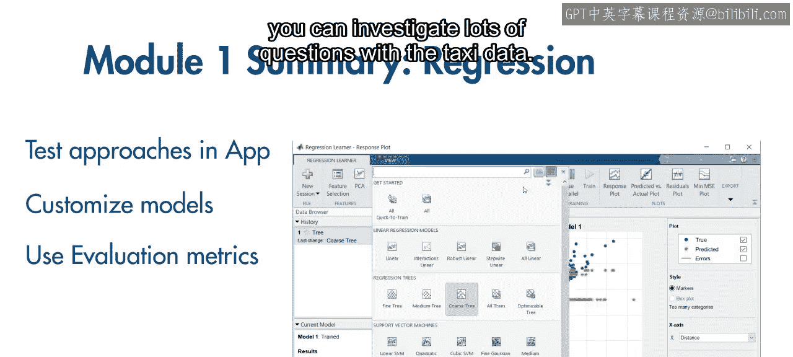

例如，你可以尝试以下挑战：
*   改进行程时长的预测精度。
*   尝试预测行程费用。

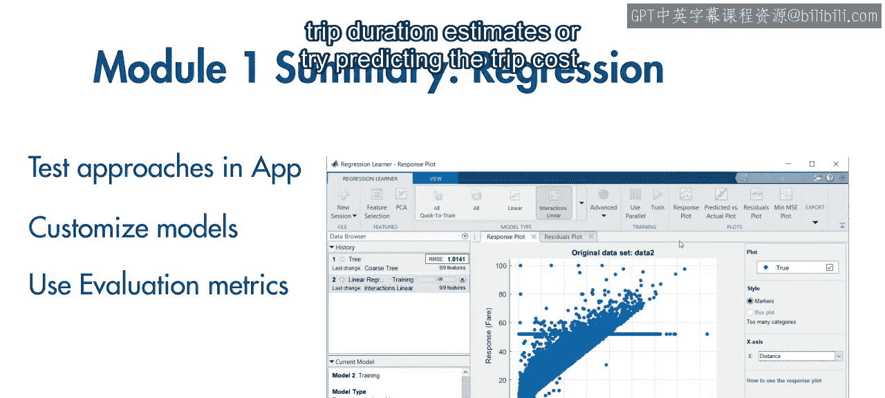

当你准备就绪，即可参加本模块的测验。祝你好运。

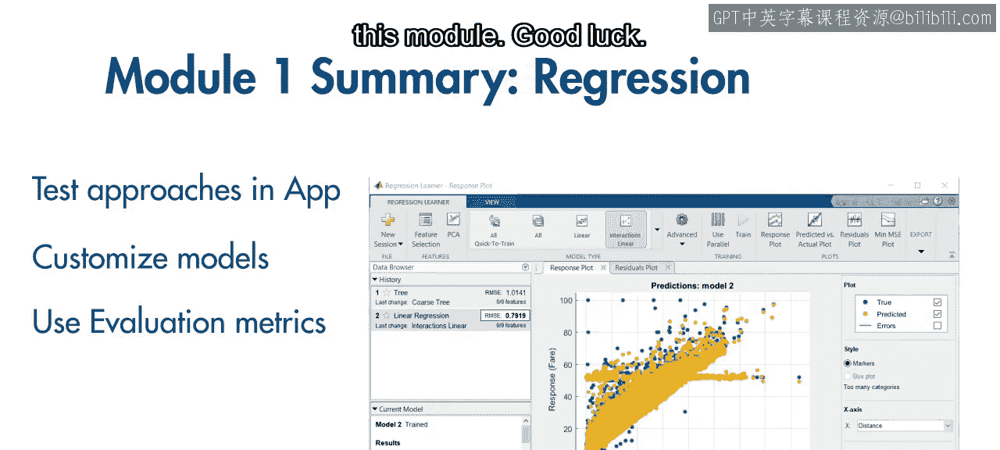

---

本节课中我们一起学习了回归模型的完整工作流程，从应用场景识别、使用回归学习器App训练与比较模型，到利用代码进行高级定制，以及关键评估指标（RMSE和R²）的解读。最重要的是，我们强调了通过实践来巩固技能，无论是使用个人数据还是课程提供的示例数据。