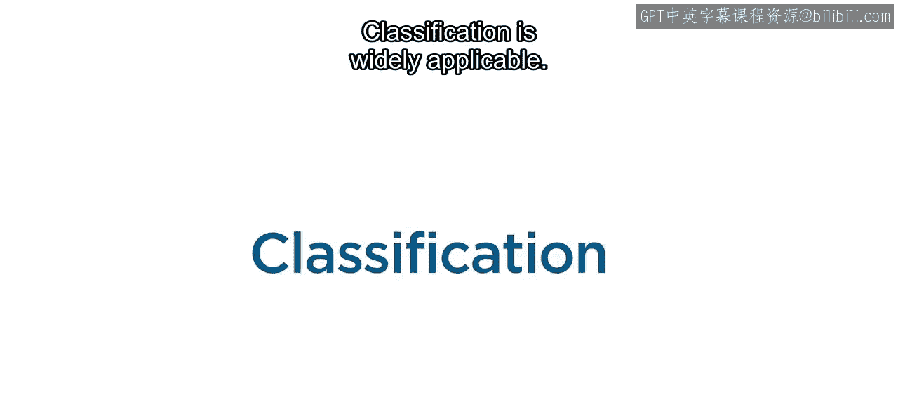
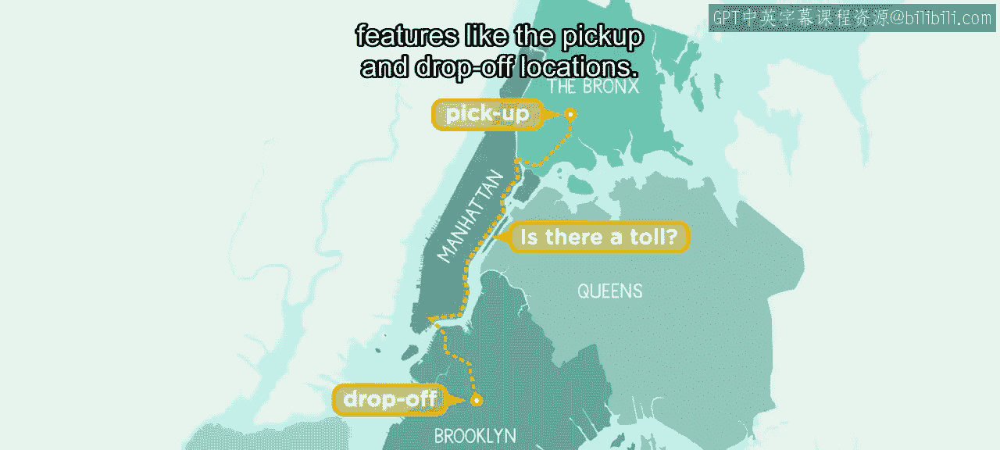
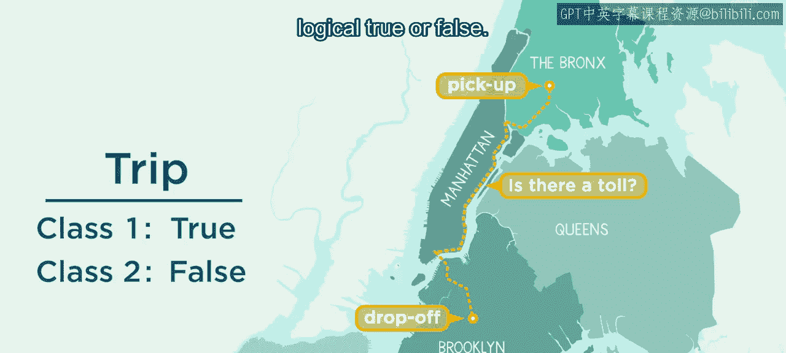
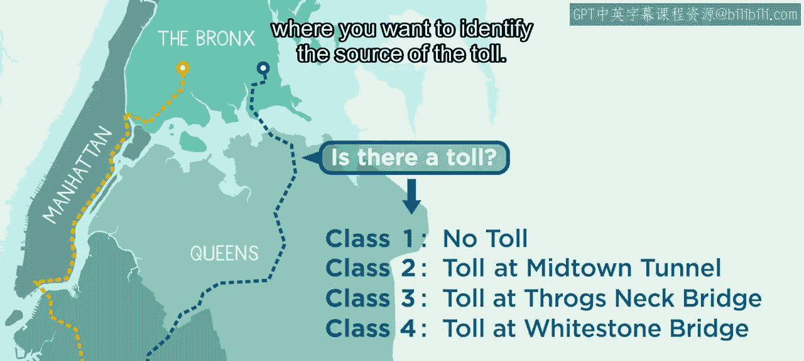
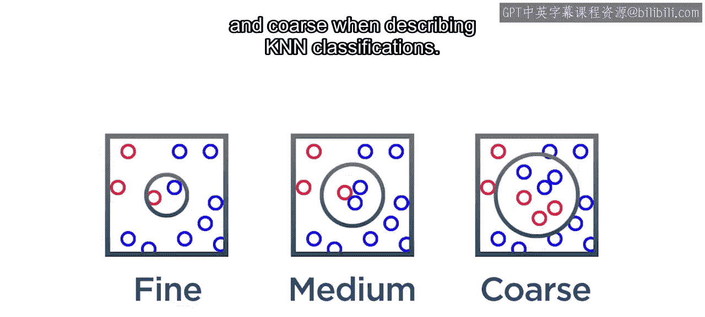
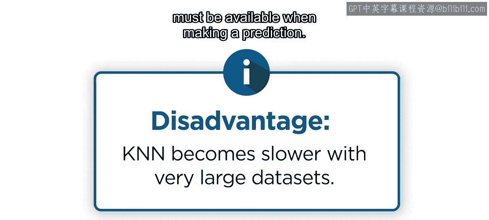
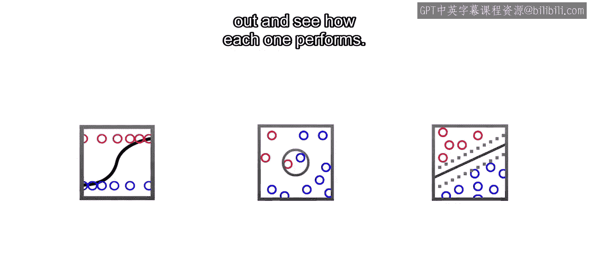
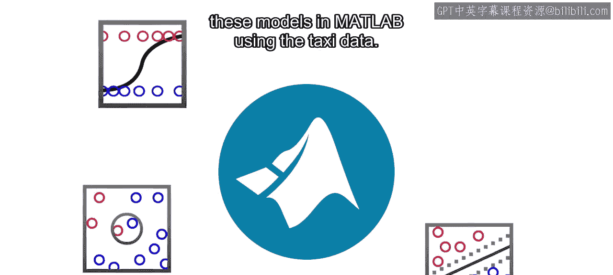

# 11：分类介绍 🎯

在本节课中，我们将要学习分类模型的基础知识。分类是机器学习的一个核心领域，它用于根据一个或多个预测变量来预测离散的响应值。我们将介绍几种最流行的分类模型，并解释它们的工作原理。

## 分类概述

上一节我们介绍了回归模型，本节中我们来看看分类模型。分类模型使用一个或多个预测变量来预测离散的响应值。你可以将其理解为将未知项目归类到一个离散的类别集合中。

分类的应用非常广泛，例如：
*   电子邮件过滤
*   语音和手写识别
*   医疗诊断

## 分类问题示例

假设你在纽约市，想要根据上车和下车地点等特征来预测某次行程是否需要支付过路费。

请注意，这里的目标不是预测过路费的具体金额，而是将行程归类为“需要过路费”或“不需要过路费”。这意味着这个问题有两个类别。你可以使用分类数据标签如“有”和“无”，或者使用逻辑值“真”和“假”。

无论你如何命名类别标签和选择变量，分类的目标都是为未标记的测试案例确定类别标签。

在这个例子中，我们有两个类别，这被称为**二元分类**。但你也可能遇到更复杂的问题，例如需要识别过路费的来源。

具有三个或更多类别的问题被称为**多类分类**。为了介绍分类概念，本视频将重点讨论二元分类。

有多种分类模型可供选择，以下是一些最常见的模型。

## 常见分类模型

你已经学习了回归中决策树的基础知识。在分类情况下，主要区别在于响应变量现在是离散的，因为可能的结果是从你的类别列表中预先确定的，而不是基于数据计算得出的。

接下来，让我们更仔细地看看逻辑回归、K最近邻和支持向量机。请记住，每个模型都可以处理任意数量的预测变量。

### 逻辑回归

让我们从逻辑回归开始。逻辑回归类似于线性回归。

在**线性回归**中，你找到一个方程，使用预测变量来预测连续的响应值。
在**逻辑回归**中，目标同样是找到一个方程，但现在是为了估计一个二元响应变量，例如“是/否”或“真/假”，所有这些都可以编码为0或1。

为了实现这一点，逻辑回归不是将一条直线拟合到数据，而是拟合一个S形的逻辑函数，也称为**Sigmoid函数**。这条曲线从0到1，它根据你的预测特征来估计行程需要过路费的概率。

因此，逻辑回归仍然使用一个公式，但这个公式更适合二元问题。与线性回归的情况一样，任务是确定方程的系数。

需要注意的是，你可以选择一个**阈值**。如果概率大于这个阈值，则预测行程需要过路费；否则，预测不需要。很容易假设分类阈值应始终为0.5。但阈值取决于具体问题，在许多情况下，你必须调整阈值。例如，你可能会设置一个高阈值来分类垃圾邮件，以免过滤掉重要的电子邮件。

当你有一个二元响应变量时，应该考虑使用逻辑回归，这正是该模型独特构建的目的。此外，当你的数据行为良好且关系不太复杂时，这个模型效果很好。因为它训练速度快，所以非常适合作为初始基准模型。

### K最近邻

有时，你的数据对于简单的数学公式来说过于复杂。在这种情况下，使用一种称为**K最近邻**的分类模型是一个好方法。

该分类模型假设相似的事物存在于相近的位置，换句话说，彼此靠近。KNN通过查看给定数量K的邻近观测值来预测响应。

为了更好地理解KNN的工作原理，考虑一个你将K设置为3的例子。对于一个新数据点，分类将考虑其3个最近的邻居。这里，注意有两个数据点标记为“有”，一个标记为“无”。由于大多数邻居是“有”，因此新数据点被分类为“有”。这也被称为**多数投票机制**。

KNN模型与逻辑回归不同，因为进行新预测需要参考所有现有数据，而不是通过数学方程运行。因此，对于大型数据集，KNN模型在计算上可能很昂贵。此外，你需要注意K的正确值。K值为1可能导致预测对噪声或异常值的鲁棒性较差。较大的K值由于多数投票机制会产生更稳定的预测。但最终，非常大的K值会使预测变得不那么准确，因为难以捕捉复杂的行为。你需要调整K以找到最适合特定数据集的值。

根据K值的大小，通常使用术语“精细”、“中等”和“粗糙”来描述KNN分类。

总的来说，KNN分类模型是最容易理解和解释的模型之一，并且正如你将在本模块后面看到的，它可以相当准确。KNN的主要缺点是随着数据量的增加，其速度会显著变慢。这使其在需要快速预测或内存限制严格的环境中可能不切实际，因为进行预测时必须所有数据都可用。

### 支持向量机

本视频涵盖的最后一种模型是**支持向量机**。你可能记得SVM模型也是回归的一个选项。SVM模型因其灵活性而成为分类的热门选择。

在二元分类问题中，假设你想将代表“无”的橙色方块与代表“有”的蓝色圆圈分开。此图上显示的任何一条线都是一个可行的选项，它们都能完美地将橙色方块与蓝色圆圈分开。但是否存在一条最优的线或决策边界？为了最好地捕捉数据的行为，目标是找到一条能最准确地将新观测值分类到两个类别之一的线。

你可能想要一条在两个类别之间均匀间隔并为每个类别提供缓冲区的线。这正是SVM所做的。该算法试图找到一条正好位于两个类别中间的线，最大化两者之间的距离，称为**间隔**。

为了找到最大化间隔的线，SVM算法首先从两个类别中找到离该线最近的点。这些点被称为**支持向量**。因此，SVM算法试图以这样一种方式找到决策边界，使得两个类别之间的分离尽可能宽。在这个二维情况下，该决策边界对应于一条线。但这个边界通常被称为**超平面**，它适用于更高维度。

简而言之，支持向量机是一种分类器，它找到一个最优超平面，以最大化两个类别之间的间隔。

在实际例子中，通常不可能找到一个完美分离两个类别的超平面。一个在间隔内但被正确分类的点称为**间隔误差**。一个在分离边界错误一侧的点是**分类误差**。总误差是间隔误差和分类误差的总和。

当数据可以被一条直线或超平面分离时，会发生什么？在这些情况下，你可以使用**核方法**，它将数据投影到一个额外的维度。现在，不是决策线，而是有一个分离点的决策曲面。这个概念可以推广到更高维度。通过核方法，你将数据映射到一个更高维度的空间，在那里数据是线性可分的。用于转换的数学函数称为**核函数**，并且有不同类型的核函数。线性是最常见的，但其他选项包括多项式、径向基函数，特别是高斯函数。这些函数中的每一个都有其自身的特性和表达式。

核方法是SVM的一个真正优势，因为它使你能够高效地处理非线性数据。然而，必须正确选择核函数，以避免训练速度急剧增加。

## 总结

本节课中我们一起学习了几种广泛使用的分类模型，它们可以调整以处理任意数量的预测变量。每种模型在准确性和训练速度方面都有其自身的优点和缺点。要知道哪种模型在特定数据集上效果最好，唯一的方法是尝试它们并查看每种模型的性能。

接下来，你将学习如何在MATLAB中使用出租车数据快速训练这些模型。

