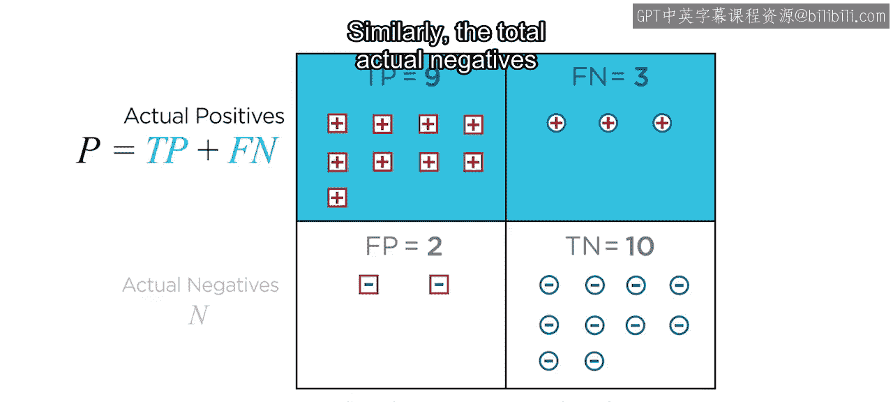
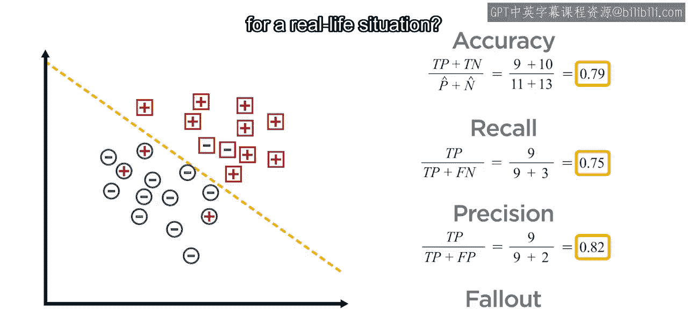
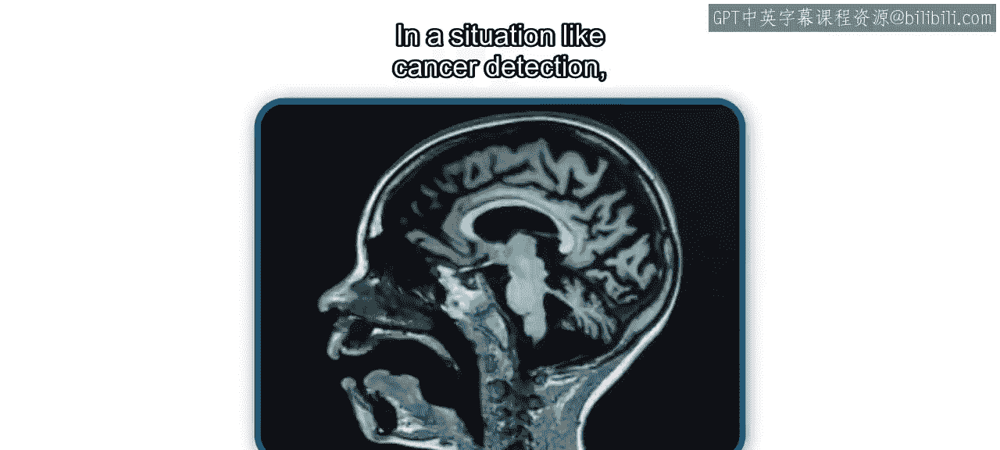
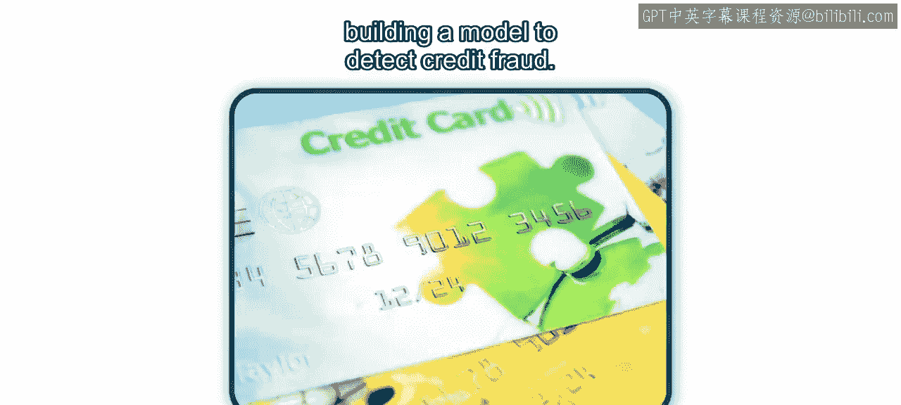
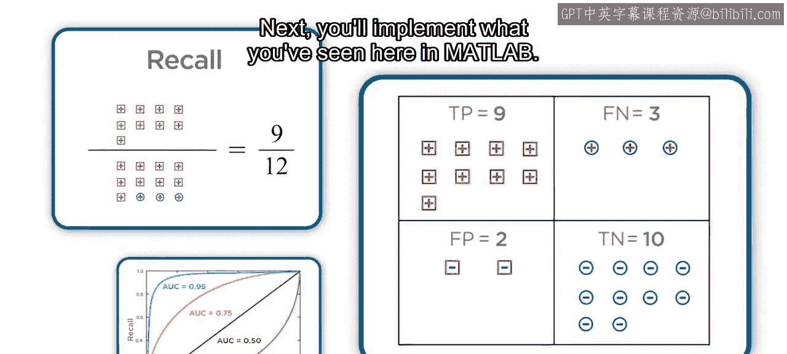

# 13：评估分类模型 🎯

在本节课中，我们将学习如何评估分类模型的性能。我们将从构建混淆矩阵开始，并从中推导出四个关键的评估指标：召回率、误报率、精确率和准确率。接着，我们将探讨在评估模型性能时，为何需要考虑这些指标之间的权衡。最后，我们将使用接收者操作特征曲线来系统地评估召回率与误报率之间的权衡关系。

## 从混淆矩阵开始

上一节我们介绍了常见的分类模型及其训练方法。本节中，我们来看看如何评估这些模型的性能。让我们从一个简单的二分类例子开始。

回忆一下，二分类模型使用一个决策边界来分隔两类数据。在这个例子中，数据点被分为正类和负类。决策边界一侧的数据点被预测为正类，另一侧的被预测为负类。

假设有12个正类数据点，模型正确分类了其中9个，这些被称为**真正例**。其余3个被错误分类为负类的正类数据点，被称为**假反例**。同样，有12个负类数据点，其中10个被正确分类为**真反例**，2个被错误分类为正类的负类数据点，被称为**假正例**。

评估这四种情况的一个常用方法是使用**混淆矩阵**。在混淆矩阵中，真实值按行分组，预测值按列分组。矩阵的每个象限分别对应真正例、真反例、假正例和假反例的数量。

以下是混淆矩阵中各项的基本关系：

*   实际正例总数 = 真正例 + 假反例
*   实际负例总数 = 假正例 + 真反例
*   预测正例总数 = 真正例 + 假正例
*   预测负例总数 = 假反例 + 真反例

## 四个关键评估指标

基于混淆矩阵，我们可以计算四个核心的评估指标。在探讨它们之间的权衡之前，让我们先逐一详细了解每个指标。

以下是四个关键指标的定义：

1.  **召回率**：衡量模型正确识别出某个类别的能力。对于正类，其计算公式为：
    `召回率 = 真正例 / (真正例 + 假反例)`
2.  **误报率**：衡量模型对某个类别产生“误报”或“假警报”的频率。对于二分类中的正类，其计算公式为：
    `误报率 = 假正例 / (假正例 + 真反例)`
3.  **精确率**：衡量模型对某个类别的预测有多准确。对于正类，其计算公式为：
    `精确率 = 真正例 / (真正例 + 假正例)`
4.  **准确率**：衡量模型整体分类正确的比例。其计算公式为：
    `准确率 = (真正例 + 真反例) / 总样本数`

如果分类是完美的，那么准确率、精确率和召回率都将为1，而误报率将为0。然而，在现实中，我们很少能达到这种理想状态，因此需要考虑指标间的权衡。

## 评估中的权衡考量

回到我们的例子，该模型的准确率为79%，召回率为75%，精确率为82%，误报率为17%。这样的性能在现实应用中是否可以接受？这取决于具体的应用场景。

*   **癌症检测**：假阳性可能导致患者暂时焦虑，但假阴性（即漏诊）可能带来致命的后果。在这种情况下，我们可能希望**最大化召回率**，以确保不遗漏任何阳性病例。但需要注意，通过移动决策边界使召回率达到100%，可能会降低准确率至71%，并使精确率降至63%，误报率升至58%。
*   **信用卡欺诈检测**：频繁因误报而锁定客户卡片会带来巨大困扰。因此，我们需要**最小化误报率**。然而，将误报率降至0%可能会使准确率降至71%，同时召回率大幅下降至42%，这意味着模型会放过58%的潜在欺诈活动。
*   **垃圾邮件过滤**：让几封垃圾邮件进入收件箱问题不大，但让用户错过来自亲友或同事的重要邮件则严重得多。此时，我们需要**关注精确率**，以最小化被模型误判为垃圾邮件的正常邮件数量。

在现实场景中，决策边界很少能完美分隔正负类。因此，我们需要根据应用目标，在各项指标之间进行权衡，以构建一个可接受的模型。

## 注意类别不平衡

基于目前所学，你可能会认为追求高准确率就能在所有指标间取得良好平衡。有时确实如此，但再次提醒，必须谨慎。

如果你的数据存在**类别不平衡**，例如负类样本占绝大多数，那么一个将所有或几乎所有数据点都预测为负类的模型，仍然会具有很高的准确率，甚至精确率也很高，误报率很低。然而，其召回率会非常差。反之亦然。

因此，在评估模型时，同时查看多个指标（例如召回率和误报率）通常是一个好主意。

## 使用ROC曲线进行系统评估

一种同时使用召回率和误报率来评估模型的有效方法是构建**ROC曲线**并计算**曲线下面积**。

ROC代表“接收者操作特征”，这个术语源于雷达工程领域。ROC曲线描绘了当决策阈值从0变化到1时，模型的召回率与误报率之间的关系。

AUC值范围在0到1之间，值越接近1，表示模型性能越好，意味着模型能够在保持低误报率的同时实现高召回率。AUC值为0.5时，模型相当于随机猜测；低于0.5，则意味着模型预测错误的能力比正确预测的能力还强。

ROC曲线通过可视化召回率与误报率的关系，有助于你确定决策边界的最佳设置位置。

## 总结

本节课中，我们一起学习了如何构建混淆矩阵，并从中推导出评估分类模型的关键指标。我们看到了评估分类模型需要考虑指标间的权衡，并学习了如何使用接收者操作特征曲线来系统地评估召回率与误报率之间的权衡关系。

接下来，你将在MATLAB中实践这里所学到的内容。