# 15：训练多类模型

在本节课中，我们将学习如何训练一个多类分类模型。之前我们使用二分类模型预测出租车行程是否会产生通行费。但如果想进一步知道通行费具体来源于哪个收费站，二分类模型就不再适用，因为结果类别超过了两个。本节将介绍如何训练能够从两个以上类别中预测结果的多类模型，并学习如何使用混淆矩阵来比较不同模型的性能。

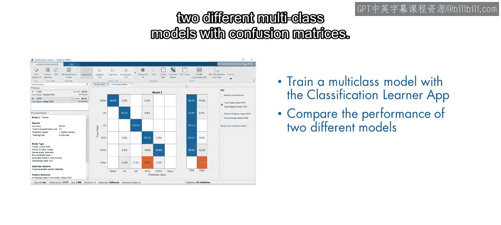

## 数据准备与问题定义

上一节我们介绍了二分类模型，本节中我们来看看如何将问题扩展到多类别预测。

首先，观察一张纽约市地图，其中高亮显示了不同的通行费来源。根据通行费金额，可以将各个桥梁和隧道分为五类。例如，标记为“MTA”的紫色过境点在2015年收费均为5.54美元。这些缩写或指桥梁名称（如“HH”指亨利哈德逊桥），或指收取通行费的交通管理局（如“MTA”指大都会运输署）。数据集中还有一些通行费与官方报告的任何价格都不匹配，这些通行费被归入第六类，名为“其他”。

以下是开始建模的步骤：
1.  打开一个新的实时脚本，加载一个月的出租车数据。
2.  使用提供的函数 `addTollSource` 来添加一个包含六个通行费来源的新分类变量。
3.  使用另一个自定义函数移除未收取通行费的行程，因为这些数据点不再需要。

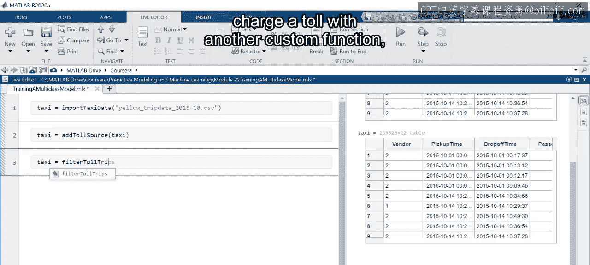

## 使用分类学习器应用程序

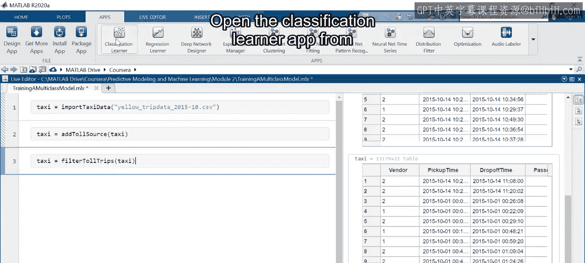

接下来，我们从工具条打开“分类学习器”应用程序，并开始一个新的会话。

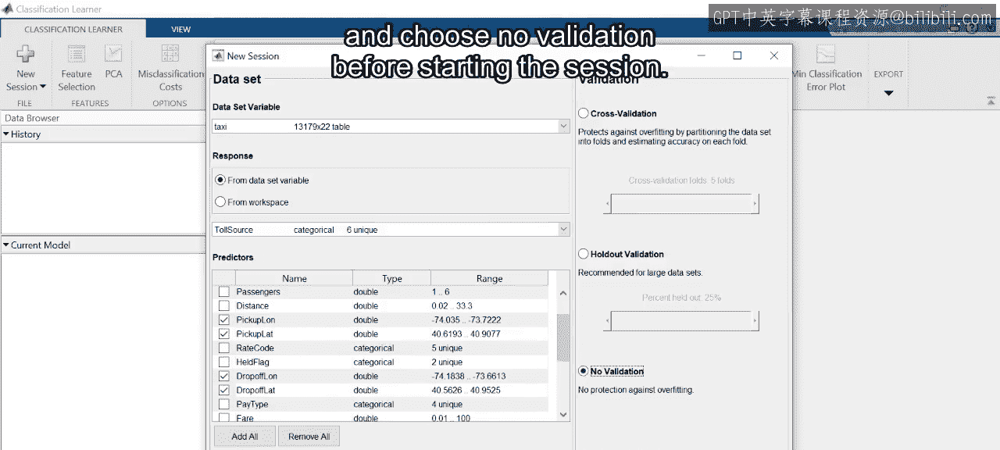

在应用程序中，请确保在下拉列表中选择了出租车数据，并选择变量 `TollSource` 作为响应变量。像之前进行二分类时一样，选择上车和下车坐标变量作为预测变量。在开始会话前，选择“无验证”。

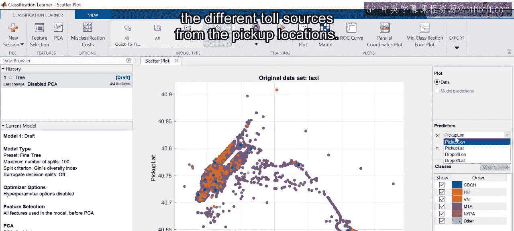

观察散点图中上车位置的分布，可以大致看出曼哈顿岛的轮廓。大多数产生通行费的行程始于曼哈顿或附近机场。然而，仅从上车位置很难区分不同的通行费来源。

尝试选择下车位置进行观察。现在，可以看到相同颜色的点形成了不同的簇。大部分点是紫色的，属于MTA类。也可以看到其他颜色（如VN或HH类）的较小点群。这些类别在视觉上的清晰分离表明，下车位置将有助于预测通行费来源。

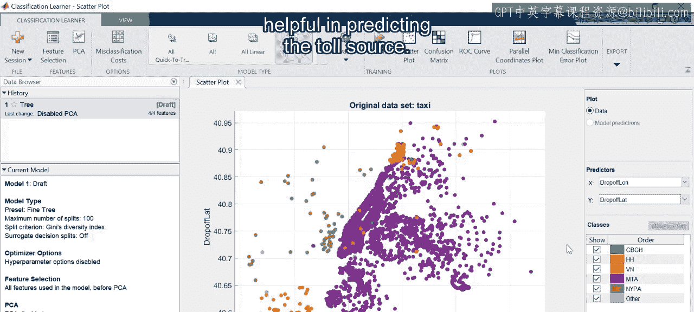

## 训练多类模型：K最近邻算法

那么，如何训练一个模型来预测多个类别呢？有些算法可以轻松地从二分类扩展到多类模型，例如K最近邻算法。

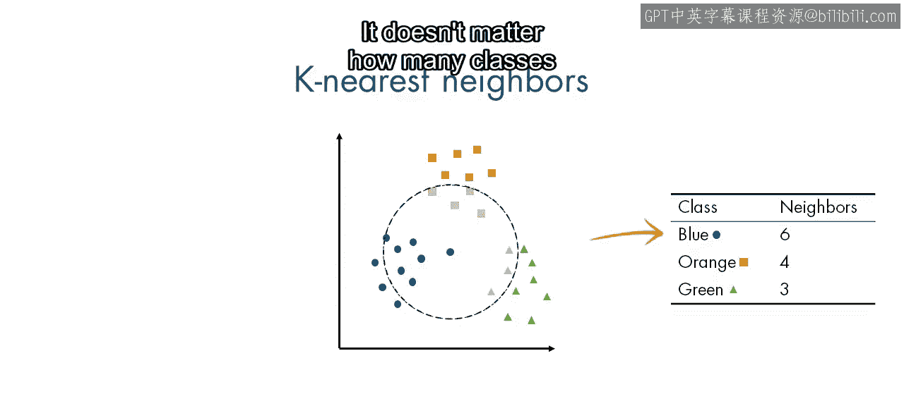

K最近邻分类器的工作原理是识别每个数据点的最近邻居，然后将其分配到这些邻居中最常见的类别。邻居集合中代表多少个类别并不重要。

以下是K最近邻算法的核心概念：
```
对于一个新数据点，找出训练集中与其距离最近的K个邻居。
统计这K个邻居中各个类别的数量。
将该数据点分配给数量最多的那个类别。
```

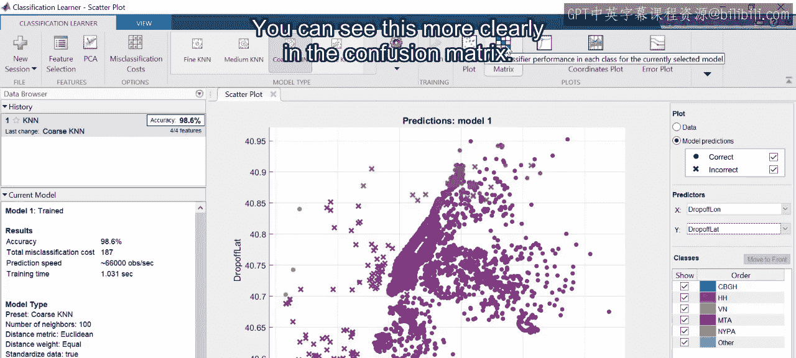

要亲自尝试，请在应用程序中选择一个“粗略KNN”模型并点击“训练”。这个KNN模型表现如何？报告的准确率超过98%。这是否意味着模型性能很好？

查看散点图会发现，许多行程被错误地标记为MTA类。事实上，看起来有些类别根本没有出现。这一点在混淆矩阵中可以看得更清楚。

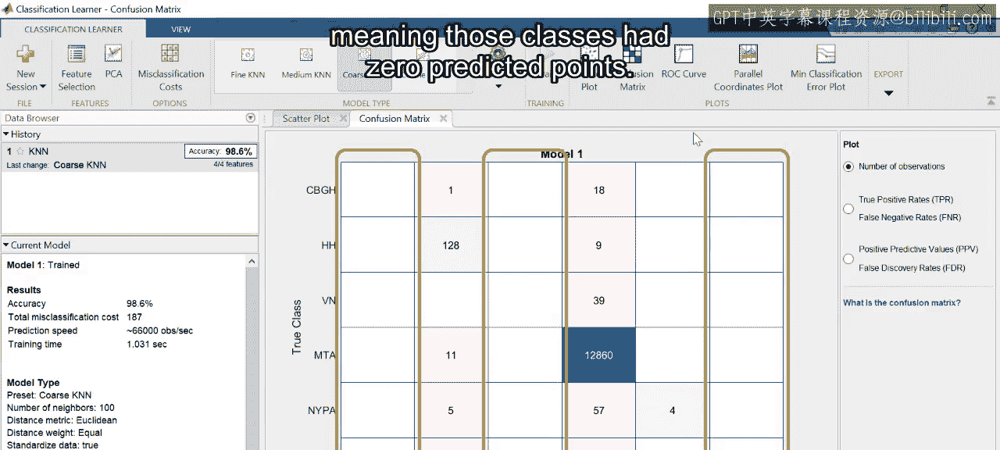

多类模型的混淆矩阵与二分类情况类似，X轴是预测类别，Y轴是真实类别。但现在，每个类别都对应一行和一列，因此这个矩阵的大小是6x6。注意，几乎所有数据点都被预测为MTA类，但由于这个类别最常见，整体准确率仍然很高。有三个列是空的，意味着那些类别的预测点数为零。

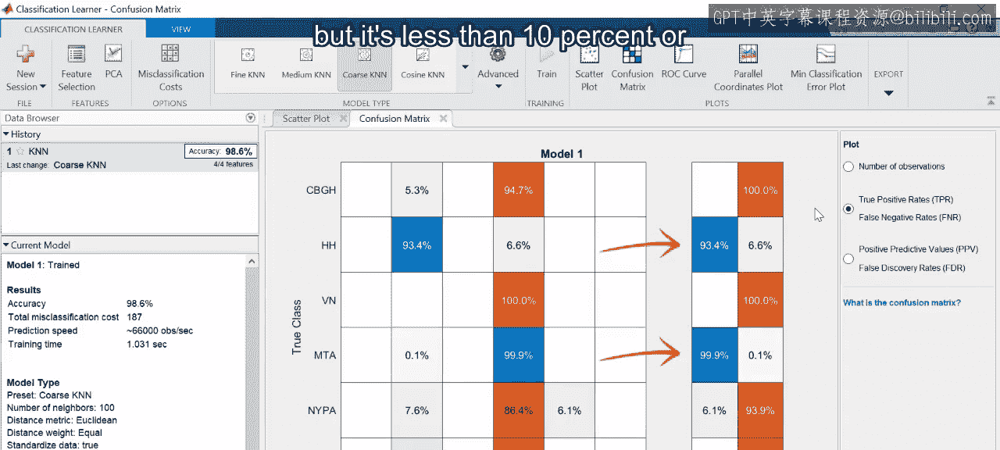

这种不佳的性能反映在每个类别的召回率（或真阳性率）上。HH和MTA类的召回率超过90%，但其他类别的召回率低于10%，甚至未定义。

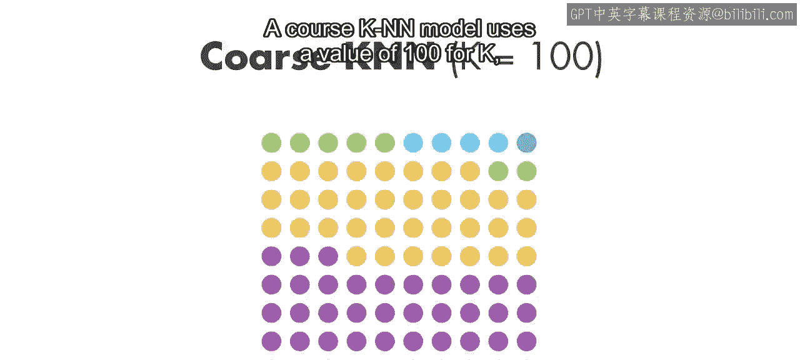

为什么会发生这种情况？粗略KNN模型使用的K值为100，这意味着每个数据点都被分配给它100个最近邻居中最常见的类别。

然而，有几个类别的数据点甚至不足50个，这意味着它们总是会被分配给更常见的MTA类。你可以尝试自定义这个模型。什么样的K值能改善这些类别的召回率？

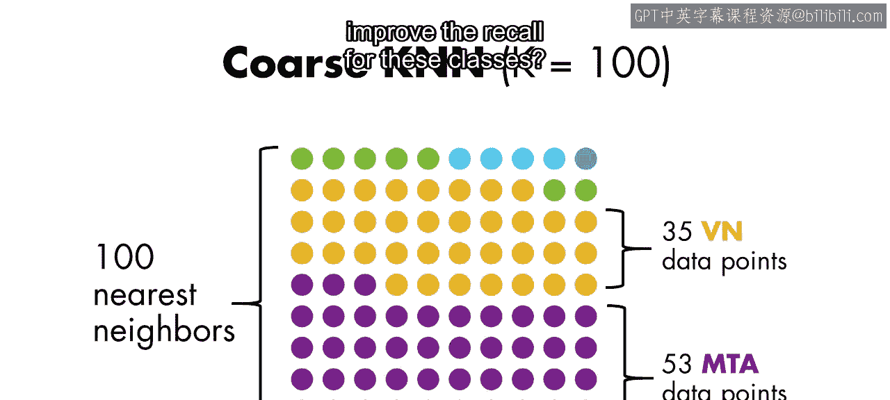

## 训练多类模型：支持向量机

让我们转向另一种类型的模型：支持向量机。

回忆一下，单个SVM模型会找到两个类别之间的决策边界，因此它不能轻易扩展到多个类别。相反，可以采用多个二分类器来实现相同目标。这种称为“一对多”分类的策略为每个类别使用一个单独的模型。

在训练之前，每个模型中的数据点被标记为属于或不属于某个特定类别。然后使用SVM或逻辑回归等二分类技术训练这些模型。当需要预测新数据点的类别时，会为每个模型计算一个分数。该分数代表新数据点与孤立类别的匹配程度。数据点被分配给其模型得分最高的类别。

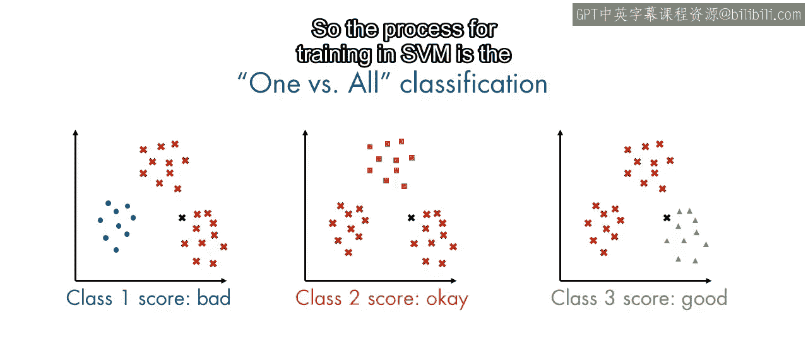

所有这些在MATLAB中都是自动处理的，因此训练SVM的过程对于二分类或多类模型是相同的。

以下是“一对多”策略的核心步骤：
```
对于N个类别，训练N个独立的二分类器。
第i个分类器学习区分“类别i”和“所有其他类别”。
预测时，用所有N个分类器对新样本进行评分。
将新样本分配给给出最高“属于该类”置信度的分类器所对应的类别。
```

让我们在应用程序中训练一个多类SVM。首先从下拉列表中选择一个“线性SVM”模型。在高级选项中，默认的多类方法是“一对一”。这是“一对多”策略的一个稍高级的版本，但它使用了相同的训练多个模型的方法。保持此选项被选中并训练模型。

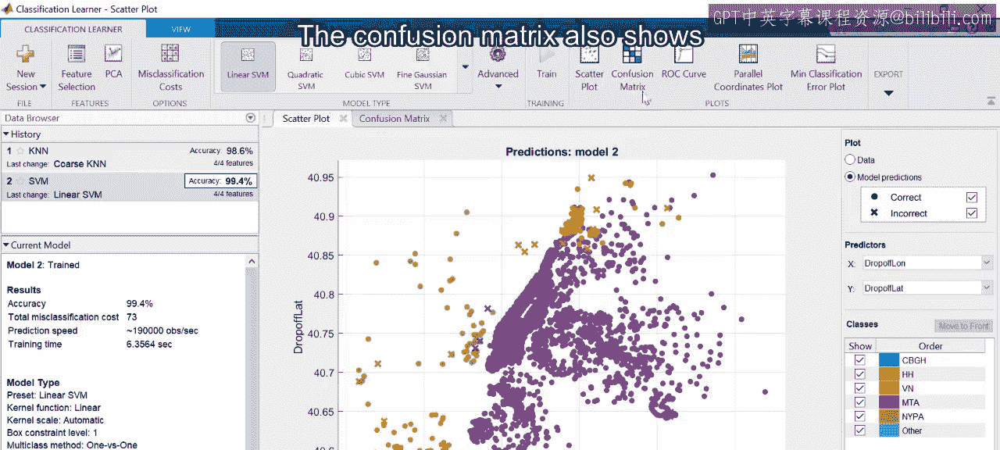

SVM模型的整体准确率高于KNN模型，但它是否在预测较小类别方面表现更好？从散点图来看似乎是这样，因为更多的类别可见。换句话说，SVM模型没有将所有来自较小类别的点都分配给MTA类。

混淆矩阵也显示了更好的召回率（除了“其他”类）。尽管如此，这些结果表明，线性SVM模型在预测已知通行费来源方面比粗略KNN模型做得更好。

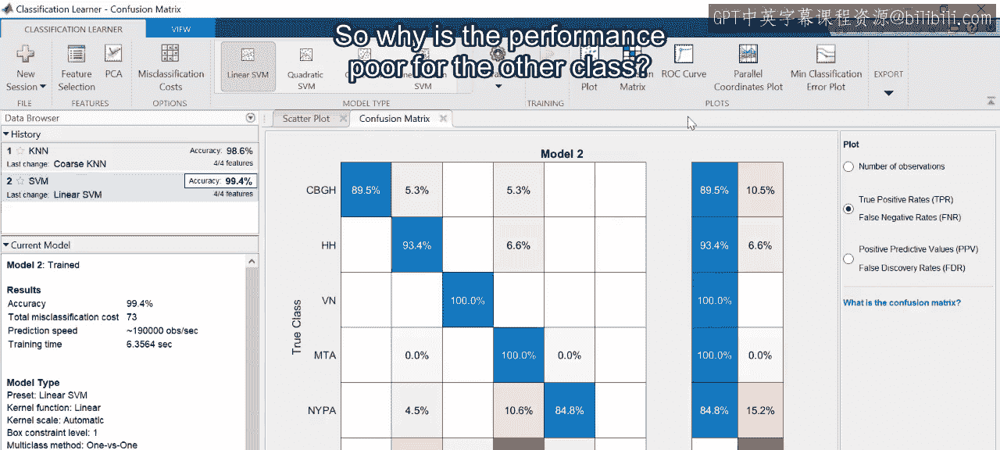

那么，为什么“其他”类的性能不佳呢？回到散点图，取消选择除“其他”之外的所有类别。下车位置相当分散，这意味着这个类别与其他类别有显著的重叠。

因此，除了上车和下车位置之外，还需要额外的特征来准确预测这个类别。另一方面，这些通行费可能本应属于某个已知来源，但它们的金额记录有误。值得进一步调查，看看这些数据点是否应被视为缺失值。

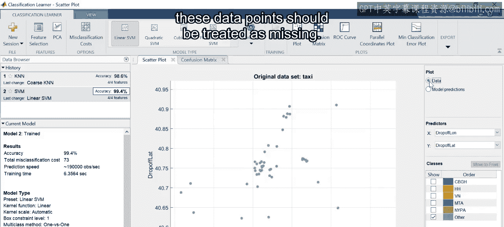

## 总结

本节课中我们一起学习了在MATLAB中训练和评估多类分类模型。总结要点如下：

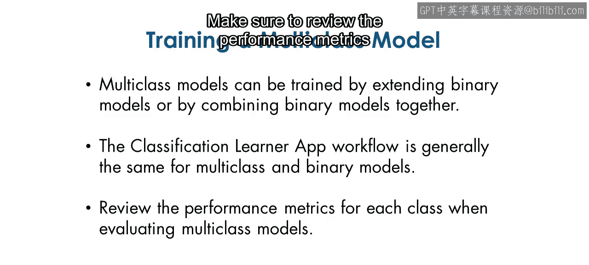

1.  **模型构建方法**：多类模型可以通过将二分类模型扩展到更多类别，或通过组合多个二分类模型来训练。
2.  **工具使用**：分类学习器应用程序可以执行这两项任务，因此多类模型和二进制模型的工作流程大体相同。
3.  **模型评估**：整体准确率指标很少能说明全部情况。在评估模型时，务必查看每个类别的性能指标。