16：分类总结 🎯

在本节课中，我们将对分类模块的核心内容进行总结。我们将回顾分类问题的定义、模型训练与评估方法，以及如何将二分类模型扩展到多分类问题。

当响应变量具有一组离散的可能结果时，需要使用分类模型。

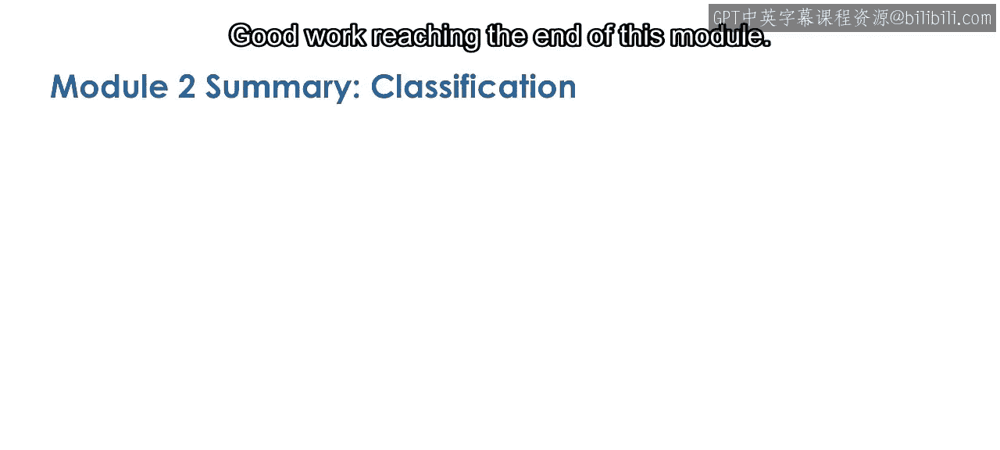

例如，预测患者是否有患病风险，或者预测机器是否需要维护。

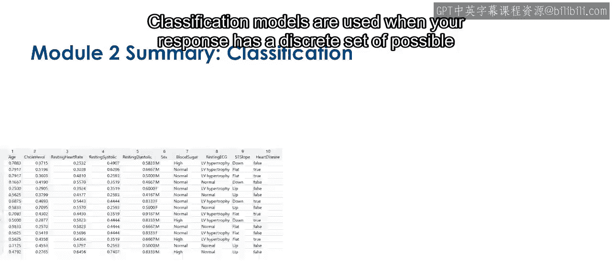

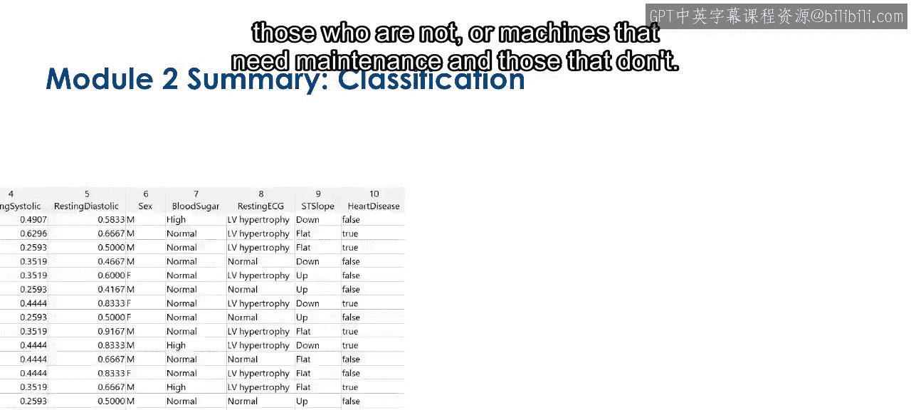

在本次课程中，我们使用出租车数据来预测行程是否包含通行费。

**`y = predict(model, X)`** 其中 `y` 为离散类别标签。

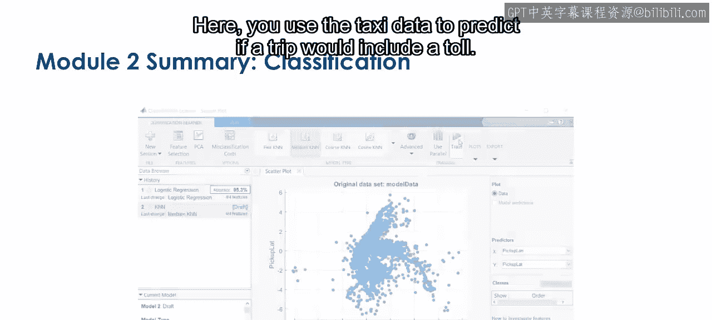

---

上一节我们介绍了分类问题的应用场景，本节中我们来看看如何训练模型。

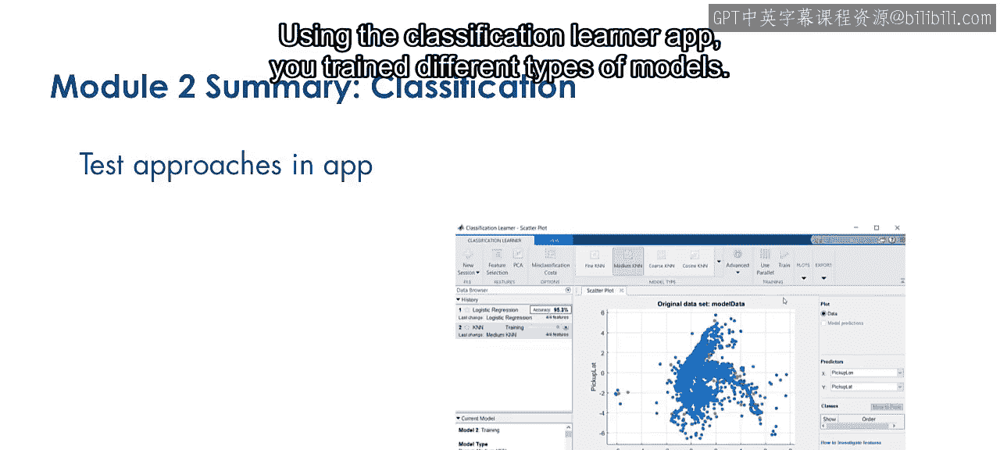

使用分类学习器应用程序，您可以训练多种不同类型的模型。

以下是几种常见的分类模型类型：
*   决策树
*   支持向量机
*   K近邻
*   集成方法

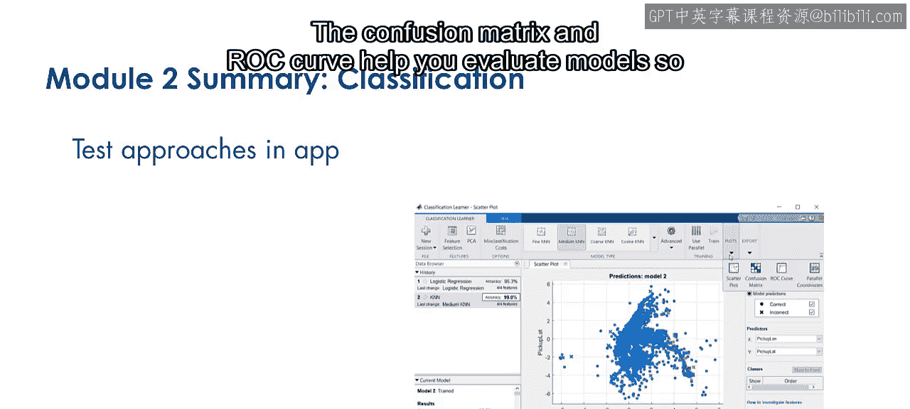

---

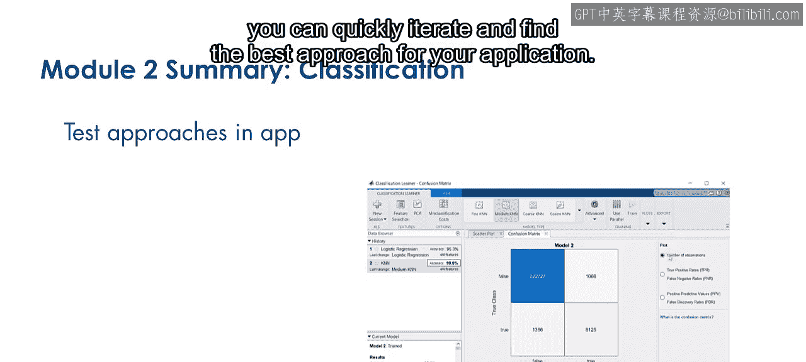

模型训练完成后，评估其性能至关重要。混淆矩阵和ROC曲线是帮助您评估模型的工具，使您能够快速迭代并找到最适合您应用的方法。

混淆矩阵展示了模型预测结果与实际类别的对比情况。

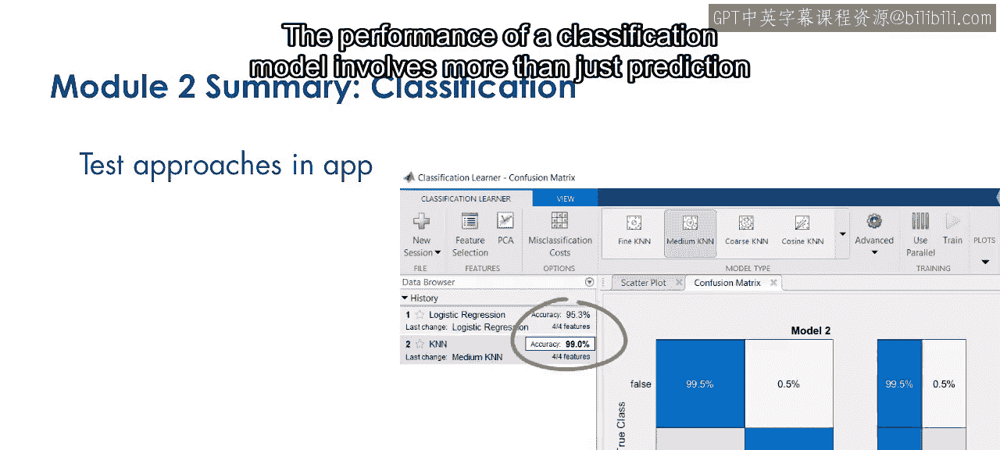

ROC曲线则通过可视化召回率与误报率之间的权衡，帮助您评估模型性能。

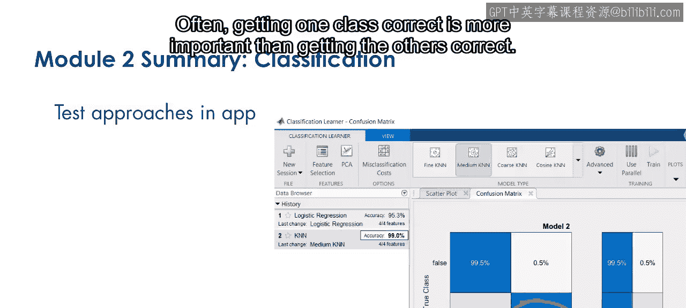

---

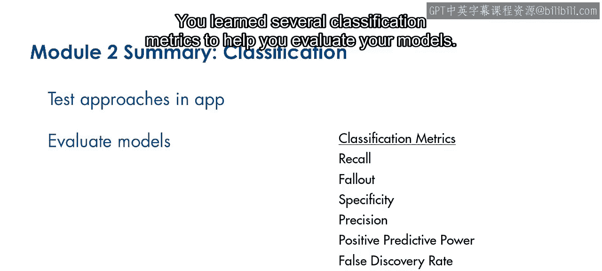

分类模型的性能评估不仅仅关乎预测准确率。通常，正确预测某一特定类别比其他类别更为重要。

您学习了多个分类评估指标来帮助评估模型。

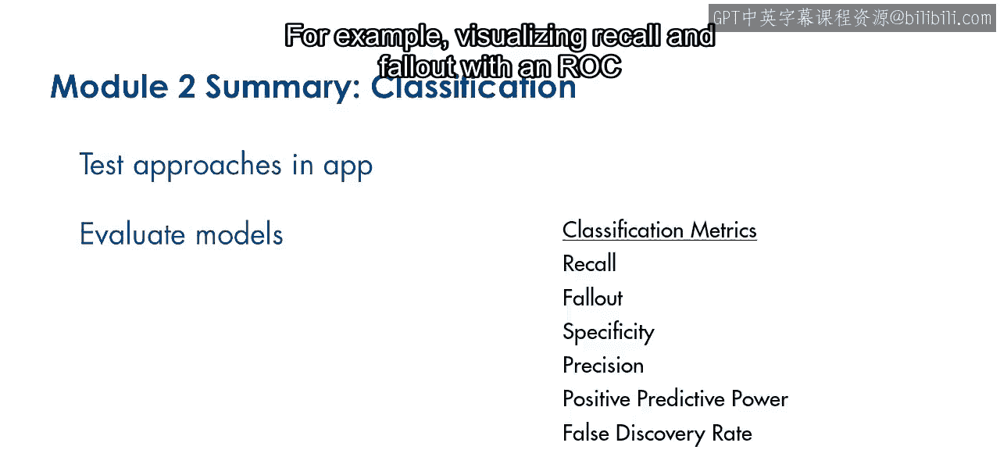

以下是几个关键指标：
*   **准确率**：正确预测的样本比例。
*   **召回率**：实际为正例的样本中被正确预测的比例。**公式：Recall = TP / (TP + FN)**
*   **精确率**：预测为正例的样本中实际为正例的比例。**公式：Precision = TP / (TP + FP)**
*   **F1分数**：精确率和召回率的调和平均数。

例如，使用ROC曲线可视化召回率和误报率，有助于识别这两个指标之间的权衡关系。

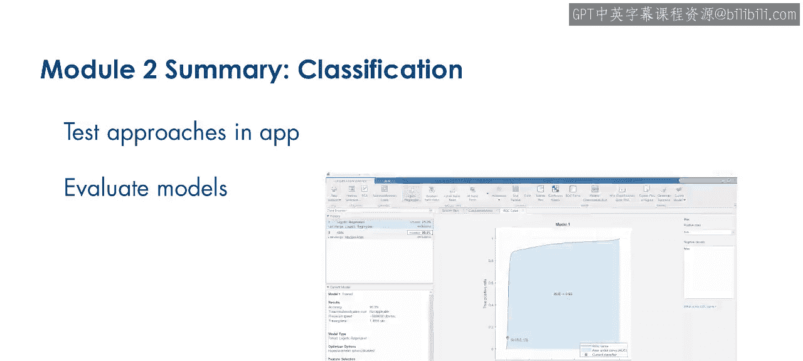

您可以根据需求调整模型或尝试新的方法。

---

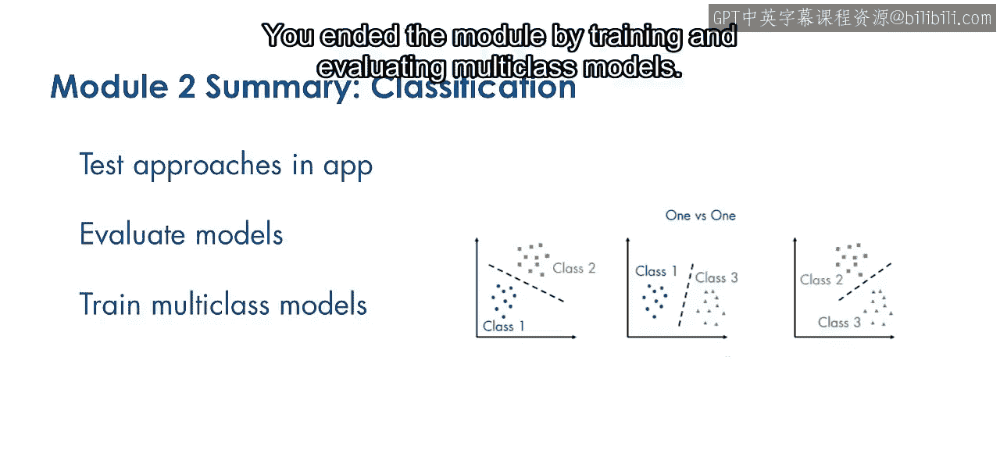

最后，我们通过训练和评估多类别模型来结束本模块。您学习了如何利用“一对一”和“一对多”方法将二分类器扩展到多分类问题。

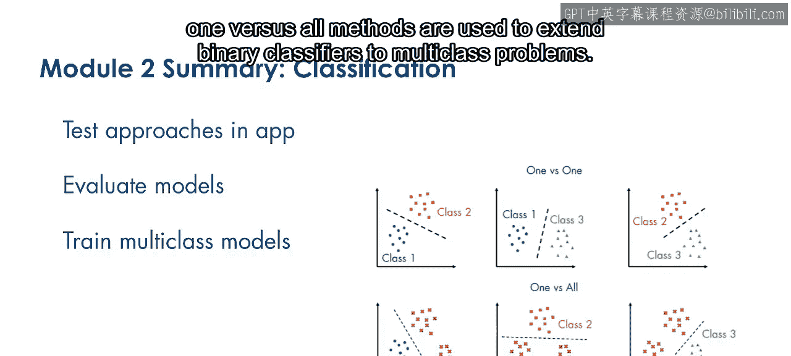

*   **一对一**：为每两个类别训练一个分类器。
*   **一对多**：为每个类别训练一个将其与其他所有类别区分的分类器。

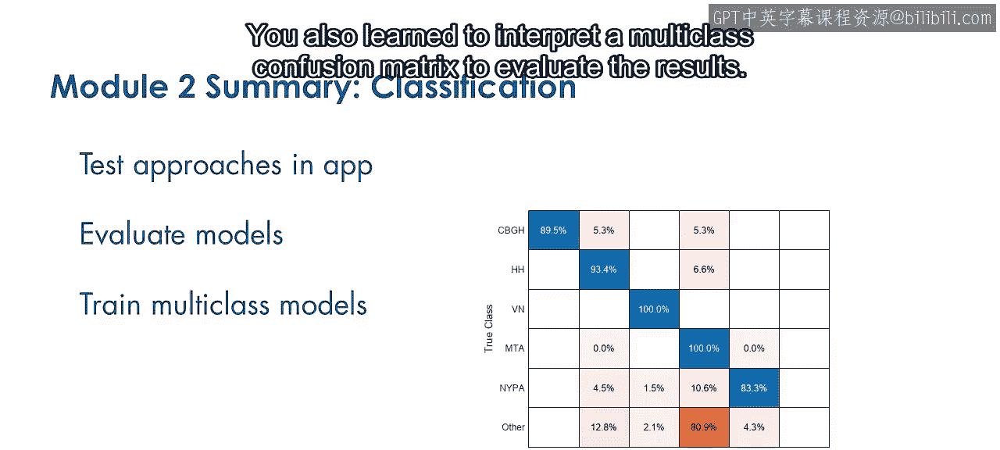

您还学习了如何解读多类别混淆矩阵来评估结果。

---

本节课中我们一起学习了分类问题的完整流程：从定义问题、使用分类学习器训练模型，到利用混淆矩阵和ROC曲线等工具评估模型性能，最后扩展到多分类问题的解决方法。

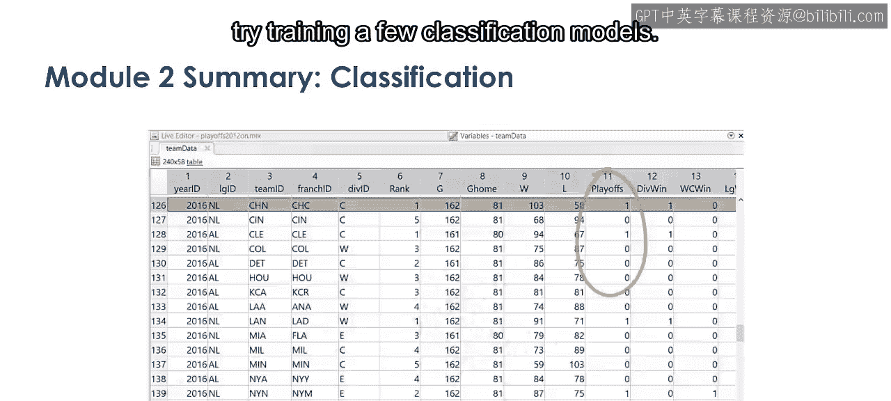

现在，请花些时间练习您所学到的知识。如果您自己的数据包含离散响应变量，可以尝试训练一些分类模型。

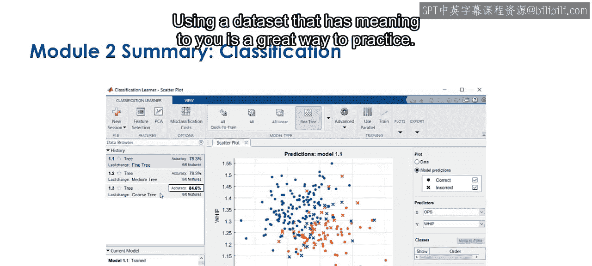

使用对您有实际意义的数据集是很好的练习方式。

您也可以继续在出租车数据上进行练习。尝试使用夏季月份的数据，看看结果是否有所不同。

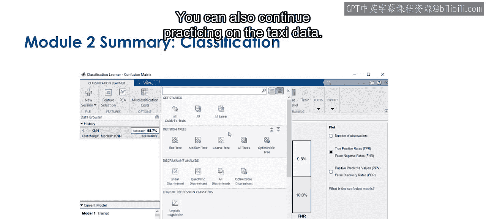

当您准备好后，请完成本模块的测验。

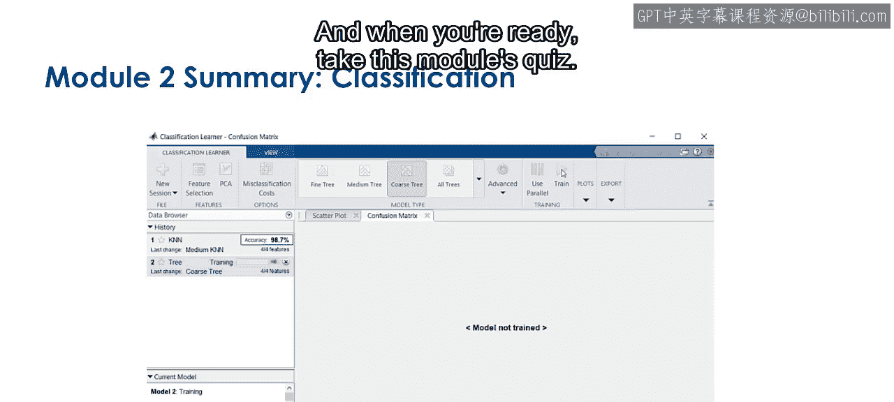

祝您好运。