# 17：解决欠拟合和过拟合

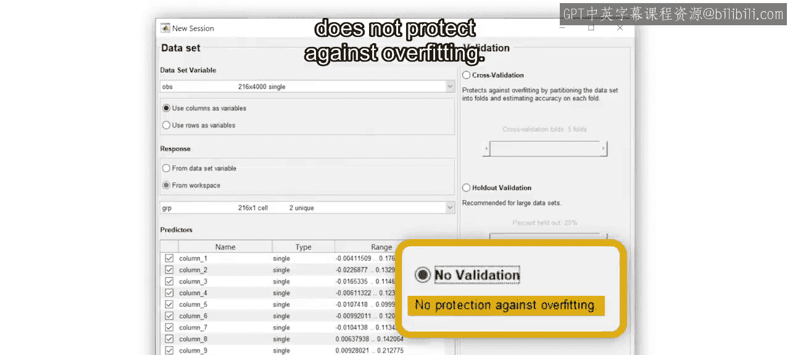


在本节课中，我们将要学习机器学习中的两个核心问题：欠拟合与过拟合。我们将探讨它们产生的原因，并学习如何使用训练集、验证集和测试集来找到模型复杂度的最佳平衡点，从而构建泛化能力强的模型。

## 什么是过拟合与欠拟合？

上一节我们介绍了在应用中选择“无验证”选项的警告。本节中，我们来看看为什么验证数据对于避免过拟合至关重要。

考虑以下数据以及拟合到这些数据的一个简单线性模型。我们知道，简单线性模型易于解释、训练和预测速度快。然而，它们有一个缺点：线性模型无法捕捉复杂的模式和趋势，这可能导致较大的误差。这种效应被称为**欠拟合**，该模型被称为具有**高偏差**。

如何避免欠拟合？如果模型对数据来说过于简单，你可以使用更复杂的模型，或者设计具有更强预测能力的新特征。例如，如果一阶线性模型对这个数据集来说太简单，你可以选择更高阶的多项式，如下所示：

```matlab
% 示例：从一阶线性模型转为二阶多项式模型
% 欠拟合模型：y = β0 + β1*x
% 更复杂模型：y = β0 + β1*x + β2*x^2
```

此时，你已经知道更复杂的模型可能更难以解释，并且需要更多时间来训练和预测。但它们还可能带来另一个问题。观察结果，你会发现模型对训练数据的拟合非常好，但可能“太好”了。这意味着它捕捉到了数据中的噪声，即捕捉到了不真实且未来不会以相同方式重现的模式。一旦将此模型应用于新数据，就可能导致更大的误差。这种效应被称为**过拟合**，该模型被称为具有**高方差**。

## 模型误差与复杂度的关系

在介绍如何避免过拟合之前，我们先来看看模型误差与模型复杂度之间的关系。

选择一个简单模型，并开始增加模型的复杂度以避免欠拟合并获得更小的误差。你可以一直这样做，直到训练数据的误差变得非常小。现在，当你观察额外的数据时，与训练数据相比，模型误差几乎总是会高一些。但请注意，随着复杂度的增加，存在一个误差开始增大的点。选择在训练数据上误差最低的模型，将导致在额外数据上产生相对较高的误差。因此，这个模型可能不是最佳选择。

请注意，模型复杂度存在一个最佳点，在该点上，模型能很好地捕捉训练数据中的趋势，同时又足够灵活，能在训练集之外的数据上做出良好预测。这个模型在预测训练数据时会显示出较大的误差，但它更有可能很好地泛化。位于这条最佳线右侧的模型会**过拟合**数据，而左侧的模型则会**欠拟合**。

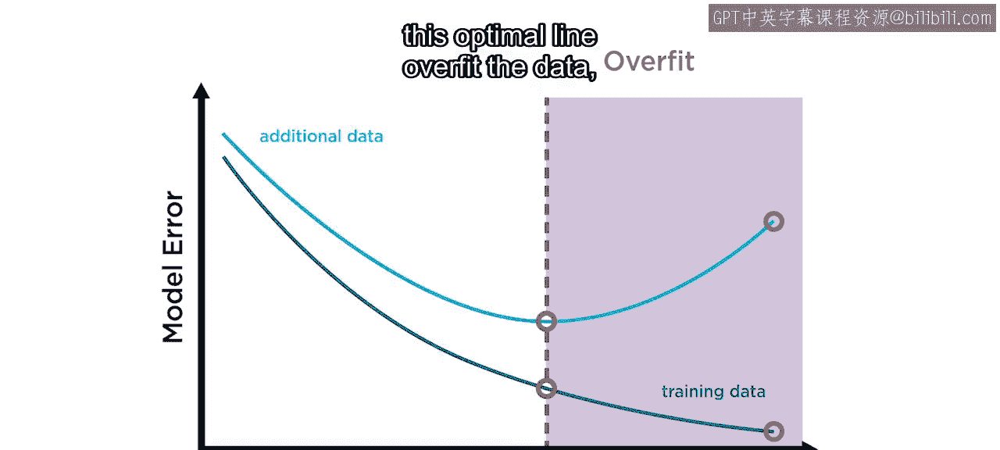

## 如何找到最佳模型配置？

那么，如何找到模型的最佳配置并避免过拟合呢？你刚刚了解到可以考虑降低模型复杂度。你也看到，为了对模型复杂度做出最佳决策，你需要不止一个数据集来验证你的模型。

以下是避免过拟合的几种主要方法：

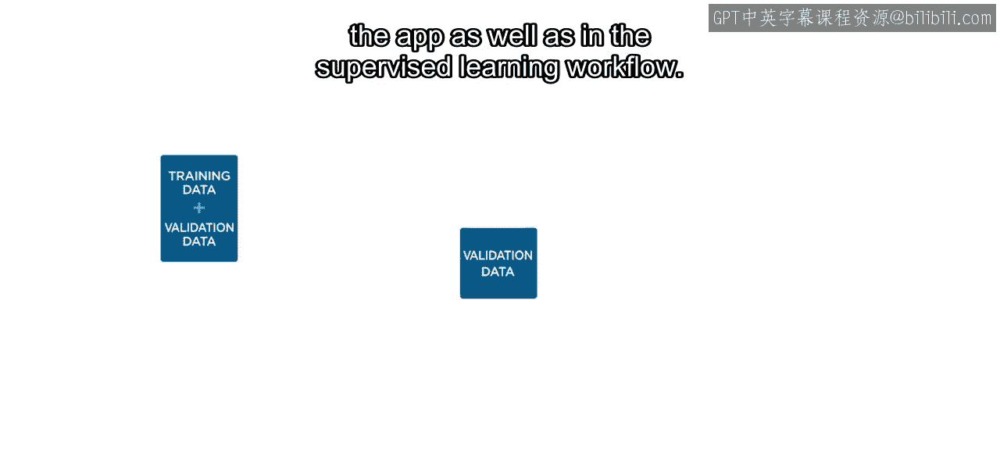

*   **降低模型复杂度**：选择更简单的模型。
*   **使用验证数据**：通过额外数据评估模型在训练过程中的表现。
*   **减少特征数量**：移除不相关或冗余的特征。
*   **正则化模型**：在模型训练过程中引入惩罚项，限制参数大小。

本视频重点介绍使用额外数据（即验证数据）的方法。另外两种方法将在后续课程中介绍。

## 训练集、验证集与测试集

你已经看到在应用和监督学习工作流程中对此有所提示。仔细观察工作流程，你会注意到另一个称为**测试集**的数据集。这是在训练和验证最终模型后，用于评估最终结果的额外数据。

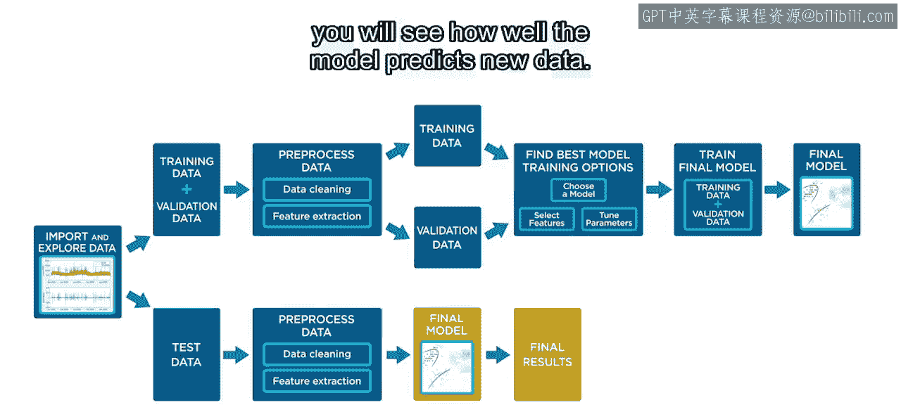

因此，总体而言，你需要三个不同的数据集：
*   **训练集**：通常是最大的数据集，用于构建模型。
*   **验证集**：用于指导模型选择、参数优化以及任何迭代的预处理步骤。
*   **测试集**：用于最终评估模型在从未见过的数据上的表现。

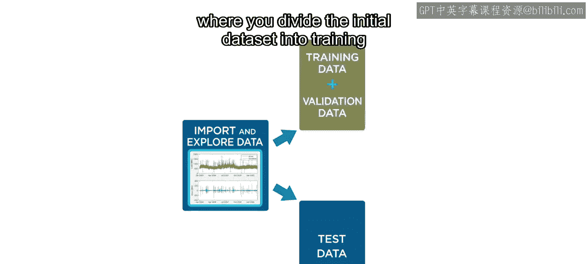

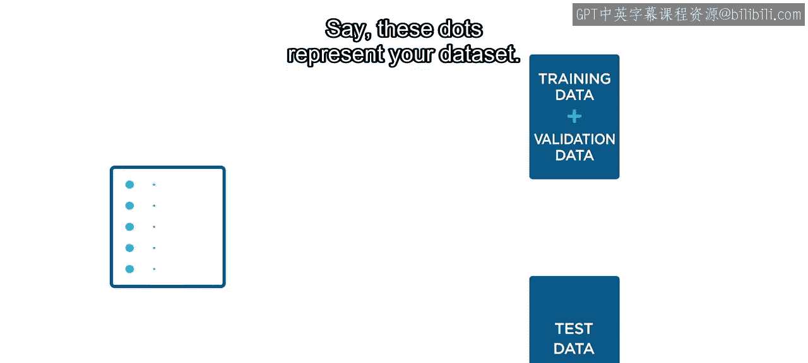

因为验证数据被用作此过程的一部分，它不能代表未见的未来数据。你需要测试数据来最终评估你的模型在从未见过的数据上的表现。在对测试数据应用相同的预处理步骤后，你将看到模型预测新数据的效果如何。

## 数据分割方法

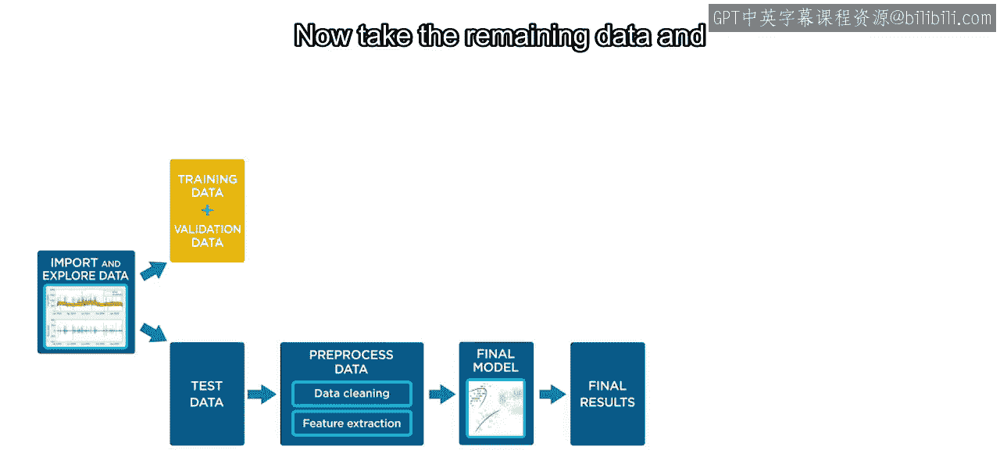

让我们从第一次分割开始，将初始数据集分为训练与验证数据以及测试数据。

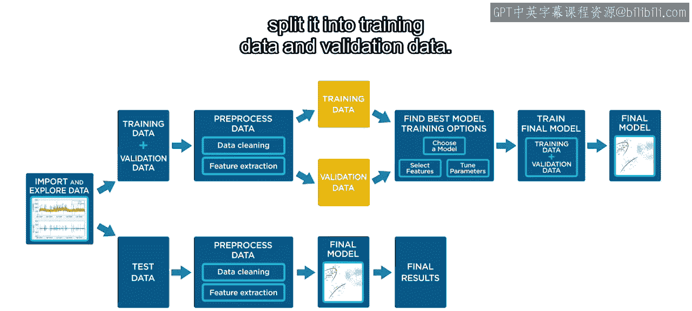

假设这些点代表你的数据。一个典型的分割可能如下所示：保留80%的数据用于训练和验证，但留出20%作为你的测试数据。这种方法称为**留出法**。你可能也听说过测试数据被称为**留出测试集**。你不必选择80/20分割，其他百分比也可能适用，具体取决于数据集的大小。将测试集放在一边，它仅用于评估你的最终模型。

现在，取剩余的组合训练和验证数据，并对其进行预处理。然后将其分割成训练数据和验证数据。

有以下几种常见的数据分割方法：

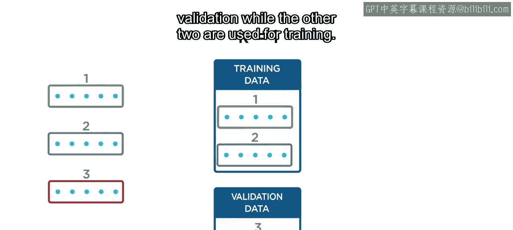

*   **留出法**：你已经从测试数据分割中了解了这种方法，它的工作方式与之前相同。例如，保留80%作为训练数据来构建模型，20%的数据进入验证数据集。然后你在训练集上训练模型，并用验证集评估其性能。
*   **K折交叉验证**：你将数据平均分配到几个子集，即所谓的“折”。以三折为例。对于第一折，选择一个子集进行验证，而另外两个用于训练。计算性能后，下一个折使用不同的子集作为验证数据，训练集也相应改变。重复此过程，直到所有子集都曾被用作验证数据一次。最后，计算所有折的平均性能。

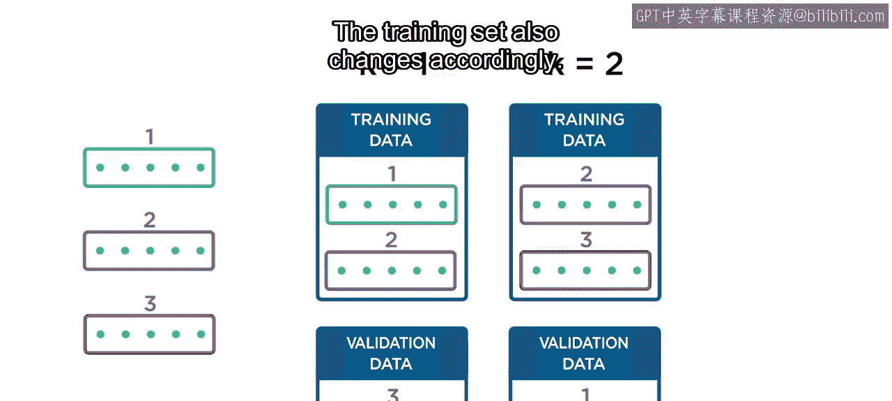

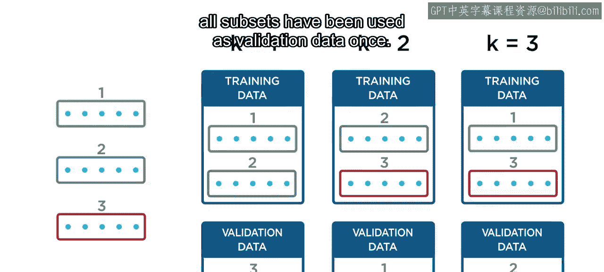

## 如何选择验证方法？

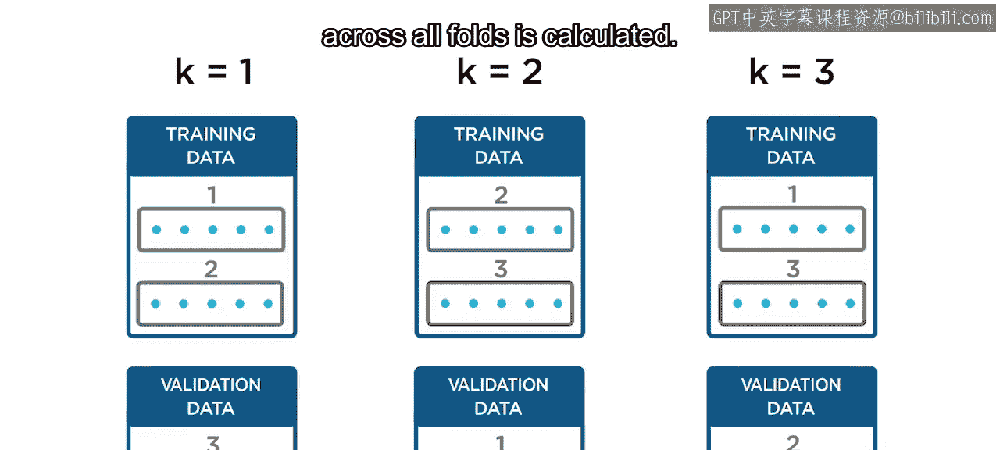

那么，你应该使用哪种验证方法？我们来比较一下两者。

留出验证涉及在单个验证集上测试你的模型，而K折交叉验证将验证过程重复K次并平均性能。这会导致更长的训练时间，但可以得到更准确的结果，特别是对于较小的数据集。如果你有大量的观测数据，那么留出法可以准确地捕捉数据中的所有趋势，并且速度也会快得多。

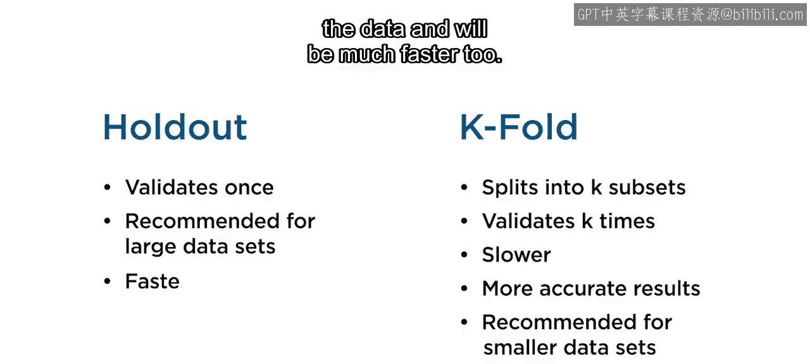

一旦决定了验证方法，你就使用验证数据来选择最佳模型、选择特征和调整参数。当你对模型满意时，然后使用训练数据和验证数据一起训练最终模型。应用程序会自动为你执行此步骤。

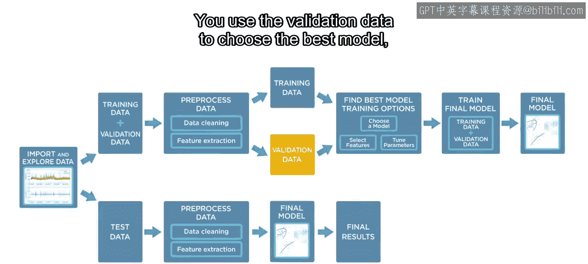

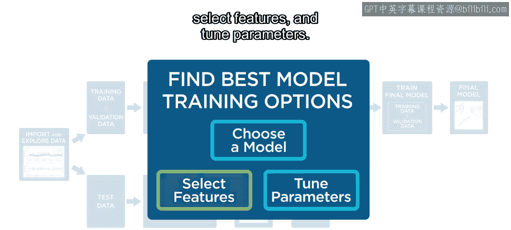

最后，使用一开始留出的测试数据来评估最终模型的泛化误差。

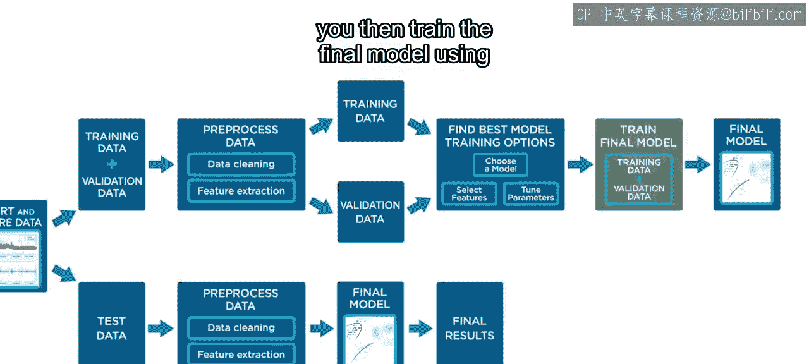

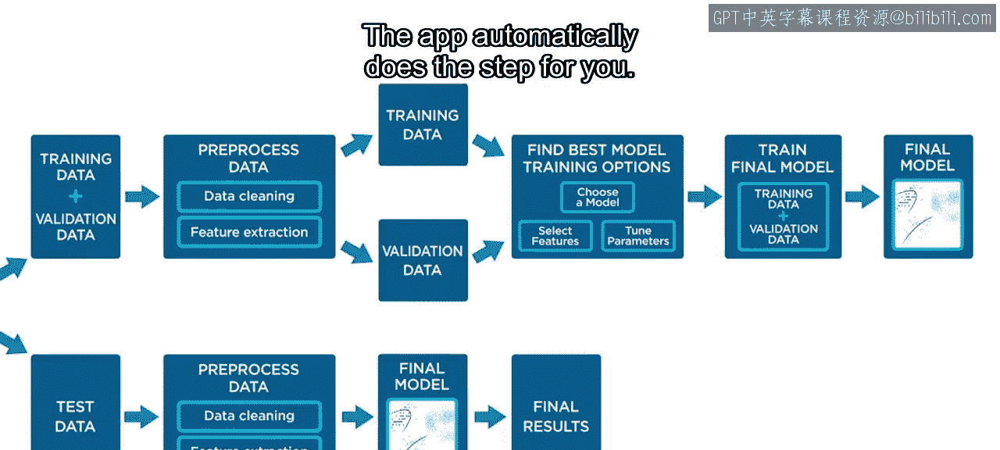

## 总结

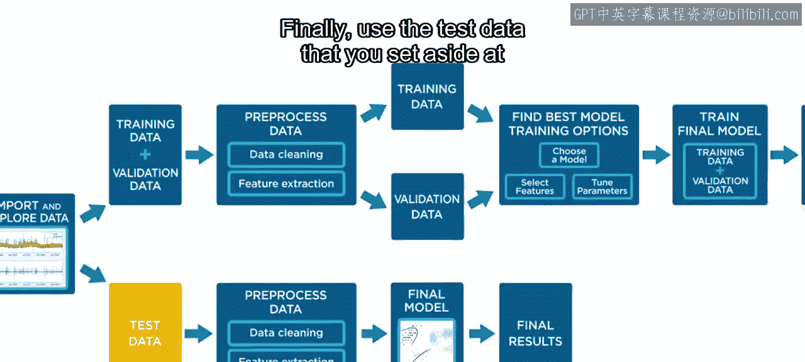

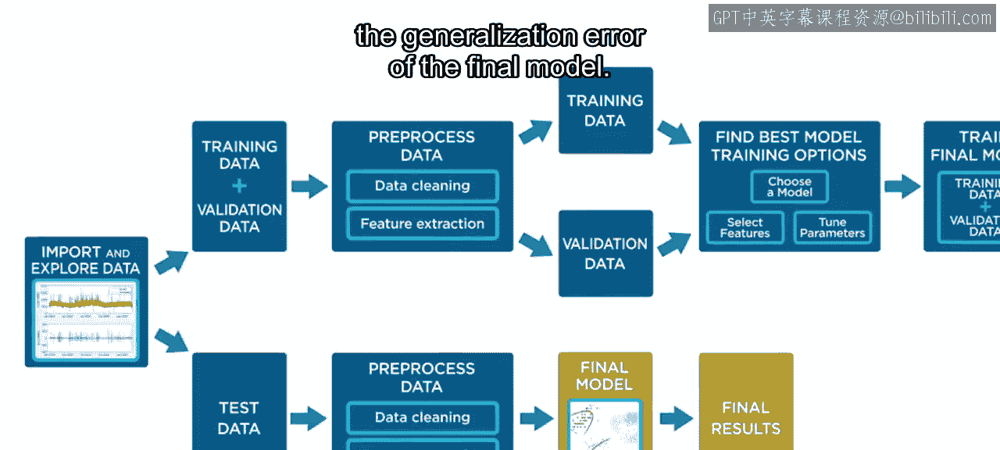

本节课中我们一起学习了机器学习模型开发中的关键概念。

简单模型通常更易于解释、训练速度更快，预测速度也更快，并且需要更少的计算资源。但简单模型可能无法捕捉数据中更复杂的模式和趋势，这种失败被称为**欠拟合**。

更复杂的模型，如高阶多项式、树或具有非线性核的SVM模型，可以捕捉这些趋势，但可能无法很好地泛化到新数据，这种失败被称为**过拟合**。

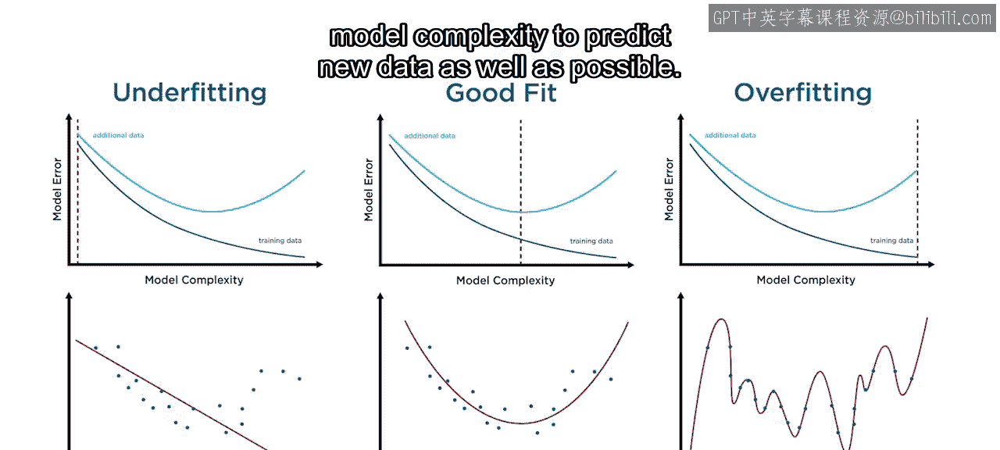

通过使用验证数据来指导你的建模过程，你可以找到合适的模型复杂度水平，以尽可能好地预测新数据。