# 18：训练时使用验证数据

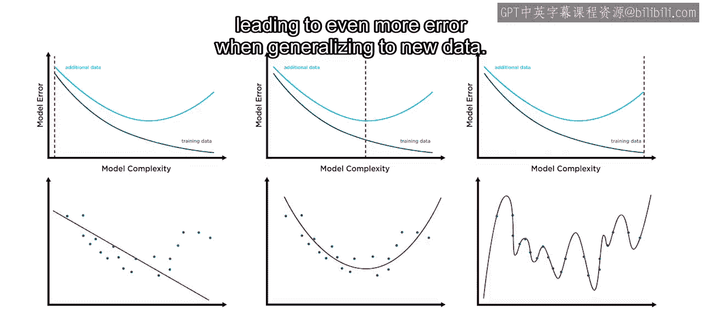

在本节课中，我们将学习如何在训练机器学习模型时使用验证数据，以防止模型过拟合，并选择泛化能力更强的模型。

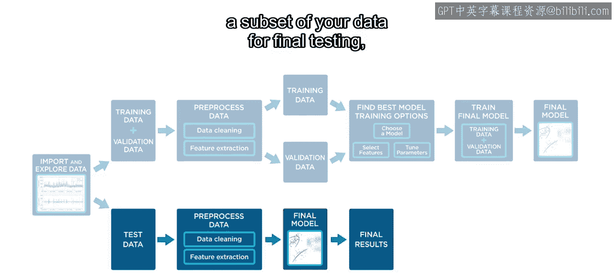

上一节我们了解到，更复杂的模型虽然能以更低的误差捕捉数据中的模式和趋势，但也可能对训练集产生过拟合，导致在泛化到新数据时产生更大的误差。

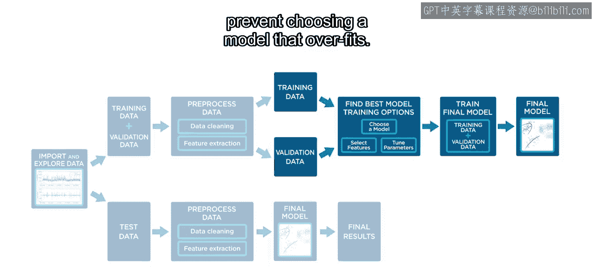

## 数据分割的重要性

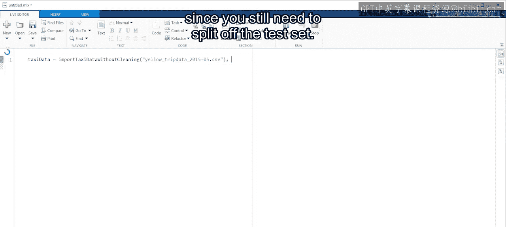

为了准确评估模型，将数据划分为不同的子集至关重要。

以下是关键的数据分割步骤：
*   将一部分数据留作最终测试。
*   使用验证数据来防止选择过拟合的模型。

现在，让我们以预测出租车行程时长为例，看看如何在MATLAB中实现这一点。

## 准备数据与划分数据集

首先，导入五月份的出租车原始数据。此时无需进行预处理，因为仍需划分测试集。

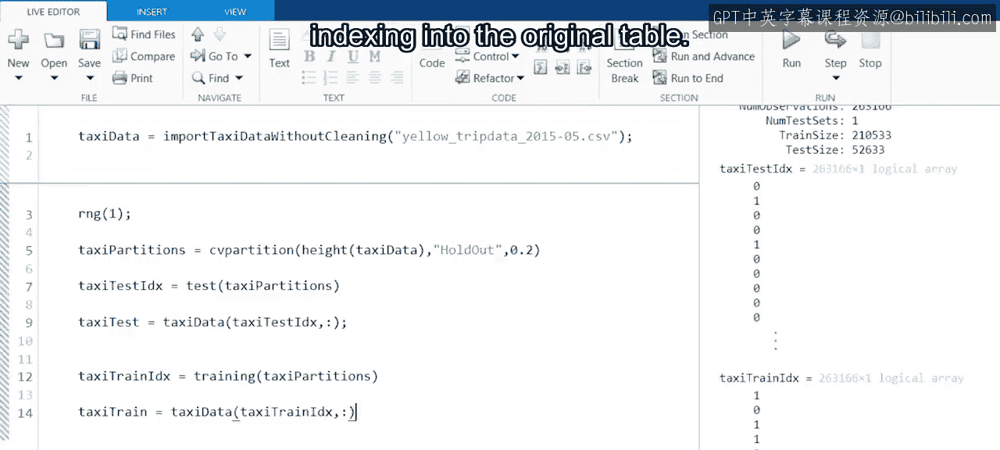

```matlab
% 为可重复性设置随机数生成器种子
rng('default');

% 使用 cvpartition 函数划分数据
c = cvpartition(height(data), 'Holdout', 0.2);

% 获取测试集索引并提取数据
testIdx = test(c);
testData = data(testIdx, :);

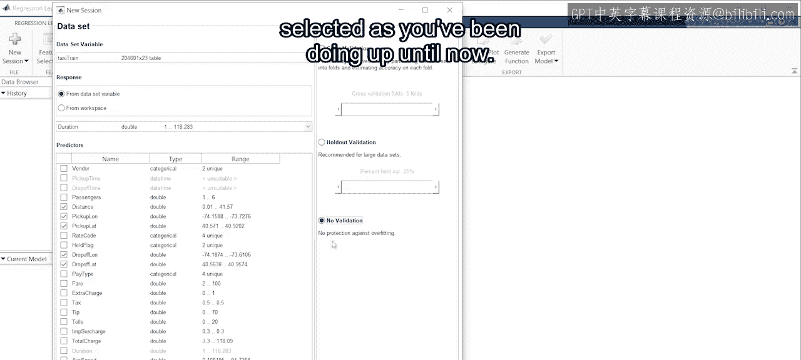

% 获取训练集索引并提取数据
trainIdx = training(c);
trainData = data(trainIdx, :);
```

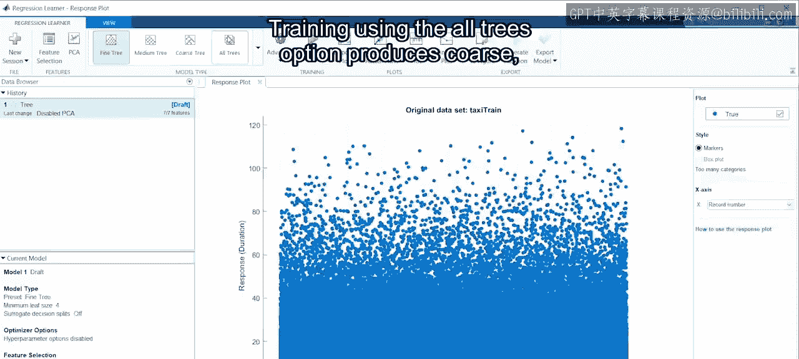

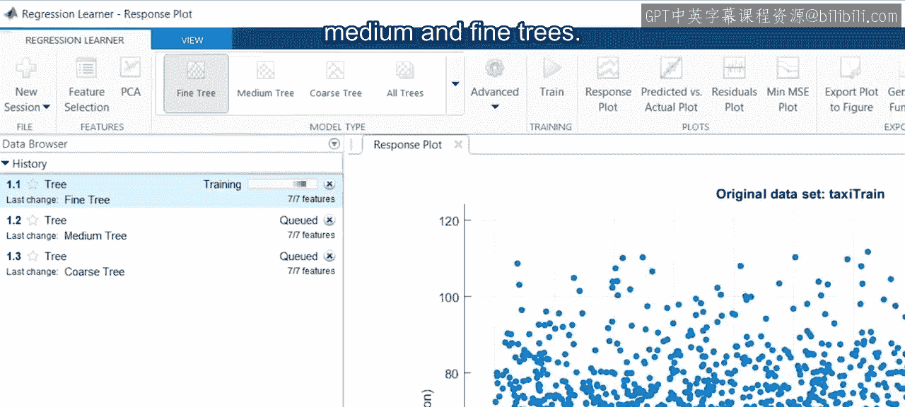

接下来，在训练任何模型之前，对训练数据应用基本的预处理函数，例如添加“一天中的时间”和“星期几”特征。

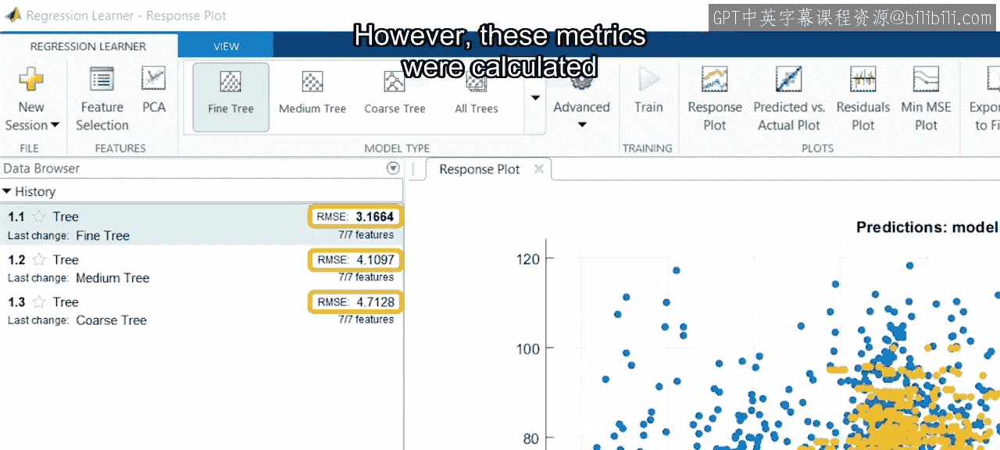

## 不使用验证数据的模型训练

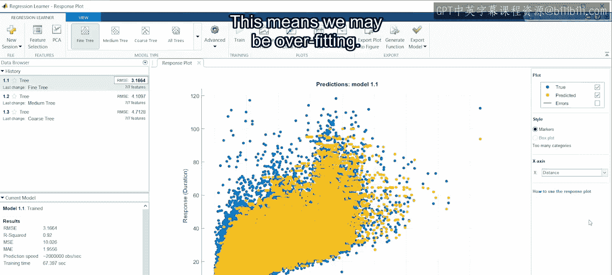

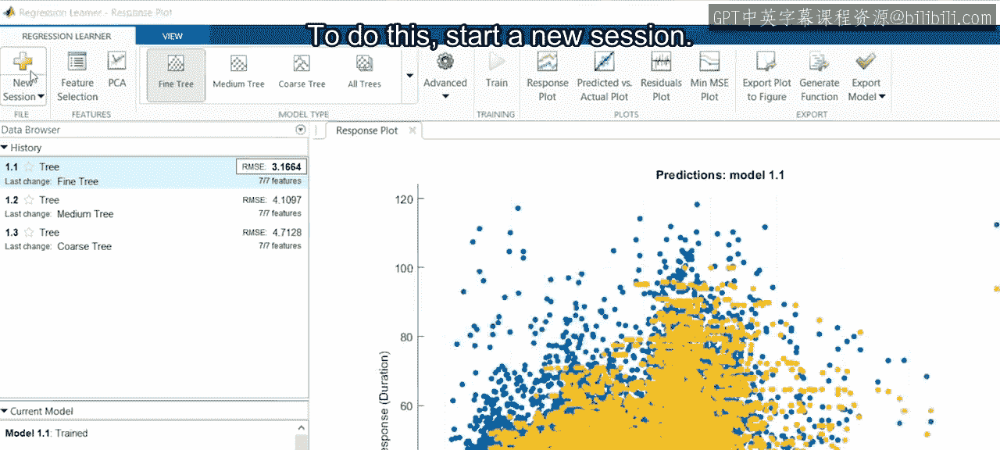

现在，让我们打开回归学习器应用程序并开始一个新会话。选择训练数据作为数据集变量，`duration`作为响应变量，并选择相关特征作为预测变量。为了后续对比，我们首先选择“无验证”。

使用“所有树”选项进行训练，会生成粗、中、细三种决策树模型。检查结果发现，细树的RMSE（均方根误差）最佳。然而，这些指标是使用训练模型所用的同一批数据计算得出的，这意味着我们可能正在过拟合。

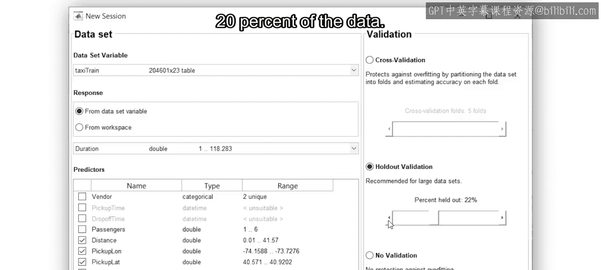

## 使用验证数据的模型训练

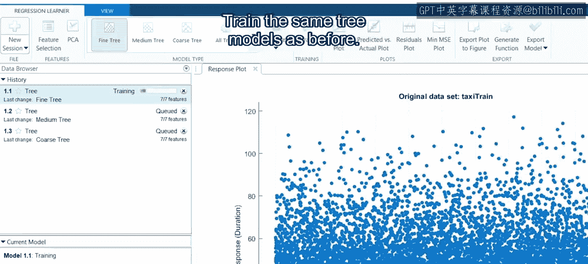

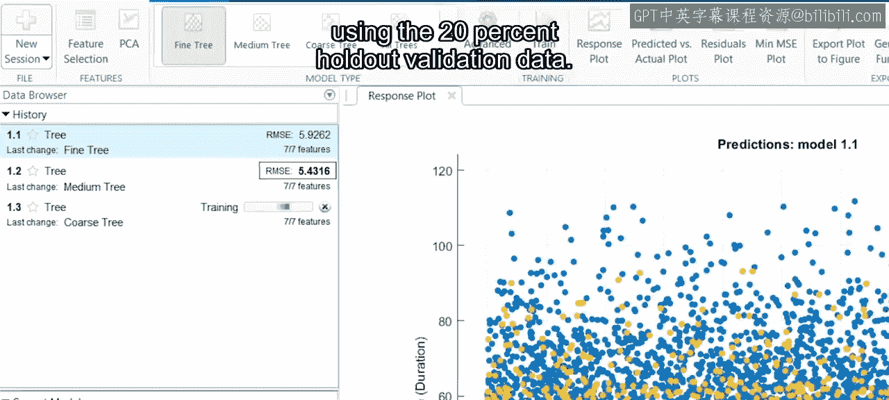

为了进行比较，让我们看看使用验证数据时的结果。为此，请启动一个新会话。数据集、响应和预测变量保持不变，但这次选择使用验证。虽然可以使用交叉验证，但由于数据超过20万行，保留验证法已足够且速度更快。我们尝试使用20%的数据作为验证集。

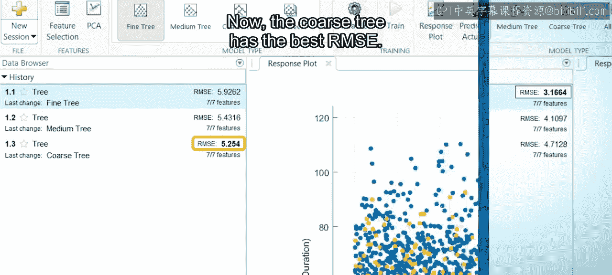

训练与之前相同的树模型。然而这一次，指标将使用那20%的保留验证数据进行计算。现在，粗树拥有最佳的RMSE。正如所怀疑的，细树对训练数据存在过拟合，而粗树的泛化能力更好。

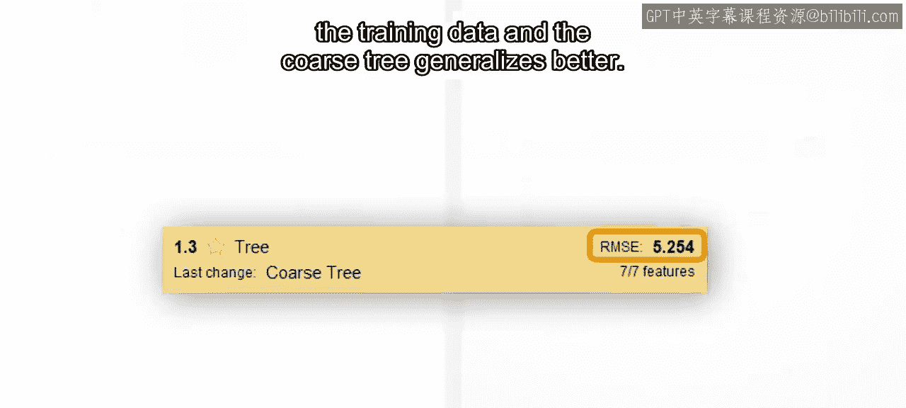

## 总结

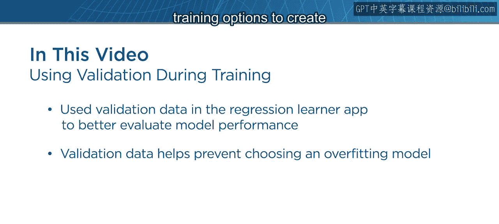

本节课中，我们一起学习了如何在回归学习器应用程序中使用验证数据来更好地评估模型性能，并防止选择过拟合的模型。下一节，我们将学习更多的方法和训练选项，以创建性能更优的模型。