# 20：使用正则化防止过拟合 🎯

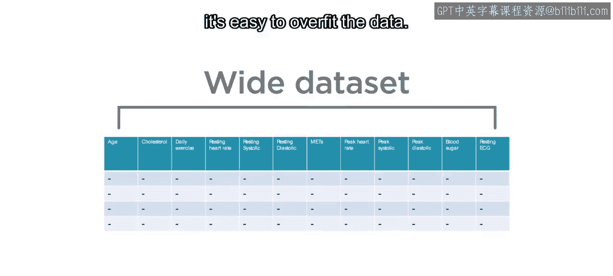

在本节课中，我们将要学习一种防止机器学习模型过拟合的重要技术——正则化。我们将了解其工作原理，并学习如何在MATLAB中训练一个正则化模型。

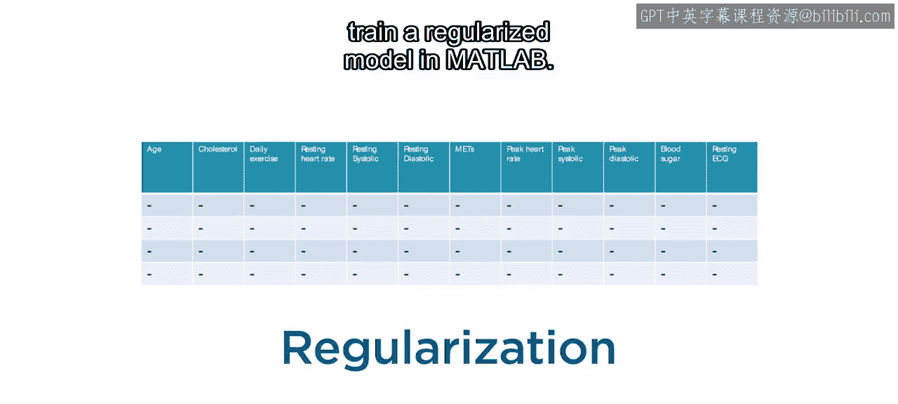

## 概述

当使用大量特征训练模型时，模型很容易对数据产生过拟合。正则化是一种帮助防止过拟合的技术。

## 正则化的基本思想

上一节我们介绍了过拟合的问题，本节中我们来看看正则化如何解决它。

让我们从一个简单的数据集和多项式模型开始考虑。这个模型从一个单一特征X开始。你可以将添加多项式项视为向模型添加额外的特征。当一个高阶多项式拟合数据时，其系数（此处用beta表示）会变得非常大。这些大值对于捕捉数据中的噪声波动是必要的。

防止过拟合的一种方法是降低多项式的阶数。这类似于在高维数据集上使用特征选择方法。使用更少的系数后，模型不再过拟合。同时，beta值也会变小，因为多项式不再被拉伸以适应数据中的每一个波动。

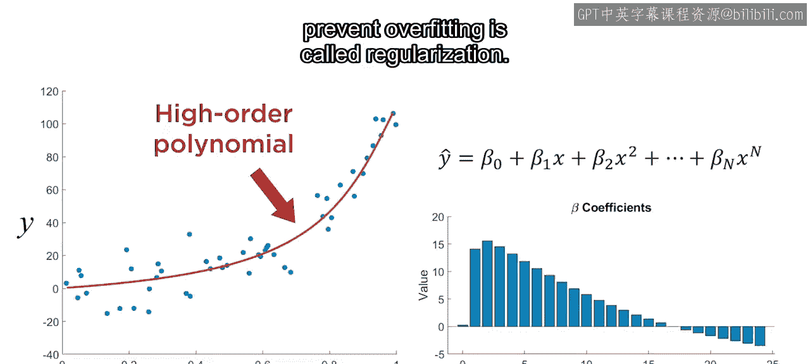

但如果你想保留所有多项式项呢？为了防止过拟合，你可以限制系数变得过大。这样，多项式的阶数仍然很高，但结果看起来像一个低阶多项式，因为没有哪个项在拟合中占主导地位。这种通过约束模型参数来防止过拟合的思想，就叫做正则化。

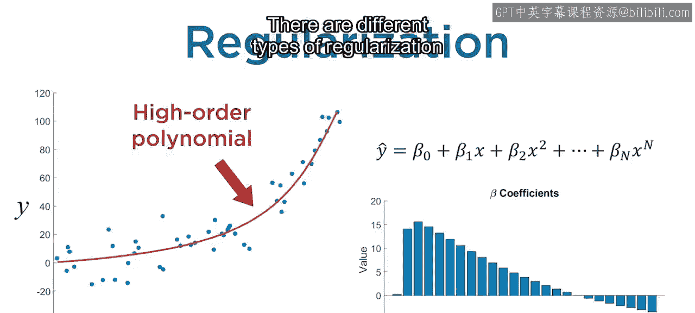

## 正则化的类型

对于不同类型的模型，存在不同的正则化方法。

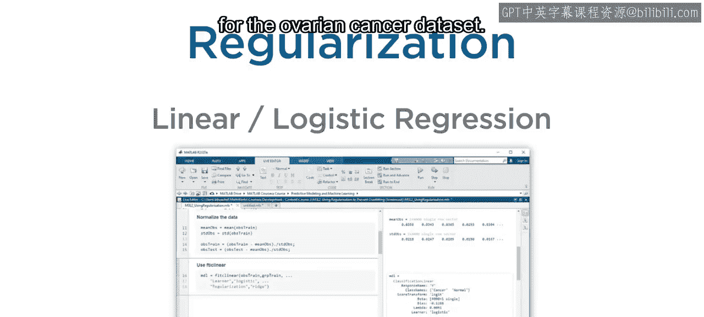

以下是几种常见的正则化类型：

*   例如，你可以通过剪枝和减少树深度来正则化决策树。当你将细树改为粗树时，你已经这样做了。
*   在本视频中，你将看到一种用于线性和逻辑回归的正则化类型。你将用它来改进卵巢癌数据集的逻辑回归模型。

## 线性模型的正则化原理

为了解释这种正则化类型，请记住大多数回归模型是通过最小化均方误差（MSE）来训练的。正则化模型则是通过最小化MSE项加上一个根据模型参数计算的额外惩罚项来训练的。惩罚项可以防止beta值变得过大。

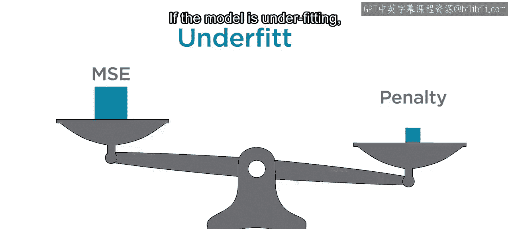

MSE项和惩罚项在训练过程中相互制衡。如果模型过拟合，MSE会很小，但惩罚项会很大。如果模型欠拟合，MSE会很大，但惩罚项会很小。最终的结果是一个平衡了两者的拟合。

## 惩罚项的计算方法

那么惩罚项是如何计算的呢？

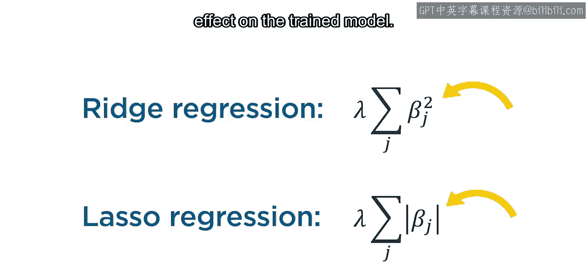

有两种常见的方法。岭回归使用beta系数的平方，而套索回归使用绝对值。这看起来可能是一个微小的差异，但它会对训练出的模型产生显著影响。

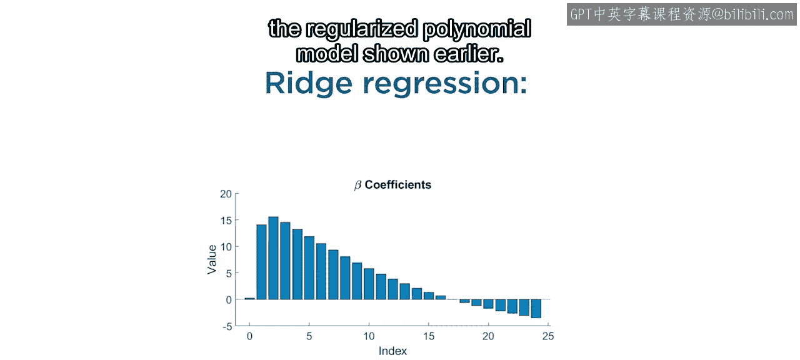

例如，以下是之前展示的正则化多项式模型的beta值。这些系数是使用岭回归拟合的。

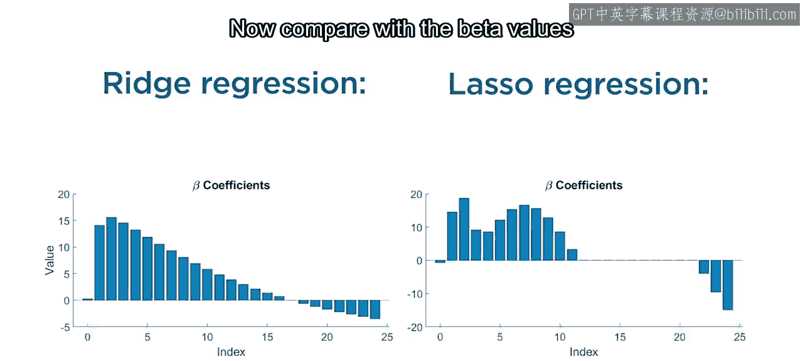

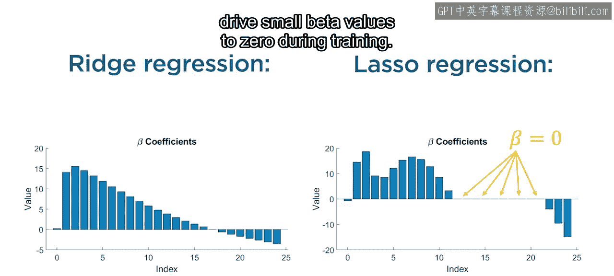

现在，与使用套索回归拟合的beta值进行比较。beta的尺度相似，但许多值为0。

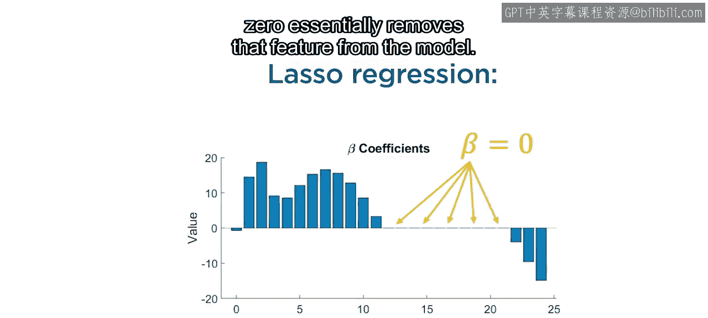

这是因为套索回归在训练过程中倾向于将小的beta值驱动为零。因此，套索回归也是一种嵌入式特征选择，因为将beta值设置为0本质上就是从模型中移除了该特征。

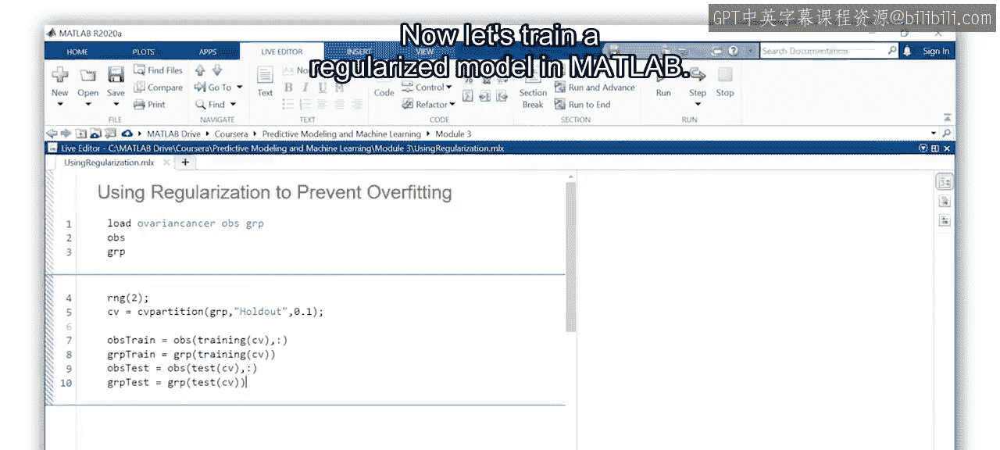

## 在MATLAB中训练正则化模型

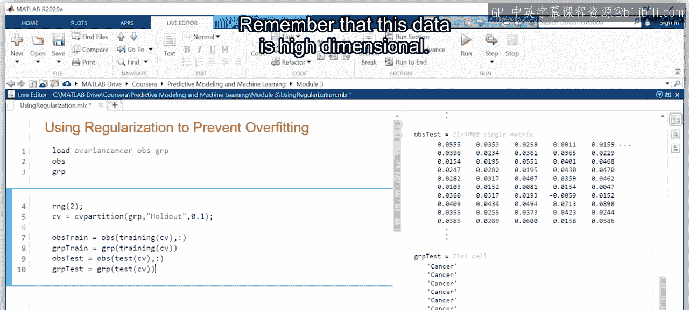

现在让我们在MATLAB中训练一个正则化模型。

首先，加载卵巢癌数据集。请记住，这些数据是高维的，它有4000个特征。

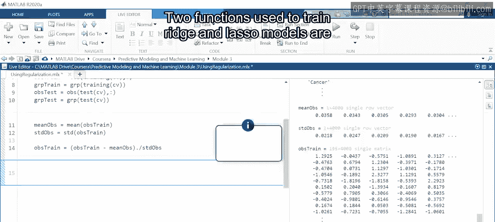

将数据拆分为训练集和测试集，以便稍后评估你的最终模型。接下来，对数据进行归一化，使所有特征具有相似的尺度。这对于惩罚项在岭回归和套索回归中正常工作至关重要。保存用于归一化训练数据的数值，以便对测试数据应用相同的归一化。

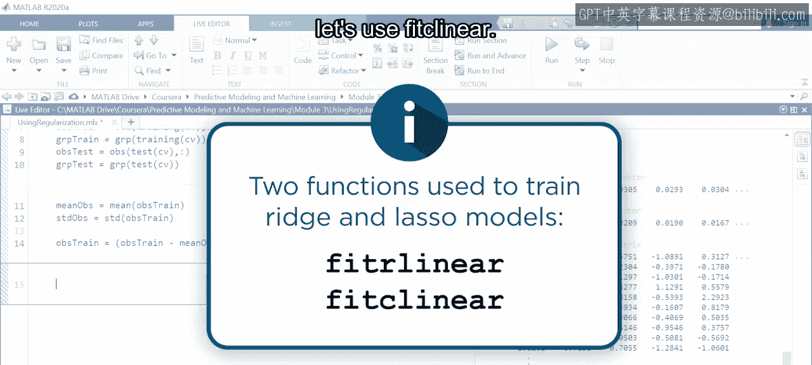

用于训练岭回归和套索模型的两个函数是 `fitrlinear`（用于回归）和 `fitclinear`（用于分类）。由于这是一个分类问题，我们使用 `fitclinear`。

以下是使用 `fitclinear` 函数的基本步骤：

1.  将预测变量矩阵和响应向量作为前两个输入添加到函数中。
2.  然后将 `Learner` 选项设置为 `‘logistic’` 以指定逻辑回归。
3.  由于岭正则化会保留所有特征，我们将其作为起点。将 `Regularization` 选项设置为 `‘ridge’`。但之后你可以自由尝试套索以比较结果。
4.  最后，将 `KFold` 选项设置为20以使用20折交叉验证。

让我们看看模型的表现如何。由于这个模型进行了K折验证，使用 `kfoldPredict` 函数来获取预测类别。你唯一需要的参数是训练好的模型。然后使用 `confusionmat` 函数获取性能指标。

准确率非常好，几乎达到95%。并且由于该模型使用了验证数据，你可以合理地相信它在新数据上也会表现良好，尽管它使用了全部4000个特征。

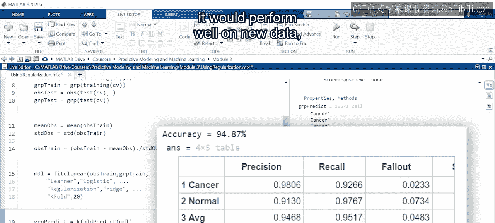

## 调整正则化强度

你现在已经成功地训练了一个正则化模型，但在使用测试数据进行评估之前，还有最后一件事需要考虑。

如果你再次查看惩罚项，请注意它们都有一个变量lambda。这是一个控制正则化强度的超参数。更高的lambda值意味着更强的惩罚项。

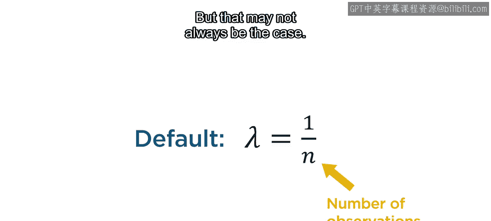

MATLAB使用 `1/n` 作为lambda的默认值，其中n是观测值的数量。这个默认值在卵巢癌数据上表现良好，但情况可能并非总是如此。

你可以通过超参数优化来调整Lambda的值，这将在以后学习。

## 总结

本节课中我们一起学习了正则化技术。

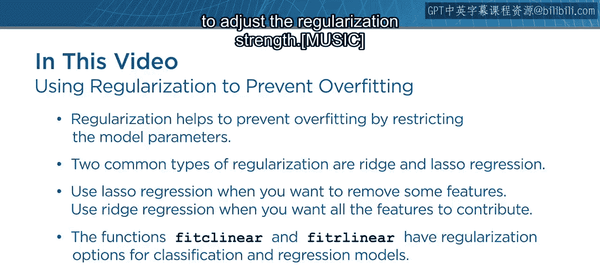

正则化通过限制模型参数来帮助防止过拟合。两种常见的正则化类型是岭回归和套索回归。当你想减少特征数量时使用套索回归；否则，当你希望所有特征都起作用时使用岭回归。函数 `fitclinear` 和 `fitrlinear` 分别具有用于分类和回归的正则化选项。最后，别忘了调整超参数lambda以调节正则化强度。