# 21：集成模型介绍 🎼

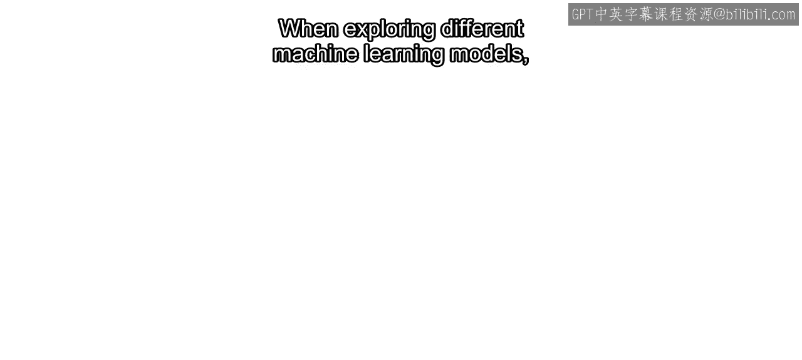

在本节课中，我们将要学习机器学习中的集成模型。集成模型通过结合多个模型的预测结果，旨在获得比单一模型更可靠、更准确的预测。我们将重点介绍两种基于决策树的常见集成方法：提升树和袋装树。

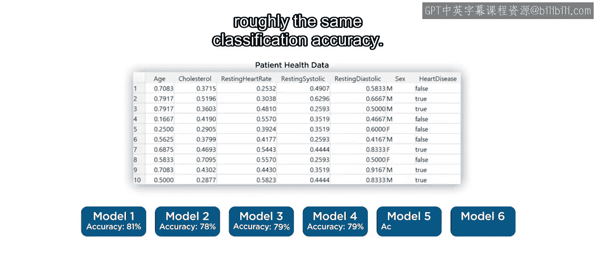

在探索不同的机器学习模型时，你可能会注意到其中几个模型产生的分类准确率大致相同。

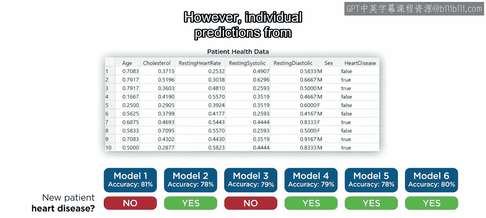

然而，这些模型各自的预测结果可能仍然存在差异。

在这种情况下，你可能需要考虑多个模型的结果，而不是仅从最准确的那个模型得出结论。综合多个模型中最常见或平均的预测，通常比单一模型的单个预测更可靠。这就是机器学习集成模型背后的原理。

## 集成模型的类型

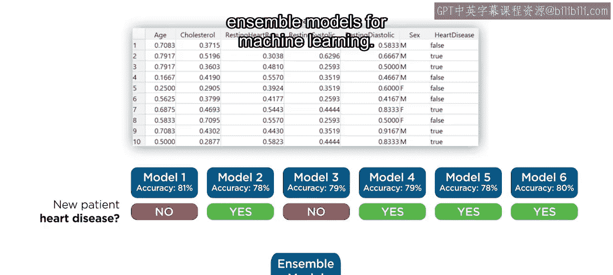

集成模型有多种类型。本节视频将重点介绍两种最常见的方法：提升树和袋装树，它们都是决策树的扩展。

## 提升树集成

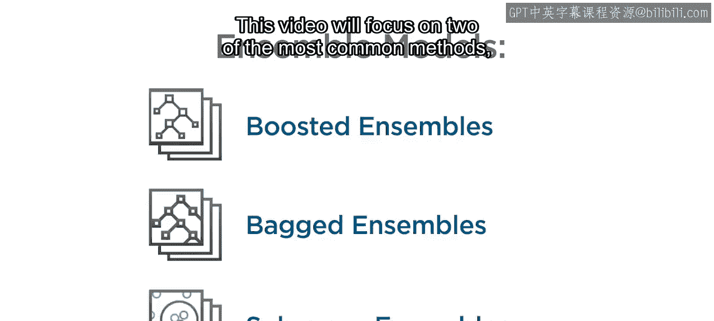

上一节我们介绍了集成模型的基本概念，本节中我们来看看提升树是如何工作的。

提升树集成针对回归和分类问题使用特定的算法。为了说明概念，我们仅关注回归问题。在这个例子中，目标是预测出租车行程的时长。

训练一个常规决策树后，每个观测到的时长都会有一个对应的预测值和模型残差。提升树集成的方法是使用这些残差作为响应变量，来训练一个额外的回归树。这会产生一组新的预测值，以及新的残差。然后，这个过程可以重复多次，用新的残差训练更多的树。

一个训练好的提升树集成的最终结果是一系列的决策树。第一棵树做出初始预测，然后由后续的每棵树进行精炼。

将结果相加，可以得到一个比初始预测更准确的最终预测。其核心思想可以概括为：

**最终预测 = 树1预测 + 树2预测 + ... + 树N预测**

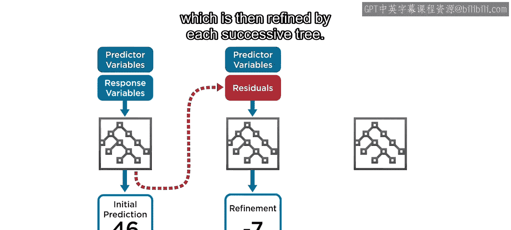

## 袋装决策树

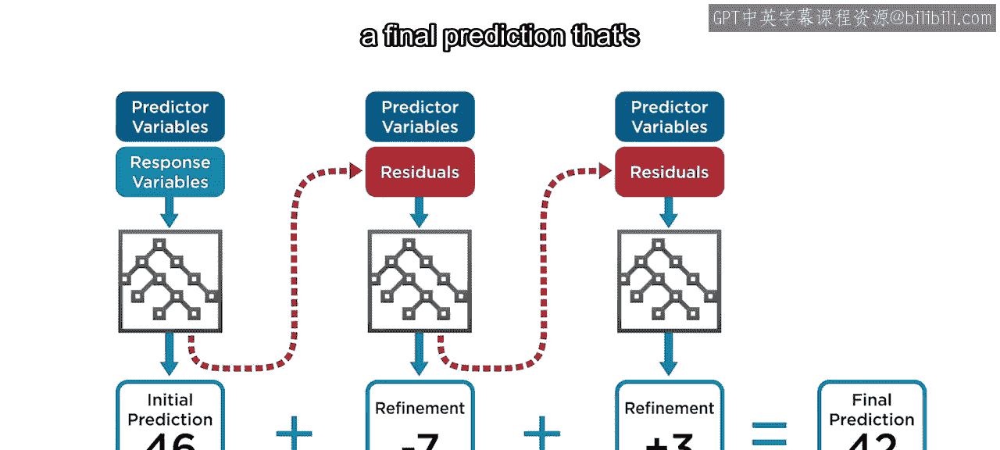

了解了提升树后，我们再来看看另一种集成算法：袋装决策树。

对于这种模型，多个决策树同时在相同的数据上进行训练。

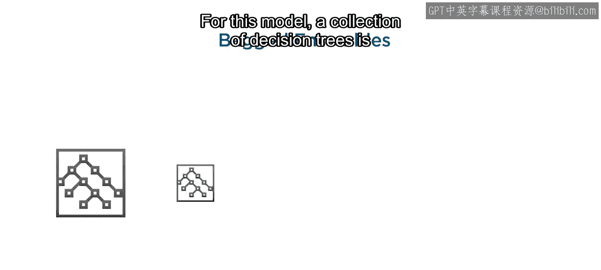

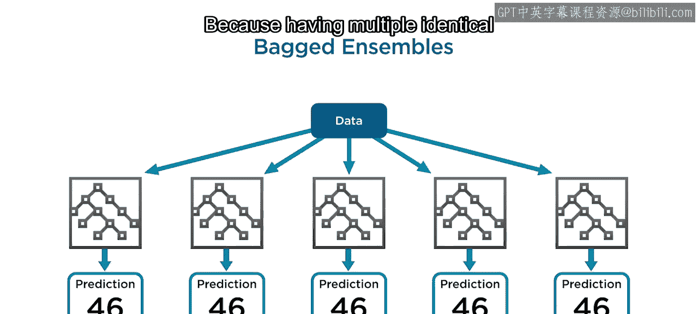

因为拥有多个完全相同的模型是冗余的，所以每个模型被赋予可用数据的一个随机子集，这确保了它们都是独特的。

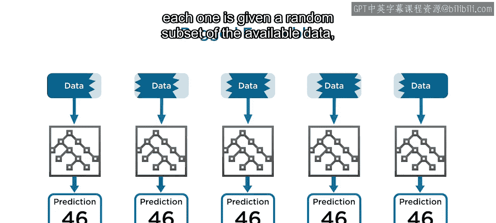

然后将结果平均在一起，形成最终预测。袋装树的一个扩展是随机森林算法。

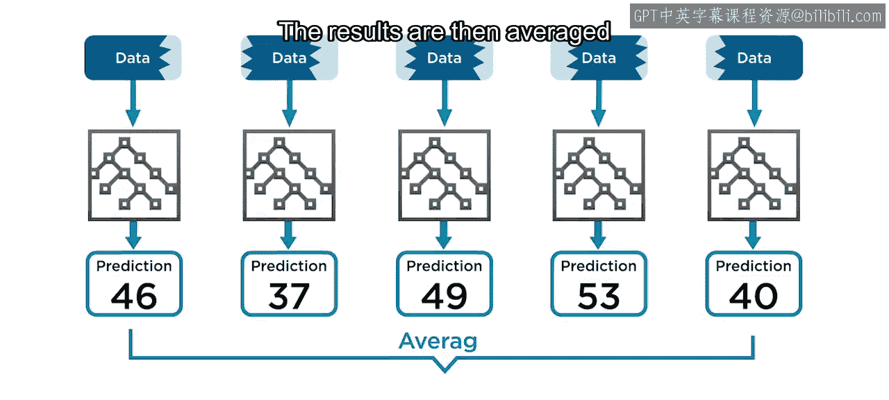

## 随机森林

还记得决策树是通过一系列关于预测变量的问题来分割训练数据的吗？袋装集成中的所有树都遵循这种模式。然而，由于每棵单独的树都在对相似的数据子集进行建模，它们的结构很可能高度相关。

随机森林集成通过在每次分割时使用可用特征的一个随机子集来避免这个问题，确保每棵单独的树都是独特的。

个别树可能损失的准确性，在将它们全部平均时可以得到恢复。

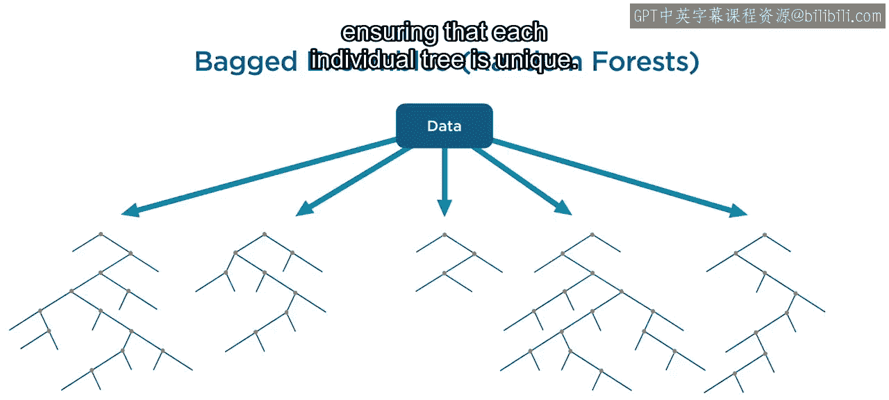

其结果是，集成模型可能比简单的袋装树对过拟合具有更强的鲁棒性。以下是其关键步骤的简化描述：

1.  从数据中随机抽取样本（有放回）。
2.  为每个样本构建一棵决策树，但在每个节点分割时，只考虑特征的一个随机子集。
3.  将所有树的预测结果进行平均（回归）或投票（分类）。

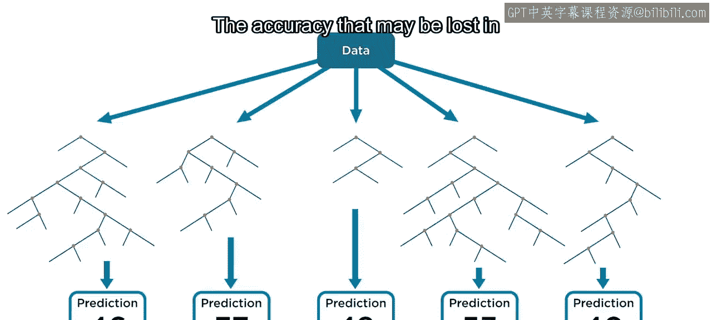

## 总结与注意事项

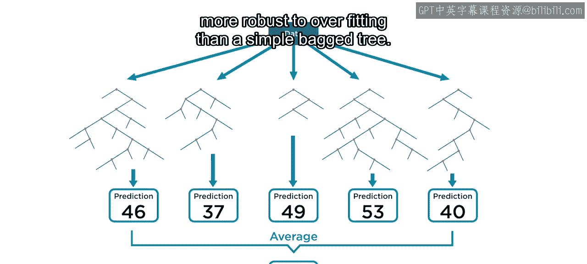

本节课中我们一起学习了回归和分类问题的各种集成方法。

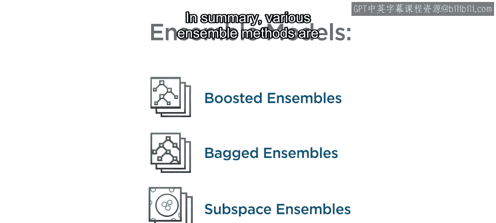

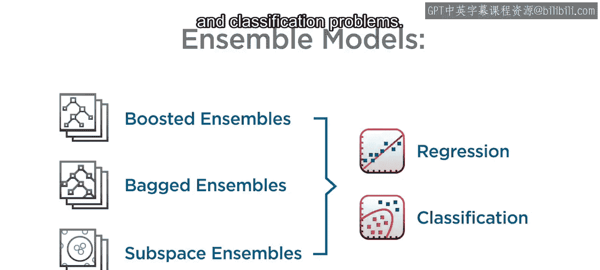

除了Matlab提供的集成方法，你还可以通过将几个模型平均在一起来创建自己的自定义集成。

集成模型可以提供比其单一模型版本更高的准确性，但请注意，这种改进通常需要付出代价。

以下是需要考虑的代价：

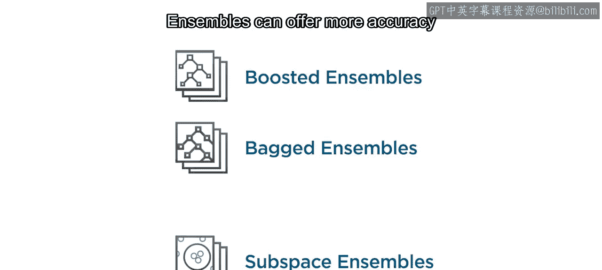

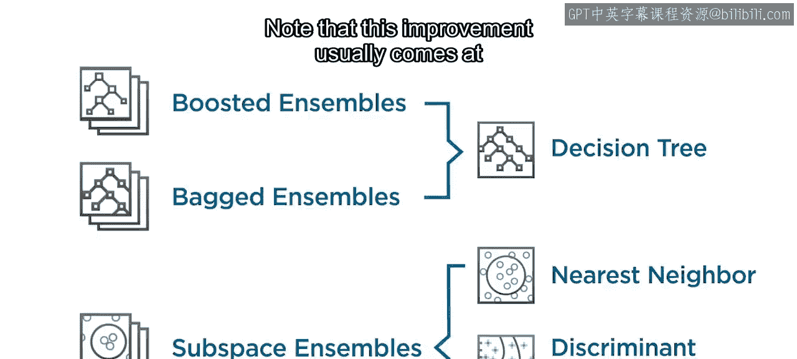

*   训练时间
*   内存利用率
*   预测速度

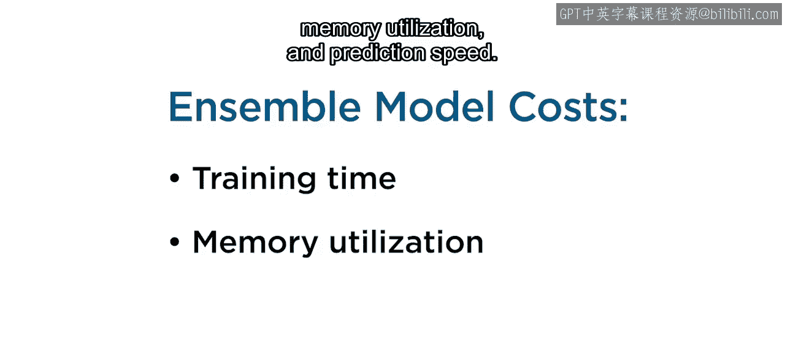

总而言之，集成模型是提高预测性能的强大工具，但在使用时需要权衡其带来的计算成本。