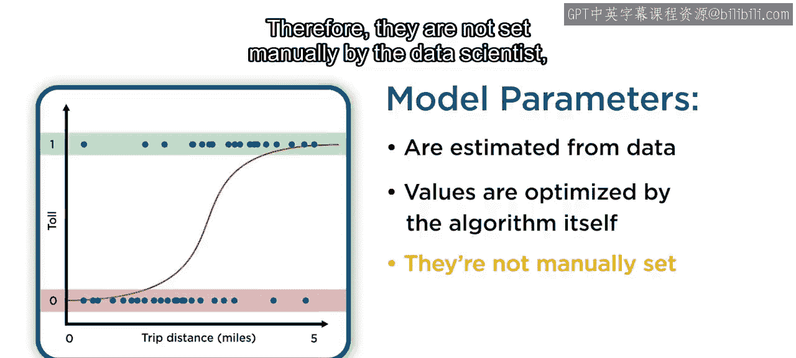
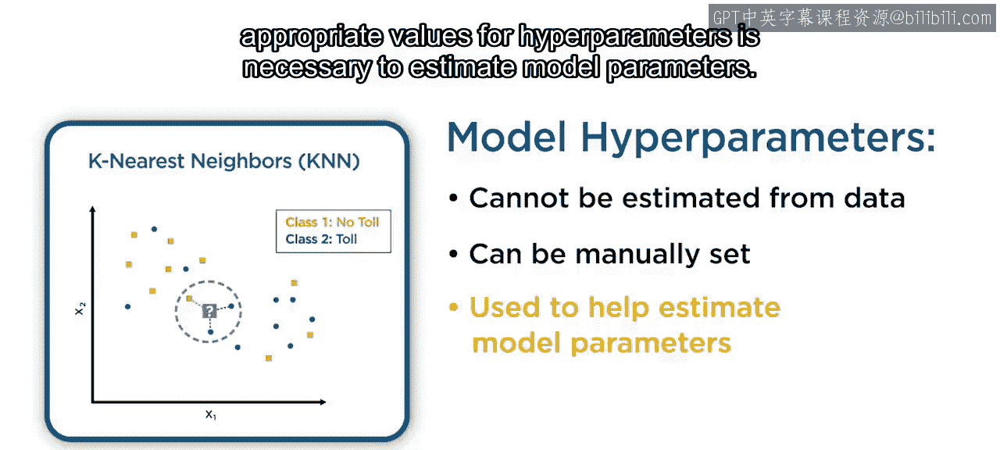
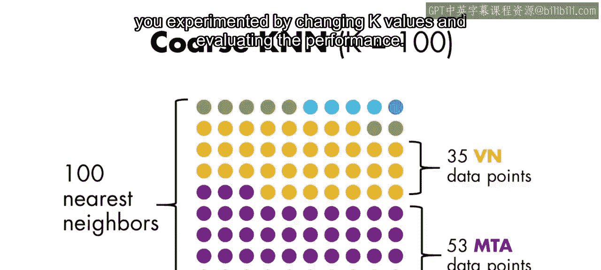
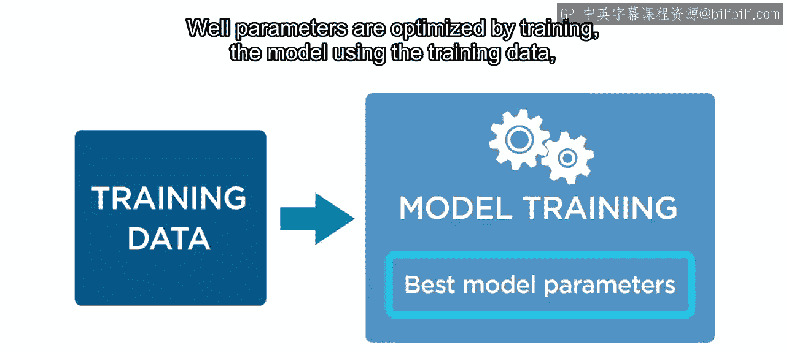
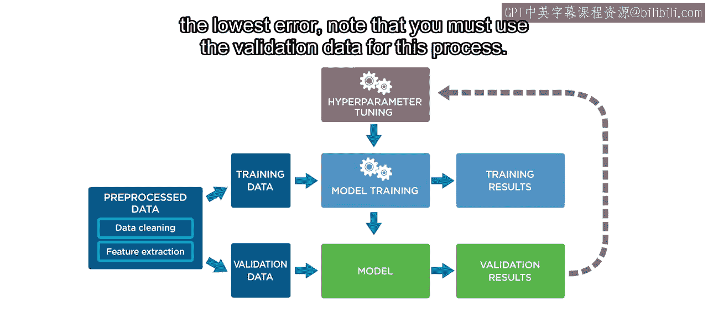
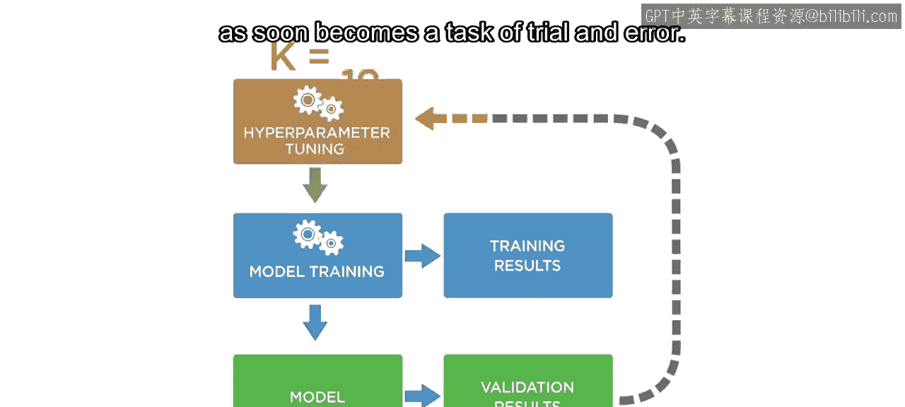
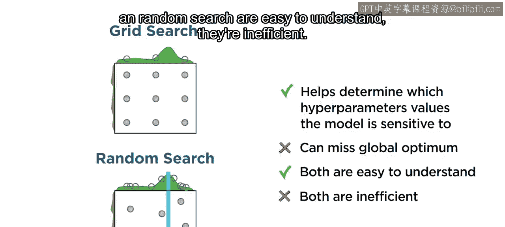
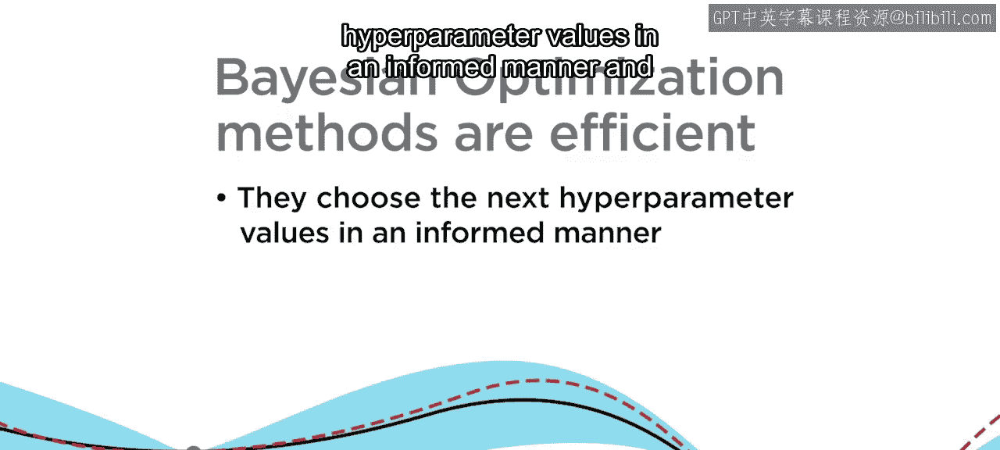
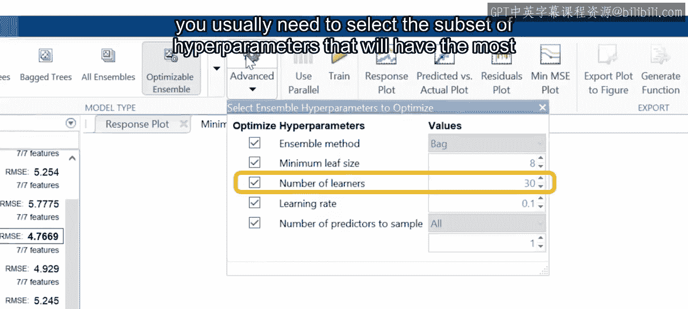
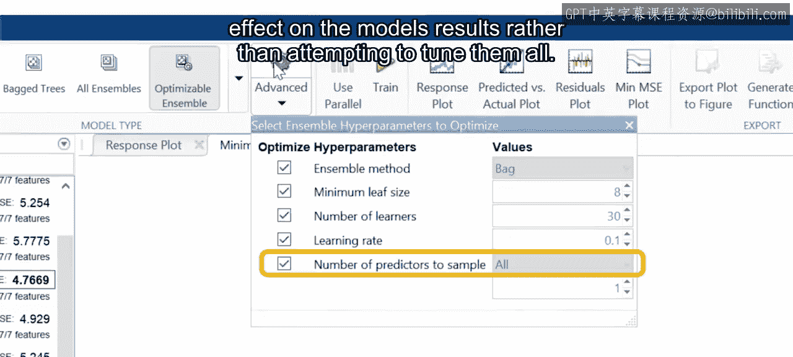

# 23：超参数介绍 🎯

在本节课中，我们将要学习机器学习模型中的两个核心概念：参数与超参数。我们将明确两者的区别，理解超参数的重要性，并探讨如何优化超参数以提升模型性能。

## 模型参数与超参数

在机器学习中，你可能会遇到“参数”和“超参数”这两个术语，它们都用于描述模型的特征。那么，这两者之间有何区别呢？

**模型参数**是模型内部的配置变量，其值从数据中估计得出。模型参数从训练数据中学习，其值由机器学习算法本身进行优化。因此，数据科学家无需手动设置它们。

例如，在逻辑回归中，S型函数（sigmoid equation）的系数就是根据数据计算得出的。

然而，有些参数无法通过训练单个模型来学习，这些参数被称为**超参数**。模型超参数会影响学习算法的工作方式，但其本身不会由训练算法利用数据进行优化。

超参数必须在运行算法之前进行设置。因此，为了估计模型参数，找到超参数的合适值是必要的。

## 超参数示例：K近邻模型

一个很好的例子是K近邻（KNN）模型中的 **K**。回想一下，K的值并非由数据设定，因为它不是由分类模型自动生成的。

因此，K是KNN模型的一个超参数。但这并非该模型中唯一的超参数，你还可以更改用于确定哪些点被视为“邻近”的**距离度量**。

这两个值都会影响你的KNN分类器的准确性。之前，你已经尝试过使用出租车数据为超参数K寻找一个合适的值。

对于二分类和多分类模型，你都通过改变K值并评估性能进行了实验。

现在，你有了两个超参数：**K** 和 **距离度量**。

那么，是否存在一种更好的方法来寻找最优的超参数值呢？

## 超参数优化

虽然参数是通过使用训练数据训练模型来优化的，但超参数是在训练过程之外确定的。

因此，为了估计超参数的最优值，你需要依赖一个称为**超参数优化**或**调优**的过程。

从概念上讲，超参数调优是在模型训练之上的一个优化循环，旨在搜索能带来最低误差的超参数组合。请注意，此过程必须使用验证数据。

尽管这种优化可以通过手动搜索来完成，但它很快就会变成一项反复试验的任务。

## 自动化超参数调优方法

有方法可以自动化这个过程。一种方法是**网格搜索**，它会遍历超参数的每一种组合。

以KNN为例，网格搜索会尝试K和距离度量的每一个值组合，以确定最优值集。然而，这种方法可能非常耗时，并且随着数值数量的增加，其扩展性很差。

你也可以使用一种称为**随机搜索**的方法。顾名思义，超参数值的组合是随机抽样的。因此，并非所有超参数值都会被尝试。这很有帮助，因为事先很难确定模型对哪些超参数值敏感。然而，随机搜索仍可能错过全局最优解。

尽管网格搜索和随机搜索易于理解，但它们的效率不高。

直观地说，根据过去组合的性能来选择下一个超参数组合会更高效。这正是**贝叶斯优化**的目标。采用这种方法，算法会跟踪过去的评估结果，并用其形成模型性能的概率表示。这是通过使用一个作为超参数组合主要评估器的**目标函数**，以及一个称为**代理模型**的目标函数近似来实现的。

贝叶斯优化方法之所以高效，是因为它们以知情的方式选择下一个超参数值，并且进行更少的函数评估。

## 总结与最佳实践

总而言之，改进模型的一种方法是明智地选择超参数。找到超参数的最佳组合可能很棘手，但你可以使用一些方法来自动化优化过程。

自动化的超参数调优过程在选择数值时所需的人工努力较少，但需要更多的计算时间。

由于大多数模型都有多个超参数，你通常需要选择对模型结果影响最大的超参数子集进行调优，而不是试图调优所有超参数。

在下一节课中，你将有机会了解如何使用MATLAB进行超参数调优。