# 25：评估和使用模型 🎼

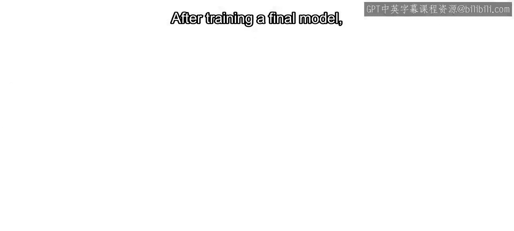

在本节课中，我们将学习机器学习工作流的最后一步：评估最终模型在测试集上的性能，并将其应用于新数据以进行预测。

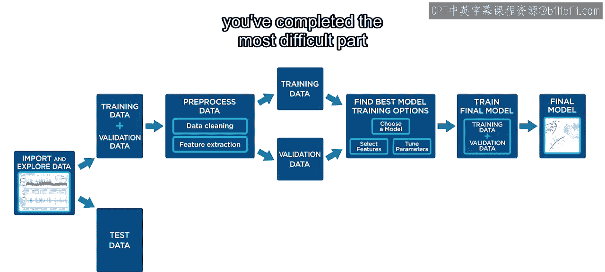

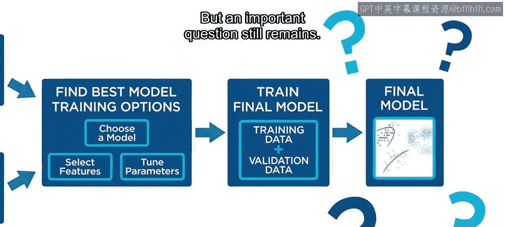

## 模型泛化能力评估

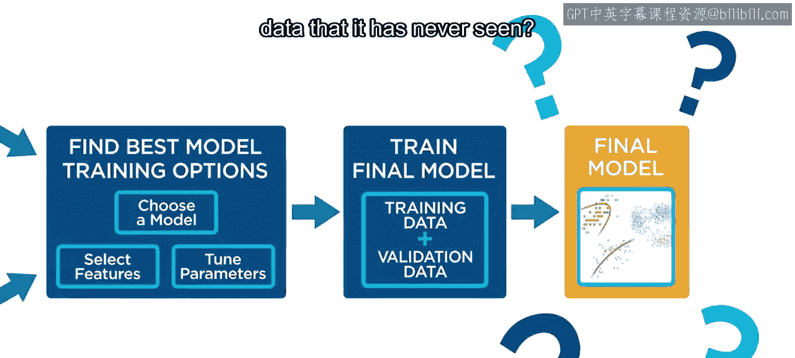

训练完最终模型后，你已经完成了机器学习工作流中最困难的部分。但一个重要的问题仍然存在：你的模型能否泛化到它从未见过的数据？

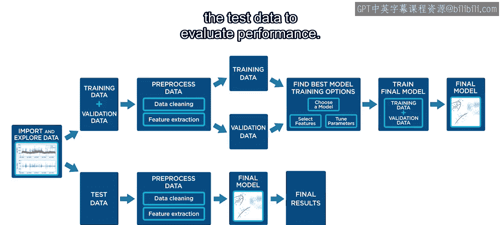

为了回答这个问题，你必须将最终模型应用于测试数据以评估其性能。

## 过拟合与测试集的重要性

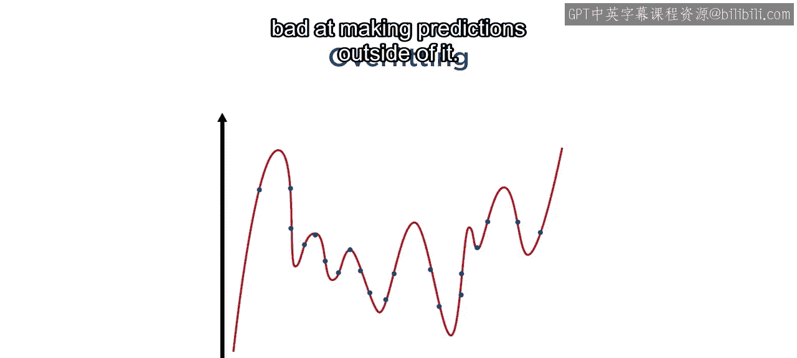

回忆一下，过拟合是指模型对训练数据过于熟悉，导致在训练数据之外进行预测时表现不佳。这就是为什么在开始训练模型之前预留测试数据非常重要。因为测试数据不用于训练，它可以模拟模型在未见数据上的表现。

## 本节内容概述

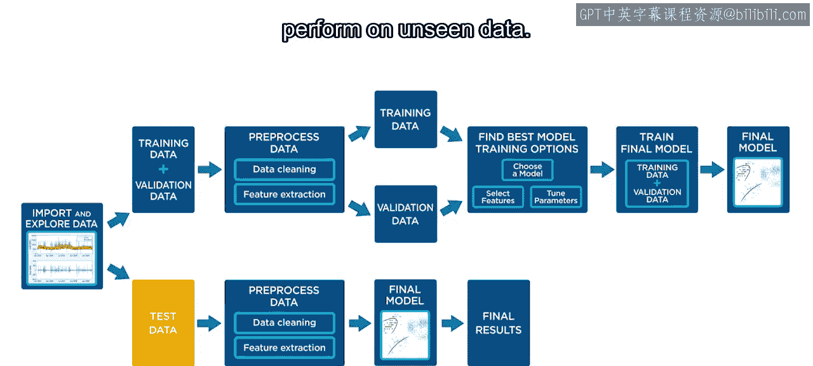

在本视频中，你将通过将优化后的模型应用于测试数据来完成机器学习工作流。具体包括：评估优化模型的性能，以及在应用程序之外使用模型进行预测。

## 准备测试数据

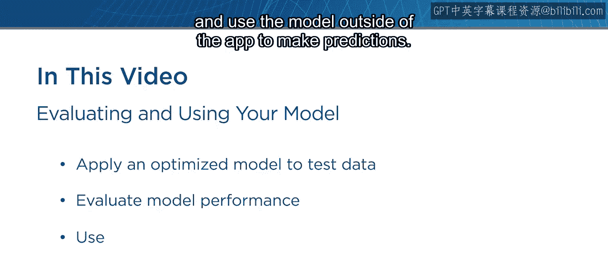

首先，对测试数据应用与组合训练和验证数据相同的预处理步骤。你还必须添加模型预测出租车行程时长所需的所有特征。

## 导入测试数据至回归学习器应用

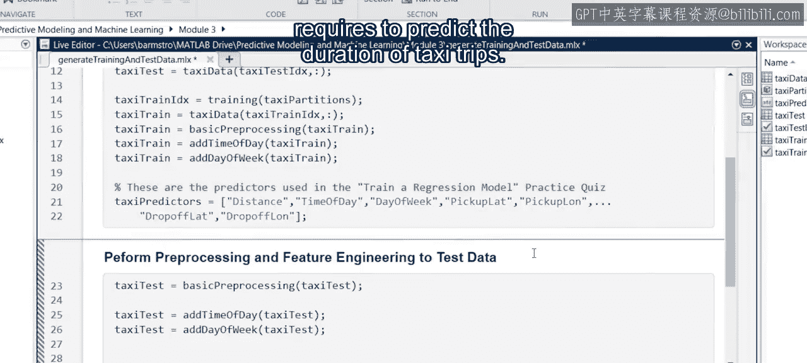

现在测试数据已准备就绪，下一步是将其导入回归学习器应用。从工作区中选择测试数据。响应变量和预测变量会根据已训练的模型自动选择。然后导入数据。

## 选择最终模型

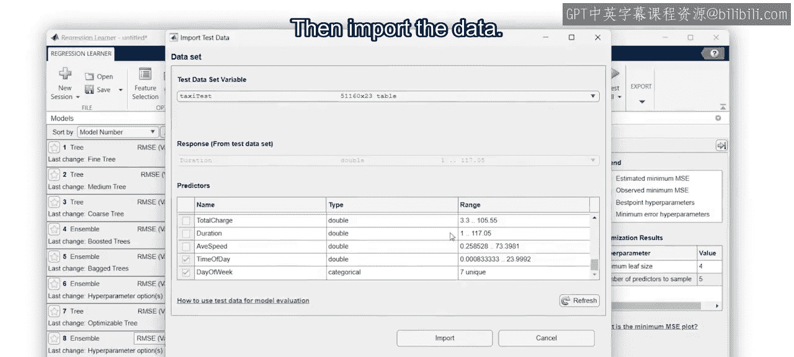

在模型历史记录中，选择你的最终模型。这里我们将使用我们优化过的、包含较少学习器的集成模型。

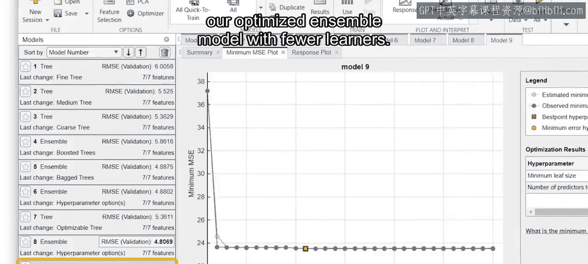

## 应用模型至测试数据

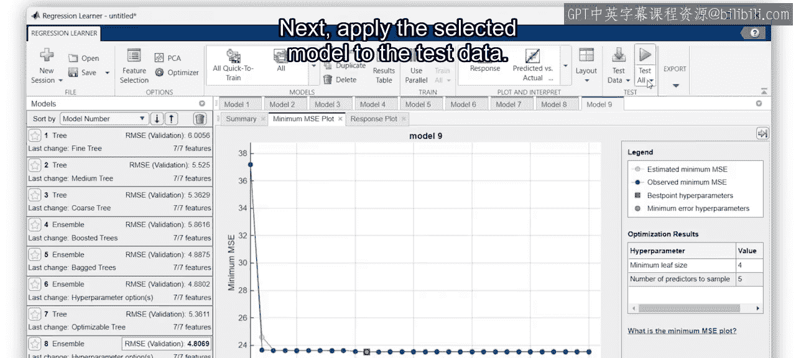

接下来，将选定的模型应用于测试数据。

## 评估测试结果

那么它的表现如何？让我们查看位于摘要选项卡中的测试结果。

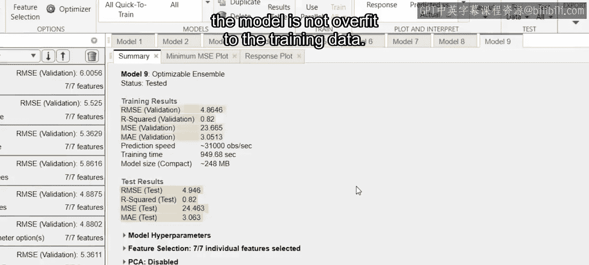

**均方根误差**告诉我们，模型预测行程时长的误差大约为5分钟。测试指标和训练指标非常相似。这是一个很好的迹象，表明模型没有对训练数据过拟合。

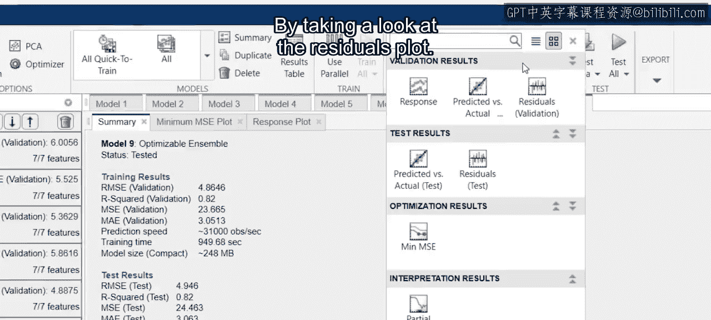

## 分析残差图

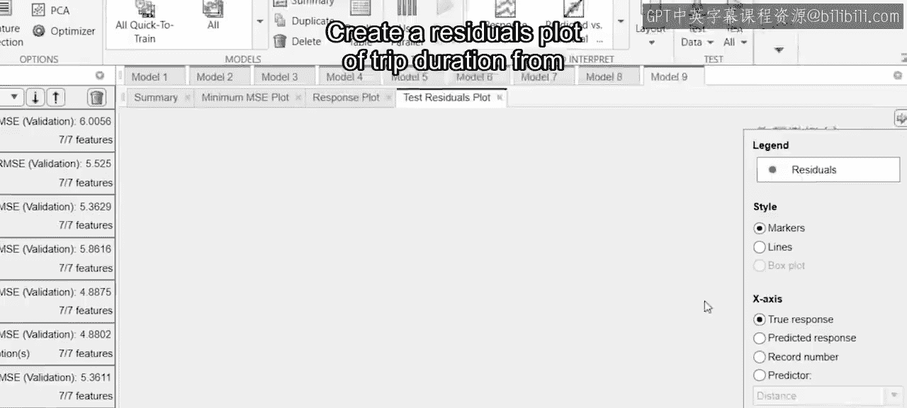

你可以通过查看残差图来了解误差如何随行程时长变化。以下是创建残差图的步骤：

1.  从测试数据创建行程时长的残差图。
2.  观察短途和长途行程的误差情况。

请注意，对于最常见的短途行程，模型表现良好，残差接近零。对于不太常见的超长途行程，模型表现不佳，会低估行程时长。这可能是由于事故或道路施工等不可预见的情况造成的。为这些事件添加额外的特征可能有助于改进模型。

## 使用模型进行新预测

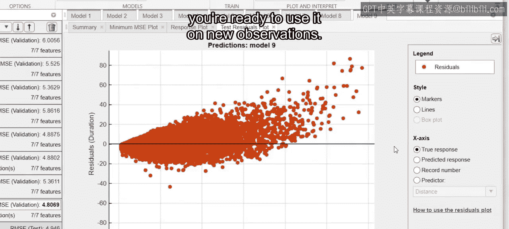

完成最终模型的评估后，你就可以将其用于新的观测数据了。以下是具体步骤：

1.  将模型导出到工作区。
2.  为导出的模型命名。

导出的模型是一个**结构体变量**。结构体将相关但不同类型的数据组合在单个变量中。你训练的模型包含所需预测特征和模型类型的信息，但最重要的是，它包含一个用于新观测数据的**预测函数**。

例如，假设你需要预测一个周二下午6点从下曼哈顿到时代广场的行程时长。

新观测数据应存储在一个表格中，该表格包含与模型训练期间使用的相同的预测特征。然后，使用导出模型的 `predict` 函数来估计行程时长。

```matlab
% 示例：使用导出的模型进行预测
predictedDuration = trainedModel.predictFcn(newObservationTable);
```

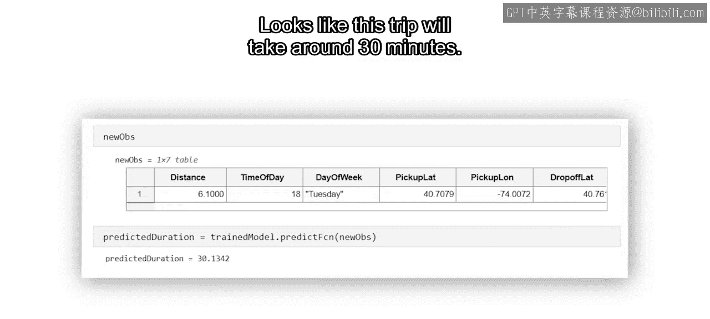

看起来这次行程大约需要30分钟。

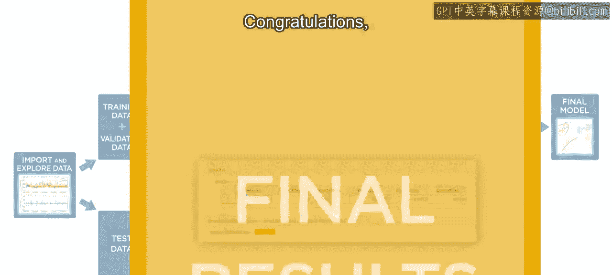

## 课程总结

恭喜你，这完成了整个机器学习工作流。

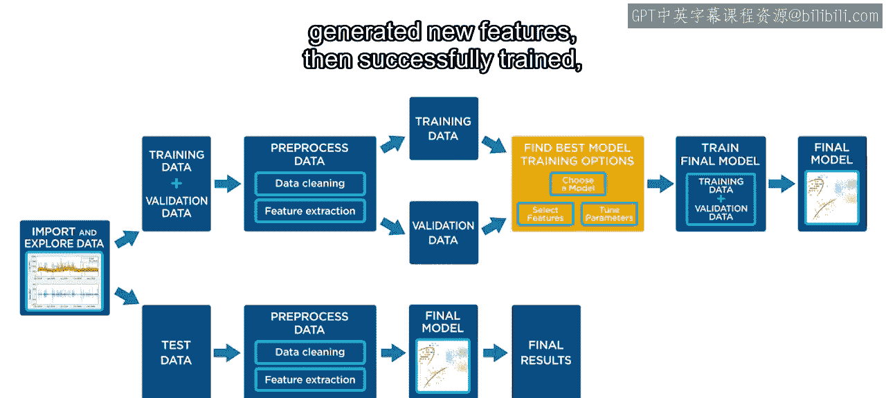

回顾一下，你从一个包含历史出租车行程数据的电子表格开始，探索并清理了数据，生成了新特征，然后成功地训练、验证并测试了一个预测模型。

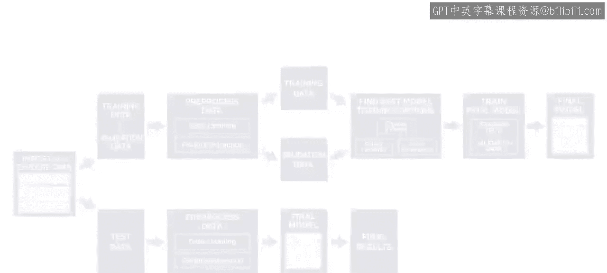

你现在已经准备好将这个工作流应用到你自己的项目中了。