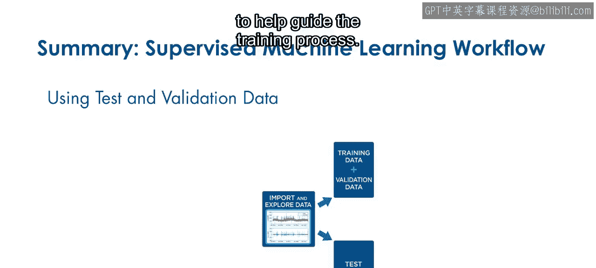
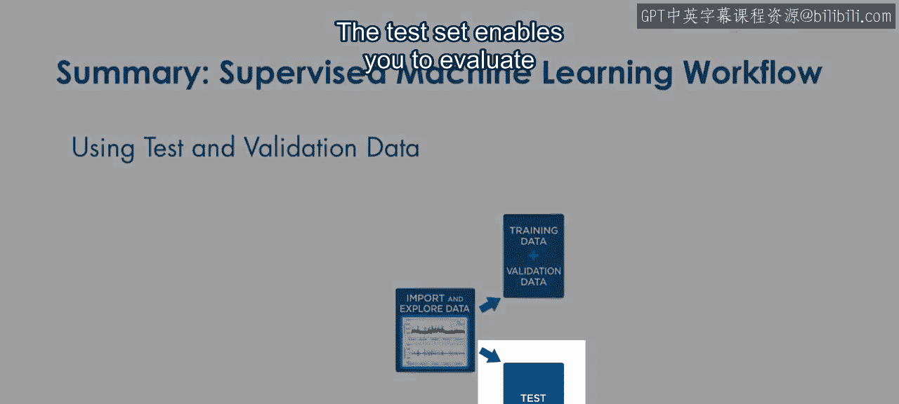
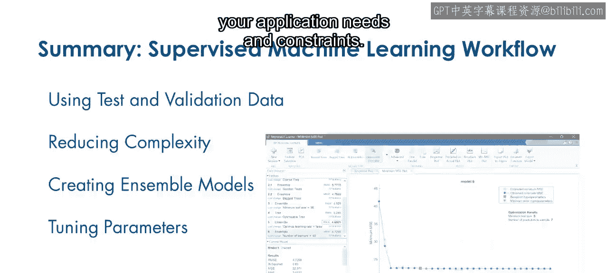
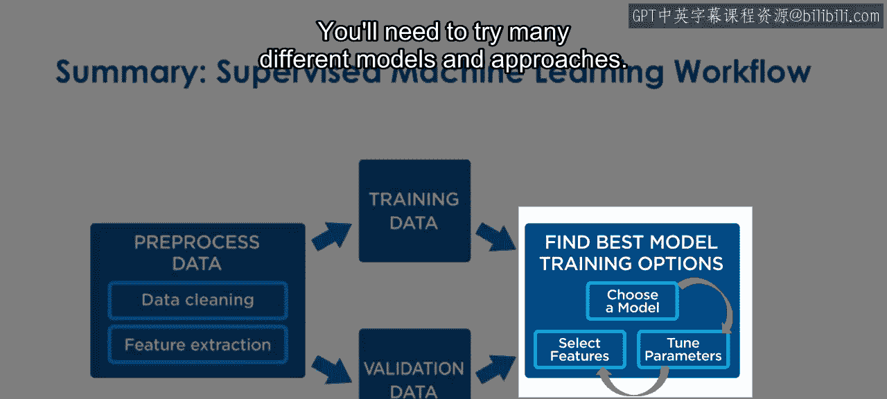
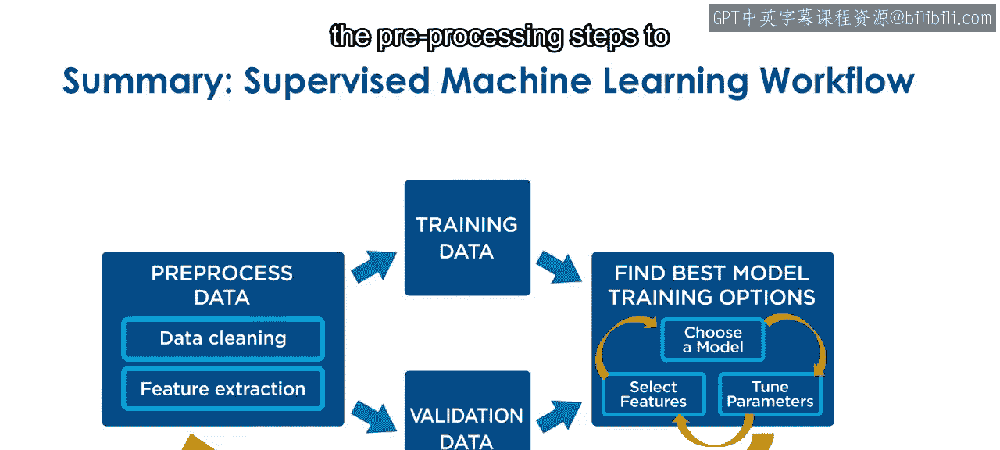
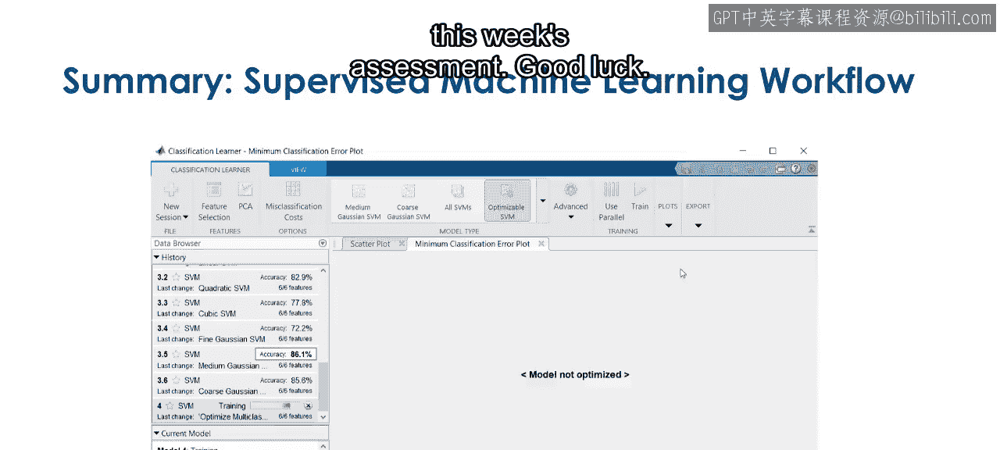

模块3：总结

在本模块中，我们学习了监督机器学习工作流中的关键步骤，包括模型评估、特征选择、集成方法以及超参数调优。现在，让我们来总结一下本模块的核心内容。

你已经成功完成了本模块的学习。结合你在课程1和课程2中获得的技能，你现在可以应用完整的监督机器学习工作流了。

以下是本模块所学内容的总结。

**使用验证数据评估与比较模型**

你首先学习了使用验证数据来评估和比较模型。验证数据有助于防止过拟合，使你的模型能够很好地泛化到新数据上。它还能提供模型性能的估计，以便你可以比较不同的方法。

由于你使用验证数据来指导训练过程，因此在工作流早期预留一个测试数据集至关重要。

`测试集 = 总数据集 - 训练集 - 验证集`

测试集使你能够使用模型从未见过的观测数据来评估最终模型。

`最终模型性能 ≈ 在测试集上的表现`

**降低模型复杂度**

接下来，我们探讨了如何使用特征选择和正则化来降低模型复杂度。这些技术帮助你识别最有用的预测变量并防止过拟合。它们对于宽数据集尤为重要。

**构建集成模型**

有时，单一模型不足以捕捉复杂的趋势。将多个模型的预测组合成一个集成模型可以提高准确性。常见的集成类型包括提升决策树和袋装决策树。

**超参数调优**

在测试不同模型时，你通常需要调整一个或多个超参数。现在，你可以根据应用需求和约束，通过调优选定的超参数来创建优化模型。

`优化模型 = 调优(模型类型, 超参数, 验证集性能)`

**机器学习是一个迭代过程**

请记住，机器学习是一个迭代过程。你需要尝试许多不同的模型和方法。你可能还需要返回到预处理步骤，以设计和清理新的特征。

花些时间复习和实践本模块的概念。当你准备好后，请继续完成本周的评估。祝你好运。

在本模块中，我们一起学习了监督机器学习工作流的完整闭环，从使用验证数据评估模型，到应用特征选择和正则化降低复杂度，再到构建集成模型和进行超参数调优。理解这个迭代过程对于构建稳健、高性能的机器学习模型至关重要。