# 29：集成模型 🚀

在本节课中，我们将要学习如何将训练好的机器学习模型投入实际应用，这个过程被称为**模型部署**或**集成**。我们将探讨三种不同的部署工作流，并了解MATLAB如何帮助你在不同场景下实现模型的实际应用。

---

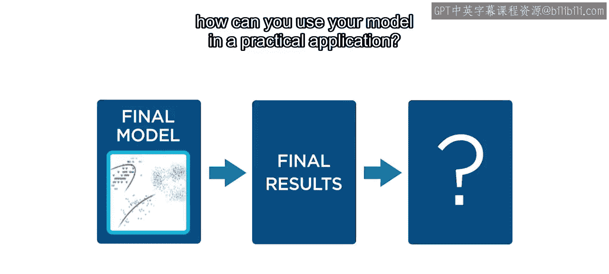

## 模型部署概述

当你训练并测试好一个最终模型后，下一步就是将其投入实际应用。虽然证明模型预测准确很重要，但关键在于如何在现实场景中使用它。

无论是帮助零售公司优化产品推荐的数据科学家，还是利用机器学习提升自动驾驶汽车性能的工程师，都需要将模型部署到生产环境中。部署方法多种多样，每种方法对应不同的工作流程。

---

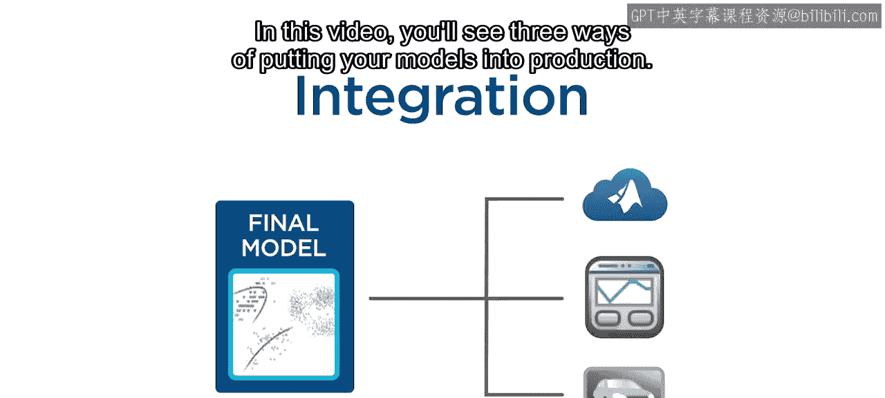

## 部署工作流一：共享MATLAB代码 📁

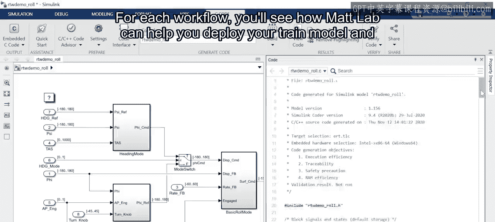

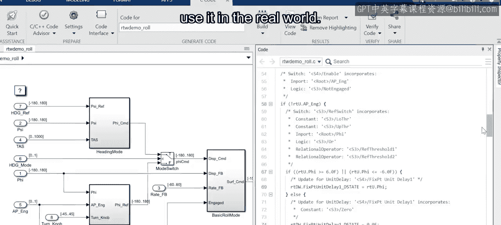

上一节我们介绍了模型部署的概念，本节中我们来看看第一种方法：共享MATLAB代码。这种方法适合希望与其他地点的同事分享研究成果的研究人员。

一个很好的选择是直接分享你的MATLAB代码。

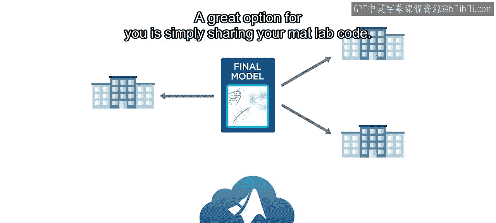

以下是具体步骤：

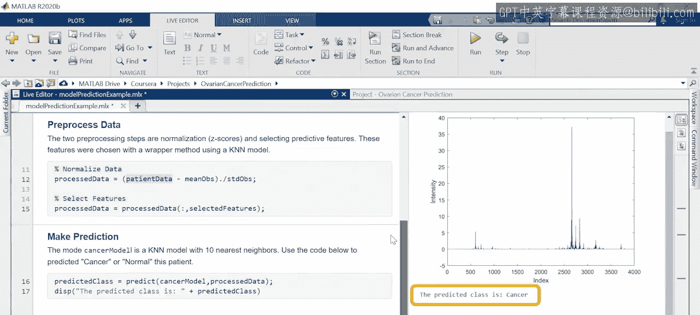

1.  首先，创建一个**Live Script**或函数，用于使用你训练好的模型进行预测。
2.  然后，利用MATLAB中的**源代码控制工具**来跟踪更改，并将你的代码上传到基于云的代码仓库，例如GitHub。

这样，任何人都可以下载你的MATLAB代码，并在他们本地的机器上运行。你的MATLAB代码甚至可以在其他编程环境中被调用。如果你分享的对象使用C++、Java或Python等其他语言，他们可以利用**MATLAB Engine API**，从他们自己的环境中调用你的MATLAB代码。

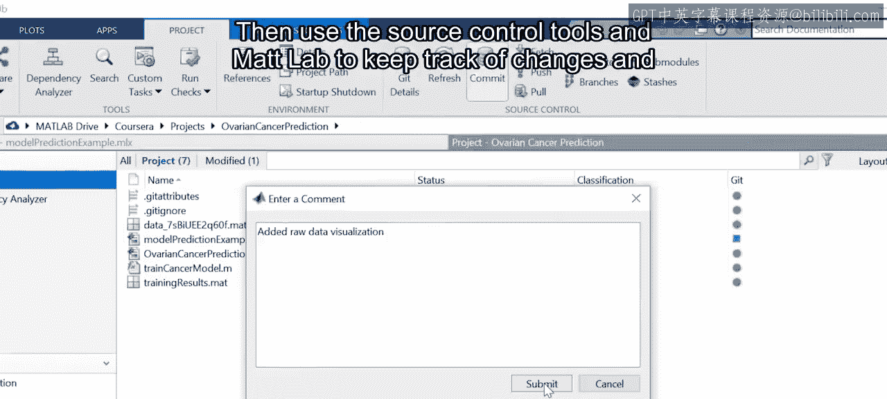

---

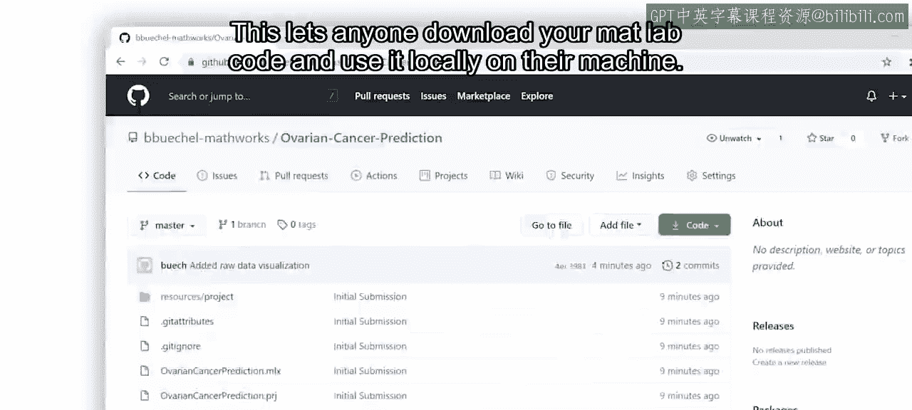

## 部署工作流二：创建Web应用程序 🌐

上一节我们介绍了通过共享代码进行协作，本节中我们来看看如何让非技术人员也能使用模型。假设你是一家零售公司的数据科学家，希望让组织内的任何人（包括没有编程经验的人）都能使用你的模型。

针对这种用例，一个好的选择是创建一个带有易用界面的Web应用程序。

以下是具体步骤：

1.  首先，在MATLAB中设计并创建一个交互式应用程序，该程序能使用你训练好的模型进行预测。
2.  然后，将应用程序托管在一个Web服务器上。

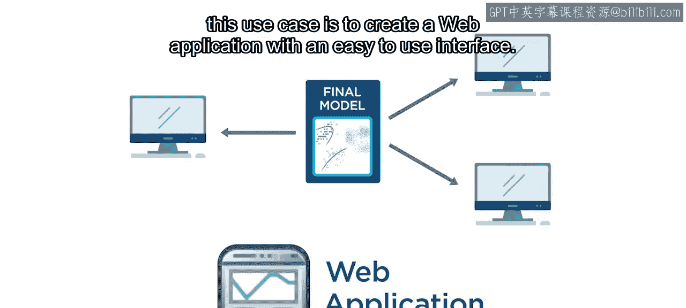

这样，任何有网络连接的同事都可以通过浏览器使用这个应用程序。

---

## 部署工作流三：部署到硬件设备 🔧

上一节我们介绍了面向用户的Web应用部署，本节中我们来看看面向硬件的部署。假设你是一名致力于自动驾驶汽车的工程师。汽车中嵌入的许多硬件设备都可以受益于机器学习模型。

那么，如何将模型部署到不运行MATLAB的硬件设备上呢？

答案是：将你的代码转换为可以在该设备上运行的另一种语言。手动完成这个过程非常耗时。但MATLAB可以**自动生成C和C++代码**，这些代码可以轻松部署到硬件设备上。

**代码生成**功能通过让工程师快速原型化和测试新的硬件系统，可以为他们节省大量时间。

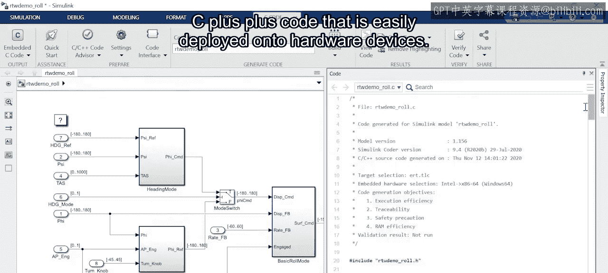

---

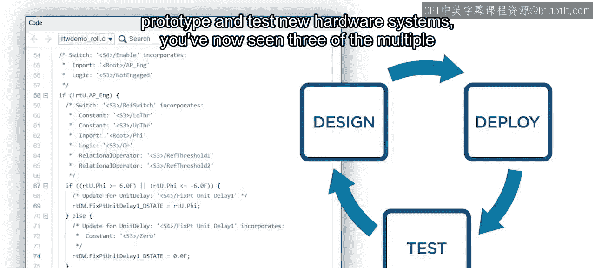

## 总结

本节课中我们一起学习了将机器学习模型投入实际生产的三种主要方法：

1.  **共享MATLAB代码**：通过代码仓库和API实现跨团队、跨语言的协作与复用。
2.  **创建Web应用程序**：构建交互式界面，让非技术用户也能便捷地使用模型。
3.  **部署到硬件设备**：利用代码生成技术，将模型转换为C/C++代码，集成到嵌入式系统中。

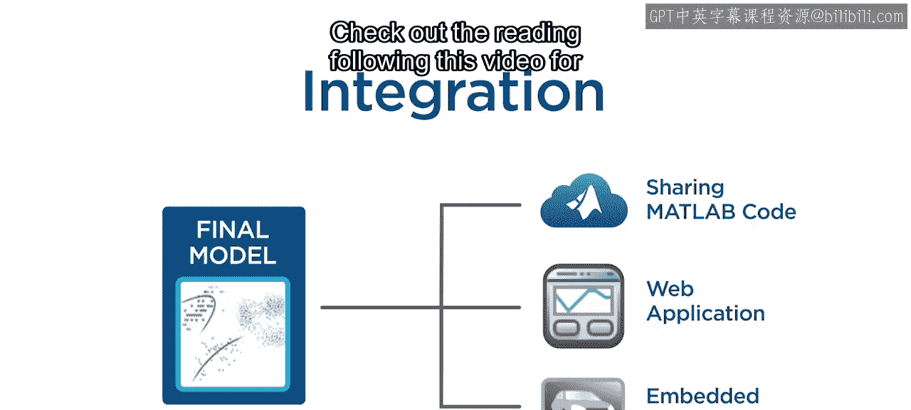

每种方法都代表了一种在现实场景中使用模型的有效途径。要了解更多关于使用MATLAB集成模型的示例，请查看本视频后的阅读材料。