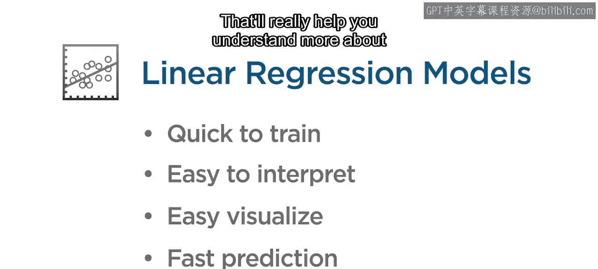
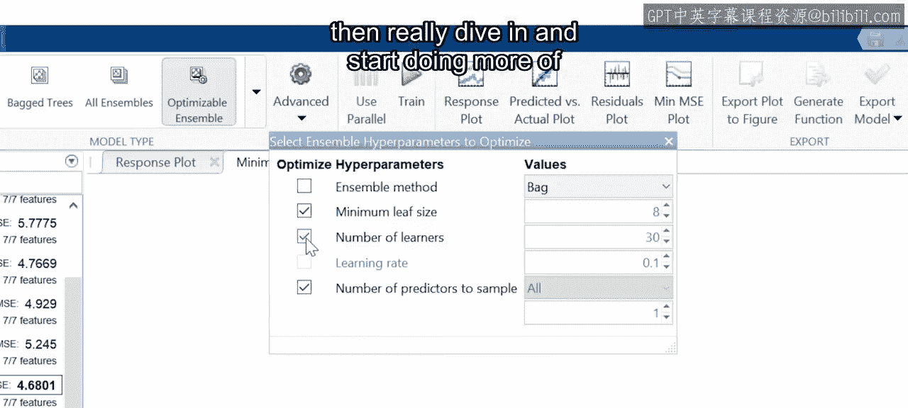
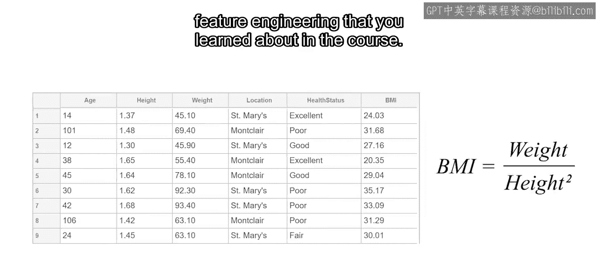
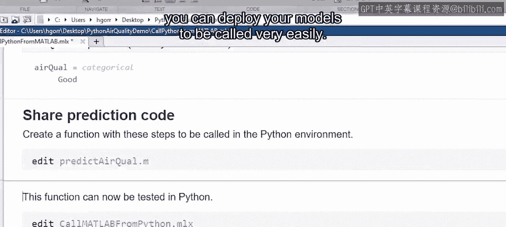
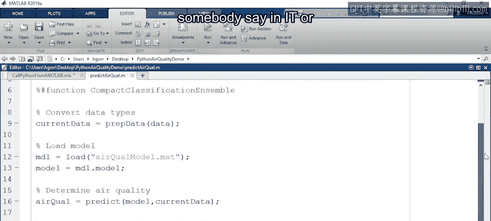
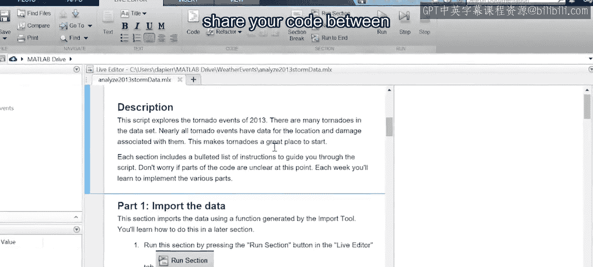
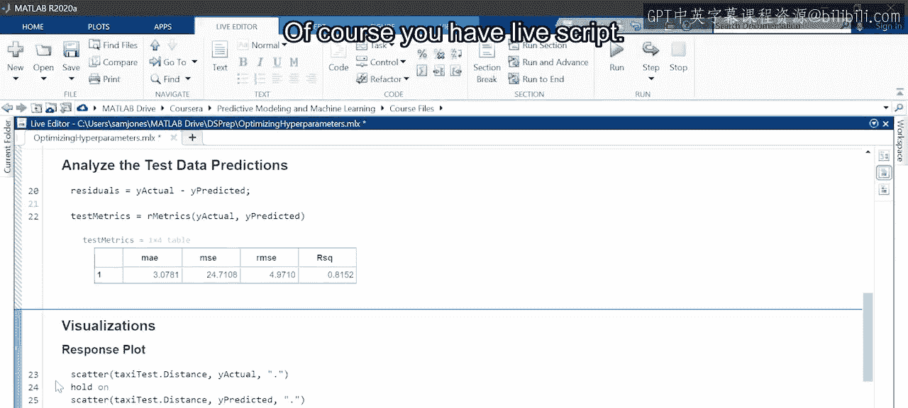
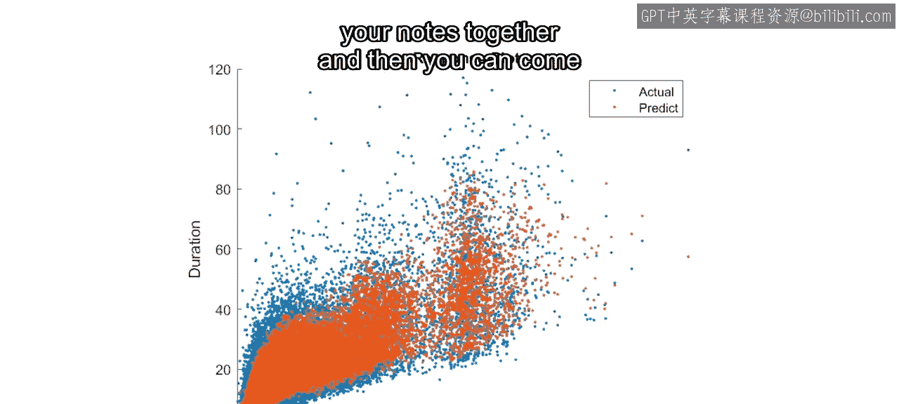
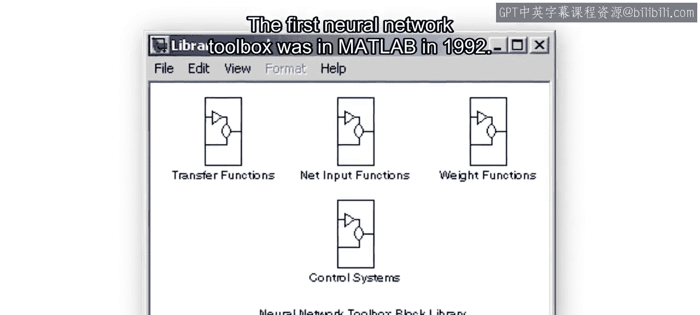

# 30：与Heather的讨论 🎤

在本节课中，我们将通过产品营销专家Heather的分享，了解数据科学实践中的常见问题、工作流程以及行业应用。我们将探讨如何开始一个项目、特征工程的重要性、跨领域应用以及团队协作的挑战。

---

## Heather的角色与工作方式

Heather在MathWorks的产品营销团队工作。她的主要职责是制作视频、示例和博客文章，为数据科学主题提供实用的解释。同时，她也会收集用户和课程学员的反馈，帮助开发团队确定改进的优先级。最近，她专注于帮助数据科学家和工程师团队集成他们的机器学习和深度学习应用。

上一节我们介绍了Heather的背景，本节中我们来看看她个人的工作方式。

当开始一个新项目时，Heather倾向于使用应用程序尝试多种不同的模型。如果对数据有一定了解，可以排除或优先考虑某些可能表现良好的模型。她通常从一个非常简单的模型开始，例如线性模型。

**代码示例：在MATLAB中拟合一个简单的线性模型**
```matlab
% 假设 X 是特征数据，y 是目标变量
mdl = fitlm(X, y);
```







即使知道数据关系可能不是线性的，这样做也有助于理解预测结果是如何产生的。线性模型能提供许多有用的特性，例如可视化图表和方差分析（ANOVA），这些都能帮助你更深入地理解数据和特征，并决定下一步该做什么。在获得对可能有效的模型的初步感觉后，就可以深入进行模型调优和特征工程。

## 特征工程与深度学习

上一节我们提到了特征工程，本节中我们来看看一个常见问题：是否需要进行特征工程，还是可以直接应用深度学习技术。

Heather认为，这通常取决于你的数据、具体应用以及数据量。深度学习的一个吸引力在于，通常不需要进行大量的特征工程或特征选择。然而，深度学习往往需要大量的数据。即使在许多深度学习应用案例中，人们仍然会进行一些特征选择或工程。

例如，考虑一辆汽车在行驶时收集的所有传感器数据。这将是一个大数据问题，在一秒钟内捕获的数据量就非常庞大。如果你试图实时应用机器学习或深度学习模型，每纳秒都进行处理将非常具有挑战性。因此，工程师们通常会将这一秒钟的数据表示为一组特征。

**核心思想**：是否需要特征工程，很大程度上取决于对最终应用的前瞻性思考，以及模型在部署时的实际需求。

## 机器学习的行业应用


机器学习正被应用于许多不同的行业。Heather个人偏爱那些以某种方式帮助人类或环境的应用。

她特别关注气候变化和生态学领域的应用。这些领域的数据量巨大，变化非常频繁，预测和建模极具挑战性，因此正在进行许多有趣的研究。此外，她也喜欢任何涉及音乐或创意领域的应用，例如风格迁移、艺术创作等。还有一些鼓舞人心的故事，比如帮助儿童预测乐器类型，并让他们与计算机竞赛，从而学习如何使用机器学习。

## 企业数据科学项目的挑战

随着机器学习在不同领域的普及，许多公司首次采用这些技术。Heather观察到，企业在启动数据科学项目时面临一些挑战，尤其是在尝试部署模型或将模型提升到新水平时。







以下是一些常见的挑战及克服方法：

*   **团队协作与集成**：项目通常涉及多人协作。一个重要的解决方案是利用MATLAB能够轻松调用多种其他语言（如Python、C、Java）的特性。你可以将训练好的模型部署到这些环境中，便于与IT或设备工程部门的同事进行集成。
*   **文档与代码共享**：在团队之间记录工作并共享代码至关重要。像在课程中使用的Live Script（实时脚本）这样的工具非常有用，它可以将所有结果、代码和注释整合在一起，便于团队内部沟通。

## 给初学者的建议

对于即将完成课程并开始将机器学习应用于自己项目的学习者，Heather有一条重要的建议：提前规划。

在开始之前，思考整个应用：目标是什么？期望是什么？这有助于你在众多令人兴奋的模型和有趣的工作中不迷失方向，始终记住项目的最终目标。同时，过程中的文档记录即使对你自己也极其重要。使用Live Script等工具，将可视化图表和所有笔记保存在一起，会非常有帮助。

## 总结与趣闻

在本节课中，我们一起学习了Heather关于数据科学实践的经验分享。我们讨论了从简单模型入手的工作流程、特征工程与深度学习的权衡、机器学习在环境与创意领域的应用、企业项目面临的协作挑战，以及对初学者的规划建议。

最后，Heather分享了一个有趣的事实：这项技术并不完全是新的。第一个在MATLAB中运行的神经网络是在1992年，而回归、多项式拟合等功能出现得更早。深度学习和机器学习并非全新事物，它们已经存在了一段时间，只是我们现在正在更好地利用它们。








感谢所有学员在课程和论坛中的积极参与，请继续提问和分享你们的见解。