第31章：预测建模与机器学习总结 🎯

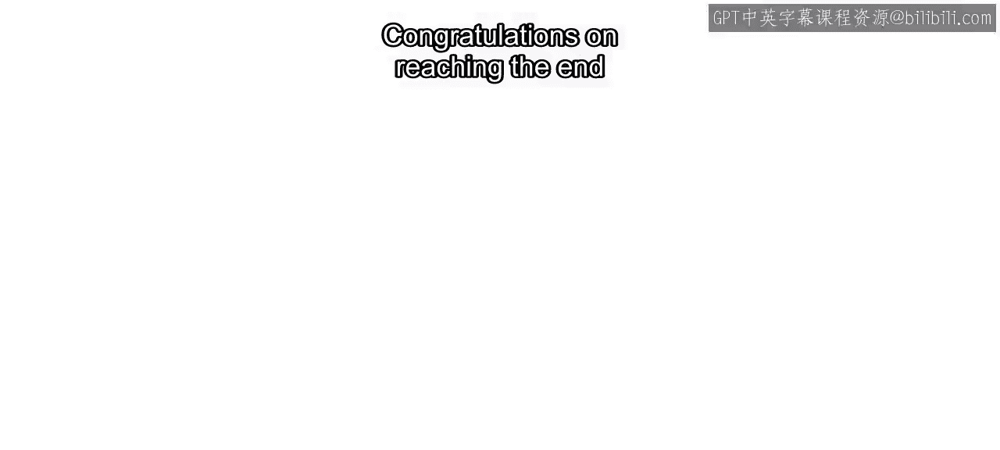

在本章中，我们将总结整个预测建模与机器学习课程的核心内容。我们将回顾从基础算法到高级技巧，再到毕业项目的完整学习路径。

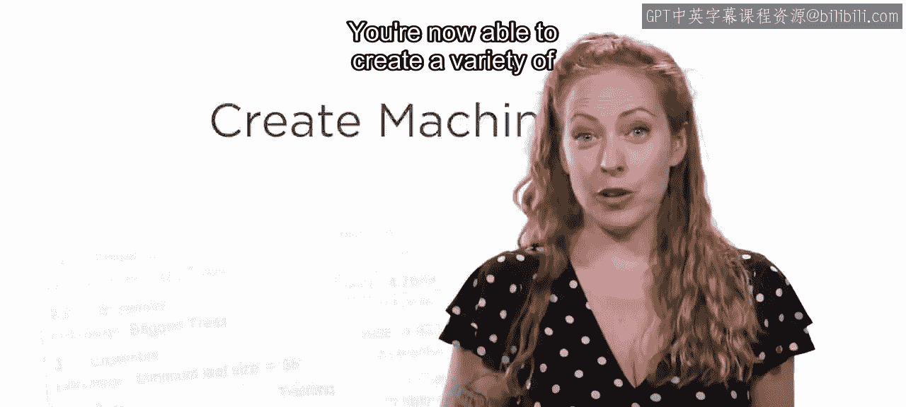

---

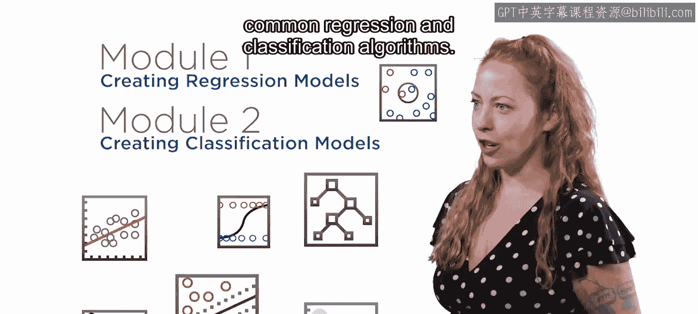

恭喜你完成了预测建模与机器学习部分的学习。你现在已经能够创建多种机器学习模型并评估它们的性能。让我们来总结一下你在本课程中学到的内容。

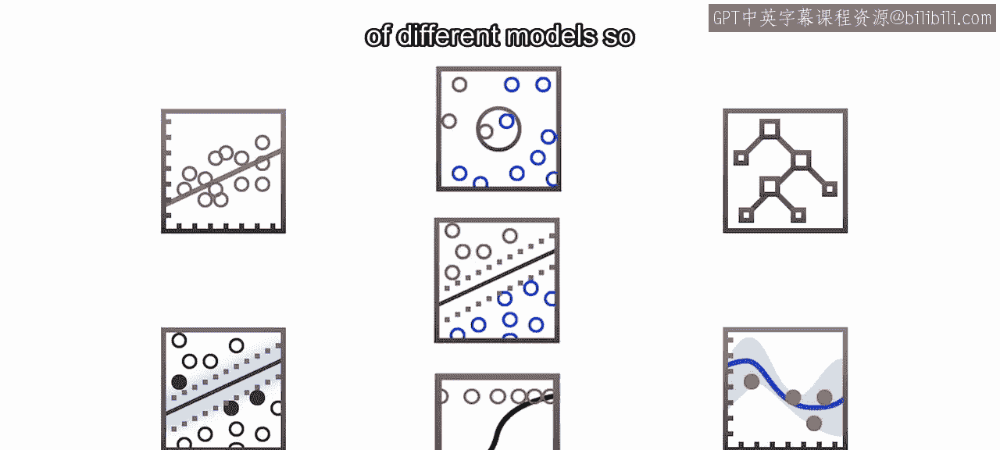

在模块1和模块2中，你学习了常见回归与分类算法的基础知识。

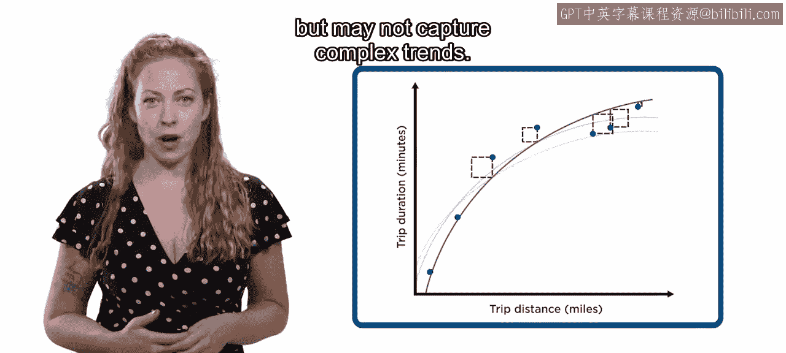

理解不同的模型非常重要，这能帮助你在选择和调优模型时做出明智的决定。以下是几种核心模型的对比：

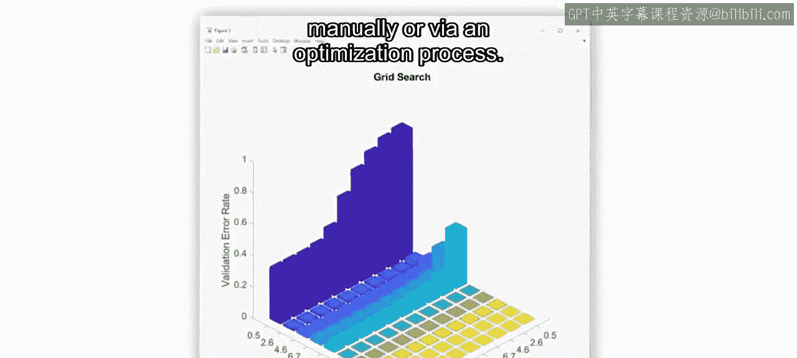

*   **线性模型**：训练速度快且易于解释，但可能无法捕捉复杂的趋势。其核心公式可表示为：`y = β₀ + β₁x₁ + ... + βₙxₙ`。
*   **决策树**：擅长捕捉非线性趋势，但引入了需要手动或通过优化过程设置的**超参数**。

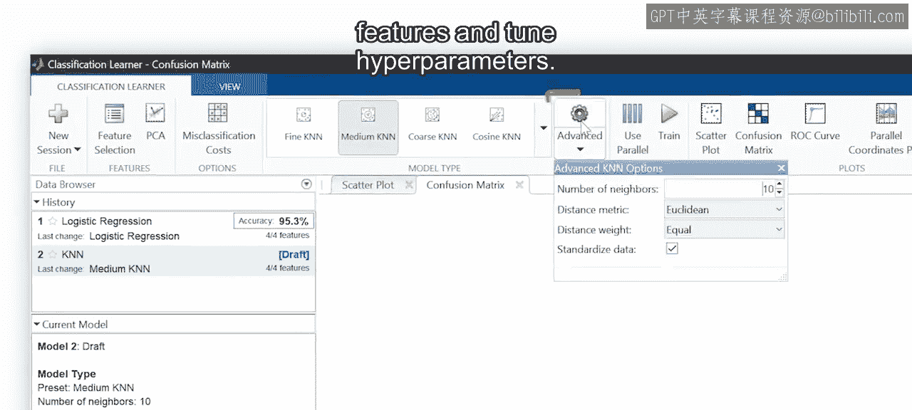

你使用了回归与分类学习器应用程序来训练不同的模型。采用基于应用程序的工作流程，使你能够快速选择特征并调整超参数。

你的训练历史会被保存，因此你可以将最新方法与之前的模型进行比较。关键指标和可视化图表在应用程序中也随时可用。

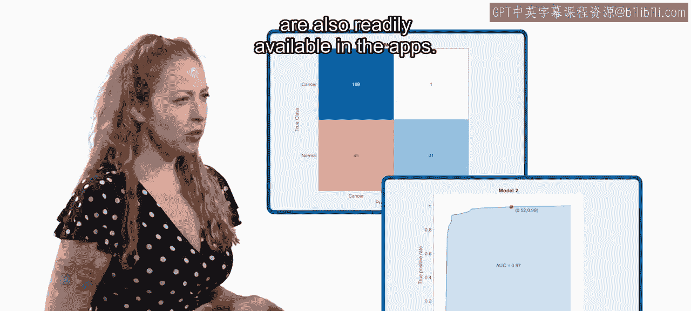

例如，**混淆矩阵**和**ROC曲线**可以帮助你识别分类模型在何处犯错。你可以检查回归模型的**残差**，以找出模型表现良好和需要改进的地方。

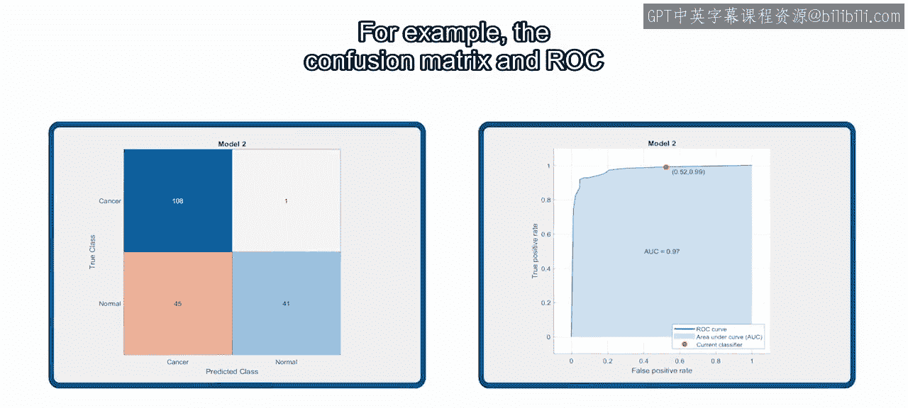

相同的工作流程适用于回归和分类问题。

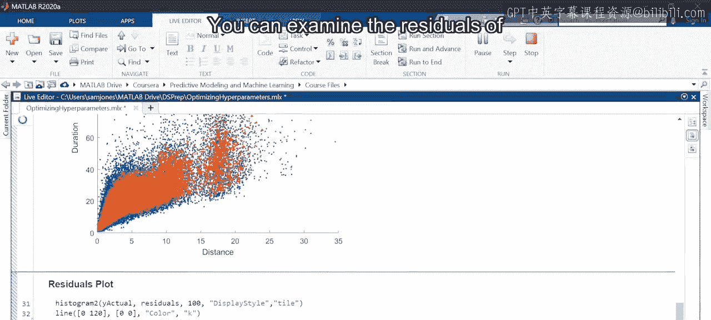

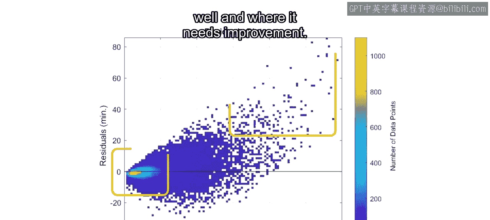

在模块3中，你通过创建用于评估最终模型的测试数据集，应用了监督式机器学习工作流程。

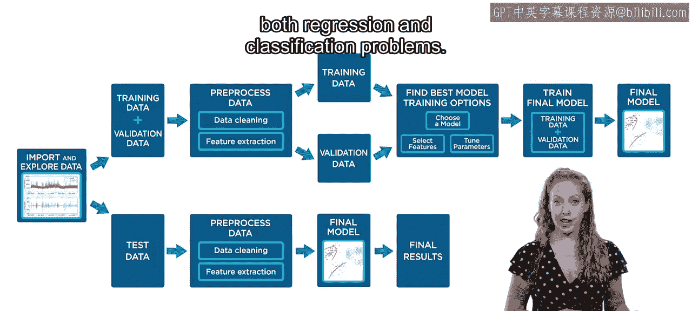

你使用验证数据来比较不同的模型，防止过拟合，并尝试了多种方法。这包括使用不同的算法、执行特征选择和优化超参数。

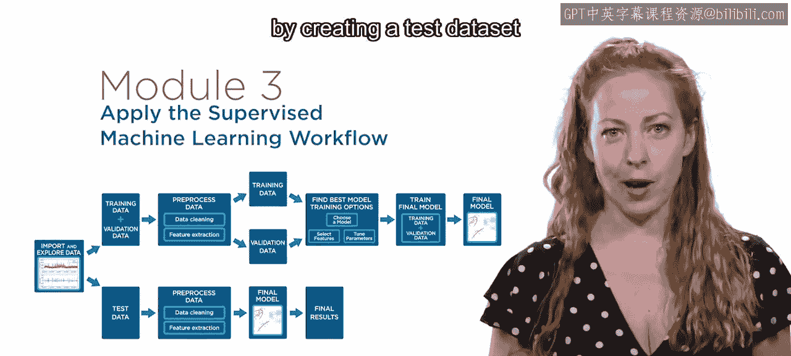

你在一个项目中应用了这些新技能，以预测不同地点和一天中不同时段的出租车需求。

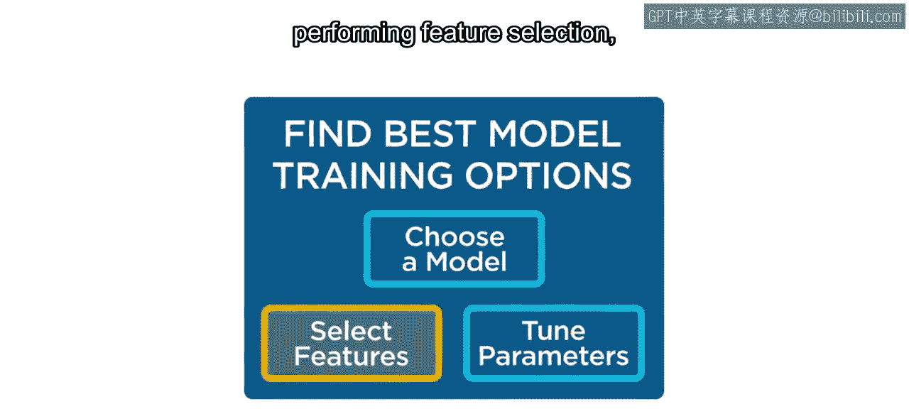

在模块4中，你学习了一些高级技术，以及部署模型的选项。

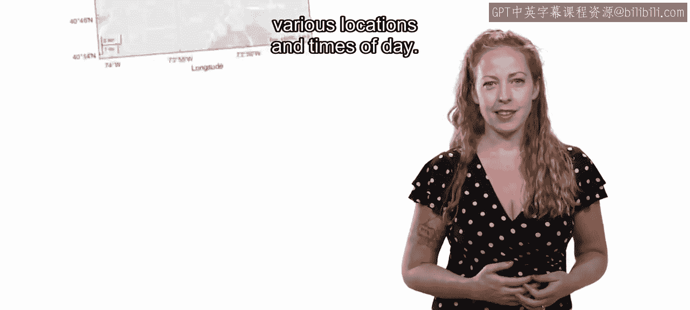

分类问题中经常出现类别不平衡的情况。某些类型的错误比其他错误代价更高的情况也很常见。

你现在可以通过**采样**和**自定义代价矩阵**来解决这两个问题。通常，你可能希望在MATLAB环境之外使用你的模型，例如在Web应用程序或设备上运行的应用程序中。你现在拥有帮助你开始部署模型的资源。

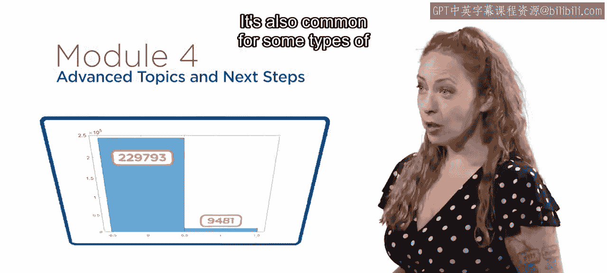

---

既然你已经能够构建预测模型，接下来该做什么？让我们问问Brandon，他将带领你完成毕业项目。Brandon，在Co4中接下来是什么？

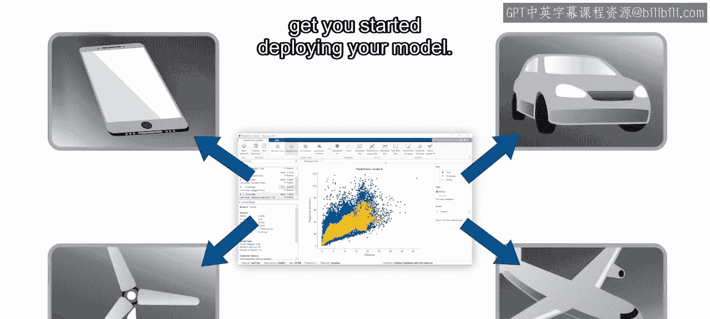

谢谢Heather，你现在已经完成了整个监督式机器学习工作流程，只是每一步都使用了不同的数据集。在毕业项目中，你现在就是数据科学家，你将决定需要捕获哪些重要统计数据、如何预处理数据以及使用哪些机器学习模型。

完成毕业项目后，你将准备好处理自己的数据科学项目。期待在那里见到你。😊

---

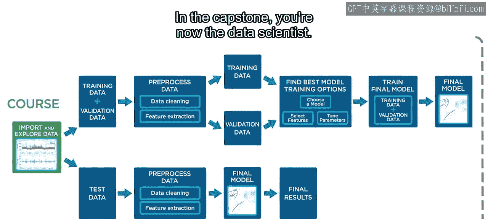

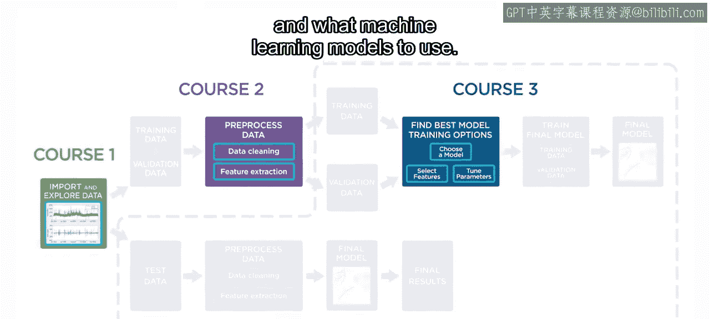

**总结**

在本章中，我们一起回顾了预测建模与机器学习的完整学习旅程。我们从回归与分类的基础算法学起，掌握了使用MATLAB应用程序进行模型训练、比较和评估的流程。随后，我们深入实践，学习了如何通过验证防止过拟合，并应用技能解决实际问题。最后，我们探讨了处理类别不平衡、自定义错误代价等高级技巧，以及模型部署的初步知识。整个课程为你接下来独立应对数据科学挑战，特别是完成毕业项目，奠定了坚实的基础。