# 1：教师介绍 👨‍🏫

在本节课中，我们将认识本系列课程的讲师团队。每位讲师都将分享他们的背景、与MATLAB的渊源以及个人兴趣，帮助你了解他们丰富的行业经验和教学热情。

---

大家好。我是Adam Filion。我是Heather Gorr。我是Brendan Hannigan。我是Erin Byrne。

我是MathWorks的在线课程开发人员。我是MathWorks的产品经理。我是MATLAB和数据科学领域的技术产品营销经理。我是MathWorks的在线内容开发人员。

我从小就是一个科学爱好者。四年级时，我最想成为的是迪士尼幻想工程师。

我早在2004年就开始使用MATLAB，当时我在弗吉尼亚理工大学攻读航空航天工程学士学位。我在研究和教学中使用MATLAB已超过10年。

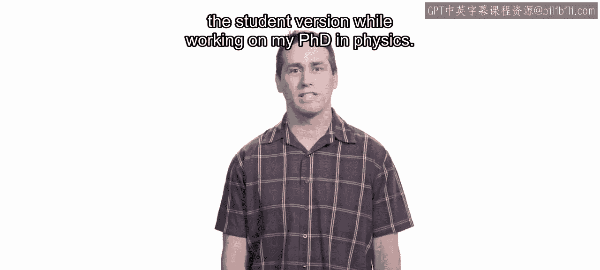

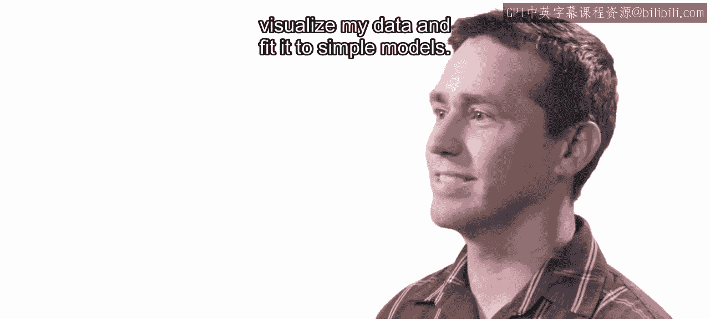

我第一次接触MATLAB是在攻读物理学博士学位期间，购买了学生版本。我主要使用MATLAB来可视化数据并拟合简单模型。

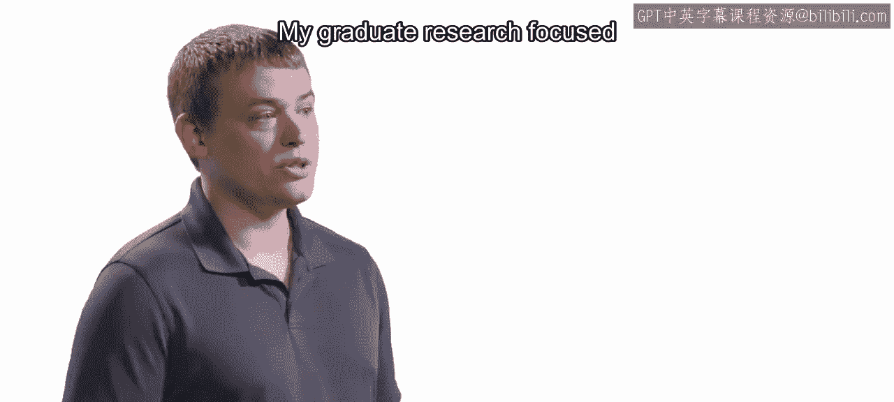

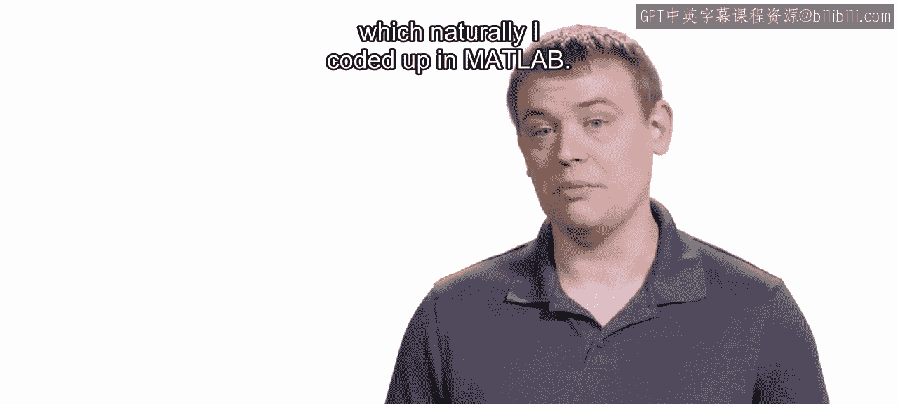

我第一次使用它是在哈维穆德学院攻读工程学期间。我博士期间的主要项目是关于生物流体模式识别的机器学习，那非常有趣。

我的研究生研究集中在一种称为“晕轨道”的领域。我在这方面的研究涉及寻找从低地球轨道到这些晕轨道的最优转移轨迹，自然，我用代码实现了它。

在MATLAB中，最近一个很酷的项目是为实时预测部署机器学习模型。我在MATLAB中创建了信号处理和机器学习算法，然后在云上的流式架构中使用这些预测。

我的职业生涯始于一名航空航天工程师。我为卫星和星际任务（包括火星探测漫游者）进行系统级设计和分析。

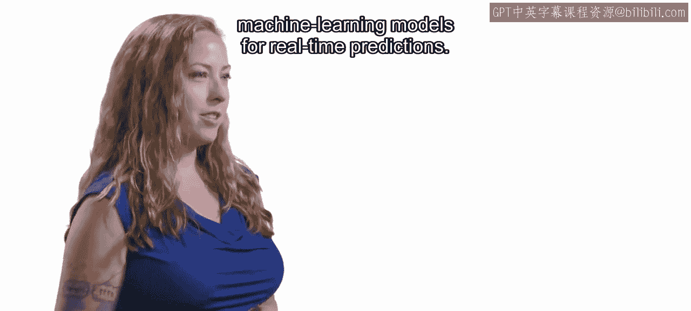

在MathWorks，我的职责是帮助其他人学习如何将机器学习、深度学习和数据科学融入他们的工作。我与开发组织合作，确定我们接下来要构建哪些新的数据科学工具。

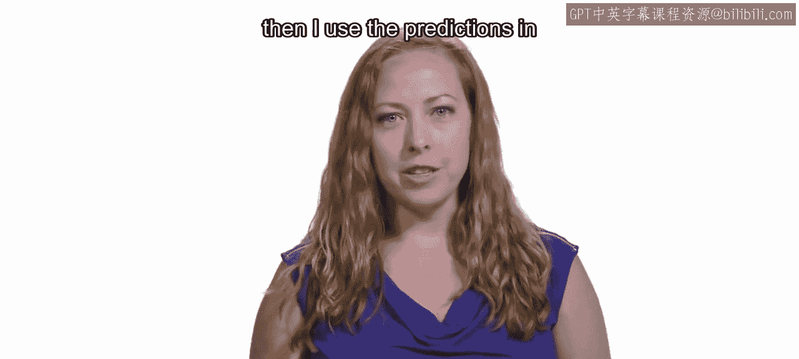

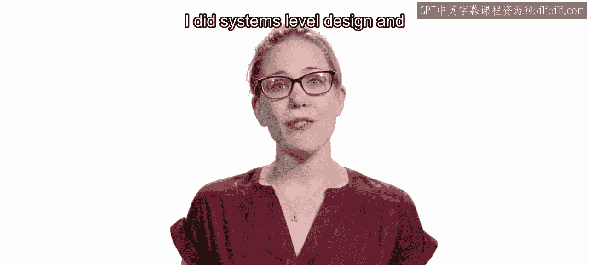

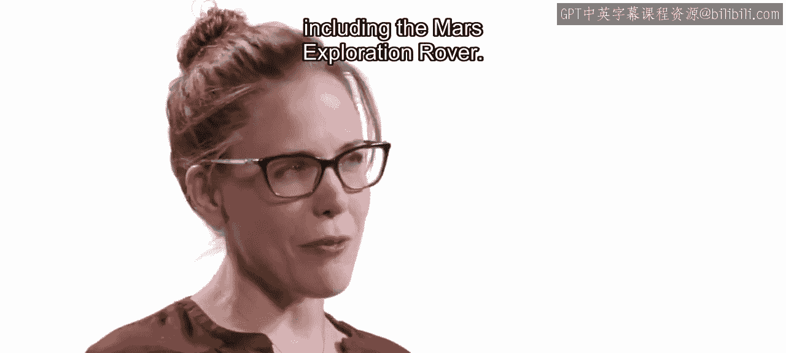

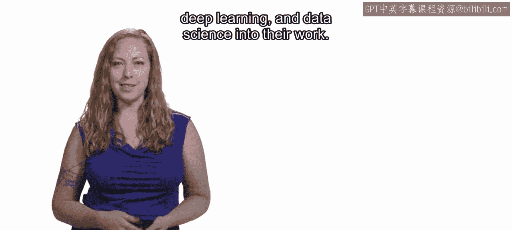

基本上，我的全部工作就是帮助像你这样的人开始并熟练地将MATLAB用于你的应用。我曾经是一名职业摇摆舞者。我是一名音乐家。

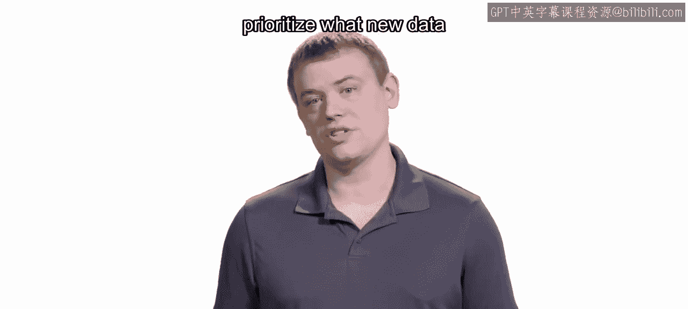

我弹吉他、打鼓，喜欢唱歌和创作音乐。我认为我对音乐的热情确实对我的职业生涯有所帮助，因为我很有创造力，并且能从不同角度思考问题，这在数据科学中很重要。

我开始涉足一些天文摄影。我最喜欢的一张是从邻居家车道上拍摄的猎户座星云照片，因为我家院子里的树挡住了视线。

实际上，我在业余时间也会使用MATLAB，我只是喜欢摆弄数据。我每天早上在查看邮件或做任何事之前，第一件事就是打开MATLAB，在开始一天工作前，我会有一段小小的MATLAB时间。

我非常高兴能在这个系列课程中与大家分享我的一些经验和来之不易的教训。我希望你能看到MATLAB如何帮助像你这样的领域专家在数据科学领域表现出色。

---

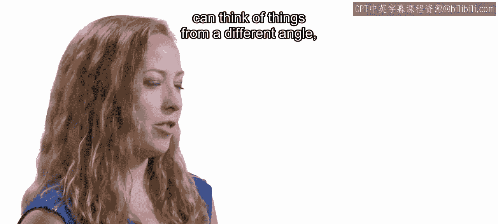

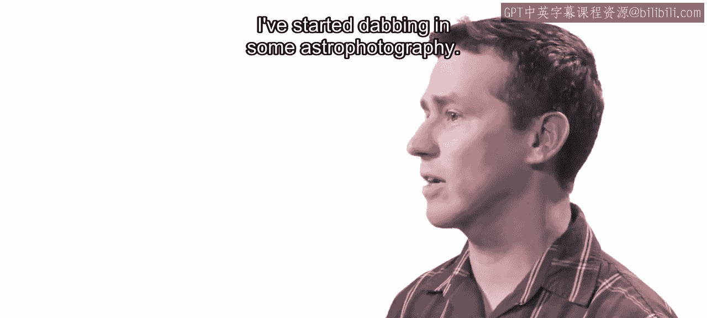

本节课中，我们一起认识了本课程的讲师团队。他们来自MathWorks的不同岗位，拥有工程、物理、数据科学等多元背景，并且都对MATLAB有着长期而深入的使用经验。他们的个人兴趣，如音乐和天文摄影，也展现了创造力与多角度思维，这些正是数据科学领域所需的宝贵特质。在接下来的课程中，他们将带领大家探索MATLAB在数据科学中的强大应用。