2：毕业项目简介 🎯

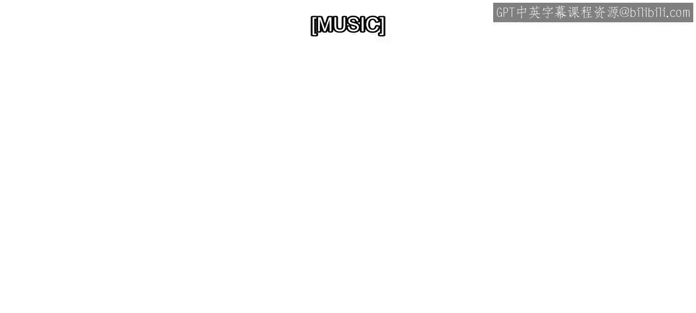

在本节课中，我们将要学习毕业项目的整体框架、核心目标以及具体的工作流程。这个项目旨在综合运用你在本专项课程中学到的所有数据科学技能。

欢迎来到“现实世界中的MATLAB数据科学项目”。你已在本专项课程中学到了许多新技能。完成这个毕业项目是一个既能实践又能展示所学知识的机会。

与真实世界的项目一样，毕业项目有明确的目标，但没有唯一正确的答案或方法。作为数据科学家，你的工作是应用机器学习工作流程。

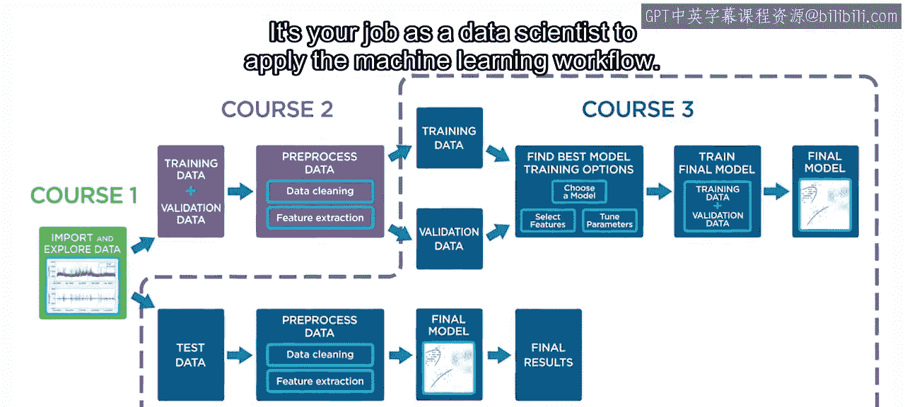

上一节我们介绍了项目的目标，本节中我们来看看项目的具体任务。你将探索数据，决定如何预处理数据，并训练最终的机器学习模型。

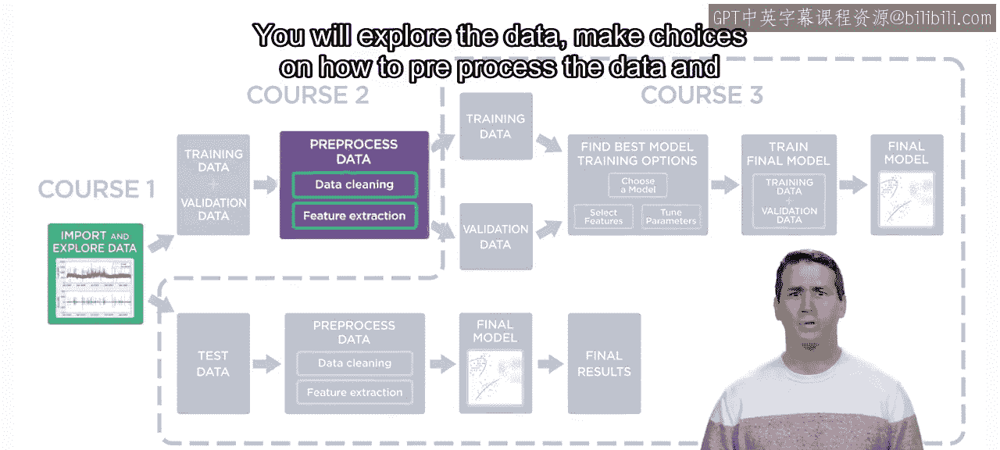

你将再次使用在课程3中使用过的出租车数据。这次，你的目标是将预测出租车需求作为一个分类问题来处理，并且需要创建六个自定义区域来进行预测。

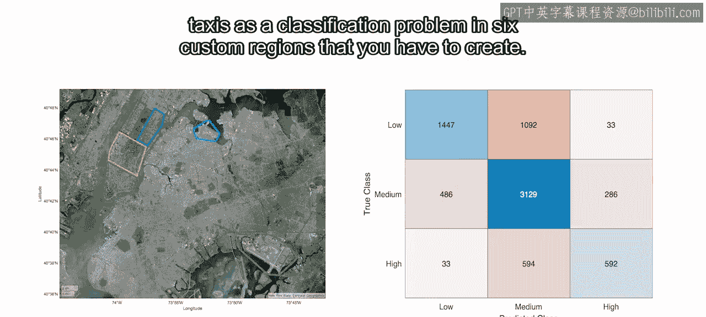

以下是项目的主要步骤：
1.  从包含单次出租车行程信息的原始数据开始。
2.  将其转换为一个汇总每个区域每小时行程数量的表格。
3.  为需求设计一个响应变量，并为预测该响应设计特征。
4.  在准备好数据并评估特征后，开始尝试不同的机器学习模型来预测出租车需求。

根据你的结果，可能需要迭代回到前面的步骤。这是数据科学工作流程中预期的一部分。

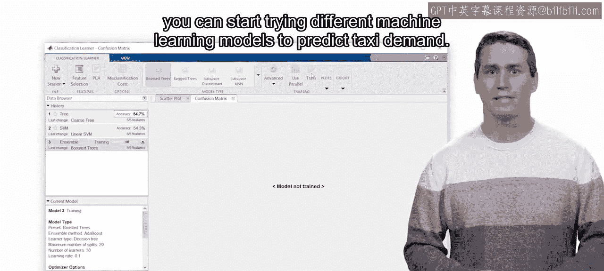

在探索数据和尝试不同方法的过程中，你将获得能改进结果的新见解。

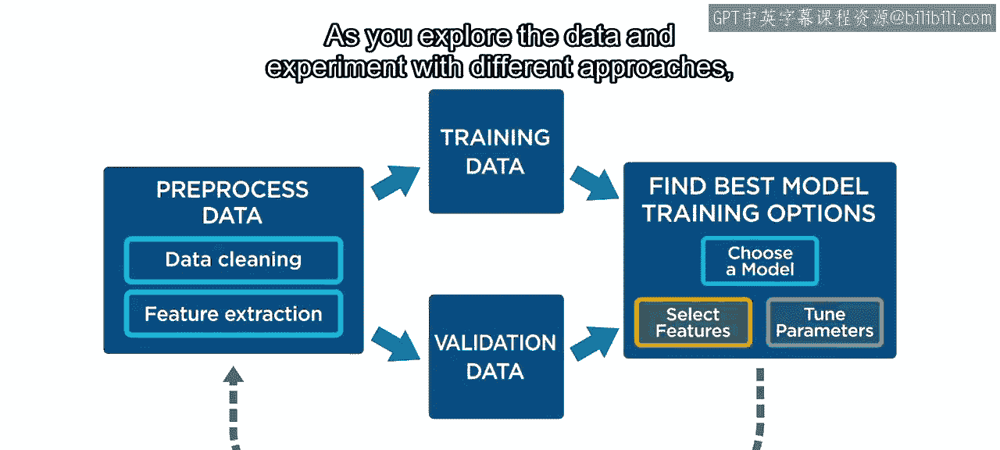

一旦创建并评估了最终模型，你将创建一份数据科学报告与同行分享。这是一个为技术受众撰写报告的练习机会。

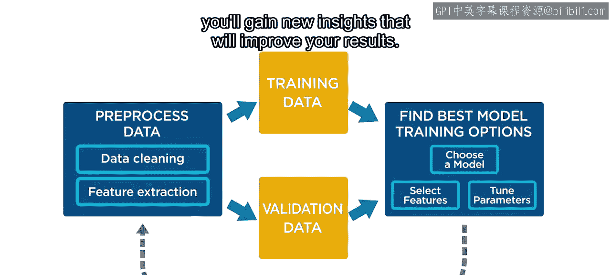

通常，你的最终听众并非其他数据科学家。例如，你可能需要说服业务团队基于你的结果尝试新方法。

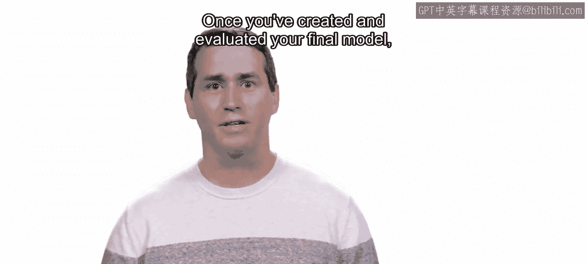

有效的沟通能增加你的数据科学工作产生有意义影响的可能性。

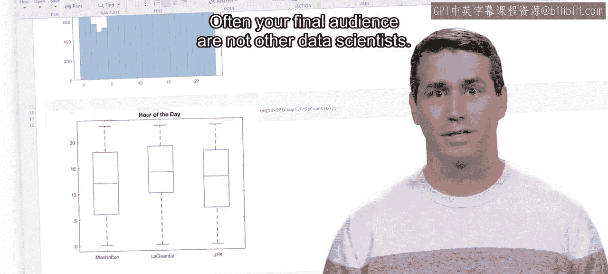

你已具备完成项目所需的所有技能。为指导你，主要任务被分为四个模块。每个模块都包含列出你需要完成任务的阅读材料。如果你需要复习，还能找到提示和指向之前课程关键概念的链接。

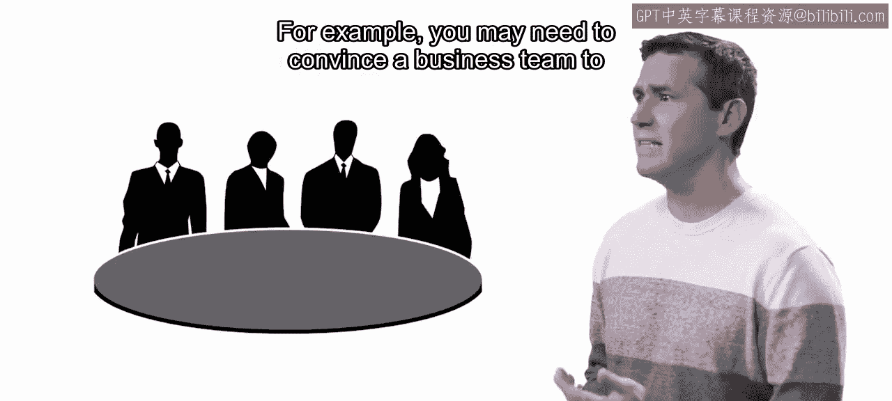

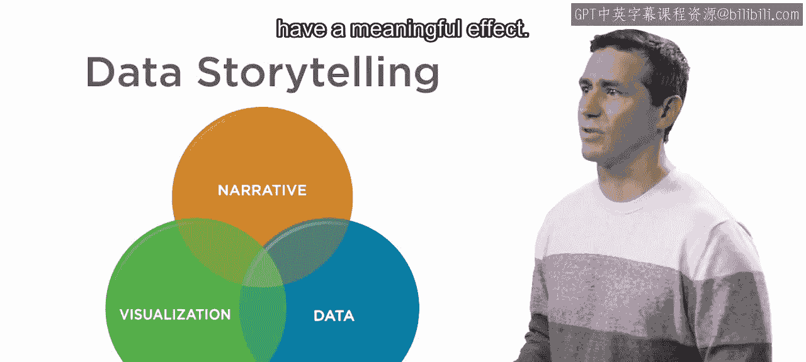

在进行项目时，请使用讨论论坛提问和分享想法。

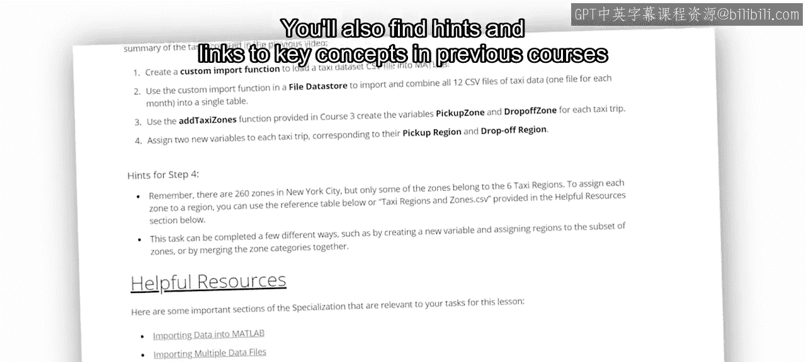

课程结束时，你将拥有自己独特的解决方案和分析与他人分享。

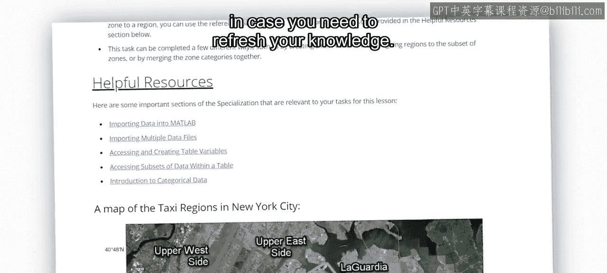

那么，让我们开始吧。

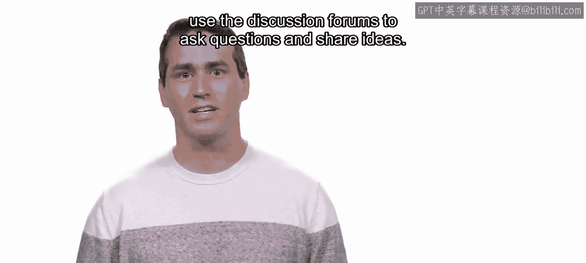

本节课中我们一起学习了毕业项目的概况。我们明确了项目目标是预测出租车需求，了解了从数据探索、预处理、特征工程到模型训练与评估的完整工作流程，并认识到沟通与迭代在数据科学项目中的重要性。现在，你已经准备好开启自己的数据科学实践之旅了。