3.1：创建出租车区域

在本节课中，我们将学习毕业项目的核心任务：预测纽约市特定区域的出租车需求高低。原始出租车数据集仅包含单次行程记录，为了分析区域需求，我们需要创建一个新的汇总表，统计每小时每个区域的乘客上车和下车数量。

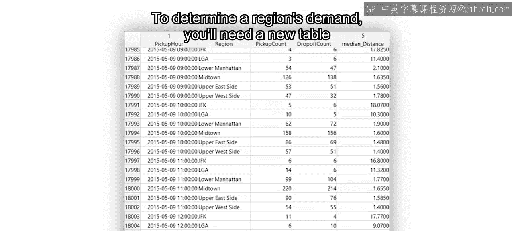

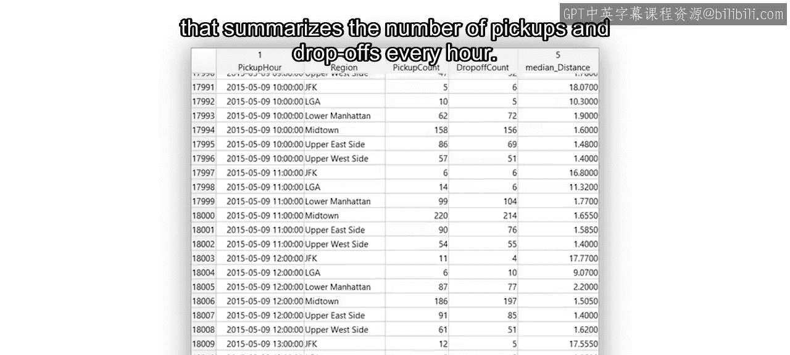

上一节我们介绍了项目的总体目标，本节中我们来看看如何从原始数据构建这个关键的汇总表。整个过程分为两个主要步骤，本节课将专注于第一步：导入原始出租车数据，并为每次行程分配其对应的上车和下车区域。

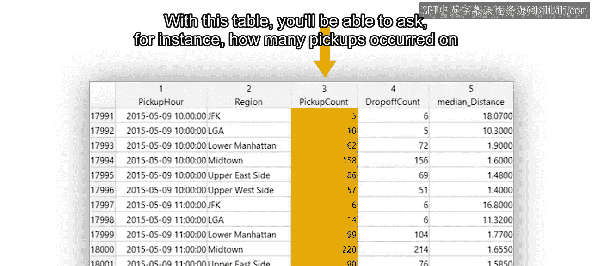

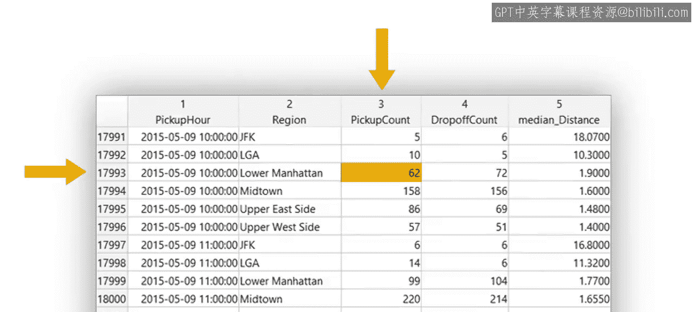

首先，我们需要访问存储在CSV文件中的数据。出租车数据按月被分成了12个独立的文件。

为了提高效率并确保过程可重复，我们将通过创建一个导入函数来自动化数据读取过程。以下是处理多个数据文件的推荐方法：

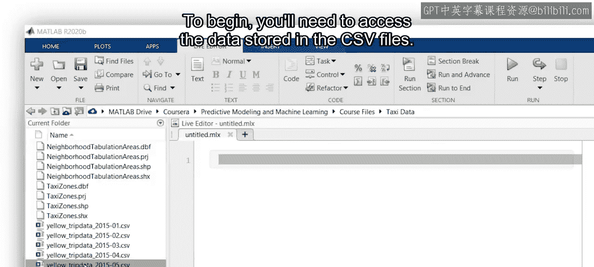

*   使用 **文件数据存储** 来批量导入所需的所有文件，而无需单独加载每一个。

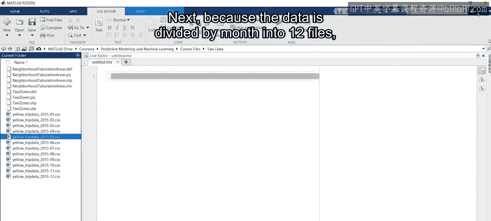

一旦出租车数据被加载到MATLAB工作区，下一步就是为每次行程分配上车和下车区域。课程提供的 `AddTaxiZones` 函数将协助完成此任务。

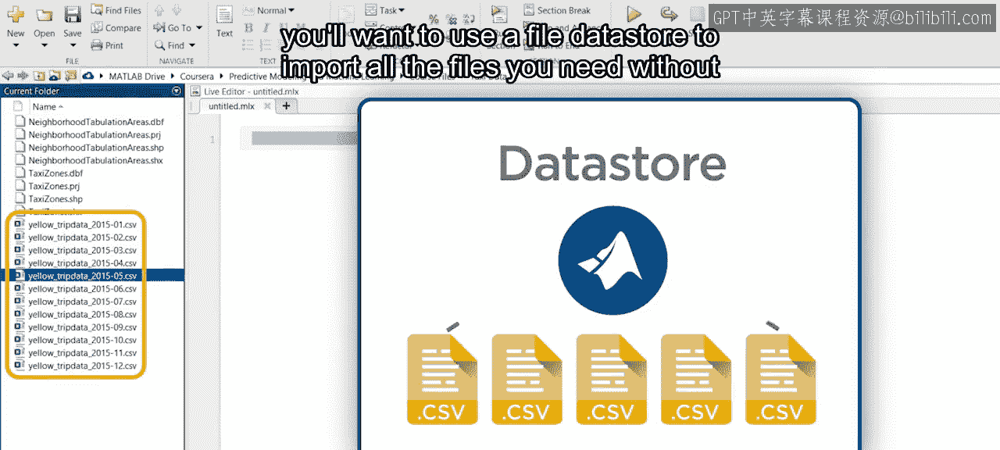

纽约市共划分为260个出租车区域，而我们需要创建的6个分析区域则由这些基本区域组合而成。例如：

*   **上西区** 区域由这6个基本区域组成。
*   **肯尼迪机场** 区域则仅包含肯尼迪机场这一个基本区域。

在为数据表添加上车和下车的基本区域信息后，我们需要确定这些基本区域分别属于哪个更大的分析区域。以下阅读材料中提供的CSV文件包含了这一映射信息。

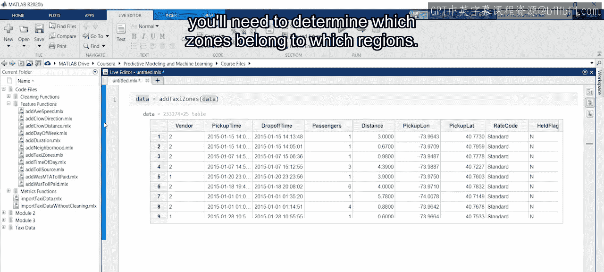

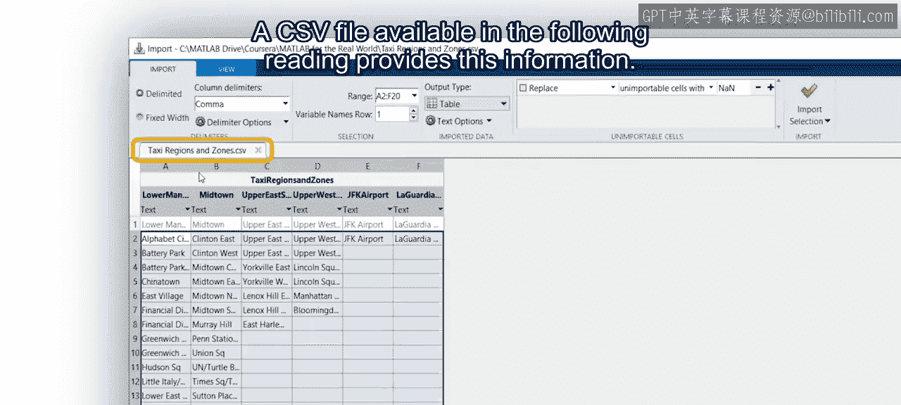

完成上述任务后，我们将得到一个包含整个出租车数据集的新表，其中新增了两个变量，分别代表每次行程的上车区域和下车区域。

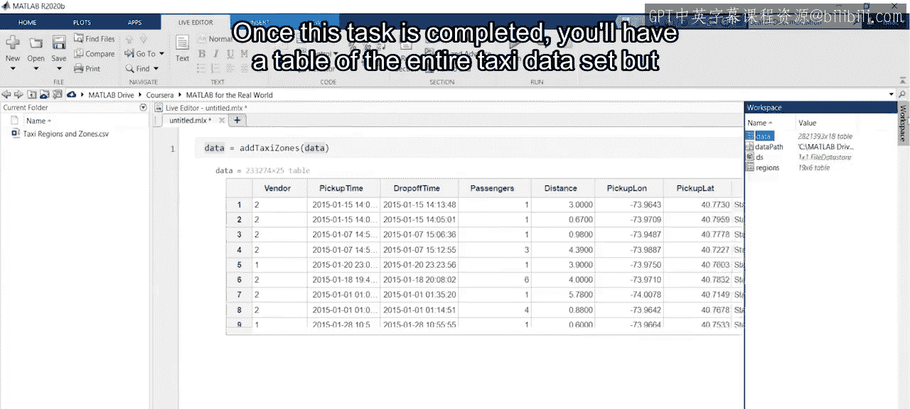

接下来，我们将利用这些新的区域变量对数据进行探索。为了完成本模块的所有任务，我们将综合运用在整个专项课程中学到的多种技术。

为了便于您回顾，以下阅读材料总结了本视频内容，并提供了指向前期课程中有用章节的链接。

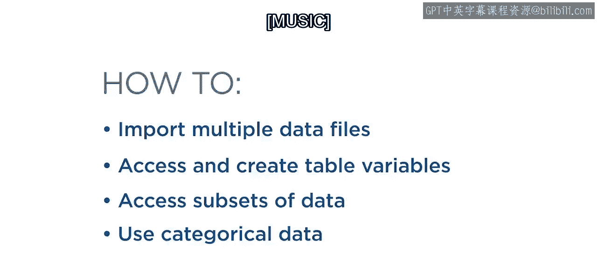

本节课中我们一起学习了如何导入原始出租车数据，并通过添加区域信息为后续的需求分析做好准备。下一课，我们将基于此数据创建最终的每小时区域需求汇总表。