模块2：特征工程工作流程介绍 🛠️

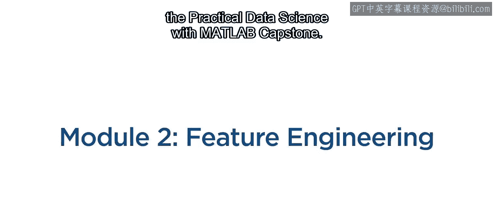

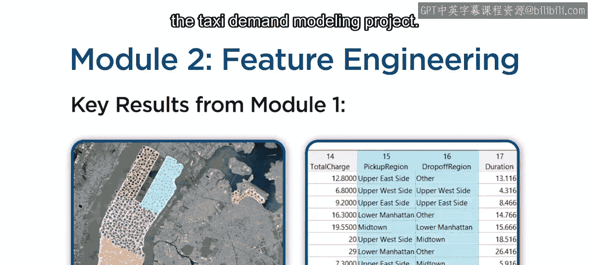

在本模块中，我们将从数据分析过渡到特征工程，为后续的机器学习建模准备数据。

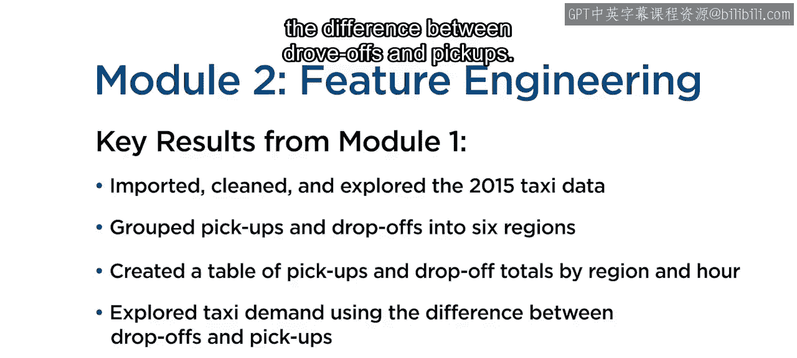

上一模块中，我们介绍了出租车需求建模项目，并完成了数据导入、清洗、探索以及区域分组等关键任务。本节中，我们将重点学习特征工程的核心工作流程。

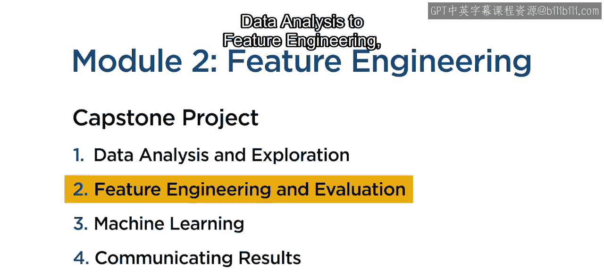

特征工程是机器学习工作流中的重要环节。其核心目标是通过创建和选择有效的特征，提升模型的预测能力。以下是特征工程工作流程的关键步骤。

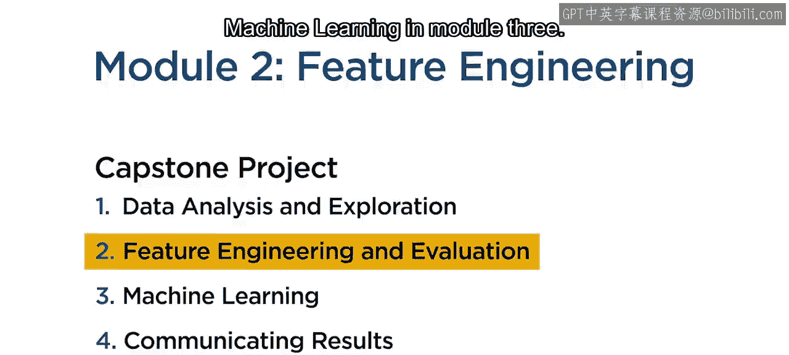

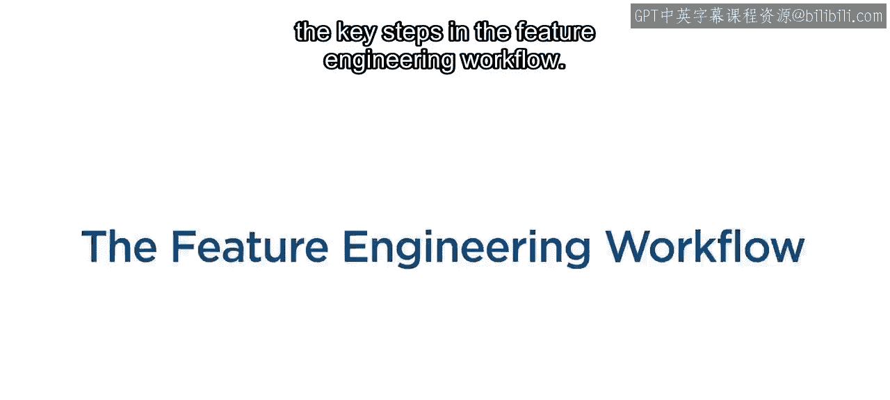

首先，需要将数据划分为训练集和测试集。这一步至关重要，因为它能帮助我们在后续阶段更准确地评估模型性能。在MATLAB中，可以使用 `cvpartition` 函数来实现。

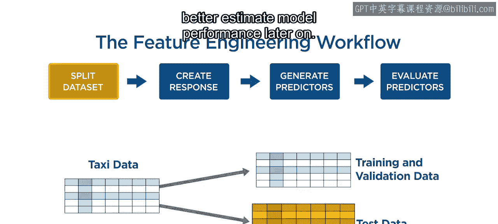

```matlab
% 示例：按比例划分数据
cv = cvpartition(N, 'HoldOut', 0.3); % 保留30%数据作为测试集
idxTrain = training(cv);
idxTest = test(cv);
```

接下来，需要创建机器学习模型的**响应变量**。响应变量可以是原始变量、经过处理的变量，或是多个变量的函数。其选择完全取决于你试图解决的具体问题。

然后，可以生成**预测特征**。与响应变量类似，预测特征可以基于一个或多个变量创建，可以经过处理，也可以不处理。特征的数量仅受可用数据和创造力的限制。

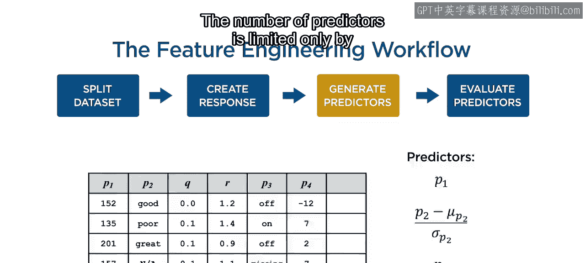

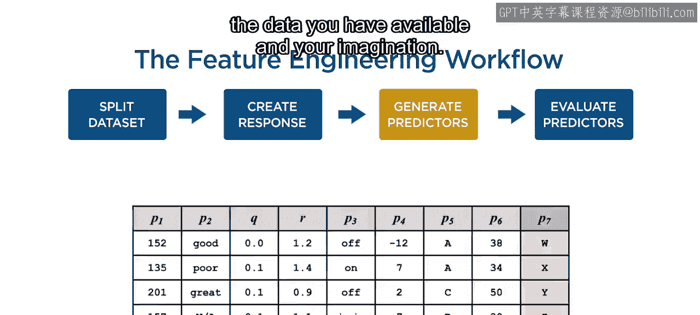

然而，创建的特征只有在能为模型增加预测能力时才有价值。这就引出了工作流程的最后一步：**评估**。

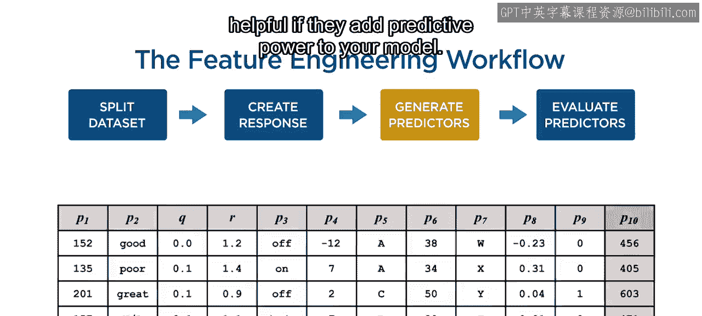

在评估阶段，你需要结合可视化与统计方法，来理解预测特征与响应变量之间的关系。例如，可以计算相关系数或绘制散点图矩阵。

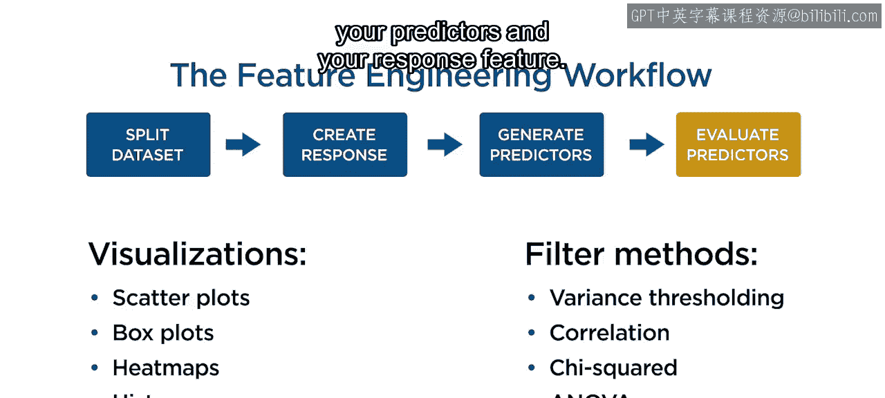

```matlab
% 示例：计算相关系数
correlationMatrix = corr([predictors, response]);
```

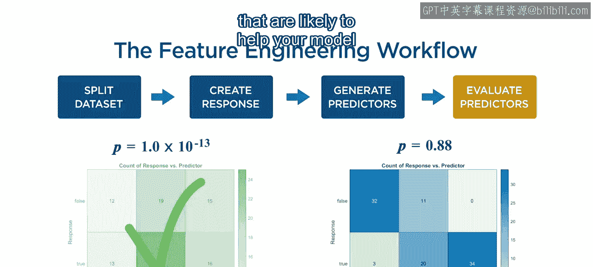

理解这些关系有助于你识别可能对模型有帮助的特征，并剔除无效的特征。同时，这也能启发你设计新的特征、改进现有特征，并在训练模型前发现并解决潜在问题。

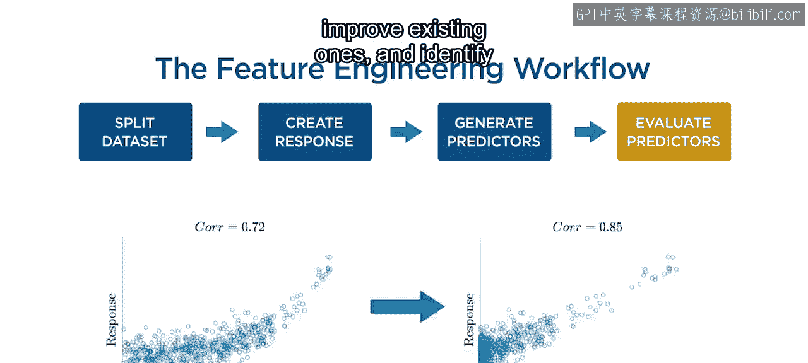

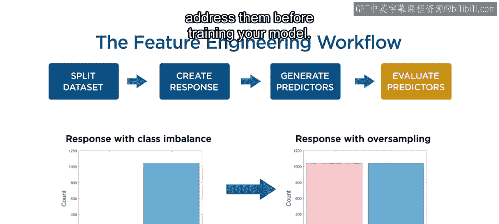

现在，是时候开始动手实践了。接下来，你将获得一系列任务清单和资源，以帮助你构建自己的特征集。

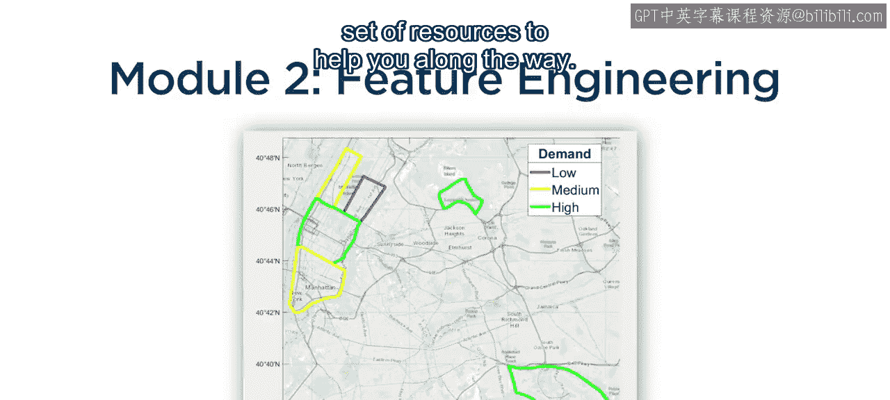

本节课中，我们一起学习了特征工程的标准工作流程，包括数据划分、响应变量与预测特征的创建，以及通过评估筛选有效特征。掌握这些步骤，将为你在下一个模块中成功构建机器学习模型奠定坚实基础。