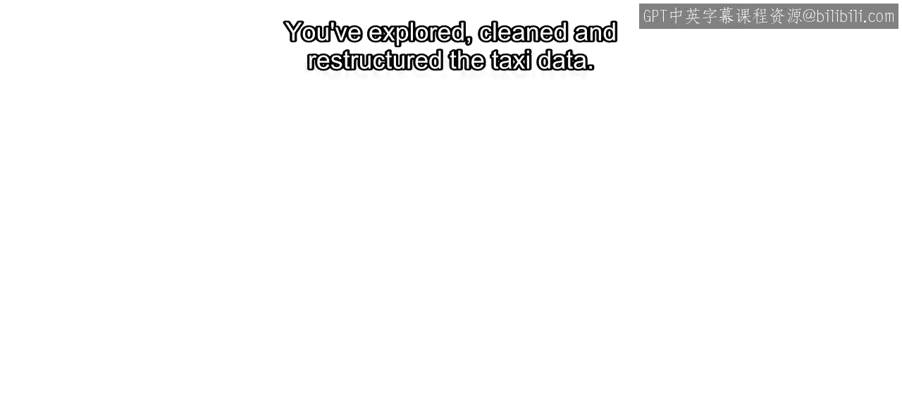
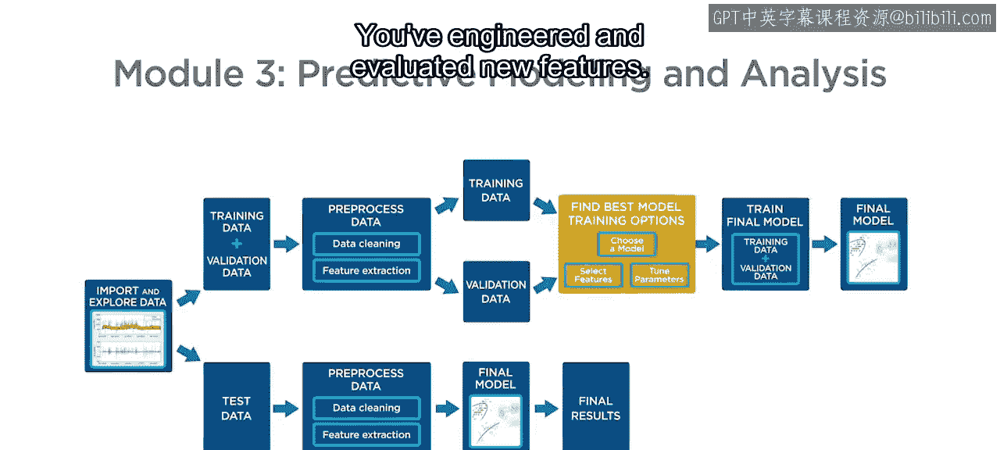
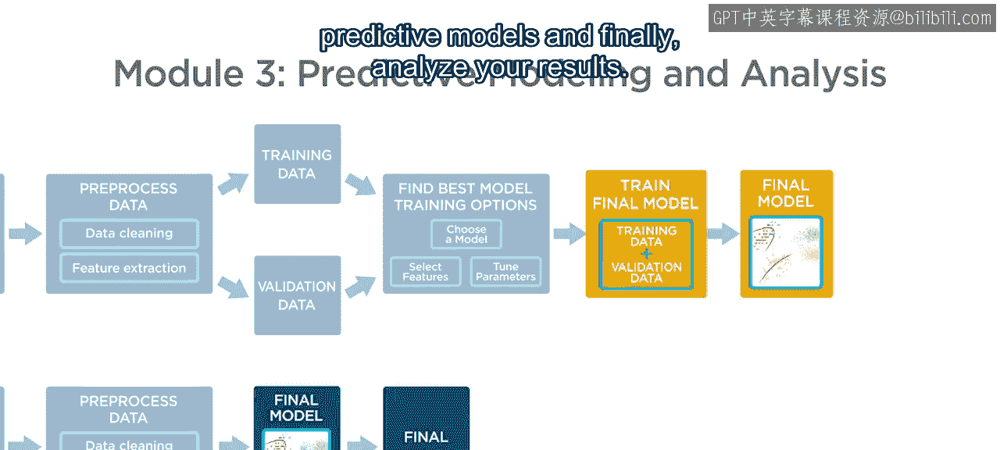
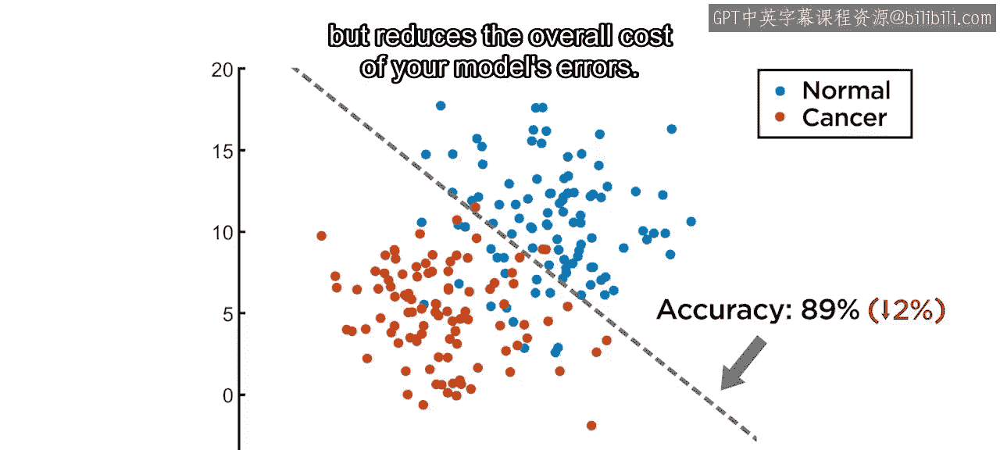
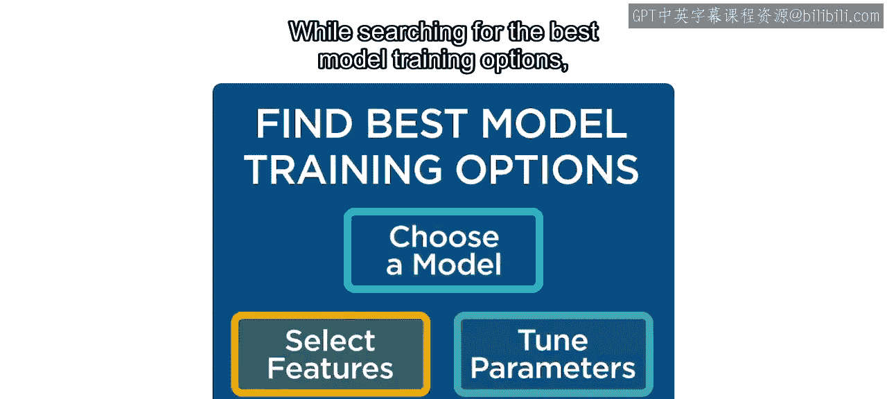
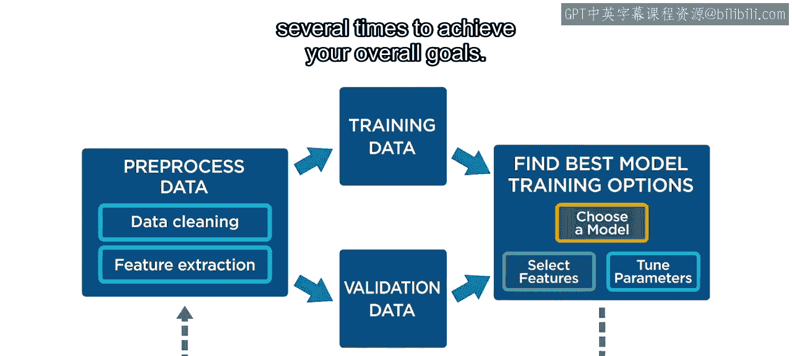
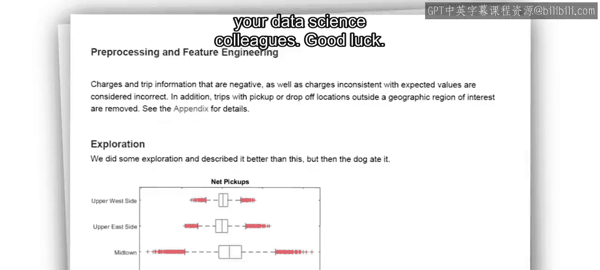

模块3：模型训练与结果分析

在本模块中，我们将学习如何训练预测模型，并最终分析结果。我们将使用之前已准备和分析好的纽约市出租车数据，来预测未来一小时内各区域的出租车需求量等级。

---

上一节我们完成了数据的探索、清洗、重构以及特征工程与评估。本节中，我们来看看如何训练预测模型。

具体而言，我们将对纽约市各区域未来一小时内的出租车需求量进行分类，等级分为**高**、**中**、**低**三类。

---

首先，我们将平等对待每个类别。我们会尝试不同的模型类型，优化超参数，并测试不同的特征组合，目标是找到具有最高**整体准确率**的模型。

**整体准确率**的公式可以表示为：
`准确率 = (正确预测的样本数) / (总样本数)`

---

然而，在实际业务场景中，某些分类错误可能比其他错误代价更高。因此，接下来我们将处理一个更详细的场景，即根据现实世界的行为和业务关切，优先考虑减少某些特定的分类错误。

训练分类模型时，通常需要综合考虑多种性能指标及其之间的权衡。例如，如果降低某个类别（如“高需求”）的**假阴性率**比降低其他错误更重要，我们就需要在建模中着重优化这一点。

这可能会导致整体准确率下降，但能降低模型错误的总体成本。**假阴性率**的计算公式为：
`假阴性率 = (实际为真但预测为假的样本数) / (实际为真的总样本数)`

---

在寻找最佳模型训练选项的过程中，您可能会发现，为了达成总体目标，需要在工作流程的各个步骤之间进行多次迭代。

以下是模型开发中常见的迭代步骤：
1.  **选择模型类型**：例如决策树、支持向量机或集成方法。
2.  **调整超参数**：使用如网格搜索或随机搜索的方法优化模型参数。
3.  **评估特征重要性**：分析哪些特征对预测贡献最大，可能进行特征增删。
4.  **验证性能**：在独立的测试集上评估模型，使用准确率、召回率、F1分数等指标。

---

一旦完成建模，您需要创建一份正式的结果与分析报告，供您的数据科学同事审阅。

---

本节课中我们一起学习了模型训练的核心流程：从以整体准确率为目标的初步建模，到根据业务需求调整优化重点，并理解了模型开发是一个需要多次迭代的过程。最后，我们明确了以正式报告形式呈现分析结果的重要性。

祝您好运。