# 9：课程总结 🎉

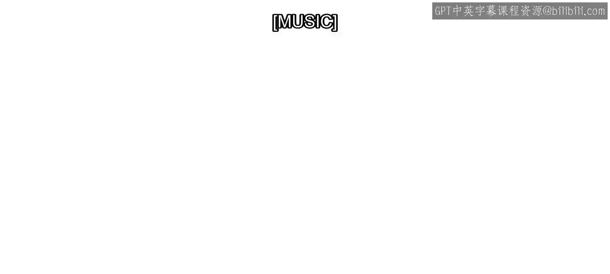

在本节课中，我们将回顾整个《实用数据科学与MATLAB》专项课程的核心内容与学习旅程，总结从数据探索到毕业项目所掌握的关键技能。

---

恭喜你完成了毕业项目。数据科学技术已在众多应用领域变得至关重要，包括自动驾驶系统、电力生产、医疗诊断、活动追踪等等。

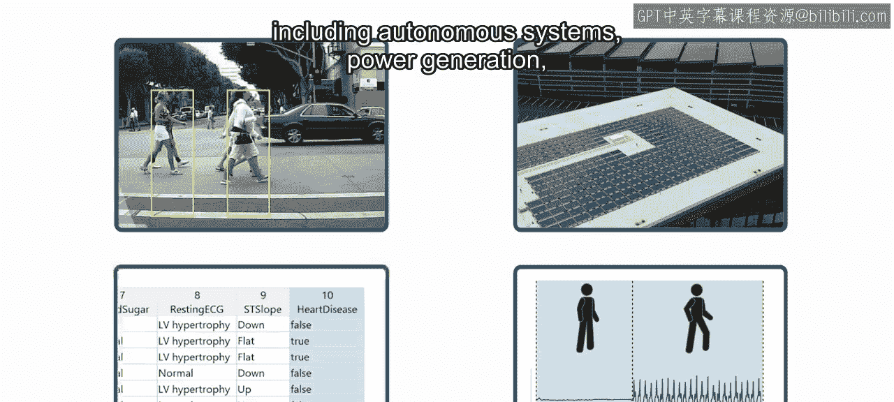

跨学科领域，海量数据既是挑战，也是机遇。通过学习如何应用数据科学实践，你已做好准备，迎接挑战并抓住机遇，无论是在当下还是整个职业生涯中。

---

### 数据探索与分析

你从探索和分析数据开始，这通常颇具挑战性。在第一门课程中，你学习了如何导入、可视化和筛选数据，以便快速获得关键洞察。

你还学习了如何计算分组汇总统计量，并发现变量之间的相关性，这有助于你更好地理解数据。

然而，当数据包含大量噪声、缺失值或异常值时，理解数据会变得困难。

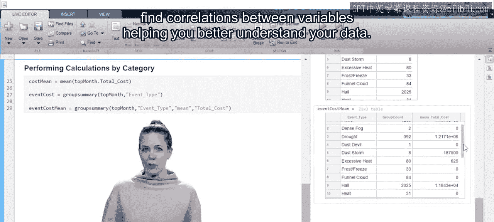

---

### 数据预处理与特征工程

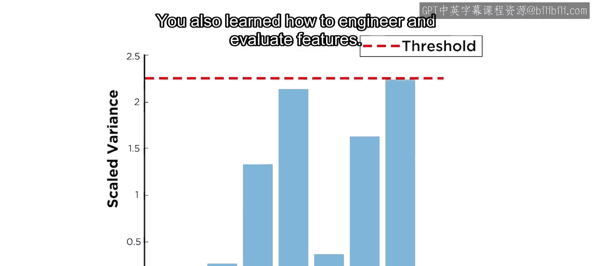

现在，你可以运用在第二门课程中学到的技能，高效地预处理数据。你还学习了如何设计和评估特征。

有用的特征通过提高训练速度和模型准确性来助力机器学习。它们也能让你的机器学习结果更易于解释。

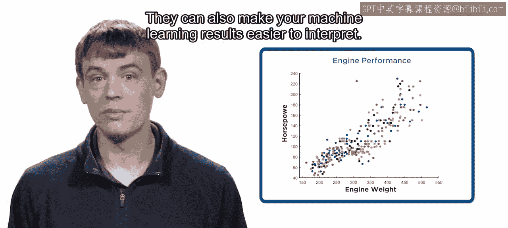

---

### 机器学习入门与应用

刚开始接触机器学习可能令人望而生畏，但凭借在第三门课程中学到的技能，你已经准备好迎接挑战。

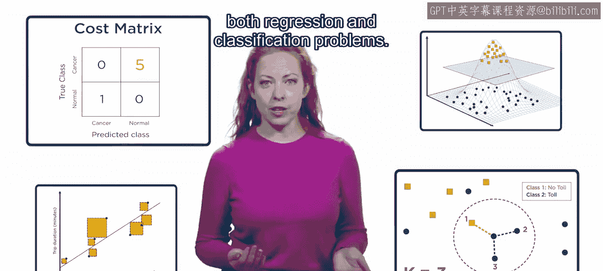

你学习了如何将多种方法应用于回归和分类问题。

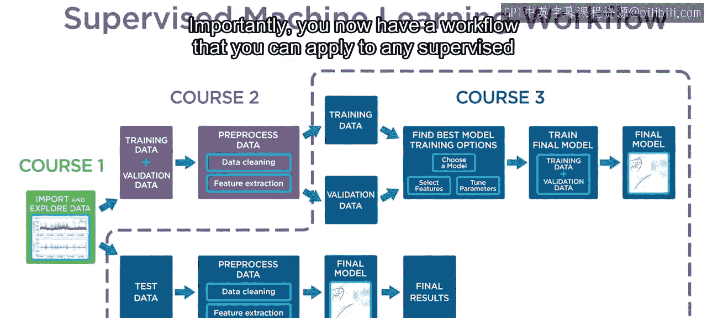

重要的是，你现在拥有一个可以应用于任何监督式机器学习项目的工作流程。

---

### 毕业项目实践

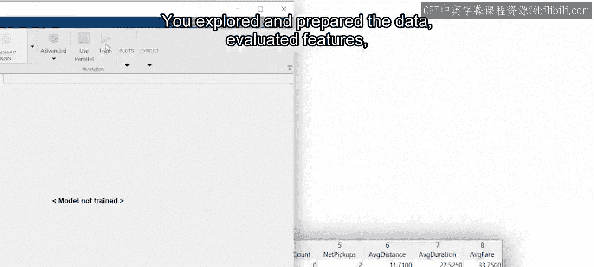

在大多数数据科学应用中，并不存在唯一正确的答案。你在毕业项目中运用了前三门课程所学的知识，处理了这样一个场景。

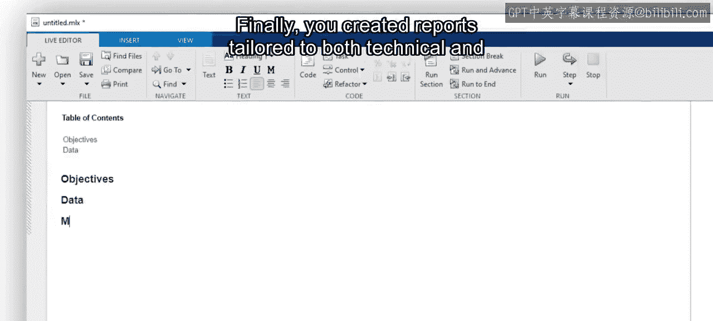

以下是你在项目中完成的关键步骤：
*   探索并准备数据。
*   评估特征。
*   创建机器学习模型并评估结果。

最后，你创建了面向技术与非技术受众的定制化报告。这是一项关键技能，能确保你的发现可用于推动有意义的变革。

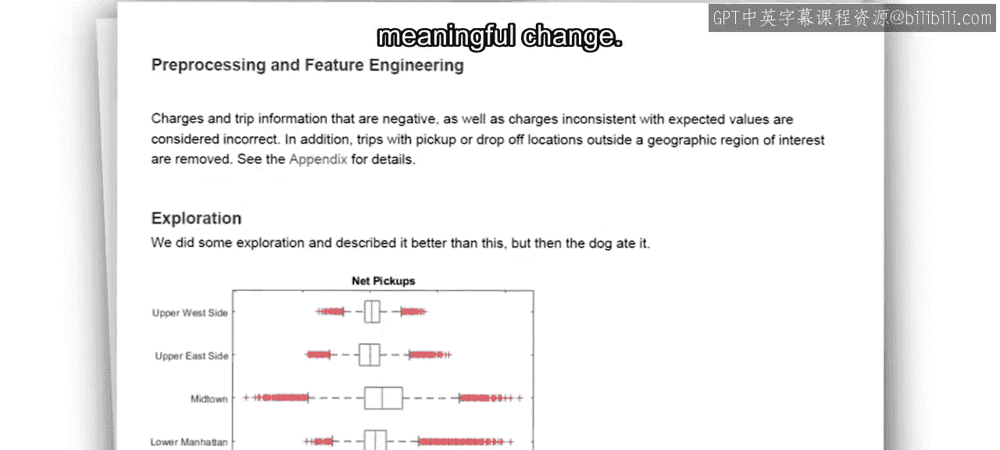

---

### 应用所学与展望未来

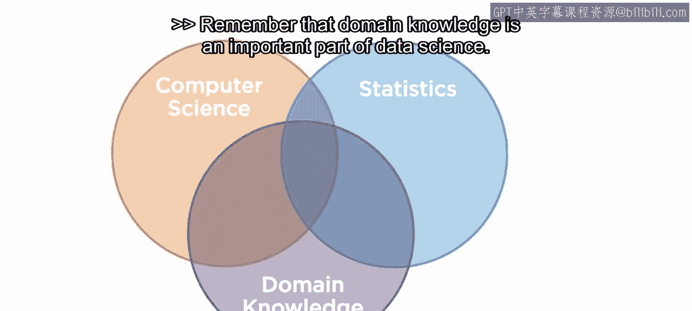

现在，是时候开始将本专项课程中学到的技能应用到你的工作中了。请记住，领域知识是数据科学的重要组成部分。

你所执行的分析不仅取决于数据，还取决于你试图回答的问题。你为机器学习模型使用和创建的特征，将取决于你试图预测的响应变量。你构建的模型类型不仅取决于数据，还取决于你的目标。

当你开始使用MATLAB处理自己的项目时，请牢记这一点。我们相信你已经具备了成功的技能。祝你好运！

---

在本节课中，我们一起回顾了整个数据科学工作流程：从数据导入、探索、预处理、特征工程，到构建与评估机器学习模型，最终完成毕业项目并生成报告。你已掌握了一套系统的方法，可以自信地运用MATLAB解决现实世界的数据科学问题。