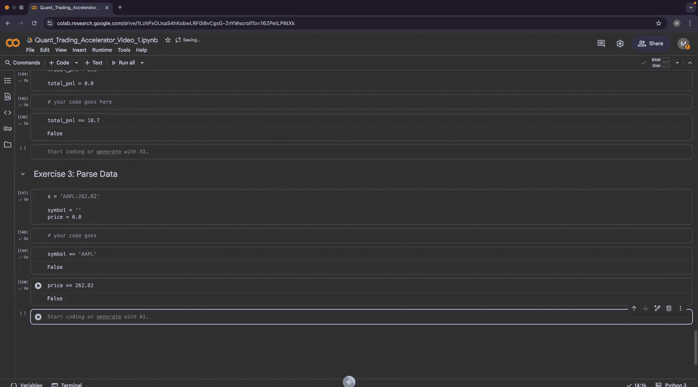

#  001：变量 🚀

在本节课中，我们将开始学习量化交易的基础知识，并动手编写代码。我们将从最核心的概念——变量开始，了解如何在程序中存储和操作数据。

## 课程概述

本课程名为“量化交易加速器”，旨在通过实践构建项目的方式，快速学习量化交易的核心技能。学习过程就像吉他手通过弹奏来学习吉他一样，我们将通过编写代码来学习编程和数学。

学习本课程的唯一前提是**求知欲**。你不需要具备任何数学或编程经验，只需对事物的工作原理充满好奇。

### 什么是量化交易？

量化交易与其他交易形式的区别在于它基于**模型**。模型接收输入，对未来做出预测（也称为预测），然后将该预测传递给策略。策略将预测转换为交易指令，最后这些指令在经纪商平台或交易所上执行。

### 课程目标

本课程有四个主要目标：
1.  培养研究技能，能够构建和测试你自己的交易想法，并将其量化。
2.  具备开发和回测你自己的模型和策略的能力。
3.  能够将所有代码整合并实现自动化。

### 我们将构建什么？

因为我们通过构建来学习，所以我们将一起构建几个项目：
*   **数据分析库**：我们将从头构建一个数据分析库。这能让我们在理解`pandas`等库背后原理的同时，学习编程和数学。
*   **研究库**：在具备一定编程和数学基础后，我们将构建研究库，用于测试想法和创建模型。
*   **模型与策略**：我们将构建并回测一个机器学习模型，并基于该模型构建交易策略。

### 核心技能

本课程涵盖四项核心技能：
*   **编程与数学**：这是基础，将在前两个项目中重点学习。
*   **计量经济学与机器学习**：深入理解这两项将使你具备强大的分析能力。

### 课程安排

我们将使用 **Google Colab** 在线环境，你只需一个浏览器即可开始，无需本地安装。视频时长约20分钟，便于学习。学习过程是**渐进式**和**即时性**的，我们只学习构建当前项目所需的知识，并逐步深入。

**重要提示**：请不要跳过视频，因为每一节都建立在前一节的基础上。请务必完成练习，只有动手构建才能真正学会。如果在学习中有任何不清楚的地方，请在评论区留言。

---

## 第一课：变量

现在，让我们开始第一课的实际内容。第一部分我们将学习**变量**。

在深入讲解变量之前，我们先简单了解一下这个笔记本（Notebook）是如何工作的。例如，这里有一段用于数字相加的Python代码。你可以通过点击运行按钮或按`Shift+Enter`来执行代码，执行结果会显示在下方。

### 创建与使用变量

要创建一个变量，你需要给它起一个有意义的名称。例如，如果你想表示价格，可以这样写：
```python
price = 10
```
这行代码将值`10`**赋值**给变量`price`。

如果你想打印出这个变量的值，可以这样做：
```python
print(price)
```

如果你想更新这个变量，例如价格上涨了0.5美元，可以这样操作：
```python
price = price + 0.5
print(price)
```
这行代码的意思是：`price`的新值等于当前值（10）加上0.5。现在打印`price`，结果是`10.5`。

我们还可以基于现有变量创建新变量。例如：
```python
old_price = price - 0.5
print(old_price)
print(price)
```
这里，`old_price`被赋值为当前`price`（10.5）减去0.5，结果是`10.0`。而原始的`price`变量值仍然是`10.5`。

### 变量的内存引用

这是一个非常重要的概念。请看下面的例子：
```python
price = 10
new_price = price  # 此时 new_price 也是 10
price = 11         # 更新 price 的值
print(new_price)   # new_price 的值是多少？
```
运行后你会发现，`new_price`的值是`10`，而不是`11`。

关键原因在于：当执行`new_price = price`时，是将`price`当时的值（10）复制给了`new_price`。随后`price = 11`是为`price`变量分配了新的内存来存储`11`，但这并不会影响`new_price`已经存储的值（10）。如果它们指向同一块内存，那么`new_price`也会变成11。我们将在后续关于数组的视频中看到指向同一内存的情况，但对于数字这类基本数据类型，赋值操作是值的复制。

现在打印`price`，可以看到它确实是`11`。如果目前对此不太理解也不用担心，随着后续的构建实践，这会变得更加直观。

---

## 数字数据类型

数字是最基本的数据类型之一。Python中有一个`type()`函数，可以查看变量的数据类型。

让我们看看`price`的数据类型：
```python
print(type(price))
```
结果显示是`float`（浮点数）。浮点数用于表示实数，可以是整数，也可以是带小数点的数。

还有另一种表示数字的数据类型叫`int`（整数），它代表没有小数部分的整数。例如，交易次数不可能是0.1或0.2次，只能是整数。
```python
number_of_trades = 100
print(type(number_of_trades)) # 输出：<class 'int'>
```

### 类型转换

我们可以进行类型转换。例如，将整数转换为浮点数：
```python
number_of_trades = float(number_of_trades)
print(type(number_of_trades)) # 输出：<class 'float'>
print(number_of_trades)       # 输出：100.0
```
虽然值看起来还是100，但末尾的`.0`表明它现在是一个浮点数。

反过来，将浮点数转换为整数时，**小数部分会被丢弃**，需要特别注意：
```python
price_int = int(price) # price 是 11
print(price_int)       # 输出：11
# 如果 price 是 11.7
price2 = 11.7
print(int(price2))     # 输出：11
```

在实际数据中，价格等信息可能以字符串形式从CSV文件或API中获取，我们需要将其转换为数字：
```python
price_str = "150.25"
price_float = float(price_str)
print(type(price_float), price_float) # 输出：<class 'float'> 150.25
```

---

## 算术运算

接下来我们看看算术运算。我们可以直接对数值进行运算：
```python
result = 3 + 3 * 3
print(result) # 输出：12
```
这里的结果是12，而不是18。这是因为运算符有**优先级**，乘法`*`的优先级高于加法`+`。所以表达式`3 + 3 * 3`等价于`3 + (3 * 3)`。

如果你想强制先执行加法，需要使用括号`()`：
```python
result = (3 + 3) * 3
print(result) # 输出：18
```

我们也可以在变量上进行算术运算，而不仅仅是字面值。例如，计算价格上涨5%：
```python
price = 100
price_increase = price * 1.05
print(price_increase) # 输出：105.0
```
计算价格下跌10%：
```python
price_decrease = price * 0.90
print(price_decrease) # 输出：90.0
```

---

## 字符串

数字很重要，但**字符串**同样重要，尤其是在我们从CSV文件加载数据时，数据通常以字符串形式出现。

字符串是文本数据。例如，交易品种的代码（Symbol）通常用字符串表示：
```python
symbol = "GOOG"
print(symbol)
print(type(symbol)) # 输出：<class 'str'>
```

### 字符串拼接

一个非常常见的操作是**字符串拼接**，即将两个字符串连接起来。这常用于为数据列添加前缀或后缀。
```python
# 添加后缀
column_name = symbol + "_price"
print(column_name) # 输出：GOOG_price

# 添加前缀
column_name2 = "price_" + symbol
print(column_name2) # 输出：price_GOOG
```

### 字符串替换

另一个常见操作是替换字符串中的部分内容。例如，将下划线`_`替换为连字符`-`：
```python
new_column_name = column_name.replace("_", "-")
print(new_column_name) # 输出：GOOG-price
print(column_name)     # 输出：GOOG_price (原始变量未改变)
```
**关键细节**：`replace`操作不会改变原始字符串（字符串是**不可变**的），而是生成一个新的字符串。如果你想保存修改后的结果，需要将其赋值给一个（新）变量。
```python
column_name = column_name.replace("_", "-")
print(column_name) # 输出：GOOG-price (现在原始变量已更新)
```

### 字符串分割

我们还可以根据特定分隔符来分割字符串，这会得到一个列表（数组）：
```python
tokens = column_name.split("-") # 按 "-" 分割
print(tokens) # 输出：['GOOG', 'price']
```
`tokens`现在是一个包含两个元素的列表。我们可以通过索引来访问各个部分（索引从0开始）：
```python
print(tokens[0]) # 输出：GOOG
print(tokens[1]) # 输出：price
```
分割操作的底层逻辑大致是：找到分隔符的位置（索引），然后根据索引提取子字符串。

### 字符串格式化

当我们需要将变量值嵌入到一段文本中时，字符串格式化非常有用。例如：
```python
price = 11
# 方法1：拼接，但需要手动转换类型
message = symbol + " price is " + str(price)
print(message)

# 方法2（更简洁）：使用 f-string (格式化字符串)
message2 = f"{symbol} price is {price}"
print(message2)
```
`f-string`（在字符串前加`f`）会自动将变量格式化为字符串，是更清晰、更推荐的方式。

---

## 练习

现在，我们通过练习来巩固所学知识。请完成以下练习，确保每个测试条件都为`True`后再继续。

### 练习 1：计算价格变化

计算今日价格与昨日价格之间的差值（Delta）。
```python
# 给定数据
price_today = 100
price_yesterday = 90
price_delta = 0  # 请在此行下方编写你的代码，计算价格变化

# 你的代码写在这里
price_delta = price_today - price_yesterday

# 测试
print(price_delta == 10) # 如果计算正确，应输出 True
```

### 练习 2：计算总盈亏

给定一系列交易的盈亏，计算总盈亏（P&L）。
```python
# 给定数据
trade1_pnl = -2.0
trade2_pnl = 3.0
trade3_pnl = 8.5
total_pnl = 0.0  # 请在此行下方编写你的代码，计算总盈亏

# 你的代码写在这里
total_pnl = trade1_pnl + trade2_pnl + trade3_pnl

# 测试
print(total_pnl == 9.5) # 如果计算正确，应输出 True
```

### 练习 3：解析数据字符串

这是一个稍有挑战的练习。你将从API收到一个格式不规整的字符串数据，需要从中解析出交易品种和价格。
```python
# 给定数据
data_string = "AAPL price is 262.82"
symbol = ""   # 请在此行下方编写代码，从 data_string 中提取品种代码
price = 0.0   # 请在此行下方编写代码，从 data_string 中提取价格

# 你的代码写在这里
# 提示：使用 .split() 和类型转换
tokens = data_string.split() # 默认按空格分割
symbol = tokens[0] # AAPL
price = float(tokens[3]) # 262.82

# 测试
print(symbol == "AAPL")   # 应输出 True
print(price == 262.82)    # 应输出 True
```

---

## 总结



本节课中，我们一起学习了量化交易入门的第一块基石——**变量**。我们了解了如何创建和使用变量，探讨了数字（`int`, `float`）和字符串（`str`）这两种基本数据类型，并进行了类型转换。我们还学习了算术运算符的优先级，以及字符串的拼接、替换、分割和格式化等关键操作。最后，我们通过三个练习巩固了这些概念。在下一节课中，我们将学习更复杂的数据结构。


---
*本课程免费提供，感谢我的Patreon支持者。如果你从本系列中获得价值并希望帮助我创作更多内容，可以考虑加入他们。*