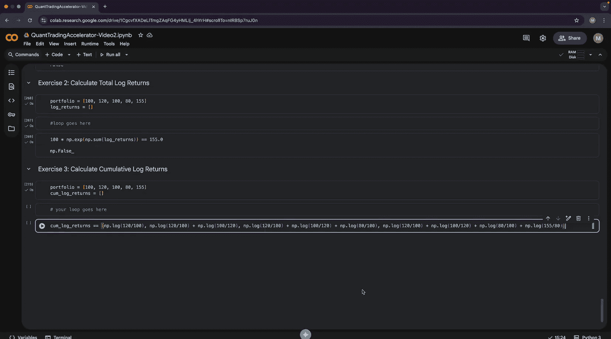

#  002：数组

在本节课中，我们将学习数组及其在金融领域的应用。数组是量化交易、人工智能和机器学习的基础构建模块，因此深入理解数组至关重要。

## 数组基础

数组可以表示一系列数据，例如价格时间序列。我们可以创建一个数组并查看其内容。

```python
prices = [10.2, 9.4, 8.7, 9.1]
print(prices)
```

Python 将数组识别为列表。我们可以检查其数据类型和长度。

```python
print(type(prices))
print(len(prices))
```

### 访问数组元素

访问数组元素称为索引。索引从 0 开始。

```python
first_price = prices[0]
second_price = prices[1]
print(first_price, second_price)
```

也可以使用负数索引从数组末尾开始访问。

```python
last_price = prices[-1]
second_last_price = prices[-2]
print(last_price, second_last_price)
```

需要注意的是，如果尝试访问超出索引范围的元素，会导致错误。

```python
# prices[5]  # 这将引发 IndexError: list index out of range
```

### 更新数组元素

我们可以更新数组中特定位置的元素。

```python
prices[0] = None  # 将第一个元素更新为 None，表示缺失数据
prices[-1] = None  # 将最后一个元素更新为 None
print(prices)
```

### 删除数组元素

有多种方法可以删除数组元素。`pop()` 方法默认删除并返回最后一个元素。

```python
removed_element = prices.pop()
print(prices, removed_element)
```

也可以指定索引来删除特定位置的元素。

```python
removed_element_front = prices.pop(0)
print(prices, removed_element_front)
```

使用 `del` 语句也可以删除元素，但它不返回被删除的值。

```python
del prices[0]
print(prices)
```

在删除元素时，位置选择对性能有巨大影响。从数组末尾删除是高效操作，而从开头删除则需要移动所有后续元素，效率较低。

```python
import time

# 创建一个包含2亿个元素的数组
large_array = [1] * 200_000_000

# 从开头删除（效率低）
start = time.time()
while large_array:
    large_array.pop(0)
end = time.time()
print(f"从开头删除耗时: {end - start:.3f} 秒")

# 重新创建数组
large_array = [1] * 200_000_000

# 从末尾删除（效率高）
start = time.time()
while large_array:
    large_array.pop()
end = time.time()
print(f"从末尾删除耗时: {end - start:.6f} 秒")
```

### 添加数组元素

我们可以向数组添加元素。使用 `append()` 方法添加单个元素。

```python
prices = []
prices.append(10.5)
print(prices)
```

使用 `extend()` 方法或 `+=` 运算符可以一次性添加多个元素。

```python
prices.extend([11.4, 9.5, 12.3])
# 或者 prices += [11.4, 9.5, 12.3]
print(prices)
```

## 同质数组与异质数组

数组中的元素可以是不同类型的数据。

*   **异质数组**：包含多种数据类型的数组。
    ```python
    mixed_array = [1.0, "hello", True, [1, 2]]
    ```
*   **同质数组**：所有元素类型相同的数组。
    ```python
    float_array = [1.0, 2.5, 3.7]
    int_array = [1, 2, 3]
    ```

在量化交易和机器学习中，我们主要使用同质数组（特别是浮点数数组），因为计算机可以对它们进行高度优化的并行计算。

## 循环

循环与数组结合使用，可以对数组中的每个元素自动执行操作。最基本的循环是 `for` 循环与 `range()` 函数。

```python
for i in range(5):
    print(i)  # 输出 0, 1, 2, 3, 4
```

更常见的是直接遍历数组元素。

```python
prices = [10.2, 9.5, 9.4]
for price in prices:
    print(price)
```

循环的一个实际应用是计算交易盈亏总和。

```python
trade_pnls = [120, -2, -1, 4.1]
total_pnl = 0
for pnl in trade_pnls:
    total_pnl += pnl
print(total_pnl)
```

## NumPy 数组

NumPy 是 Python 中用于科学计算的核心库，它提供了高性能的多维数组对象。使用 NumPy 数组进行计算比使用 Python 原生列表快得多，尤其是对于同质数值数据。

```python
import numpy as np

# 创建一个大型同质数组（浮点数）
large_np_array = np.ones(200_000_000, dtype=np.float64)

# 使用 NumPy 的优化求和函数
start = time.time()
np_sum = np.sum(large_np_array)
end = time.time()
print(f"NumPy 求和耗时: {end - start:.3f} 秒")

# 使用 Python 原生循环求和（效率低）
start = time.time()
py_sum = 0
for val in large_np_array:
    py_sum += val
end = time.time()
print(f"Python 循环求和耗时: {end - start:.3f} 秒")
```

速度差异巨大的原因在于 NumPy 数组是同质的，并且底层使用 C 语言编写，能够利用 CPU 的 SIMD（单指令多数据）指令进行并行计算。

## 对数与金融应用

对数函数在金融中有广泛应用，它是指数函数的逆运算。

```python
x = 2
y = np.exp(x)  # e^2
z = np.log(y)  # ln(e^2) = 2
print(y, z)
```

一个实际应用是计算连续复利下的投资增长。

```python
capital = 1000
rate = 0.05
years = 20
future_value = capital * (1 + rate) ** years
print(future_value)
```

使用对数可以方便地求解一些问题，例如计算投资翻倍所需的时间。

```python
capital = 1000
target = 2 * capital
rate = 0.05
# 求解方程：capital * (1+rate)^T = target => (1+rate)^T = 2
# 两边取对数：T * log(1+rate) = log(2)
T = np.log(2) / np.log(1 + rate)
print(f"翻倍所需年数: {T:.2f}")
# 验证
print(f"验证: {capital * (1+rate)**T}")
```

## 收益率与对数收益率

在金融中，我们更关注收益率而非绝对金额，因为收益率是尺度无关的，便于比较不同规模的投资。

*   **简单收益率**: `(P_t - P_{t-1}) / P_{t-1}`
*   **对数收益率**: `log(P_t / P_{t-1})`

对数收益率具有两个重要性质：
1.  **对称性**：价格上涨和下跌相同百分比时，对数收益率的绝对值相等，符号相反。
2.  **时间可加性**：多期对数收益率等于各期对数收益率之和。

```python
portfolio = [100, 120, 100]
# 简单收益率
simple_returns = [(portfolio[i] - portfolio[i-1]) / portfolio[i-1] for i in range(1, len(portfolio))]
print("简单收益率:", simple_returns)  # [0.2, -0.1666...]

# 对数收益率
log_returns = [np.log(portfolio[i] / portfolio[i-1]) for i in range(1, len(portfolio))]
print("对数收益率:", log_returns)  # [0.1823..., -0.1823...]
# 对数收益率之和为0，表明最终价值回到起点
print("对数收益率之和:", np.sum(log_returns))
```

## 练习

为了巩固所学知识，请完成以下练习。

### 练习 1：计算平均对数收益率

给定一组对数收益率，使用循环计算其算术平均值。

```python
log_returns = [0.05, -0.02, 0.03, 0.01, -0.01]
average_log_return = 0
# 你的循环代码放在这里
# for ... in ...:
#     average_log_return += ...

# 测试
expected_avg = 0.0828  # 示例值，实际需计算
# print(abs(average_log_return - expected_avg) < 1e-4)
```

### 练习 2：计算投资组合的总对数收益率

给定一个投资组合的价值序列，通过循环计算其各期的对数收益率，并验证其总和经过指数运算后等于最终价值与初始价值的比值。

```python
portfolio = [100, 120, 100, 80, 155]
log_returns = []
# 你的循环代码放在这里，用于填充 log_returns 列表
# for i in range(1, len(portfolio)):
#     ...

# 测试：总对数收益率的指数应等于 (最终价值/初始价值)
# total_log_return = sum(log_returns)
# print(np.exp(total_log_return) == 155/100)
```

### 练习 3：计算累积对数收益率

给定一个投资组合的价值序列，计算其累积对数收益率序列。第 `t` 期的累积对数收益率是直到 `t` 期为止的所有单期对数收益率之和。

```python
portfolio = [100, 110, 105, 115]  # 示例数据
log_returns = []
cumulative_log_returns = []
# 你的循环代码放在这里
# 首先计算 log_returns
# 然后计算 cumulative_log_returns

# 测试
# 预期的累积对数收益率示例: [log(110/100), log(110/100)+log(105/110), ...]
# expected_cumulative = [np.log(110/100), np.log(105/100), np.log(115/100)]
# 比较 cumulative_log_returns 和 expected_cumulative
```



## 总结


本节课我们一起学习了数组的核心概念。我们介绍了如何创建、访问、更新和删除数组元素，并强调了同质数组在性能上的优势。我们探讨了循环如何与数组协作以处理数据。通过引入 NumPy，我们看到了针对数值计算进行优化的数组带来的巨大性能提升。最后，我们深入探讨了对数和对数收益率在金融建模中的重要性，包括其对称性和时间可加性，并完成了相关的编程练习。掌握这些内容是构建量化交易策略和数据分析工具的基础。在下一部分，我们将学习线性代数和矩阵，并开始构建我们自己的数据分析库。