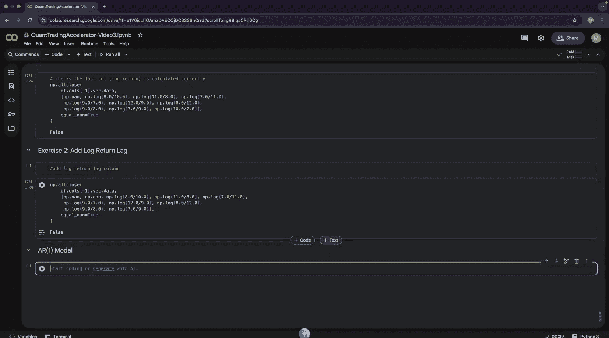

#  003：向量化

在本节课中，我们将学习向量化的核心概念。向量化是一种强大的数组运算技术，能极大提升数据处理效率。我们将从零开始构建自己的数据分析库，并深入理解向量化如何加速量化交易中的计算。

## 向量与标量运算

上一节我们介绍了数组。本节中，我们来看看向量化，它本质上是数组运算的强化版。

首先，我们需要熟悉向量的基本代数运算。我们将向量建模为一个类，并实现其与标量（单个数值）的运算。

以下是向量与标量运算的示例：

```python
# 创建向量
v = Vector([1, 2, 3, 4])

# 向量加标量
print(v + 1)  # 输出: [2, 3, 4, 5]
# 等价于对每个元素执行: 1+1, 2+1, 3+1, 4+1

# 向量减标量
print(v - 2)  # 输出: [-1, 0, 1, 2]

# 向量乘标量
print(v * 2)  # 输出: [2, 4, 6, 8]

# 向量除标量
print(v / 2)  # 输出: [0.5, 1.0, 1.5, 2.0]
```

这些运算在底层通过循环实现，但代码表达非常简洁。重要的是，这些操作会创建新的数组，而不是修改原向量，这被称为不可变性。

## 向量化的威力

现在，我们来展示向量化的性能优势。向量化之所以快速，是因为它利用了CPU的SIMD（单指令多数据）指令，能够并行处理同质数组中的数据。

我们通过一个基准测试来对比循环与向量化的速度：

```python
import numpy as np
import time

# 创建包含1亿个元素的列表和向量
size = 100_000_000
python_list = list(range(size))
vector = Vector(python_list)  # 内部转换为NumPy数组

# 方法1：使用Python循环
start = time.time()
result_loop = []
for x in python_list:
    result_loop.append(x + 1)
print("循环耗时:", time.time() - start, "秒")
print("最后10个结果（循环）:", result_loop[-10:])

# 方法2：使用向量化运算
start = time.time()
result_vector = vector + 1
print("向量化耗时:", time.time() - start, "秒")
print("最后10个结果（向量化）:", result_vector.data[-10:])
```

在这个测试中，向量化操作通常比纯Python循环快**20倍以上**。性能提升来自两方面：代码更简洁，以及底层使用优化的、并行的C例程处理同质数据。

## 向量与向量运算

接下来，我们学习向量与向量之间的运算。进行此类运算的前提是两个向量的长度必须相同。

以下是向量间算术运算的示例：

```python
# 创建两个向量
x = Vector([1, 2, 3, 4])
y = Vector([1, -1, 2, -2])

# 向量加法
print(x + y)  # 输出: [2, 1, 5, 2]
# 计算过程: [1+1, 2+(-1), 3+2, 4+(-2)]

# 向量减法
print(x - y)  # 输出: [0, 3, 1, 6]
# 计算过程: [1-1, 2-(-1), 3-2, 4-(-2)]

# 向量乘法（逐元素相乘）
print(x * y)  # 输出: [1, -2, 6, -8]
# 计算过程: [1*1, 2*(-1), 3*2, 4*(-2)]
```

## 向量化统计计算

在处理高频数据集时，快速计算统计指标至关重要。向量化使得这些计算极其高效。

我们将计算对数收益的一些基本统计量。假设我们有一个投资组合的对数收益向量：

```python
import math

# 投资组合的对数收益率
log_returns = Vector([0.01, -0.02, 0.015, -0.01, 0.03])

# 计算均值 (mu)
mu = log_returns.mean()
print("平均对数收益率 (mu):", mu)

# 计算方差 (variance)
# 方差公式: Var = mean( (x - mu)^2 )
squared_diff = (log_returns - mu) ** 2  # 计算与均值的平方差
variance = squared_diff.mean()
print("方差 (Variance):", variance)

# 计算标准差 (standard deviation)
# 标准差公式: Std = sqrt(Variance)
std_dev = math.sqrt(variance)
print("标准差 (Standard Deviation):", std_dev)
# 我们的Vector类也提供了便捷方法
print("标准差 (便捷方法):", log_returns.std())
```

在`Vector`类的实现中，`mean`和`std`方法内部都调用了NumPy的向量化函数，确保高速计算。整个过程中没有使用任何显式循环。

## 金融应用：向量化夏普比率

现在，我们将向量化应用于金融领域，计算夏普比率。夏普比率衡量的是风险调整后的收益。

对于日内高频交易，通常不考虑无风险利率。基本的夏普比率计算公式为：

**夏普比率公式：**
`Sharpe = μ / σ`
其中，`μ` 是平均收益，`σ` 是收益的标准差。

以下是计算示例：

```python
# 投资组合1：收益相对稳定
portfolio1_returns = Vector([0.01, 0.01, 0.01, 0.0])
mu1 = portfolio1_returns.mean()
std1 = portfolio1_returns.std()
sharpe1 = mu1 / std1
print("投资组合1 - 平均收益:", mu1, "标准差:", std1, "夏普比率:", sharpe1)

# 投资组合2：收益波动较大，但总复合增长率相同（对数收益可加）
portfolio2_returns = Vector([0.01, -0.01, -0.01, 0.06])
mu2 = portfolio2_returns.mean()  # 均值相同
std2 = portfolio2_returns.std()  # 标准差更大
sharpe2 = mu2 / std2
print("投资组合2 - 平均收益:", mu2, "标准差:", std2, "夏普比率:", sharpe2)
```

夏普比率越高，表明收益的稳定性越好。直观上，你会选择夏普比率更高的投资组合1，因为它的收益波动更小。

## 构建数据分析库

理解了向量化之后，我们可以开始从第一性原理构建自己的数据分析库。这能帮助我们深入理解Pandas等库的工作原理。

我们的库将包含两个核心组件：`Column`（列）和`DataFrame`（数据框）。`Column`是`Vector`的包装，增加了列名信息。`DataFrame`则是由多个`Column`组成的表格。

以下是创建数据框和列的示例：

```python
from datetime import datetime, timedelta

# 创建时间列
times = [datetime(2023, 10, 1) + timedelta(days=i) for i in range(7)]
time_col = Column("time", times)

# 创建价格列
prices = [100.0, 101.5, 102.0, 100.5, 103.0, 104.5, 102.0]
price_col = Column("price", prices)

# 创建数据框
table = DataFrame([time_col, price_col])
print(table)
```

## 数据转换与特征工程

在量化分析中，我们经常需要对数据进行转换，例如计算滞后值（lag）和对数收益，为预测模型准备特征。

以下是关键步骤：

1.  **计算滞后值**：获取时间序列的前一个值，用于自回归模型。
    ```python
    price_lag1 = price_col.shift(1)
    table.append(Column("price_lag1", price_lag1.data))
    print(table)
    ```

2.  **计算收益率**：通常使用对数收益，因为它具有时间可加性。
    ```python
    # 计算价格比 (Price_t / Price_{t-1})
    ratio = price_col / price_lag1
    table.append(Column("ratio", ratio.data))

    # 计算对数收益: log(Price_t / Price_{t-1})
    log_returns = ratio.log()
    table.append(Column("log_return", log_returns.data))
    print(table)
    ```

3.  **创建滞后特征**：用前一期的对数收益预测下一期。
    ```python
    log_return_lag1 = Column("log_return", log_returns.data).shift(1)
    table.append(Column("log_return_lag1", log_return_lag1.data))
    print(table)
    ```

现在，我们的数据已经准备好用于预测模型。`log_return` 是目标变量（y），`log_return_lag1` 是特征变量（X）。

## 行优先与列优先顺序

在将数据输入机器学习库前，需要理解数据在内存中的排列顺序。主要有两种格式：

*   **列优先**：数据按列连续存储。这是我们`DataFrame`目前的存储方式。
*   **行优先**：数据按行连续存储。这是大多数机器学习库（如scikit-learn）期望的格式。

我们需要将特征数据转换为行优先格式。以下是如何从我们的数据框中提取特征矩阵`X`和目标向量`y`：

```python
# 提取特征 (X) - 转换为行优先顺序
# 假设我们使用 `log_return_lag1` 作为特征
X = table["log_return_lag1"].to_row_order()
print("特征矩阵 X (行优先):")
print(X)

# 提取目标 (y) - 即我们要预测的 `log_return`
y = table["log_return"].data
print("目标向量 y:")
print(y)
```

在实际建模前，通常需要删除包含`NaN`（由滞后操作产生）的行。

## 练习

为了巩固所学，请完成以下练习。

**练习 1：创建对数收益**

给定一个价格序列，请使用一行向量化代码计算其对数收益。

```python
prices = Vector([100, 101, 99, 102, 105])
# 你的代码：计算对数收益，结果应赋值给 `log_returns`
# log_returns = ...

# 测试
expected_last = math.log(105 / 102)
assert abs(log_returns.data[-1] - expected_last) < 1e-10
```

**练习 2：创建滞后列**

为给定的对数收益序列创建一个滞后一期的列。

```python
log_returns = Vector([0.01, -0.005, 0.02, 0.015])
# 你的代码：创建滞后列 `log_returns_lag1`
# log_returns_lag1 = ...

# 测试
assert log_returns_lag1.data[0] is np.nan  # 第一个元素应为NaN
assert log_returns_lag1.data[1] == 0.01    # 第二个元素应为原序列的第一个值
```

## 总结

本节课中我们一起学习了向量化的核心知识。我们了解到向量化通过利用SIMD指令进行并行计算，能带来巨大的性能提升。我们实践了向量与标量、向量与向量的运算，并进行了向量化的统计计算（如均值、方差、标准差）和金融指标计算（如夏普比率）。接着，我们从零开始构建了一个简单的数据分析库，学会了如何创建数据框、进行数据转换（如计算滞后值和对数收益）以及为机器学习模型准备特征数据（区分行优先与列优先格式）。掌握向量化思维和操作，是进行高效量化数据分析与建模的基石。




在下一部分，我们将利用准备好的数据，开始构建一个用于预测的自回归模型。