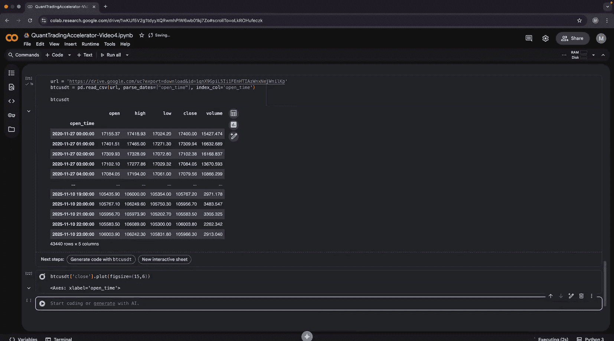
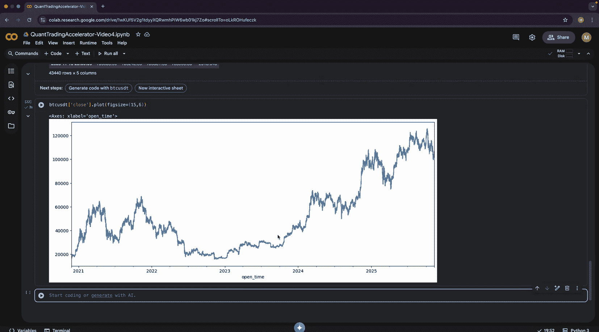
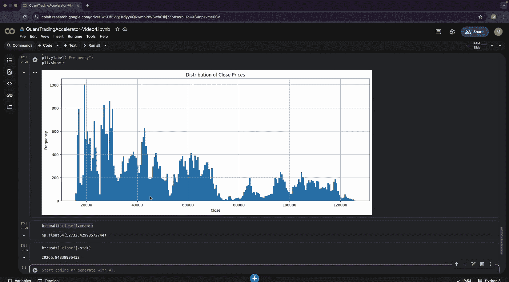
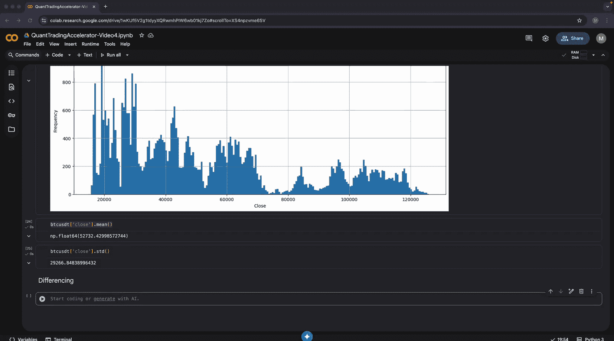
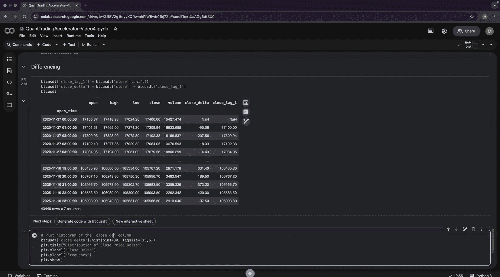
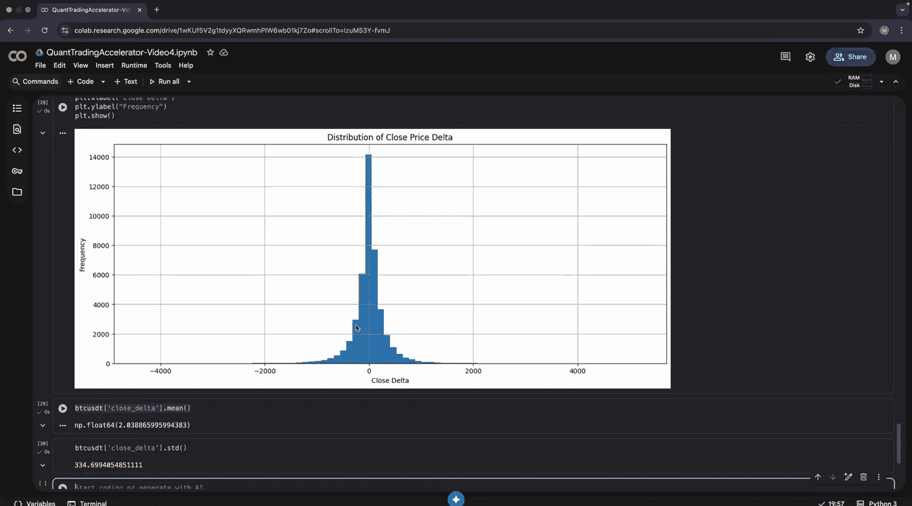
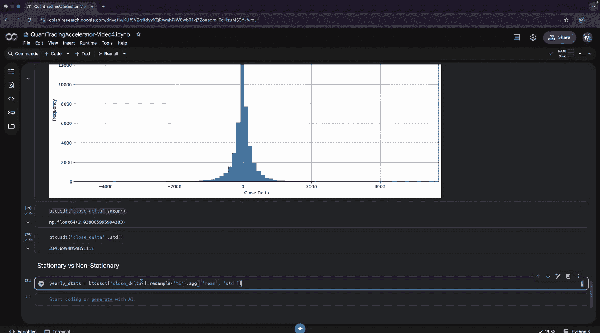
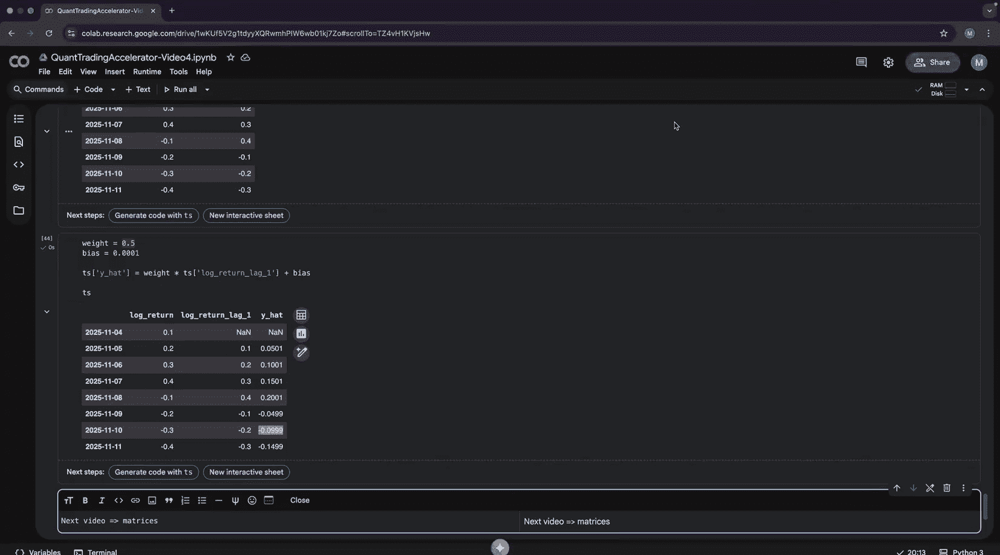

#  004：时间序列分析

在本节课中，我们将学习时间序列分析的基础知识。我们将从核心统计概念入手，然后探讨时间序列的特性，最后介绍如何使用计量经济学模型来捕捉基本的交易动态。

## 概述

时间序列是按时间顺序排列的数据点序列，在量化交易中至关重要。本节将介绍分析时间序列所需的基本统计量、时间序列的差分处理、自相关性以及自回归模型。我们将看到，一个简单的自回归模型就能有效捕捉市场中的均值回归和动量这两种基本动态。

## 核心统计概念

上一节我们学习了因子分析，本节我们将目光转向时间序列。分析时间序列的第一步是理解其核心统计特征，这包括衡量数据集中趋势和离散程度的指标。

以下是衡量集中趋势的两个最常见指标：

*   **均值**：所有数据点的平均值。它代表了序列的期望值，但对异常值敏感。
    ```python
    import numpy as np
    trade_pnl = np.array([10, 11, -400, 7, 10, 11, 8, 10, 2])
    mean_pnl = np.mean(trade_pnl)  # 计算均值
    ```
*   **中位数**：将数据排序后位于中间位置的值。它对异常值不敏感。
    ```python
    median_pnl = np.median(trade_pnl)  # 计算中位数
    ```

接下来，我们需要衡量数据的离散程度，即数据点偏离集中趋势的程度。最常用的指标是标准差。

以下是标准差的应用示例，我们比较两个投资组合：

```python
import pandas as pd
# 创建两个总收益相同但波动性不同的投资组合时间序列
portfolio_a = pd.Series([1, 1, 1, 1, 1, 1])
portfolio_b = pd.Series([6, -4, 2, 3, -5, 4])

# 计算均值和标准差
benchmark = pd.DataFrame({
    'Total PnL': [portfolio_a.sum(), portfolio_b.sum()],
    'Mean': [portfolio_a.mean(), portfolio_b.mean()],
    'Std Dev': [portfolio_a.std(), portfolio_b.std()]
}, index=['Portfolio A', 'Portfolio B'])
```

标准差量化了收益的波动性。波动性越低，收益越稳定。基于均值和标准差，我们可以计算**风险调整后收益**，例如夏普比率。

```python
# 计算夏普比率（简化版，假设无风险利率为0）
benchmark['Sharpe'] = benchmark['Mean'] / benchmark['Std Dev']
```

夏普比率越高，表明在承担单位风险时获得的回报越高，投资组合的表现越稳健。





另一个关键概念是**相关性**，它衡量两个时间序列共同运动的程度。

*   **正相关**：一个序列上升时，另一个也倾向于上升。
*   **负相关**：一个序列上升时，另一个倾向于下降。

相关性系数介于-1到1之间。理解相关性对构建交易策略（如配对交易中的均值回归策略）非常重要。





## 时间序列特性与差分

掌握了基础统计知识后，我们来看一个真实的时间序列例子。我们以比特币的小时价格数据为例。



直接分析原始价格序列会遇到问题：其分布可能呈现多个峰值，且均值和标准差在长时间内并不稳定（例如，价格从2万美元涨到6万美元）。这引出了**平稳性**的概念——一个平稳时间序列的统计特性（如均值、方差）不随时间变化。



许多金融时间序列（如价格）是**非平稳**的。一个常见的处理方法是进行**差分**，即计算相邻时间点数据的变化量（收益率）。

```python
# 假设 df 是一个包含‘close’价格列的DataFrame
df['close_delta'] = df['close'] - df['close'].shift(1)  # 计算价格差分（简单收益率）
# 或者计算对数收益率，使其具有可加性
df['log_return'] = np.log(df['close'] / df['close'].shift(1))
```



差分后的序列（收益率）通常更接近平稳，分布呈现单峰，且统计特性更稳定，从而更适合进行统计建模和预测。

## 自相关与自回归模型

为了预测未来，我们需要利用历史数据。在时间序列分析中，我们创建**滞后变量**，即过去时间点的值。

```python
# 创建滞后特征
for lag in [1, 2, 3, 4]:
    df[f'log_return_lag{lag}'] = df['log_return'].shift(lag)
df_clean = df.dropna()  # 删除包含NaN的行
```

接下来，我们检查**序列自相关**，即时间序列当前值与其过去值（滞后值）之间的相关性。

```python
# 计算自相关系数
autocorr_dict = {}
for lag in [1, 2, 3, 4]:
    autocorr_dict[f'lag{lag}'] = df_clean['log_return'].corr(df_clean[f'log_return_lag{lag}'])
```

自相关图通常显示相关性随着滞后阶数的增加而衰减。显著的负一阶自相关可能暗示着**均值回归**特性。

这自然引出了**自回归模型**。我们重点介绍一阶自回归模型（AR(1)），它试图用前一时刻的值来预测当前值。

AR(1) 模型的定义如下：
`y_t = φ * y_{t-1} + c + ε_t`
其中：
*   `y_t` 是当前时刻的值（如对数收益率）。
*   `y_{t-1}` 是前一时刻的值（滞后一期）。
*   `φ` 是自回归系数（权重）。
*   `c` 是常数项（偏差）。
*   `ε_t` 是误差项。

这个简单模型的强大之处在于，其系数 `φ` 能够解释两种基本的市场动态：

1.  **均值回归**：当 `φ` 为**负数**时，模型预测当前变化会反向修正上一期的变化。这对应着“涨多必跌，跌多必涨”的现象。
    ```python
    # 模拟均值回归动态的预测（假设 phi 为负）
    phi = -0.3  # 负权重
    c = 0.001   # 微小偏差
    df_clean['pred_mean_rev'] = phi * df_clean['log_return_lag1'] + c
    ```

2.  **动量**：当 `φ` 为**正数**时，模型预测趋势将持续。这对应着“涨者恒涨，跌者恒跌”的现象。
    ```python
    # 模拟动量动态的预测（假设 phi 为正）
    phi = 0.3   # 正权重
    c = 0.001
    df_clean['pred_momentum'] = phi * df_clean['log_return_lag1'] + c
    ```

通过数学优化（如最小二乘法）从数据中估计出 `φ` 和 `c`，我们就得到了一个能够捕捉资产价格动态的简单预测模型。

## 总结

本节课我们一起学习了时间序列分析的核心内容。我们首先回顾了均值、标准差和相关性等基础统计概念，并学会了如何用夏普比率评估风险调整后收益。接着，我们探讨了金融时间序列的非平稳特性，并通过差分将其转化为更适合分析的收益率序列。然后，我们引入了滞后变量和自相关的概念，并最终介绍了一阶自回归模型。这个模型虽然简单，但其参数能直观地解释金融市场中两种根本的动态——均值回归和动量，为后续更复杂的建模打下了坚实的基础。




在下一节课中，我们将进入矩阵的世界。矩阵是二维数组，也是机器学习和线性代数的核心。掌握矩阵运算后，我们就可以真正开始构建机器学习模型了。