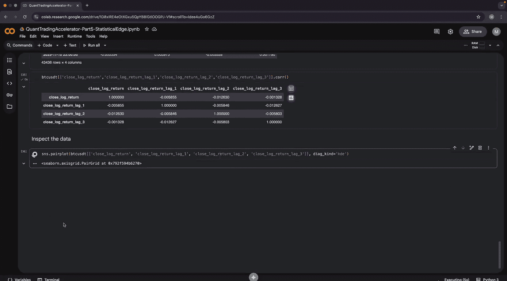
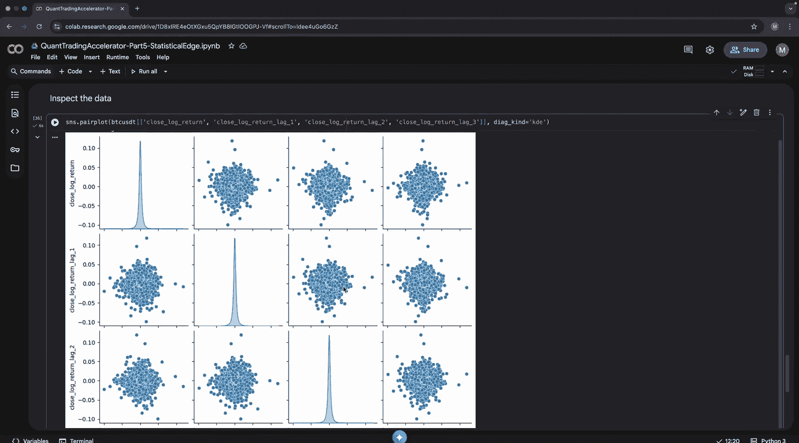
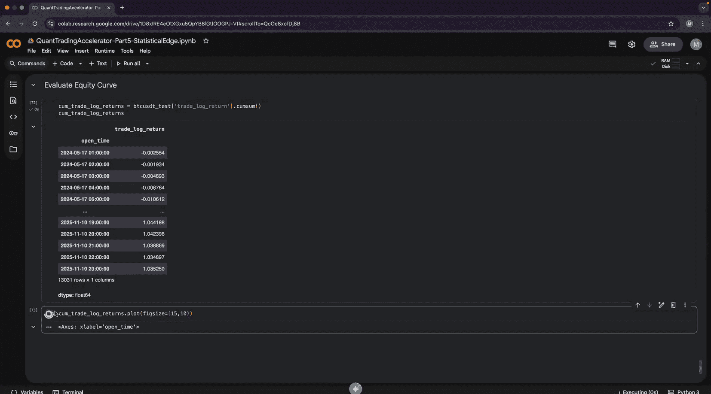
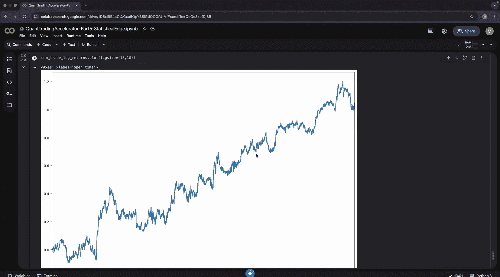
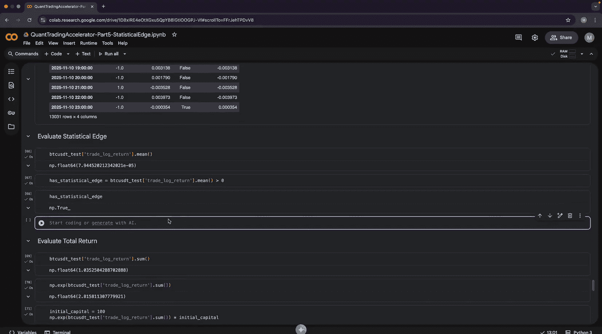
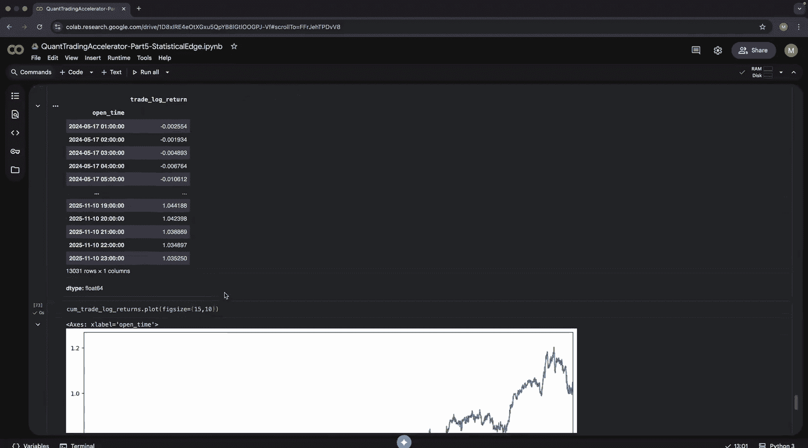
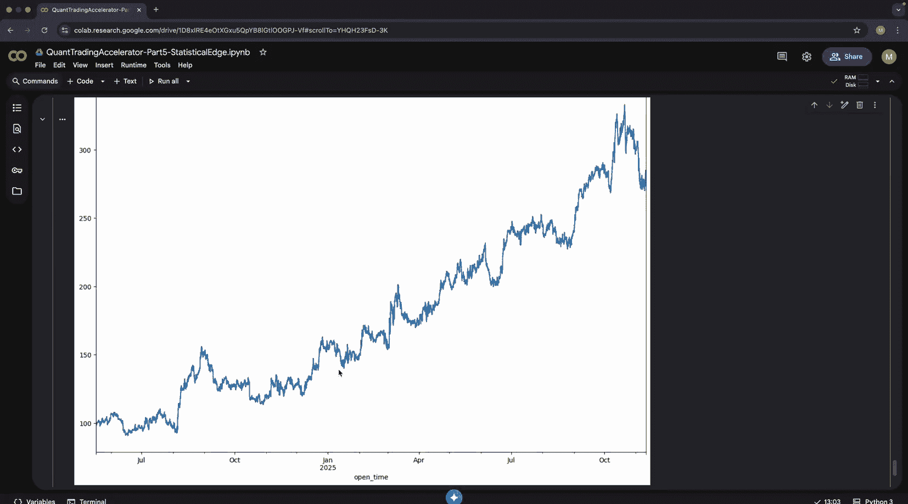
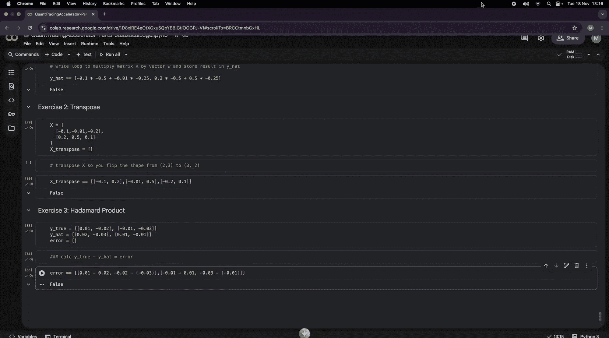
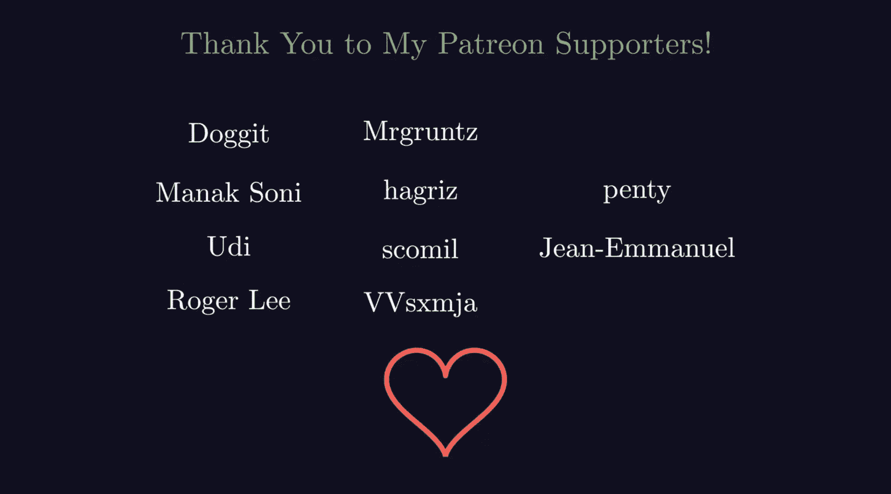

#  005：统计优势 📈

## 概述

在本节课中，我们将学习如何构建量化交易模型的核心基础——统计优势。我们将从理解矩阵运算开始，这是机器学习模型的基石。接着，我们会学习如何利用一个微小的统计优势来创造利润，并最终构建我们的第一个预测模型。核心概念是：胜率不等于阿尔法（超额收益），关键在于期望值为正。

---

## 矩阵代数基础

上一节我们学习了时间序列数据处理。本节中，我们将引入矩阵，以便同时处理和分析多个时间序列数据。

### 什么是矩阵？

在代码中，矩阵本质上是一个二维数组。例如：

```python
import numpy as np
matrix = np.array([[1, 2, 3], [4, 5, 6], [7, 8, 9]])
```

要访问矩阵中的单个元素（标量），需要进行两次索引：

```python
element = matrix[0, 1]  # 访问第一行第二列的元素，值为 2
```

### 矩阵与标量运算

矩阵可以与一个标量（单个数字）进行运算，例如加法或乘法。手动实现会非常繁琐且低效：

```python
# 低效的手动循环加法
M, N = matrix.shape
for i in range(M):
    for j in range(N):
        matrix[i, j] += 1
```

使用NumPy可以高效地完成：

```python
# 高效的NumPy运算
matrix = matrix + 1
# 或 matrix += 1
```

### 矩阵与向量乘法

这是机器学习中最核心的运算之一。模型预测通常表示为：

**公式：** `Y_hat = X · W + b`



其中：
*   `X` 是输入特征矩阵。
*   `W` 是权重向量。
*   `b` 是偏置项。
*   `Y_hat` 是预测值。

在NumPy中，使用点积（`np.dot`）或`@`运算符进行矩阵乘法：



```python
X = np.array([[1, 2], [3, 4], [5, 6]])  # 输入矩阵
W = np.array([0.5, -0.2])               # 权重向量
b = 0.1                                 # 偏置项

# 计算预测值
Y_hat = np.dot(X, W) + b
# 或 Y_hat = X @ W + b
```

**重要提示：** 广播（`*`）不等于矩阵乘法（`@`）。广播是逐元素操作，而矩阵乘法遵循线性代数规则。

---

## 构建统计优势模型

理解了矩阵运算后，我们现在可以深入探讨如何利用机器学习来开发统计优势。

### 数据准备与探索

首先，我们需要获取并准备数据。我们将使用比特币永续合约的OHLC（开盘价、最高价、最低价、收盘价）小时数据。

```python
import pandas as pd
# 假设已下载数据并加载为DataFrame `df`
# 计算对数收益率，因其具有时间可加性，便于建模复合增长
df[‘log_return’] = np.log(df[‘close’] / df[‘close’].shift(1))
```

我们的目标是预测未来的对数收益率。我们使用过去的收益率作为特征，这被称为自回归模型。

```python
# 创建滞后特征
for lag in [1, 2, 3]:
    df[f‘lag_{lag}’] = df[‘log_return’].shift(lag)
# 目标变量是下一期的对数收益率
df[‘target’] = df[‘log_return’].shift(-1)
# 删除包含NaN的行
df = df.dropna()
```

以下是数据特征间关系的可视化图，可以看到金融数据非常嘈杂，没有明显的多项式关系，这也是线性回归在此类问题中表现尚可的原因之一。


### 划分训练集与测试集

对于时间序列数据，必须按时间顺序划分，以避免数据泄露，确保模型评估的可靠性。

```python
def train_test_split_time_series(data, train_size=0.7):
    split_idx = int(len(data) * train_size)
    train_data = data.iloc[:split_idx]
    test_data = data.iloc[split_idx:]
    return train_data, test_data

train_df, test_df = train_test_split_time_series(df)
```

训练集用于学习模式，测试集（样本外数据）用于检验该模式是否具有持续性。

### 训练线性回归模型

我们将使用PyTorch构建一个简单的单变量线性回归模型。PyTorch提供了对训练过程的精细控制。

以下是训练流程的核心步骤：

1.  **设置可复现性**：固定随机种子。
2.  **准备张量**：将数据转换为PyTorch张量。
3.  **定义模型**：一个线性层。
4.  **定义损失函数和优化器**：使用Huber损失（对异常值鲁棒性较好）和随机梯度下降优化器。
5.  **训练循环**：前向传播、计算损失、反向传播、更新参数。

```python
import torch
import torch.nn as nn
import torch.optim as optim

# 1. 可复现性设置
torch.manual_seed(42)
np.random.seed(42)

# 2. 准备张量
X_train = torch.tensor(train_df[[‘lag_1’]].values, dtype=torch.float32)
y_train = torch.tensor(train_df[‘target’].values, dtype=torch.float32).unsqueeze(1) # 增加列维度

# 3. 定义模型
model = nn.Linear(in_features=1, out_features=1)

# 4. 定义损失和优化器
criterion = nn.HuberLoss()
optimizer = optim.SGD(model.parameters(), lr=0.01)

# 5. 训练循环
epochs = 5000
for epoch in range(epochs):
    optimizer.zero_grad()          # 清零梯度
    predictions = model(X_train)   # 前向传播
    loss = criterion(predictions, y_train) # 计算损失
    loss.backward()                # 反向传播
    optimizer.step()               # 更新参数
    if epoch % 500 == 0:
        print(f‘Epoch {epoch}, Loss: {loss.item():.4f}’)

# 查看学到的参数
print(“Weight:”, model.weight)
print(“Bias:”, model.bias)
# 例如，权重为负可能表示均值回归行为
```

### 模型评估与统计优势计算

训练完成后，我们需要在测试集上评估模型的盈利能力。

**关键点：胜率不等于阿尔法。** 一个模型可能只有略高于50%的胜率，但如果其盈利交易的收益平均高于亏损交易的损失，它仍然可以产生正的期望收益。

以下是评估步骤：

1.  **样本外预测**：使用训练好的模型对测试集进行预测。
2.  **生成交易信号**：根据预测值的符号决定做多（1）或做空（-1）。
3.  **计算交易收益**：信号乘以实际的目标收益率。
4.  **计算关键指标**：
    *   **方向性准确率（胜率）**：`(信号 == 实际方向符号).mean()`
    *   **期望值（平均交易收益）**：`trade_returns.mean()`。若大于0，则存在统计优势。
    *   **总对数收益**：`trade_returns.sum()`
    *   **转换为简单收益**：`np.exp(total_log_return) - 1`
    *   **夏普比率（风险调整后收益）**：`(mean_return / std_return) * sqrt(annualization_factor)`

```python
# 1. 样本外预测
X_test = torch.tensor(test_df[[‘lag_1’]].values, dtype=torch.float32)
with torch.no_grad():
    test_predictions = model(X_test).squeeze().numpy()

# 2. & 3. 添加到测试DataFrame并计算收益
test_df[‘prediction’] = test_predictions
test_df[‘signal’] = np.sign(test_df[‘prediction’]) # 交易信号
test_df[‘trade_return’] = test_df[‘signal’] * test_df[‘target’] # 交易收益



# 4. 计算关键指标
win_rate = (test_df[‘signal’] == np.sign(test_df[‘target’])).mean()
expected_value = test_df[‘trade_return’].mean()
has_edge = expected_value > 0
total_log_return = test_df[‘trade_return’].sum()
total_simple_return = np.exp(total_log_return) - 1







print(f“胜率: {win_rate:.2%}”)
print(f“期望值: {expected_value:.6f}”)
print(f“是否存在统计优势: {has_edge}”)
print(f“总简单收益: {total_simple_return:.2%}”)
# 假设初始资金100元
initial_capital = 100
final_capital = initial_capital * (1 + total_simple_return)
print(f“初始资金 {initial_capital} 元，最终约为 {final_capital:.2f} 元”)
```

即使胜率仅略高于50%，由于期望值为正，通过多次交易，资金曲线仍可能呈现增长。下图展示了在未考虑交易费用情况下的模拟资金曲线。




**重要提醒**：上述结果未计入交易费用。在实际交易中，尤其是高频策略，交易费用会显著侵蚀甚至逆转微小的统计优势。策略是作为流动性提供者（挂单，费用低或可能有返佣）还是流动性提取者（吃单，费用高）至关重要。

---

## 练习

为了巩固对矩阵运算的理解，请完成以下练习：

1.  **手动实现点积**：不使用NumPy内置函数，通过循环手动计算两个向量的点积。
    ```python
    x = np.array([1, 2, 3])
    y = np.array([4, 5, 6])
    # 你的手动实现代码 here
    # 验证结果应等于 np.dot(x, y)
    ```

2.  **手动实现矩阵转置**：编写一个函数，通过循环将矩阵的行列互换。
    ```python
    A = np.array([[1, 2, 3], [4, 5, 6]])
    # 你的转置实现代码 here
    # 验证结果应等于 A.T
    ```

3.  **手动计算误差矩阵**：给定预测值矩阵 `Y_hat` 和实际值矩阵 `Y`，通过循环计算它们的差值（误差矩阵）。
    ```python
    Y_hat = np.array([[1.1, 2.2], [3.3, 4.4]])
    Y = np.array([[1.0, 2.0], [3.0, 4.0]])
    # 你的误差计算代码 here
    # 验证结果应等于 Y_hat - Y
    ```

---

## 总结

本节课我们一起学习了量化模型开发的核心。我们首先掌握了矩阵代数的基本运算，这是构建多变量模型的基础。然后，我们利用线性回归模型预测金融时间序列，并深入理解了“统计优势”的本质——它由期望值定义，而非单纯的胜率。我们构建了一个简单的交易策略原型，并学习了如何评估其样本外表现，包括计算方向性准确率、期望收益、总收益和夏普比率。最后，我们强调了在实际应用中考虑交易费用的极端重要性。在接下来的课程中，我们将探索分类模型以及更严谨的回测与验证方法。





---
*本课程免费提供，感谢我的Patreon支持者。如果您从本系列中获得价值并希望帮助我创作更多内容，请考虑加入他们。您也可以通过Buy Me a Coffee支持我。链接在我的频道详情页。*