#  006：分类模型

在本节课中，我们将学习分类模型。我们将构建一个二元分类器来预测价格涨跌方向，评估其性能与盈利能力，并介绍一些关键的评估指标和概念，如ROC曲线和超额可预测性统计量。

---

## 数据准备与目标创建

上一节我们介绍了回归模型，本节中我们来看看分类模型。首先，我们需要导入必要的库并加载数据。

```python
import numpy as np
import pandas as pd
import torch
import torch.nn as nn
import torch.optim as optim
from sklearn.preprocessing import StandardScaler
import matplotlib.pyplot as plt
```

我们使用与之前相同的比特币永续合约数据。

```python
# 加载数据
data = pd.read_csv('your_data.csv', index_col=0, parse_dates=True)
# 计算对数收益率
data['log_return'] = np.log(data['close'] / data['close'].shift(1))
# 创建滞后特征
for lag in [1, 2, 3]:
    data[f'lag_{lag}'] = data['log_return'].shift(lag)
data = data.dropna()
```

接下来，我们需要创建分类模型的目标变量。我们希望预测价格是上涨（标记为1）还是下跌（标记为0）。

```python
# 创建二元分类目标
data['target'] = data['log_return'].map(lambda x: 1 if x > 0 else 0)
```

检查目标变量的分布平衡性非常重要。如果数据严重偏向某一类，模型可能缺乏判别能力。

```python
# 检查目标平衡性
print(data['target'].value_counts(normalize=True))
```

---

## 模型训练与评估

现在，我们将数据分割为训练集和测试集，并训练一个逻辑回归模型。

```python
# 按时间分割数据
split_idx = int(len(data) * 0.8)
train_data = data.iloc[:split_idx].copy()
test_data = data.iloc[split_idx:].copy()

# 准备特征和目标
features = ['lag_1', 'lag_2', 'lag_3']
scaler = StandardScaler()
X_train = scaler.fit_transform(train_data[features])
X_test = scaler.transform(test_data[features])
y_train = train_data['target'].values
y_test = test_data['target'].values

# 转换为PyTorch张量
X_train_tensor = torch.tensor(X_train, dtype=torch.float32).unsqueeze(1)
y_train_tensor = torch.tensor(y_train, dtype=torch.float32).unsqueeze(1)
X_test_tensor = torch.tensor(X_test, dtype=torch.float32).unsqueeze(1)
```

以下是定义和训练逻辑回归模型的代码。

```python
class LogisticRegression(nn.Module):
    def __init__(self, input_dim):
        super().__init__()
        self.linear = nn.Linear(input_dim, 1)

    def forward(self, x):
        return self.linear(x)

model = LogisticRegression(input_dim=len(features))
criterion = nn.BCEWithLogitsLoss()
optimizer = optim.SGD(model.parameters(), lr=0.01)

# 训练模型
epochs = 5000
for epoch in range(epochs):
    optimizer.zero_grad()
    logits = model(X_train_tensor).squeeze()
    loss = criterion(logits, y_train_tensor.squeeze())
    loss.backward()
    optimizer.step()
    if epoch % 500 == 0:
        print(f'Epoch {epoch}, Loss: {loss.item():.4f}')
```

训练完成后，我们在测试集上进行预测并评估模型性能。

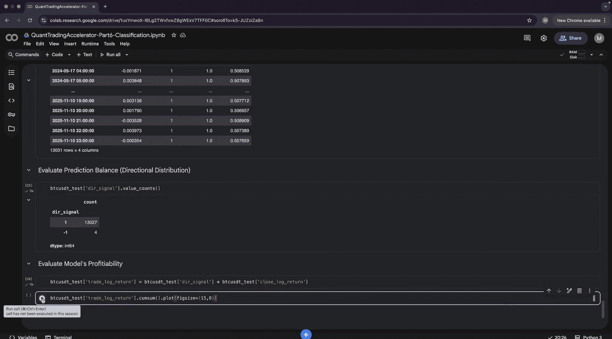

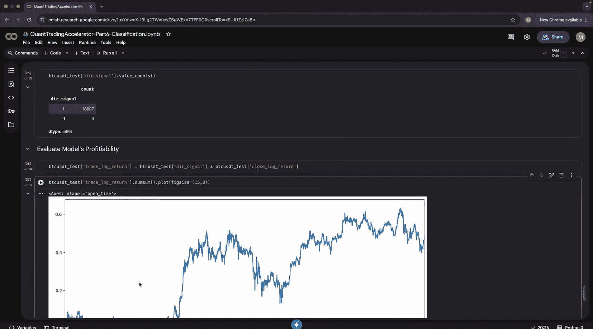

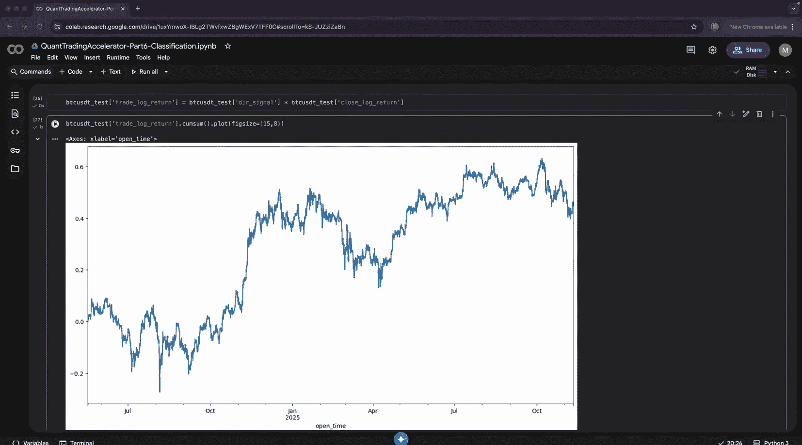

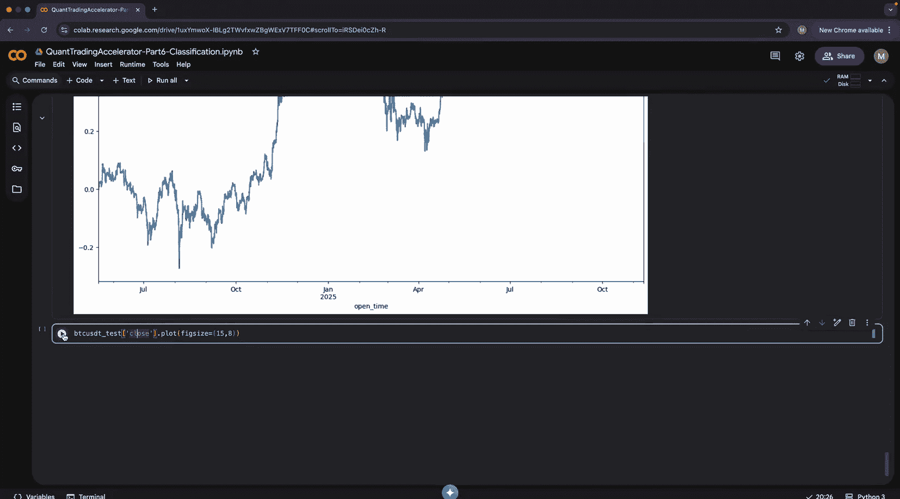

```python
# 在测试集上预测
with torch.no_grad():
    test_logits = model(X_test_tensor).squeeze()
    probabilities = torch.sigmoid(test_logits)
    predictions = (probabilities >= 0.5).float()

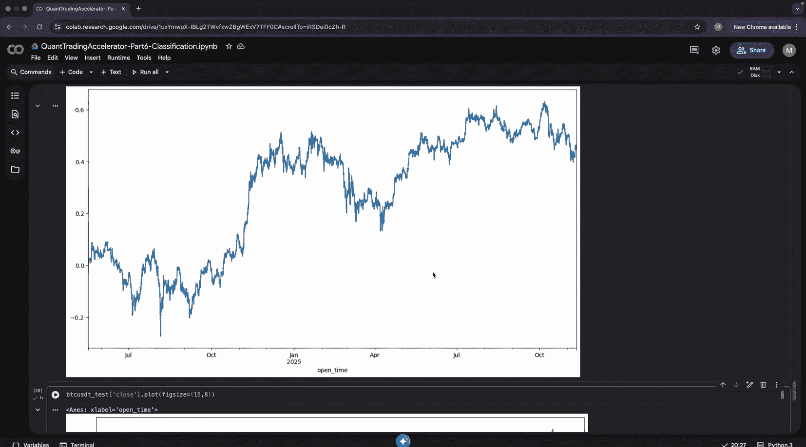

# 计算准确率
accuracy = (predictions == torch.tensor(y_test, dtype=torch.float32)).float().mean()
print(f'测试集方向准确率: {accuracy.item():.2%}')
```

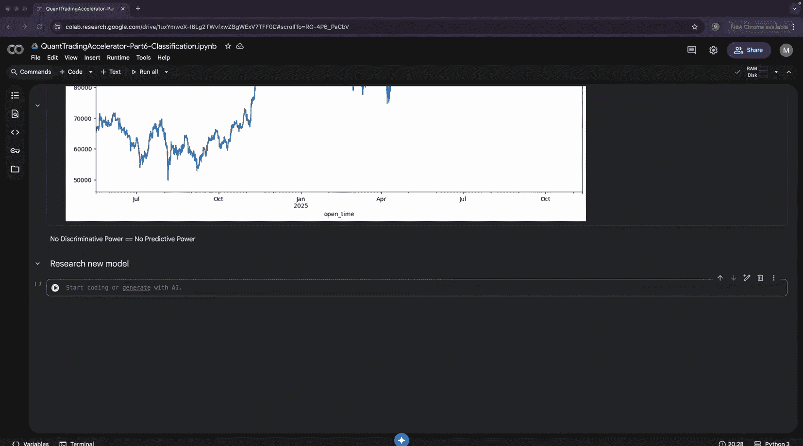

仅仅看准确率是不够的，我们还需要评估模型的盈利能力。

---

## 盈利能力与策略评估

为了评估盈利能力，我们需要将模型的预测信号转换为交易信号，并计算策略的累积收益。

以下是计算交易信号和策略收益的步骤。

```python
# 将预测标签转换为方向信号（1为做多，-1为做空）
test_data = test_data.copy()
test_data['pred_signal'] = predictions.numpy()
test_data['dir_signal'] = np.where(test_data['pred_signal'] == 1, 1, -1)

# 计算策略的单期对数收益率
test_data['strategy_log_return'] = test_data['dir_signal'] * test_data['log_return']

# 计算策略的累积对数收益率（复合增长）
test_data['cum_strategy_return'] = test_data['strategy_log_return'].cumsum()
```

我们可以绘制策略的权益曲线，并与单纯买入持有的收益进行对比。

```python
# 计算买入持有收益
test_data['buy_hold_return'] = test_data['log_return'].cumsum()

# 绘制对比图
plt.figure(figsize=(12, 6))
plt.plot(test_data.index, test_data['cum_strategy_return'], label='策略收益 (对数)')
plt.plot(test_data.index, test_data['buy_hold_return'], label='买入持有收益 (对数)', alpha=0.7)
plt.xlabel('日期')
plt.ylabel('累积对数收益率')
plt.title('策略收益 vs 买入持有收益')
plt.legend()
plt.grid(True)
plt.show()
```

此外，我们计算夏普比率来评估风险调整后的收益。

```python
# 计算年化夏普比率（假设每小时一个数据点，一年约8760小时）
returns_series = test_data['strategy_log_return']
annual_factor = np.sqrt(8760) # 将小时收益率年化
sharpe_ratio = returns_series.mean() / returns_series.std() * annual_factor
print(f'年化夏普比率: {sharpe_ratio:.2f}')
```

---

## 模型诊断与高级指标

一个常见的陷阱是模型可能缺乏判别能力，即它可能总是预测同一个方向。我们可以使用混淆矩阵和ROC曲线来诊断。

以下是计算混淆矩阵和相关指标的方法。

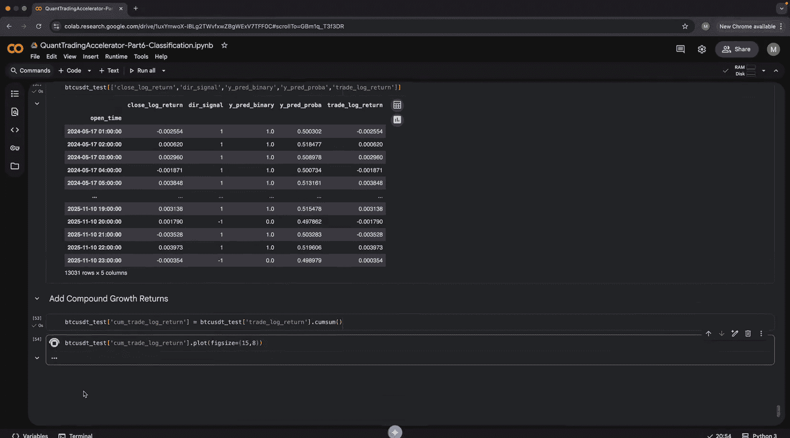

```python
from sklearn.metrics import confusion_matrix, roc_auc_score, roc_curve

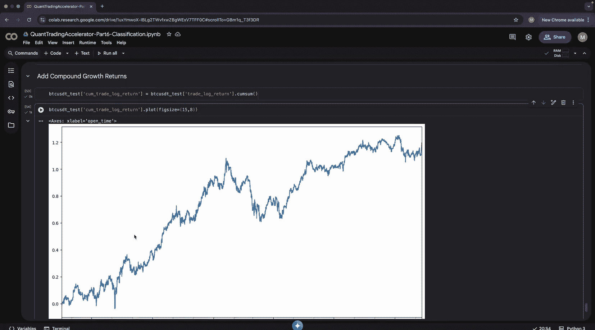

# 计算混淆矩阵
tn, fp, fn, tp = confusion_matrix(y_test, predictions.numpy()).ravel()
print(f"真负例(TN): {tn}, 假正例(FP): {fp}")
print(f"假负例(FN): {fn}, 真正例(TP): {tp}")

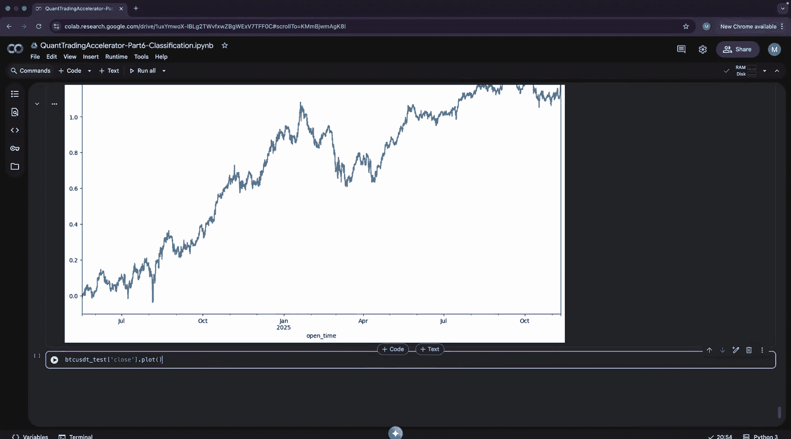

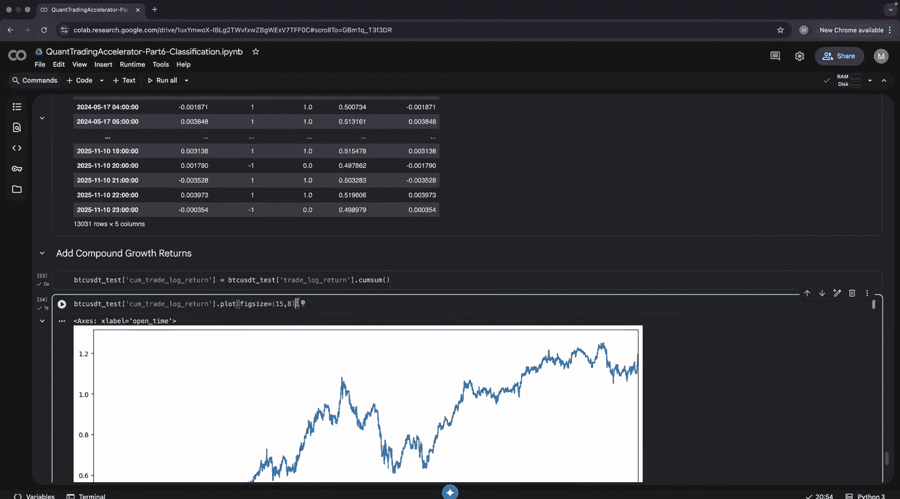

# 计算查准率和查全率
precision = tp / (tp + fp) if (tp + fp) > 0 else 0
recall = tp / (tp + fn) if (tp + fn) > 0 else 0
print(f'查准率 (当预测上涨时的准确率): {precision:.2%}')
print(f'查全率 (捕捉到的实际上涨比例): {recall:.2%}')

# 计算ROC-AUC分数
auc_score = roc_auc_score(y_test, probabilities.numpy())
print(f'ROC-AUC 分数: {auc_score:.3f}')
# AUC > 0.5 表示优于随机猜测
```

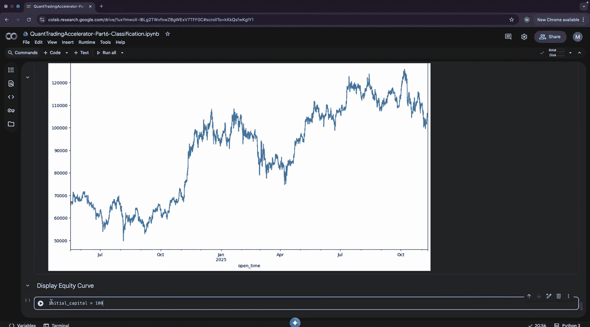

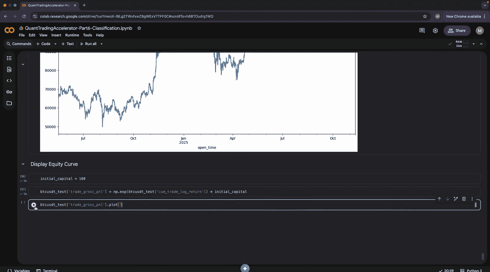

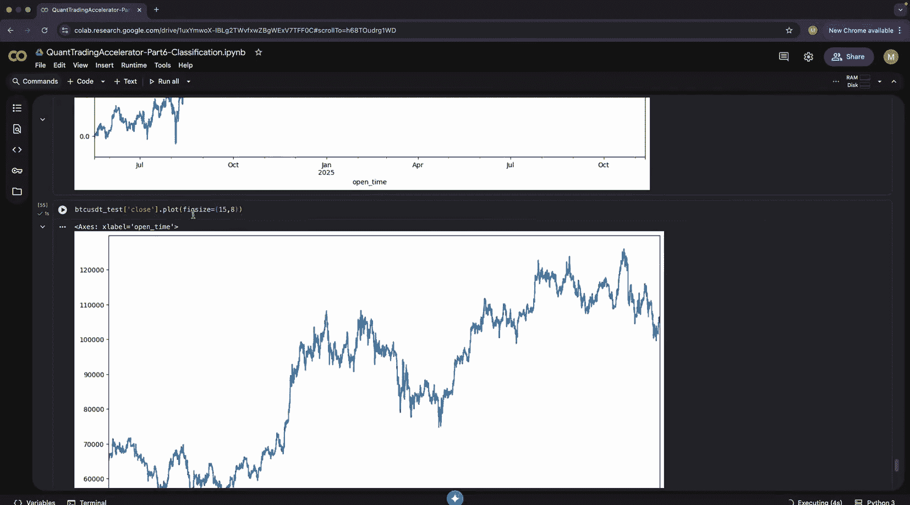

ROC-AUC分数量化了模型的判别能力。我们还可以绘制ROC曲线进行可视化。

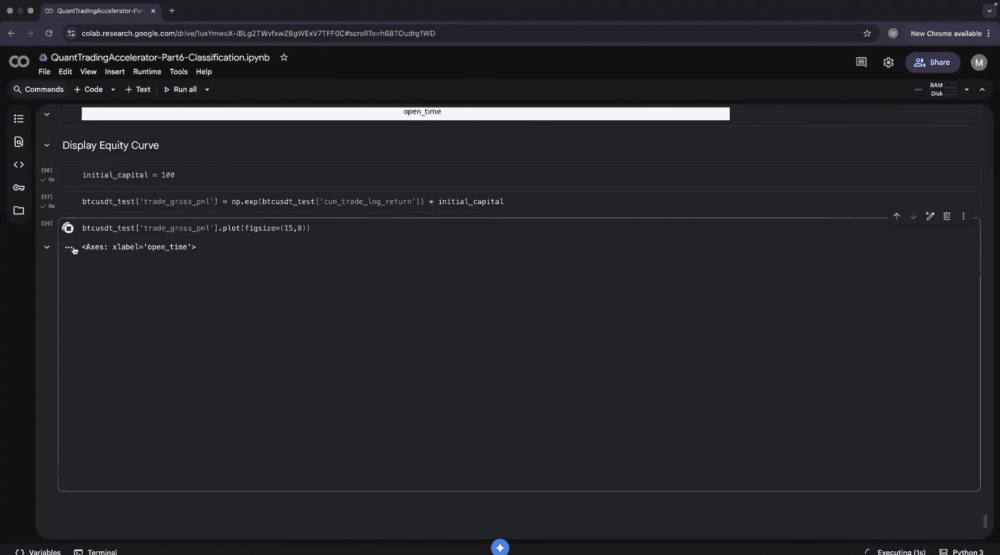

```python
fpr, tpr, _ = roc_curve(y_test, probabilities.numpy())
plt.figure(figsize=(8, 6))
plt.plot(fpr, tpr, label=f'模型 (AUC = {auc_score:.3f})')
plt.plot([0, 1], [0, 1], 'k--', label='随机猜测')
plt.xlabel('假正率')
plt.ylabel('真正率')
plt.title('ROC 曲线')
plt.legend()
plt.grid(True)
plt.show()
```

---

## 超额可预测性统计量

最后，我们介绍一个用于评估分类模型预测能力的补充统计量——超额可预测性（或Gco统计量）。它衡量了模型预测相对于随机猜测的优越程度。

其核心思想是计算模型策略收益与随机猜测策略收益的差值累积和。

```python
# 生成随机猜测信号作为基准
np.random.seed(42) # 确保可复现
random_signals = np.random.choice([-1, 1], size=len(test_data))
test_data['random_strategy_return'] = random_signals * test_data['log_return']
test_data['cum_random_return'] = test_data['random_strategy_return'].cumsum()

# 计算超额可预测性：模型累积收益 - 随机猜测累积收益
test_data['excess_predictability'] = test_data['cum_strategy_return'] - test_data['cum_random_return']

# 绘制超额可预测性曲线
plt.figure(figsize=(12, 6))
plt.plot(test_data.index, test_data['excess_predictability'])
plt.axhline(y=0, color='r', linestyle='--', alpha=0.5)
plt.xlabel('日期')
plt.ylabel('超额可预测性')
plt.title('模型相对于随机猜测的超额可预测性')
plt.grid(True)
plt.show()
```

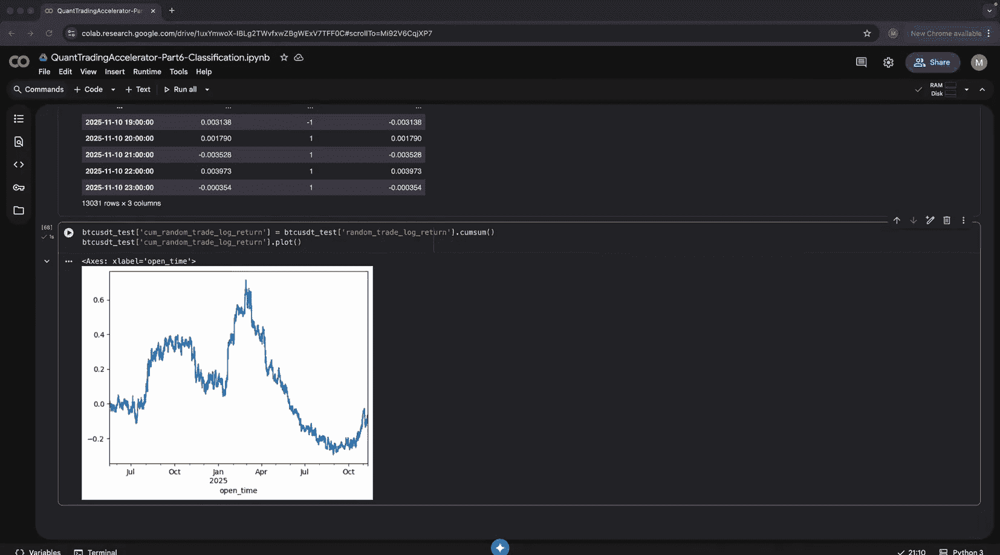

正值表示模型预测能力优于随机猜测。

---

## 收益分解概念

本节最后，我们简要介绍收益分解的概念。未来收益率可以分解为方向（符号）和幅度（绝对值）两部分：

`未来收益率 = sign(未来收益率) * abs(未来收益率)`

我们已经用分类模型预测了方向（sign）。一个自然的延伸是使用回归模型来预测幅度（abs）。将两者的预测结合起来，可能获得更强的预测能力。这将是课后练习的一部分。

---

## 总结

本节课中我们一起学习了：
1.  **构建二元分类模型**：使用逻辑回归预测价格涨跌方向。
2.  **评估模型性能**：超越简单的准确率，通过混淆矩阵、查准率、查全率和ROC-AUC来全面评估。
3.  **评估策略盈利能力**：将预测信号转化为交易策略，计算累积收益和夏普比率。
4.  **诊断模型缺陷**：认识到判别能力的重要性，避免模型陷入“永远看涨”的陷阱。
5.  **引入高级指标**：使用超额可预测性（Gco统计量）量化模型相对于随机基准的优越性。
6.  **了解收益分解**：认识到将收益率分解为方向和幅度两部分，为后续构建更强大的混合模型奠定了基础。

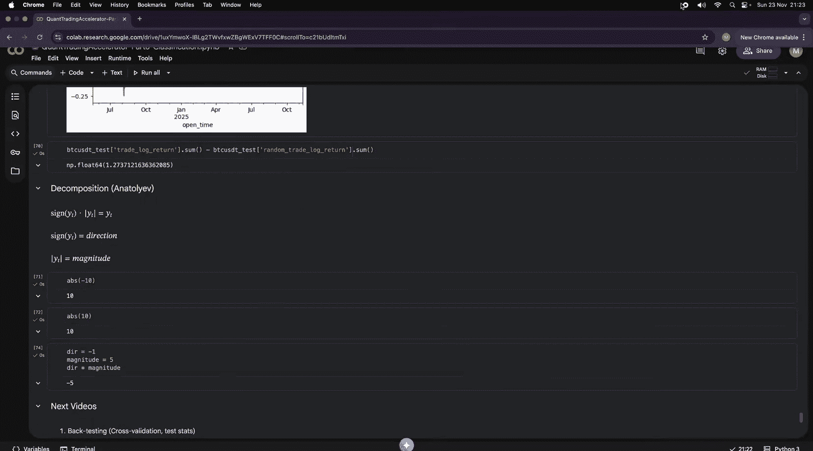


记住，一个在样本上表现良好的模型，必须在样本外测试中保持其预测能力和盈利能力，才能考虑投入实战。下一节课，我们将深入探讨回测与交叉验证。