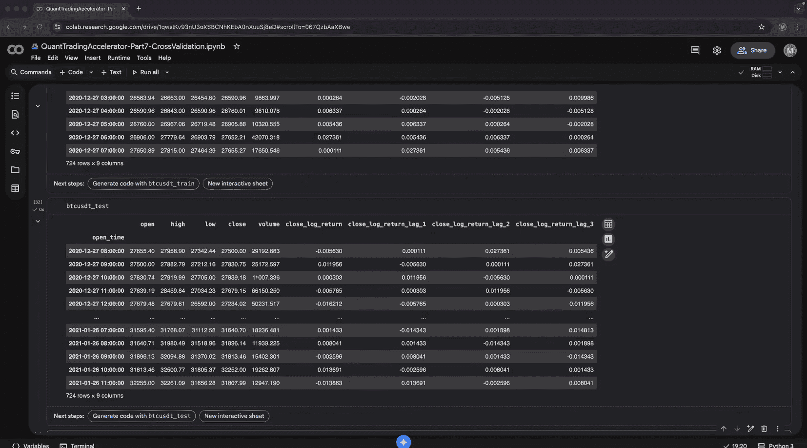
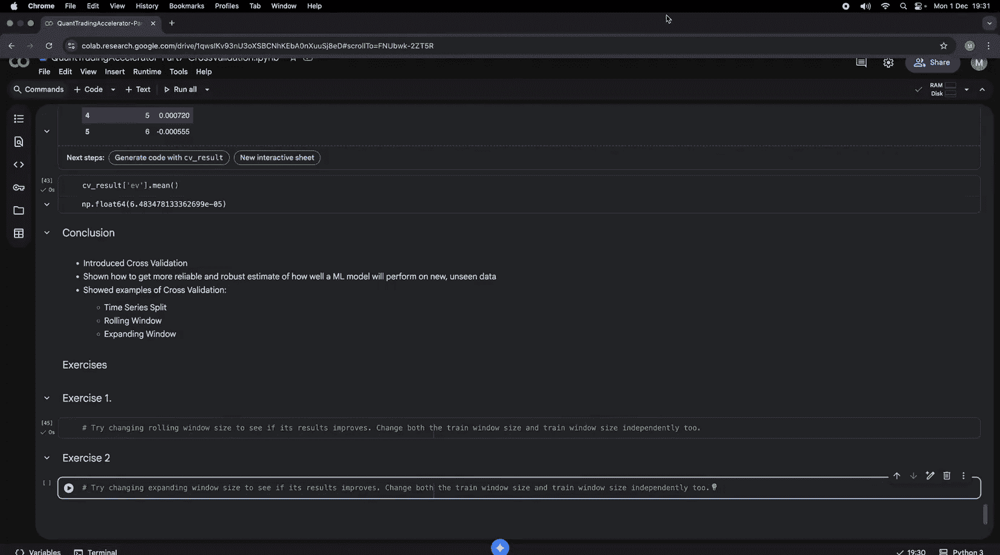

#  007：交叉验证 📊

在本节课中，我们将学习交叉验证。交叉验证是确保我们训练的机器学习模型稳健可靠的关键技术。我们将探讨几种适用于时间序列数据的交叉验证方法，并比较它们的性能。

## 概述

在本系列课程中，我们首先学习了数组，然后深入研究了向量和时间序列，接着探讨了可以表示多个时间序列的矩阵。在之前的视频中，我们研究了回归和分类模型。本节课的核心是确保我们训练的模型是稳健和可靠的，这正是交叉验证的主题。

交叉验证本质上存在多种方法。对于时间序列数据，我们必须非常小心，始终要正确保持时间顺序，避免数据泄露。因此，我们需要使用专门为时间序列设计、能保持时间顺序的交叉验证方法。

## 导入库

首先，我们需要导入必要的库。

```python
import numpy as np
import pandas as pd
import torch
import torch.nn as nn
import torch.optim as optim
```

## 问题背景

我们试图解决的核心问题是：如果改变训练集和测试集的比例，模型的性能可能会对此非常敏感。我们希望找到一种更稳健的方法，以确保模型在新的、未见过的未来数据上表现良好。

这就是经典的时间序列分割方法。我们总是使用最旧的数据进行训练，最新的数据进行测试，从不混合时间顺序。这样做的主要原因是避免数据泄露，我们不希望模型在尚未“看到”的数据上进行训练。在经典统计学中，这被称为样本内和样本外测试。

## 交叉验证方法

我们将介绍两种主要的交叉验证窗口方法：扩展窗口和滚动窗口。

### 扩展窗口

扩展窗口是指我们不断增加训练集窗口的大小。

以下是扩展窗口的示意图：
```
Fold 1: Train [T1, T2] | Test [T3, T4]
Fold 2: Train [T1, T2, T3] | Test [T4, T5]
Fold 3: Train [T1, T2, T3, T4] | Test [T5, T6]
```
如你所见，在第一个折中，测试集有两个数据点。在下一个折中，训练窗口从 T1 扩展到 T4，同时窗口也在滑动。这被称为扩展窗口，因为训练窗口的大小在不断扩展。

### 滚动窗口

滚动窗口是指训练和测试窗口的大小固定，但窗口在时间轴上滑动。

以下是滚动窗口的示意图：
```
Fold 1: Train [T1, T2] | Test [T3, T4]
Fold 2: Train [T2, T3] | Test [T4, T5]
Fold 3: Train [T3, T4] | Test [T5, T6]
```
在这个例子中，训练和测试窗口的大小是固定的，但它只是滑动或滚动。它从最旧的数据集开始训练，测试集总是未来的数据集。这两种方法都提供了寻找稳健可靠的机器学习模型的好方法。

## 加载数据

现在，我们开始构建模型。首先加载数据。我们将使用与之前视频相同的数据集。

```python
# 加载数据
data = pd.read_csv(‘your_bitcoin_data.csv‘, index_col=0, parse_dates=True)
```
该数据是比特币永续期货合约的小时级时间序列数据，每一行代表一个小时的时间间隔，包含标准的开盘价、最高价、最低价和收盘价。

## 数据预处理

数据加载后，我们需要进行预处理，创建用于预测的特征和目标变量。

首先，创建对数收益率。
```python
# 创建对数收益率
data[‘log_return‘] = np.log(data[‘close‘] / data[‘close‘].shift(1))
```

接着，创建自回归模型的滞后项作为特征。
```python
# 创建滞后特征
lags = 3
for i in range(1, lags + 1):
    data[f‘lag_{i}‘] = data[‘log_return‘].shift(i)
data = data.dropna()
```

我们将预测 `log_return`，并使用滞后项作为输入特征。
```python
features = [f‘lag_{i}‘ for i in range(1, lags + 1)]
target = ‘log_return‘
X = data[features].values
y = data[target].values
```

## 创建训练循环函数

由于我们将多次训练模型，为了避免重复代码，我们将训练循环封装成一个函数。这是良好的软件工程实践。

```python
def train_model(model, loss_fn, optimizer, X_train, y_train, epochs=5000, verbose=True):
    """
    PyTorch 训练循环函数。
    使用全批量梯度下降，适用于可以全部装入内存的小数据集。
    """
    for epoch in range(epochs):
        # 重置累积的梯度
        optimizer.zero_grad()
        # 前向传播，进行预测
        y_pred = model(X_train)
        # 计算损失
        loss = loss_fn(y_pred, y_train)
        # 反向传播，计算梯度
        loss.backward()
        # 使用计算出的梯度更新模型参数
        optimizer.step()
        # 为调试打印损失，可选
        if verbose and epoch % 1000 == 0:
            print(f‘Epoch {epoch}, Loss: {loss.item()}‘)
```

## 时间序列分割

现在，我们需要创建时间序列分割的功能。记住，关键是要保持样本内和样本外的划分，并保持时间顺序。

```python
def time_series_split(data, train_size=0.75):
    """
    按时间顺序分割数据为训练集和测试集。
    """
    split_idx = int(len(data) * train_size)
    train_data = data.iloc[:split_idx]
    test_data = data.iloc[split_idx:]
    return train_data, test_data
```

我们首先经验性地检查分割是否正确。
```python
# 检查分割
train_data, test_data = time_series_split(data)
print(“训练集时间范围:“, train_data.index[0], “至“, train_data.index[-1])
print(“测试集时间范围:“, test_data.index[0], “至“, test_data.index[-1])
```

## 训练机器学习模型

现在，我们开始训练机器学习模型。我们将使用一个简单的线性回归模型。

```python
# 定义模型参数
input_size = len(features)
output_size = 1

# 初始化模型、损失函数和优化器
model = nn.Linear(input_size, output_size)
loss_fn = nn.HuberLoss()  # Huber损失是均方误差和平均绝对误差之间的良好平衡
optimizer = optim.SGD(model.parameters(), lr=0.01)

# 将数据转换为PyTorch张量
X_train_tensor = torch.tensor(train_data[features].values, dtype=torch.float32)
y_train_tensor = torch.tensor(train_data[target].values, dtype=torch.float32).view(-1, 1)

# 训练模型
train_model(model, loss_fn, optimizer, X_train_tensor, y_train_tensor)
```

## 获取测试集预测

训练完成后，我们需要获取模型在测试集上的预测结果。

```python
def get_predictions(model, X_test):
    """
    获取模型在测试集上的预测结果。
    """
    model.eval()  # 将模型设置为评估模式，提高效率
    with torch.no_grad():
        predictions = model(X_test)
    return predictions.squeeze()  # 将二维张量压缩为一维

# 将测试数据转换为张量
X_test_tensor = torch.tensor(test_data[features].values, dtype=torch.float32)
y_hat = get_predictions(model, X_test_tensor)
```

我们将预测值 `y_hat` 放回数据框中以便分析。
```python
test_data = test_data.copy()
test_data[‘y_hat‘] = y_hat.numpy()
```

## 评估模型盈利能力

损失函数（如均方误差）可以衡量误差，但不能解释模型是否盈利。我们需要评估模型的盈利能力。

```python
def evaluate_profitability(model, test_data, X_test_tensor):
    """
    评估模型预测的盈利能力。
    """
    # 获取预测值
    y_hat = get_predictions(model, X_test_tensor)
    test_data = test_data.copy()
    test_data[‘y_hat‘] = y_hat.numpy()

    # 根据预测值的符号生成交易信号：1为做多，-1为做空
    test_data[‘signal‘] = np.sign(test_data[‘y_hat‘])

    # 计算每次交易的日志收益率：信号 * 实际日志收益率
    test_data[‘trade_log_return‘] = test_data[‘signal‘] * test_data[‘log_return‘]

    # 计算累积收益曲线
    test_data[‘equity_curve‘] = test_data[‘trade_log_return‘].cumsum()

    # 计算交易胜率
    test_data[‘trade_win‘] = test_data[‘trade_log_return‘] > 0
    win_rate = test_data[‘trade_win‘].mean()

    # 计算交易日志收益率的期望值
    expected_value = test_data[‘trade_log_return‘].mean()

    return expected_value, win_rate

ev, win_rate = evaluate_profitability(model, test_data, X_test_tensor)
print(f“交易期望值: {ev:.6f}, 胜率: {win_rate:.2%}“)
```

## 整合训练与评估流程

为了避免重复代码，我们将模型训练和盈利能力评估整合到一个函数中。

```python
def train_and_evaluate(train_data, test_data, features, target):
    """
    整合流程：训练模型并评估其盈利能力。
    """
    # 准备数据
    X_train = torch.tensor(train_data[features].values, dtype=torch.float32)
    y_train = torch.tensor(train_data[target].values, dtype=torch.float32).view(-1, 1)
    X_test = torch.tensor(test_data[features].values, dtype=torch.float32)

    # 定义模型
    input_size = len(features)
    model = nn.Linear(input_size, 1)
    loss_fn = nn.HuberLoss()
    optimizer = optim.SGD(model.parameters(), lr=0.01)

    # 训练模型
    train_model(model, loss_fn, optimizer, X_train, y_train, verbose=False)

    # 评估盈利能力
    ev, win_rate = evaluate_profitability(model, test_data, X_test)
    return ev
```

## 手动尝试不同数据分割比例

现在，我们手动尝试不同的训练集分割比例，观察模型期望值的变化。

```python
train_sizes = [0.4, 0.5, 0.6, 0.7, 0.8, 0.9]
results = []

for train_size in train_sizes:
    train_data, test_data = time_series_split(data, train_size=train_size)
    ev = train_and_evaluate(train_data, test_data, features, target)
    results.append({‘train_size‘: train_size, ‘expected_value‘: ev})
    print(f“训练集比例 {train_size:.0%}: 期望值 = {ev:.6f}“)

results_df = pd.DataFrame(results)
print(results_df)
```

观察发现，当训练集比例超过80%时，期望值变为负数，说明模型在该分割下没有统计优势。

## 自动化交叉验证循环

手动尝试非常繁琐。利用编程的力量，我们可以构建第一个交叉验证循环。

```python
def cross_validate_time_series_split(data, features, target, delta=0.1):
    """
    对时间序列分割进行交叉验证，自动遍历不同的训练集比例。
    """
    train_sizes = np.arange(delta, 1.0, delta)  # 例如 [0.1, 0.2, ..., 0.9]
    ev_list = []
    train_size_list = []

    for train_size in train_sizes:
        train_data, test_data = time_series_split(data, train_size=train_size)
        ev = train_and_evaluate(train_data, test_data, features, target)
        ev_list.append(ev)
        train_size_list.append(train_size)

    # 将结果组合成DataFrame
    results = pd.DataFrame({‘train_size‘: train_size_list, ‘expected_value‘: ev_list})
    # 计算平均期望值作为稳健性指标
    mean_ev = results[‘expected_value‘].mean()
    return results, mean_ev

cv_results, mean_ev = cross_validate_time_series_split(data, features, target, delta=0.1)
print(“交叉验证结果:“)
print(cv_results)
print(f“\n平均期望值: {mean_ev:.6f}“)
```
平均期望值为正，表明模型对训练集大小的变化具有一定的稳健性。



## 滚动窗口交叉验证

接下来，我们看看其他方法，更具体地说，看看滚动窗口交叉验证。

首先，我们展示滚动窗口背后的算法原理。
```python
n_samples = len(data)
window_size = 24 * 30  # 假设一个月约30天，每小时一条数据
n_windows = n_samples // window_size
print(f“总样本数: {n_samples}, 窗口大小: {window_size}, 窗口数量: {n_windows}“)

# 展示滚动窗口的索引
for i in range(n_windows - 1):
    train_start = i * window_size
    train_end = (i + 1) * window_size
    test_start = train_end
    test_end = (i + 2) * window_size
    print(f“窗口 {i}: 训练索引 [{train_start}:{train_end}], 测试索引 [{test_start}:{test_end}]“)
```

然后，我们实现滚动窗口交叉验证。
```python
def rolling_window_cross_validation(data, features, target, window_size=24*30):
    """
    执行滚动窗口交叉验证。
    """
    n_samples = len(data)
    ev_list = []

    for i in range(n_samples // window_size - 1):
        train_start = i * window_size
        train_end = (i + 1) * window_size
        test_start = train_end
        test_end = (i + 2) * window_size

        train_data = data.iloc[train_start:train_end]
        test_data = data.iloc[test_start:test_end]

        ev = train_and_evaluate(train_data, test_data, features, target)
        ev_list.append(ev)

    results = pd.DataFrame({‘window‘: range(len(ev_list)), ‘expected_value‘: ev_list})
    mean_ev = results[‘expected_value‘].mean()
    return results, mean_ev

rolling_results, rolling_mean_ev = rolling_window_cross_validation(data, features, target)
print(“滚动窗口交叉验证结果:“)
print(rolling_results.head())
print(f“\n滚动窗口平均期望值: {rolling_mean_ev:.6f}“)
```

## 扩展窗口交叉验证

最后，我们评估扩展窗口交叉验证。

扩展窗口的算法示例如下：
```
迭代1: 训练 [0:724] | 测试 [724:1448]
迭代2: 训练 [0:1448] | 测试 [1448:2172]
迭代3: 训练 [0:2172] | 测试 [2172:2896]
```
训练窗口不断扩展，测试窗口大小固定。

```python
def expanding_window_cross_validation(data, features, target, initial_window=24*30, step=24*30):
    """
    执行扩展窗口交叉验证。
    """
    n_samples = len(data)
    ev_list = []
    iteration = 0

    train_end = initial_window
    while train_end + step <= n_samples:
        train_data = data.iloc[:train_end]
        test_data = data.iloc[train_end:train_end+step]

        ev = train_and_evaluate(train_data, test_data, features, target)
        ev_list.append(ev)
        iteration += 1
        train_end += step  # 扩展训练窗口

    results = pd.DataFrame({‘iteration‘: range(len(ev_list)), ‘expected_value‘: ev_list})
    mean_ev = results[‘expected_value‘].mean()
    return results, mean_ev

expanding_results, expanding_mean_ev = expanding_window_cross_validation(data, features, target)
print(“扩展窗口交叉验证结果:“)
print(expanding_results)
print(f“\n扩展窗口平均期望值: {expanding_mean_ev:.6f}“)
```

## 总结

本节课我们一起学习了交叉验证。我们介绍了交叉验证的概念，并展示了如何通过交叉验证获得更可靠、更稳健的模型性能估计，特别是当模型对时间序列分割非常敏感时。

我们实践了三种交叉验证方法：
1.  **时间序列分割交叉验证**：通过改变训练集比例来验证模型稳健性。
2.  **滚动窗口交叉验证**：使用固定大小的窗口在时间轴上滑动。
3.  **扩展窗口交叉验证**：训练窗口随时间不断扩展。

没有绝对正确或错误的交叉验证方法，选择哪种方法很大程度上取决于你的数据分布。例如，如果滚动窗口能给你更好的结果，那么在部署模型时，你就应该确保使用最近一段时间（如两周）的数据进行训练，并在生产环境中定期（如每周）重新训练模型权重。

## 练习

为了帮助你巩固知识，请尝试以下练习：

1.  **实验滚动窗口**：尝试改变滚动窗口的窗口大小，观察是否能得到更好的结果。目前代码中训练和测试窗口大小是硬编码且相同的。请你重构代码，使训练窗口大小和测试窗口大小可以独立调整。例如，训练窗口可以是4周，而测试窗口是1周或2周。



2.  **实验扩展窗口**：尝试为扩展窗口使用不同的初始窗口大小和步长。同样，不要手动操作，请编写算法来自动化这个过程。收集所有结果并进行分析。本节课的一个关键收获是尽可能自动化研究过程，避免手动复制粘贴。


---
**系列课程免费提供，感谢Patreon上慷慨支持者的赞助。我的目标是保持本频道的独立性，以便创作我真正相信有价值的内容。如果你觉得我的工作对你有价值，请考虑通过成为Patreon会员来支持本频道。链接在下方描述中。**