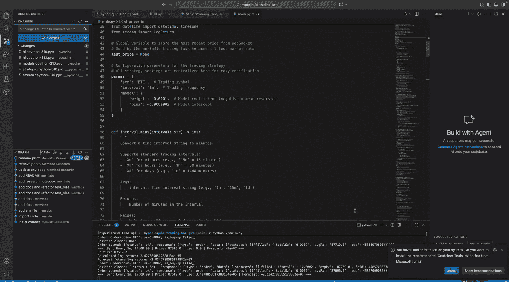
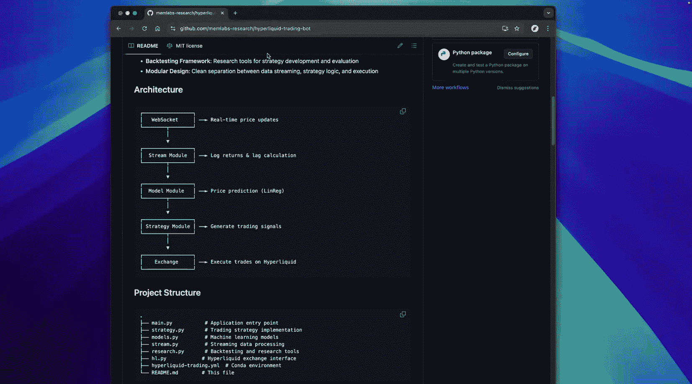
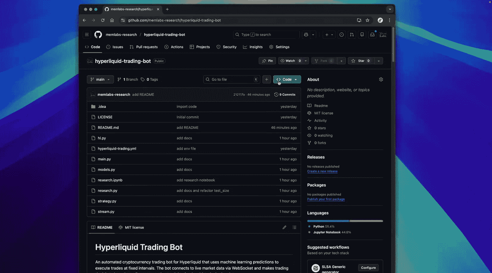
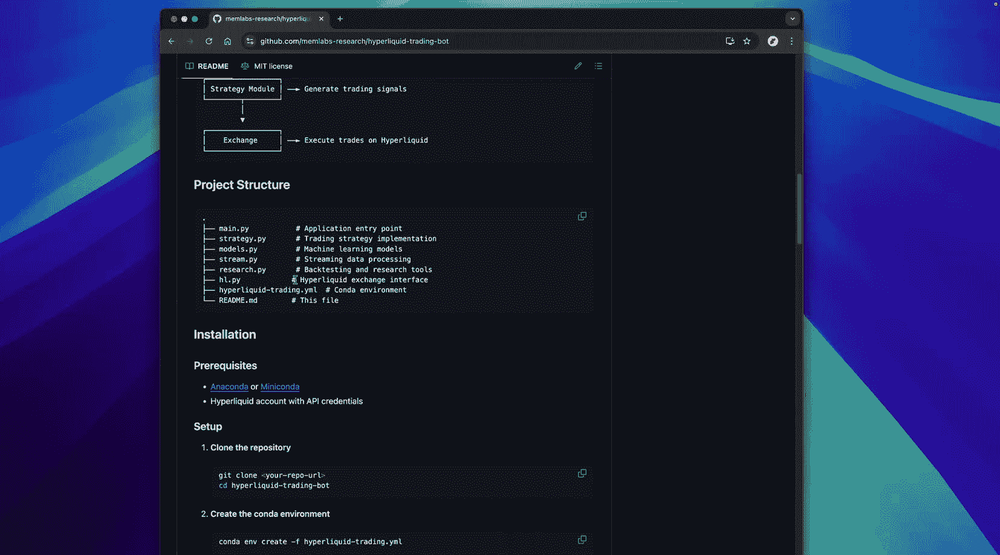
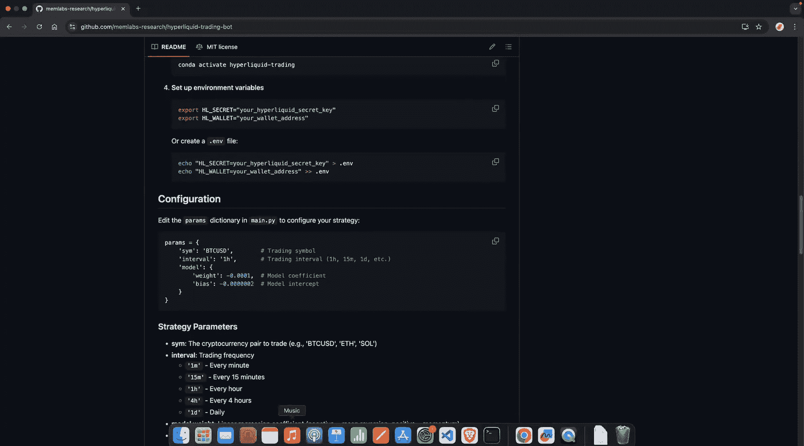
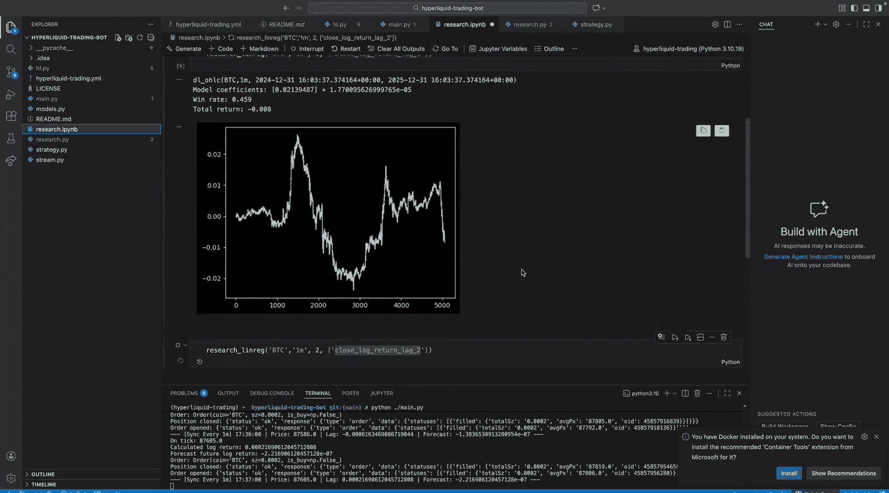
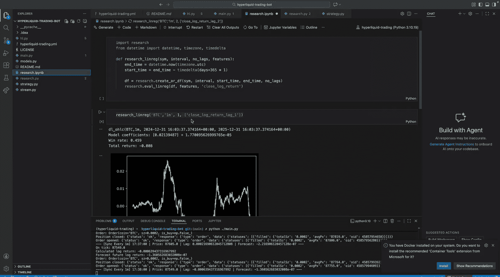

#  009：交易机器人构建实战 🚀







在本节课中，我们将把本系列视频中学到的所有知识整合起来，实际构建并实现一个交易机器人。我们将从项目结构、核心代码模块到策略实现，完整地走一遍流程，为你提供一个可以在此基础上进行研究和扩展的基础框架。



## 概述

本教程将指导你如何搭建一个基于机器学习的自动化交易系统。该系统会从交易所实时获取价格数据，使用线性回归模型进行预测，并根据预测结果执行交易。我们将使用 Hyperliquid 测试网进行演示，确保你在不损失真实资金的情况下进行实验。

---

## 项目结构与设置 🛠️

上一节我们介绍了本课程的目标，本节中我们来看看如何获取并设置项目。



首先，你需要克隆提供的 GitHub 项目仓库。按照项目 `README.md` 文件中的步骤，可以轻松完成环境设置并运行程序。

以下是设置项目的关键步骤：
1.  克隆代码仓库。
2.  创建并激活 Conda 虚拟环境（推荐使用 Miniconda）。
3.  设置必要的环境变量，包括你的钱包地址和私钥（用于 Hyperliquid 测试网）。
4.  安装项目依赖。

**核心概念：环境变量**
在 `config.py` 或通过系统环境变量设置你的密钥，例如：
```python
import os
WALLET_ADDRESS = os.getenv(‘HYPERLIQUID_WALLET_ADDRESS’)
PRIVATE_KEY = os.getenv(‘HYPERLIQUID_PRIVATE_KEY’)
```

---

## 核心代码模块解析 ⚙️

设置好项目后，我们来深入理解代码的核心模块。整个应用由几个关键部分组成，它们协同工作以实现自动化交易。

### 数据流模块

交易机器人的核心是实时处理数据。我们通过 WebSocket 从交易所订阅交易数据流。

**核心概念：异步编程与 WebSocket**
我们使用 Python 的 `asyncio` 库进行异步编程。这就像餐厅厨师同时处理多个订单，而不是一个接一个地做。在代码中，一个“任务”持续监听 WebSocket 获取最新价格，另一个“任务”则定期执行交易逻辑，两者互不阻塞。

以下是处理 WebSocket 连接和数据监听的核心逻辑：
```python
async def connect_and_listen(self):
    # 连接到 Hyperliquid 的 WebSocket
    # 订阅交易数据流
    # 在一个循环中持续接收消息
    while True:
        message = await websocket.recv()
        data = json.loads(message)
        # 更新全局变量中的最新价格
        global LAST_PRICE
        LAST_PRICE = data[‘price’]
```
这个模块还实现了自动重连机制，确保在网络波动或服务中断时能够恢复连接，这对需要长时间运行的交易机器人至关重要。

### 策略基类与滑动窗口

当接收到新的价格数据时，我们需要决定如何反应。这是通过策略类实现的。我们定义了一个抽象基类，所有具体策略都必须继承并实现它的 `on_tick` 方法。

**核心概念：滑动窗口与队列**
为了计算像对数收益这样的特征，我们需要维护一个最近价格的历史窗口。我们使用 `collections.deque`（双端队列）作为数据结构来实现滑动窗口。

**公式：对数收益计算**
对数收益的计算公式为：
\[
r_t = \ln(P_t) - \ln(P_{t-1})
\]
其中 \(P_t\) 是当前价格，\(P_{t-1}\) 是前一个价格。

使用 `deque` 可以在常数时间复杂度内从一端添加新数据，并从另一端移除旧数据，即使窗口很大也非常高效。以下是一个简化的流式处理器示例：
```python
from collections import deque
class StreamingProcessor:
    def __init__(self, window_size=2):
        self.price_window = deque(maxlen=window_size)
    def on_tick(self, price):
        self.price_window.append(price)
        if len(self.price_window) == self.window_size:
            # 计算对数收益
            log_return = math.log(self.price_window[-1]) - math.log(self.price_window[0])
            return log_return
        return None
```

### 机器学习模型

我们使用一个轻量级的线性回归模型进行预测。为了减少依赖，我们没有使用 `scikit-learn` 或 `PyTorch`，而是自己实现了一个简单的版本。

**核心概念：线性回归模型**
线性回归模型的预测公式为：
\[
\hat{y} = w \cdot x + b
\]
其中 \(w\) 是权重，\(x\) 是输入特征（例如当前对数收益），\(b\) 是偏置项。

以下是模型的核心实现代码：
```python
class LinearRegressionModel:
    def __init__(self, weights, bias):
        self.weights = np.array(weights)
        self.bias = bias
    def predict(self, X):
        # 支持单特征输入（标量）和多特征输入（向量）
        return np.dot(X, self.weights) + self.bias
```
这个模型接收在研究阶段确定的最优权重和偏置，并对输入的特征进行预测，输出对未来对数收益的预测值 \(\hat{y}\)。

---

## 交易策略与执行 🤖

理解了数据流和模型之后，本节我们来看看如何将它们组合成一个完整的交易策略。

### 基础吃单策略

我们实现了一个“基础吃单策略”。吃单策略是指主动与现有订单成交，消耗市场流动性，通常使用市价单。这是最简单直接的策略类型。

策略的工作流程如下：
1.  **特征计算**：从流式价格数据中计算当前的对数收益。
2.  **模型预测**：将当前对数收益输入线性回归模型，得到对未来走势的预测 \(\hat{y}\)。
3.  **生成订单**：根据预测值的符号（正或负）决定做多（买入）还是做空（卖出）。
4.  **执行订单**：通过交易所接口执行订单。

以下是策略核心 `on_tick` 方法的逻辑概览：
```python
def on_tick(self, price):
    # 1. 计算当前对数收益
    current_return = self.stream_processor.on_tick(price)
    if current_return is None:
        return # 窗口未满，等待更多数据
    # 2. 模型预测
    forecast = self.model.predict(current_return)
    # 3. 生成订单
    if forecast > 0:
        order = Order(coin=self.coin, size=self.size, side=‘buy’)
    else:
        order = Order(coin=self.coin, size=self.size, side=‘sell’)
    # 4. 执行订单
    self.exchange.execute_order(order)
```

### 订单执行

订单执行模块负责与 Hyperliquid 交易所的 API 进行交互。为了简化，我们的策略在每次发出新信号时，会先平掉现有仓位，再开立新的方向性仓位。

**核心执行步骤**：
1.  检查并关闭当前持仓。
2.  按照订单指定的方向和数量开立新持仓。
3.  处理并记录任何可能出现的API错误，防止程序意外崩溃。

---

## 参数研究与优化 🔬

一个策略能否盈利，关键在于其参数。我们提供了一个研究笔记本，帮助你系统地寻找最佳交易参数。

### 研究框架

研究流程与我们之前课程中进行的分析一致，现已整合成一个方便的函数。

以下是研究不同参数组合的示例代码：
```python
def research_strategy(interval=‘1m’, n_lags=1):
    # 获取指定时间间隔的历史K线数据
    df = exchange.fetch_ohlcv(interval)
    # 计算特征（滞后收益）和标签（未来收益）
    # 按时间序列划分训练集和测试集
    # 训练线性回归模型
    # 在测试集上回测，计算胜率、总回报等指标
    # 绘制资金曲线
    return weights, bias, win_rate, total_return
```
你可以通过循环尝试不同的 `interval`（如 `‘1h’`, `‘4h’`）和 `n_lags`，观察哪些参数组合能产生正向的、稳定的资金曲线。

### 关键任务

你的核心任务是：
1.  使用研究笔记本，找到在历史数据上表现良好的交易频率（interval）、滞后阶数（lags）、模型权重（weights）和偏置（bias）。
2.  将这些最优参数更新到主程序的配置中。
3.  在测试网上运行机器人，观察其实时表现。

**重要建议**：初期避免使用像“1分钟”这样高频的间隔进行实盘交易。手续费成本很容易吞噬微薄的预测收益。从“1小时”或“4小时”等较低频率开始研究更为稳妥。

---

## 总结与展望 🎯

本节课中我们一起学习了如何整合一个完整的自动化交易机器人。我们从项目搭建开始，逐步剖析了数据流模块、流式处理与滑动窗口的概念、轻量级机器学习模型的实现、以及具体的交易策略与执行逻辑。

这个项目是一个强大的**基础框架**。它演示了如何将数据流、模型预测和交易所执行连接起来的完整管道。然而，它本身并非一个“印钞机”。其真正的价值在于，为你提供了一个经过验证的、可工作的起点，你可以在此基础上：
*   **更换更复杂的模型**：如梯度提升树或神经网络。
*   **开发更精细的策略**：如加入风险管理、动态仓位调整、或结合订单簿信息的做市策略。
*   **优化执行逻辑**：减少不必要的频繁交易，以降低手续费影响。



恭喜你完成了整个 MemLabs 量化交易加速器系列！你现已掌握了从数据获取、特征工程、模型研究到实盘系统搭建的全套基础技能。真正的量化之旅始于独立研究和不断迭代。祝你研究顺利，新年快乐！




---
*本系列课程免费提供，感谢Patreon支持者的慷慨赞助。如果我的工作为你带来了价值，请考虑通过Patreon支持本频道，链接在视频描述中。这有助于我保持内容独立，持续创作我相信有价值的内容。*