# 课程1：深度学习入门与实践 🚀

在本节课中，我们将学习深度学习的基本概念，并通过一个实际案例——构建一个鸟类识别系统——来展示深度学习的强大能力。我们将从零开始，使用Python和FastAI库，在几分钟内完成一个能够识别鸟类图片的模型。通过这个过程，你将了解到深度学习如何自动从数据中学习特征，而无需手动编写复杂的规则。

---

## 深度学习的发展与现状 🌟

上一节我们介绍了课程的目标和内容，本节中我们来看看深度学习近年来的快速发展。2015年底，识别一张图片是否为鸟类还被认为几乎不可能，甚至成为一个笑话。然而，现在我们可以轻松地在几分钟内构建这样一个系统。

深度学习不仅在图像识别领域取得了突破，还在艺术生成、自然语言处理等多个领域展现出惊人的能力。例如，DALL-E 2和Midjourney等模型可以根据文本描述生成高质量的图像，而Google的Pathways语言模型能够理解并解释复杂的文本问题。

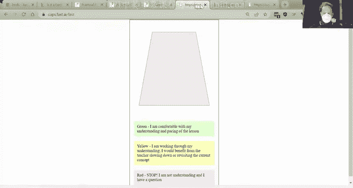

这些进展表明，深度学习已经从一个高不可攀的技术，变成了一个易于上手且功能强大的工具。接下来，我们将通过实际案例，一步步展示如何构建一个深度学习模型。

---

## 构建鸟类识别系统 🐦

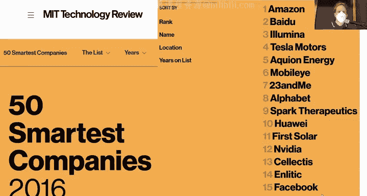

上一节我们了解了深度学习的快速发展，本节中我们来看看如何实际构建一个鸟类识别系统。我们将使用Python和FastAI库，通过简单的代码实现这一目标。

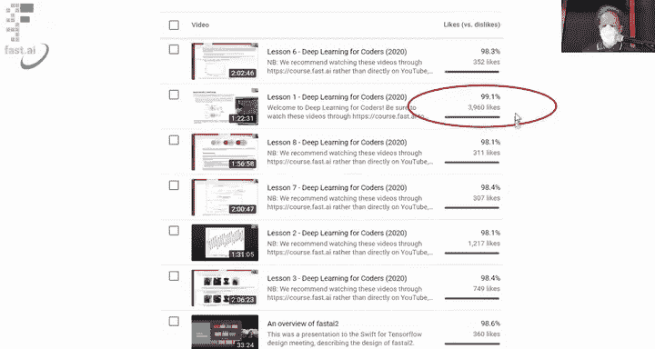

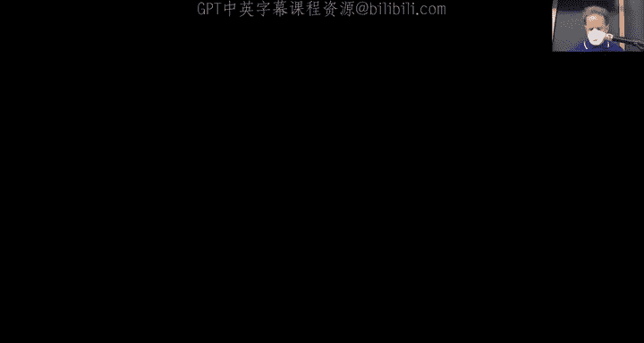

以下是构建鸟类识别系统的步骤：

1. **下载图片数据**：我们从DuckDuckGo搜索并下载鸟类和森林的图片，作为训练数据。
2. **准备数据**：使用FastAI的`DataBlock`来组织数据，指定图片的输入和标签（鸟类或森林）。
3. **训练模型**：使用预训练的ResNet模型，并通过微调（fine-tuning）适应我们的数据。
4. **测试模型**：用一张鸟类图片测试模型，查看其预测结果。

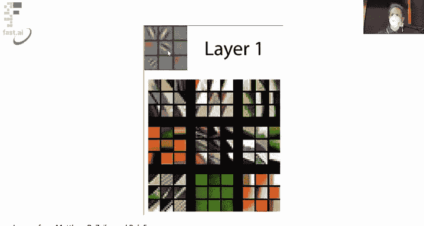

以下是核心代码示例：

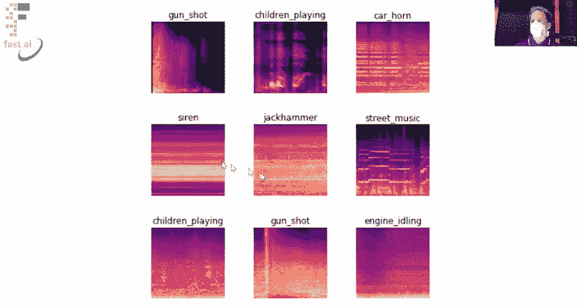

```python
from fastai.vision.all import *

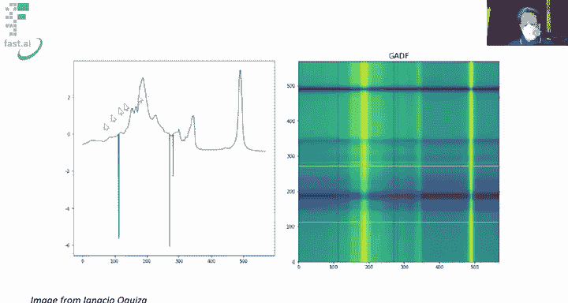

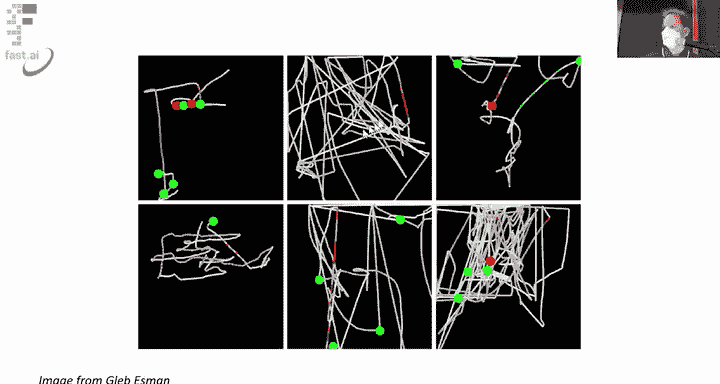

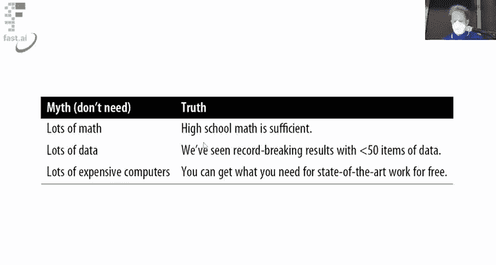

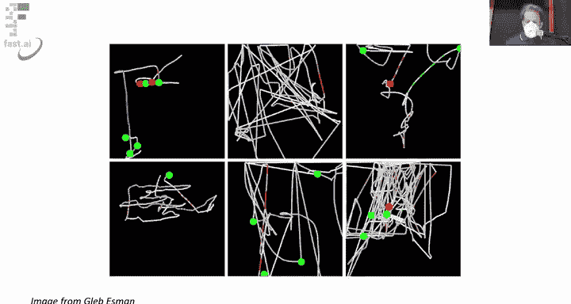

# 下载鸟类和森林图片
path = Path('bird_or_not')
bird_urls = search_images_ddg('bird photo', max_images=200)
forest_urls = search_images_ddg('forest photo', max_images=200)
download_images(path/'birds', urls=bird_urls)
download_images(path/'forests', urls=forest_urls)

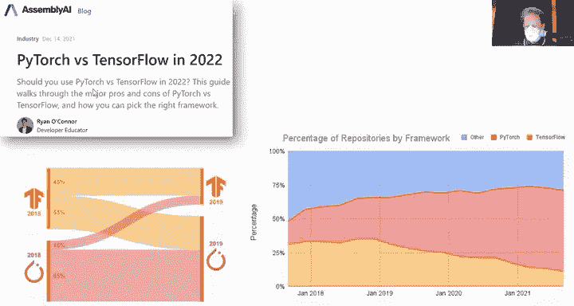

# 创建DataBlock
dls = DataBlock(
    blocks=(ImageBlock, CategoryBlock),
    get_items=get_image_files,
    splitter=RandomSplitter(valid_pct=0.2, seed=42),
    get_y=parent_label,
    item_tfms=Resize(192)
).dataloaders(path)

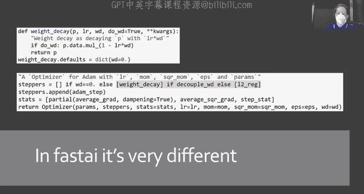

# 训练模型
learn = vision_learner(dls, resnet18, metrics=error_rate)
learn.fine_tune(3)

# 测试模型
img = PILImage.create('bird.jpg')
pred, _, probs = learn.predict(img)
print(f"预测结果: {pred}, 概率: {probs}")
```

通过这个简单的流程，我们可以在几分钟内训练出一个准确率较高的鸟类识别模型。这展示了深度学习在实际应用中的高效性和易用性。

---

## 深度学习的基本原理 🧠

上一节我们构建了一个鸟类识别系统，本节中我们来看看深度学习的基本原理。深度学习模型的核心是神经网络，它通过多层数学运算自动从数据中学习特征。

传统的机器学习方法需要手动设计特征，例如在图像识别中，专家需要定义边缘、颜色梯度等特征。而深度学习模型通过以下步骤自动学习特征：

1. **输入数据**：将图片转换为数字矩阵，每个像素点包含红、绿、蓝三个通道的数值。
2. **神经网络结构**：神经网络通过多层计算，每一层都会提取更复杂的特征。例如，第一层可能识别边缘，第二层识别形状，第三层识别物体部分。
3. **损失函数**：模型通过损失函数评估预测结果与真实标签的差距。
4. **优化权重**：通过反向传播算法调整网络中的权重，使损失函数最小化。

以下是神经网络的基本公式：

```
输出 = σ(W · 输入 + b)
```

其中，`W`是权重矩阵，`b`是偏置向量，`σ`是激活函数（如ReLU）。通过多次迭代优化，模型能够逐渐学习到数据中的规律。

---

## 深度学习的应用领域 🌍

上一节我们介绍了深度学习的基本原理，本节中我们来看看深度学习的广泛应用领域。深度学习不仅在图像识别中表现出色，还在许多其他领域取得了突破性进展。

以下是深度学习的主要应用领域：

1. **自然语言处理（NLP）**：如机器翻译、文本生成、情感分析等。
2. **计算机视觉**：如图像分类、目标检测、图像生成等。
3. **医疗与生物**：如疾病诊断、药物发现、基因序列分析等。
4. **推荐系统**：如电商平台的产品推荐、音乐和视频的内容推荐。
5. **游戏与机器人**：如AlphaGo、自动驾驶、机器人控制等。

深度学习的强大之处在于其通用性。通过简单的调整，同一个模型可以应用于不同领域。例如，图像分类模型可以用于声音分类（通过将声音转换为频谱图）或时间序列分析（通过将数据转换为图像）。

---

## 总结与下一步 🎯

在本节课中，我们一起学习了深度学习的基本概念，并通过构建一个鸟类识别系统展示了深度学习的实际应用。我们了解到，深度学习通过自动学习特征，大大简化了传统机器学习中的复杂步骤。

总结本节课的内容：

1. **深度学习的快速发展**：从2015年的“不可能”到现在的“轻松实现”。
2. **实际案例**：使用FastAI库在几分钟内构建鸟类识别系统。
3. **基本原理**：神经网络通过多层计算自动学习特征，无需手动设计。
4. **广泛应用**：深度学习在图像、文本、医疗等多个领域都有出色表现。

下一步，建议你尝试修改代码，构建自己的图像分类模型。例如，尝试识别更多类别（如猫、狗、汽车等），或者探索其他类型的深度学习应用（如文本生成或推荐系统）。

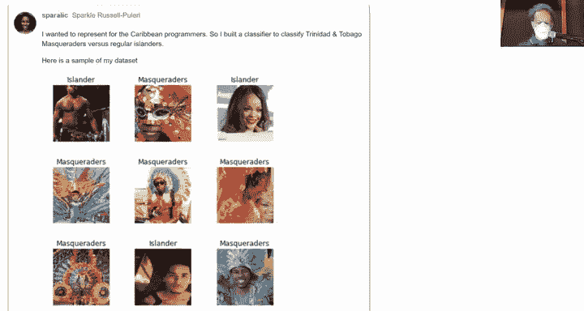

同时，不要忘记阅读《Deep Learning for Coders》第一章，并在论坛中分享你的项目成果。通过实践和分享，你将更快掌握深度学习的核心技能。

感谢你的学习，我们下节课再见！ 👋