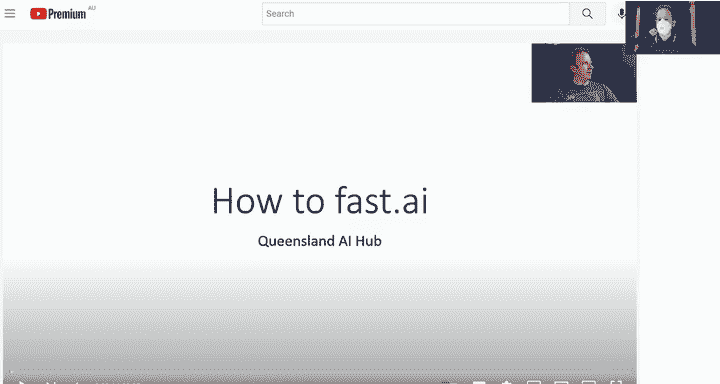
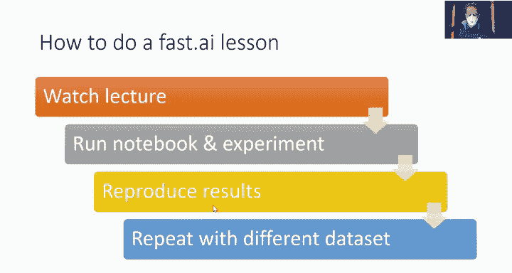
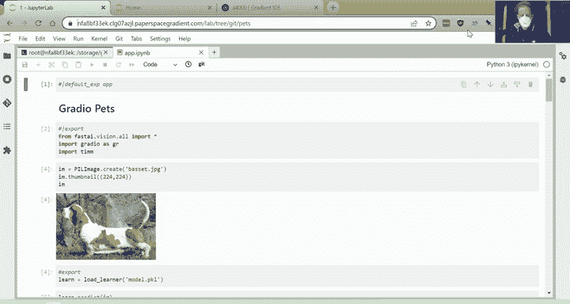
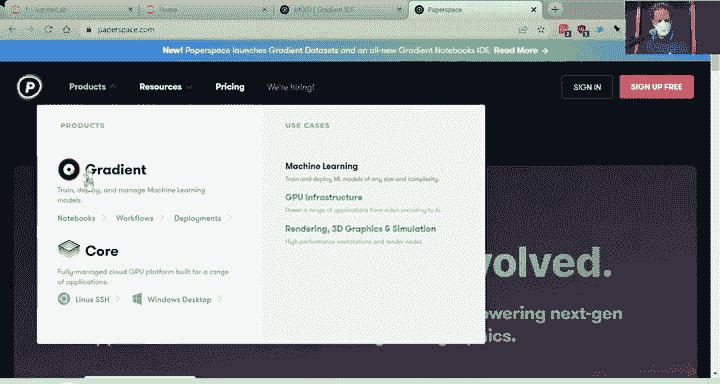
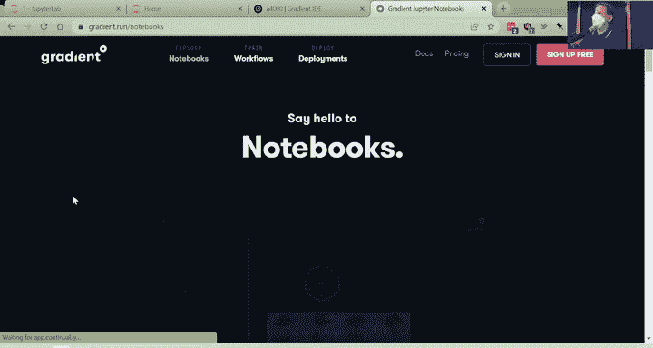
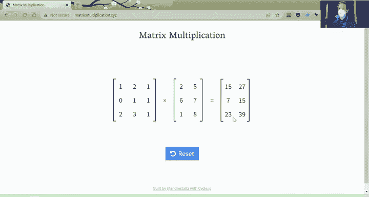
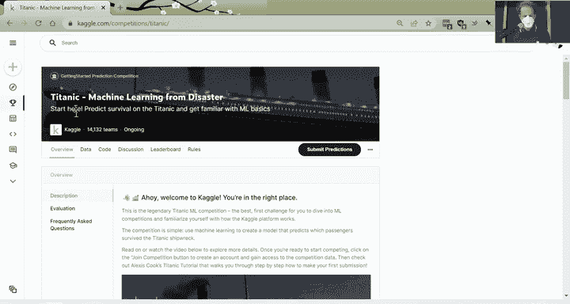
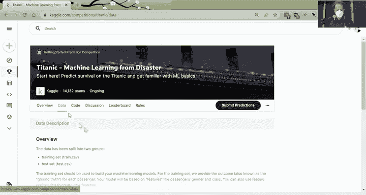
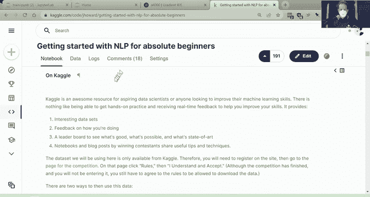

# 课程3：神经网络基础与数学原理 🧠

在本节课中，我们将深入探讨神经网络背后的核心数学原理。我们将从简单的函数拟合开始，逐步理解梯度下降、矩阵乘法以及如何通过组合基本单元构建复杂的神经网络。课程内容旨在让初学者也能轻松理解这些核心概念。

---

## 课程概述与反馈

大家好，欢迎来到《给码农的深度学习实践课程》的第三课。

我们本周进行了一个快速调查，以了解大家对课程进度的感受。超过一半的学员认为当前节奏适中。在其余学员中，一部分认为课程进度稍慢，另一部分则认为稍快。总体而言，这可能是我们能达到的最佳平衡。

一般来说，前两节课的节奏对于已经熟悉相关基础技术的学员来说较为轻松。后续课程则会更多地深入一些基础原理。今天我们将讨论矩阵乘法、梯度、微积分等内容。对于数学背景较强但编程经验较少的学员，这节课可能会更舒适，反之亦然。

请记住，官方课程更新论坛上有所有最新信息，课程网站也提供了相关资源。当你观看课程视频时，如果遇到问题，很可能已经有人提出过类似疑问。因此，请务必先搜索论坛并查看常见问题。如果找不到答案，欢迎在论坛上提问。

我想指出的一点是，在课程网站的课程讨论帖中，还有一个“第零课”。第零课大量借鉴了Raex的著作《元学习》，而该书内部又大量借鉴了我多年来关于如何快速学习AI的观点。我们尝试将学习科学本身的技术要点融入课程中。这门课程可能与你上过的任何其他课程都不同，我强烈建议你也观看第零课。第零课的最后部分是关于如何从零开始设置Linux系统，如果你不感兴趣可以跳过，但其余部分充满了有价值的信息，我认为你会觉得有用。

---

## 高效学习法

以下是进行Fast.ai课程学习的基本思路。

首先，观看讲座视频。我通常建议先完整地观看一遍视频，不要中途暂停。然后，再回过头来，边看边暂停，同时运行笔记本代码。否则，在不知道代码走向的情况下运行笔记本，可能会难以理解。

编写笔记本的目的是让你能够逐步学习。显然，你可以按照书的章节来学习，运行每一个代码单元格，并尝试修改输入和输出来理解其工作原理。然后，尝试复现这些结果。最后，尝试使用不同的数据集重复整个过程。如果你能完成最后一步，那将是一个相当大的挑战，尤其是在课程开始时，因为有太多新概念。但这确实能证明你已经掌握了核心内容。

关于“复现结果”这一步，我推荐使用Fastbook代码仓库中的一个特殊文件夹。这个文件夹包含了书中所有章节的内容，但移除了除标题外的所有文本和所有输出。这是测试你对章节理解程度的绝佳方式。在运行每个单元格之前，试着问自己：这个单元格是做什么的？它会输出什么（如果有的话）？如果你慢慢思考这个过程，这是一种极好的自学方式。任何时候不确定，都可以跳回到包含文本的笔记本来提醒自己，然后再回到“干净”版本。

我称之为自学，但正如我们之前提到的，对大多数人来说，最好的学习方式是在一定程度上与他人一起学习。研究表明，将学习作为一种社交活动，你更有可能坚持下去。论坛是寻找和创建学习小组的好地方。你还会在论坛上找到我们Discord服务器的链接，那里也有一些学习小组。无论是线下还是线上的学习小组，都是取得良好进展并找到水平相近伙伴的好方法。如果你所在的地区、时区或水平没有合适的学习小组，那就创建一个。你只需发帖说：“嘿，我们来创建一个学习小组吧。”

---

## 社区精彩项目展示

本周社区有很多精彩的活动，我无法一一展示。我使用了论坛的摘要功能，抓取了获得最高投票的一些项目，并快速展示其中几个。

*   **漫威角色检测器**：识别你最喜欢的漫威角色。
*   **石头剪刀布游戏**：使用石头、剪刀、布的图片符号，据说电脑总是输——这是我最喜欢的游戏类型。
*   **埃隆·马斯克检测器**：周围有很多埃隆的图片，这个检测器很方便，无论你是想找到更多还是更少关于他的内容。
*   **基于航拍照片预测平均温度**：这个想法非常有趣。事实证明，你可以预测得相当好。在布里斯班，预测误差在1.5摄氏度以内。这位学员实际上是一位真正的气象学家。
*   **云检测器**：在漫威角色检测器的基础上，现在还有了“这是漫威角色吗？”的检测器。
*   **这是什么恐龙**：我女儿很喜欢这个。我感觉现在的恐龙种类比我小时候多十倍，所以我从来不知道它们的名字，这个工具非常方便。
*   **表情选择冒险游戏**：通过面部表情选择你的路径。
*   **音乐流派分类**：这个也很酷。
*   **微软Power App应用**：Brian Smith创建了一个可以在手机上运行的微软Power App应用。这很酷，我猜Brian可能就在微软工作，这也是推广他自己作品的机会。
*   **艺术运动分类器**：论坛上有一个关于不同艺术运动之间相似性的有趣讨论。
*   **红绿灯检测器项目**：这个项目也很酷，有完整的推文线程和博客文章介绍，特别棒。

---

## 平台与工具介绍

在深入探讨神经网络背后的机制之前，我想先快速展示几个小技巧。本周我一直在研究如何提高神经网络的准确性，并创建了这个宠物检测器。这个检测器不仅仅是区分猫狗，还能识别具体品种，这显然要困难得多。

因为我将这个项目发布在了Hugging Face Spaces上，你可以下载并查看我的代码。只需在Space页面上点击“Files and versions”（你可以在论坛和课程网站上找到链接），就能看到所有文件并下载到自己的电脑上。

现在，我来展示一下我在这里有什么。今天，我使用了一个不同的平台。过去我向你展示过Colab和Kaggle，我们也看过如何在自己的电脑上运行模型（虽然主要不是训练模型，而是使用训练好的模型创建应用）。Paperspace是另一个网站，有点像Kaggle和Google Colab。特别是，他们有一个名为Gradient Notebooks的产品。就目前而言，在我看来，这是运行本课程和进行实验的最佳平台。我解释一下原因。

为什么前两周我没有使用它？因为我一直在等待他们为我们构建一些功能，使其变得特别好用，他们刚刚完成。我整个星期都在使用它，体验非常棒。

这就是它的样子。你在云端有一台机器在运行，但它的特别之处在于，你使用的是真正的计算机，而不是Kaggle或Colab那种奇怪的虚拟版本。

如果你点击下面的这个按钮，你会得到一个完整的JupyterLab版本，或者你可以切换到经典的Jupyter Notebooks完整版本。我今天实际上将在JupyterLab中操作，因为对于不熟悉终端的初学者来说，这是一个非常好的环境（我知道课程中很多人处于这种情况）。你几乎可以图形化地完成所有操作。这里有文件浏览器，你可以看到我的pets代码仓库，它有Git仓库功能，你可以拉取和推送代码。然后，你还可以打开终端，创建你的笔记本等等。

我倾向于全屏使用它，它就像是一个完整的IDE。你可以看到我这里有一个终端，还有一个笔记本。他们提供免费的GPU。最重要的是有两个好功能：一是你可以支付大约8或9美元/月来获得更好的GPU，并且基本上可以无限制地使用时长；二是他们有持久存储。在Colab上，如果你玩过一段时间，会发现很烦人，因为你必须折腾着把东西保存到Google Drive。在Kaggle上，也没有真正持久化环境的方法。而在Paperspace上，你保存在存储中的任何东西，下次回来时都会在那里。

我将添加所有这些功能的详细教程。如果你真的想充分利用这个平台，请查看这些教程。

---

## 核心概念回顾：训练与部署

我认为，我希望你从第二课中学到的主要东西，不一定是如何使用特定平台训练模型并通过JavaScript或在线平台将其部署到应用程序中的所有细节。

我希望你理解的关键概念是：整个过程分为两个主要部分。

第一部分是**训练阶段**。在训练阶段结束时，你会得到一个`model.pkl`文件。一旦你有了这个文件，它就是一个可以接收输入并根据你训练的模型输出结果的“东西”。因为这个过程发生得很快，一旦你有了训练好的模型，通常就不再需要GPU了。

然后是**部署阶段**。这是一个独立的步骤。

我来展示一下我是如何训练我的宠物分类器的。你可以看到我有两个Jupyter笔记本。一个是`app.ipynb`，它将用于在生产中进行推理（预测）；另一个是`train_model.ipynb`，用于训练模型。

第一部分我会跳过，因为你之前已经见过了。我创建了我的图像数据加载器，用`show_batch`检查数据是否正常，训练了一个ResNet34模型，得到了7%的准确率。这相当不错。

但看看这个，这里有一个链接，指向我和Ross Whiteman创建的一个笔记本。我们可以尝试通过寻找更好的架构来改进这个模型。目前，在PyTorch Image Models库中有超过500种架构。我们将在课程中学习它们是什么，以及它们有何不同。但总的来说，它们都是数学函数，基本上就是矩阵乘法和我们今天要讨论的非线性激活函数（如ReLU）。大多数时候，这些细节并不重要。我们关心的是三件事：它们有多快？它们使用多少内存？以及它们有多准确？

我和Ross所做的是，我们从PyTorch Image Models库中获取了所有模型，并用很少的代码创建了这个图表。在这个图表上，X轴是每个样本的推理时间（秒），所以越靠左越好（越快）。Y轴是准确率（在ImageNet上的准确率）。一般来说，你希望模型位于图表的**左上角**区域。

我们主要使用ResNet，你可以看到下面这里是ResNet18。ResNet18是一个特别小和经典的版本，常用于原型设计。我们经常使用ResNet34，就是这里这个。你可以看到，这种经典模型虽然现在已不是最先进的，但仍然被广泛使用。

我们可以开始关注上面这些模型，找出其中一些更好、更快的模型，比如这些`convnext`模型。我尝试了它们在我的宠物数据集上的效果，发现它们表现不是特别好。所以我想，好吧，试试别的。接下来我尝试了这些`coatnet`模型。这个模型特别有趣，它的准确率非常高。如果你想要0.001秒的推理时间，它是最准确的。所以我尝试了它。

我们如何尝试呢？我们只需要做的是：首先导入`timm`模块（PyTorch Image Models），然后我们可以列出模型并传入一个通配符匹配字符串。这里我可以找到我刚才看到的模型。当我创建`vision_learner`时，我只需要将模型名称作为字符串传入。你之前看到这个不是字符串，那是因为它是Fast.ai库提供的模型。Fast.ai只提供了相当少的模型。如果你安装了`timm`（`pip install timm`），你会得到数百个模型，并且以字符串形式传入。

如果我训练那个模型，每个epoch的时间从20秒增加到27秒，所以它稍微慢了一点。但准确率从7.2%**提升**到了5.5%。这是一个相当大的相对提升（7.2%除以5.5%，大约是30%的改进）。这非常棒。说实话，这是几年来我们第一次看到真正超越ResNet、广泛可用且能在普通GPU上使用的模型。所以这是一个很大的进步。现在有一些架构在很多情况下确实是更好的选择，比如这些`convnext`架构。如果你不确定用什么，可以试试这些`convnext`架构。

你可能会好奇这些名字的含义。显然，`tiny`、`small`、`large`等表示模型的大小，这决定了它将占用多少内存以及运行速度。然后，这些带有`in22k_ft1k`的模型，它们是在更多数据上训练的。ImageNet有两个不同的图像数据集：一个有1000个类别，另一个有22000个类别。这个是在有22000个类别的数据集上训练的，所以它们通常在标准自然物体照片上会更准确。

从那里，我导出了我的模型。现在我已经训练好了我的模型，完成了。显然，你还可以做其他事情，比如增加更多的训练轮次（epochs），使用图像增强等等。但我发现这个结果已经很难被大幅超越了。如果你们中有人能找到更好的方法，我很乐意听听。

然后，为了将其转化为应用程序，我做了和上周看到的相同的事情：加载学习器。我想向你展示的是，一旦我们加载了学习器并调用`predict`，它会输出一个包含37个数字的列表。这是因为有37种猫狗品种，这些数字是每个品种的概率。它们的顺序是什么？这是一个重要的问题。答案是，Fast.ai总是将这些关于类别的信息（在这种情况下是猫狗品种）存储在称为`vocab`的对象中，它位于数据加载器内部。我们可以获取这些类别，它只是一个字符串列表，告诉我们顺序。

如果我们现在将类别和概率压缩（zip）在一起，我们会得到一个字典，告诉你每个品种的概率。这是一只巴吉度猎犬，所以你可以看到，几乎可以肯定是巴吉度猎犬。

从那里开始，就像上周一样，我们可以创建我们的界面，然后启动它。我们完成了。

---

## 深入模型内部：参数与层

我们刚才到底做了什么？这个神奇的`model.pkl`文件到底是什么？

我们可以看一下这个`model.pkl`文件。它是一个名为`Learner`的对象类型。`Learner`有两个主要部分。第一部分是你将图像转换为模型输入所需的预处理步骤列表，基本上就是这里的信息（你的数据块或图像数据加载器等）。第二部分，也是最重要的，是训练好的模型。

你可以通过获取`.model`属性来获取训练好的模型。我将其称为`m`。然后如果我输入`m`，我可以查看这个模型。这里有很多东西。这些东西是什么？我们会在课程中逐步学习。但基本上，你会发现它包含很多层，因为这是一个深度学习模型。你可以看到它像一棵树，因为很多层本身又由层组成。有一个名为`timm_body`的层（这是模型的大部分），然后在最后有第二个名为`Sequential`的层。`timm_body`包含一个名为`model`的东西，然后它包含`stem`和`stages`，`stages`又包含`stage0`、`stage1`等等。

我们来看看其中的一个。在PyTorch中有一个非常方便的方法叫做`get_submodule`，我们可以传入一个点分隔的字符串来导航这个层次结构。例如，`0.model.stem.1`。这将返回这个`LayerNorm`层。

这个`nn.Conv3d`是什么？关键点是，它有一些代码实现了我们讨论过的数学函数。另一件我们学到的事情是，它有**参数**。我们可以列出它的参数，看，就是很多很多的数字。

我们再拿一个例子，我们可以看看`0.model.stages.0.block.1.mlp.fc1`和它的参数。又是很大一堆数字。

这里到底发生了什么？这些数字是什么？它们究竟是从哪里来的？这些数字怎么能判断出某物是不是巴吉度猎犬？

---

## 从基础开始：函数拟合与梯度下降

为了回答这个问题，我们将看一个Kaggle笔记本：“神经网络到底是如何工作的？”我这里有一个本地版本，将带你过一遍。

基本思想是：机器学习模型是将函数拟合到数据的东西。我们从一个非常灵活（事实上是无限灵活）的函数——神经网络开始。我们让它做一件特定的事情：识别我们给它的数据样本中的模式。

让我们做一个比神经网络简单得多的例子：一个二次函数。

让我们创建一个函数`f`，它是 `3x² + 2x + 1`。这是一个系数为3、2和1的二次函数。我们可以绘制这个函数`f`并给它一个标题。如果你以前没见过，美元符号之间的东西叫做LaTeX，基本上是我们用来排版数学方程的方式。

运行后，你可以看到这个函数和标题。这就是二次函数。

我们要做的是，假设我们不知道这是真实的数学函数，我们试图找到它。因为这显然比判断一张图像是否是巴吉度猎犬的函数要简单得多。我们只是从超级简单的开始。这是真实函数，我们将尝试从一些数据中重建它。

如果我们有一种更简单的方法来创建不同的二次函数，将会非常有帮助。所以我在这里定义了一个二次函数的一般形式，系数为`a`、`b`和`c`，在特定点`x`处，它是 `ax² + bx + c`。

让我们测试一下。对于`x=1.5`，就是 `3*1.5² + 2*1.5 + 1`，这是我们之前的二次函数。

现在我们将要创建许多不同的二次函数来测试它们，并找出哪个最好。这是Python中一个有些高级但非常有用的特性，如果你不熟悉，值得学习，它在很多编程语言中都有使用，称为函数的**部分应用**。基本上，我想要这个确切的函数，但我想固定`a`、`b`和`c`的值以选择一个特定的二次函数。

在Python中，固定函数参数值的方法是调用一个叫做`partial`的东西，传入函数，然后传入你想要固定的值。例如，如果我调用`make_quadratic(3, 2, 1)`，这将创建一个系数为3、2和1的二次方程。你可以看到，如果我传入`1.5`，我得到了和之前完全相同的值。

好的，我们现在有能力通过传入二次函数的系数参数来创建任何二次方程。这给了我们一个函数，然后我们可以像调用任何普通函数一样调用它，现在它只需要一个值`x`，因为另外三个`a`、`b`、`c`现在已经固定了。如果我们绘制这个函数，我们会得到完全相同的形状，因为系数相同。

现在我将展示一些数据的例子，这些数据匹配这个函数的形状，但在现实生活中，数据永远不会完全匹配函数的形状，它会有一些噪声。这里有几个函数来添加一些噪声。

所以你可以看到，我仍然保留了基本的函数形式，但这些数据点有些分散。至于我是如何实现这些的，完全取决于你，这不是超级必要，但这些都是我们经常使用的东西。这是为了创建正态分布的随机数。这是设置随机种子，以便每次运行不会得到相同的随机数。这个函数特别有用，它创建了一个张量（在这种情况下是一个向量），从-2到2等步长，有20个点，这就是为什么这里有20步。

然后我的`y`值就是`f(x)`加上这个噪声量。正如我所说，这些细节不太重要，主要要知道的是我们现在有一些随机数据。所以现在的想法是，我们将尝试重建原始的二次方程，找到一个匹配这些数据的方程。

我们该怎么做呢？我们可以做的是创建一个名为`quadratic`的函数。首先，将我们的数据绘制为散点图，然后绘制一个函数，这个函数是我们传入的二次函数。

这是一个在Jupyter Notebook中进行实验非常有用的东西：`interact`函数。如果你把它加在一个函数上，它会给你这些漂亮的小滑块。

这是一个系数为1.5、1.5、1.5的二次函数的例子。它拟合得不是特别好。

我们如何尝试让它拟合得更好呢？我想我会做的是，拿起第一个滑块，试着向左移动，看看它看起来是变好了还是变差了。那看起来更差了。我认为它需要更弯曲，所以试试另一个方向。是的，看起来不错。对下一个滑块做同样的事情，这样移动。不，我认为那更差。试试另一个方向。好的，最后一个滑块，试试这个方向。那更差，试试这个方向。

你可以看到我们能做什么：我们基本上挑选每个系数，一次一个，尝试增加一点，看看是否改善，尝试减少一点，看看是否改善，找到改善的方向，然后朝那个方向滑动一点。完成后，我们可以回到第一个，看看是否能变得更好。实际上你可以看到那还不错，因为我知道