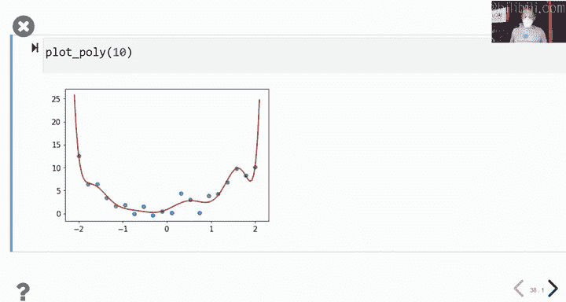
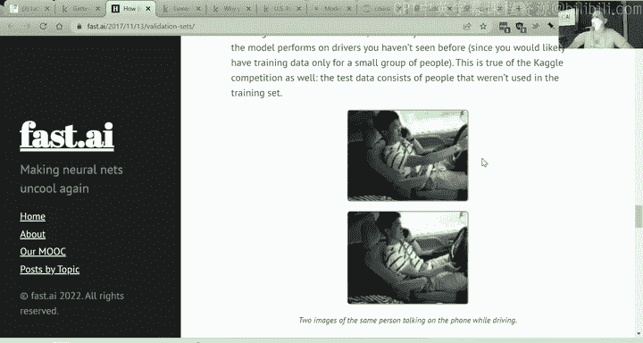
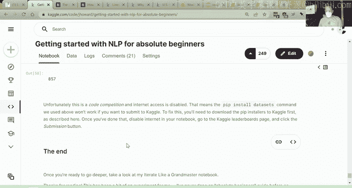
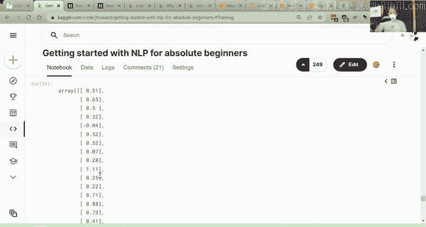

# 课程4：自然语言处理入门 🚀

在本节课中，我们将学习自然语言处理的基础知识，特别是如何使用预训练模型进行微调。我们将使用Hugging Face Transformers库，而不是FastAI库，以便大家能够熟悉不同的深度学习工具。通过本课程，你将学会如何将文本数据转换为模型可以理解的格式，并训练一个模型来解决实际问题。

---

## 概述 📖

自然语言处理是深度学习中的一个重要领域，涉及文本数据的处理和分析。本节课我们将学习如何使用预训练模型进行微调，以解决文本分类问题。我们将通过一个Kaggle竞赛实例，逐步讲解数据准备、模型训练和评估的全过程。

---

## 什么是预训练模型和微调？ 🧠

预训练模型是一组已经训练好的参数，这些参数在某些任务上已经表现良好。微调是在这些预训练参数的基础上，针对特定任务进行进一步训练的过程。这类似于在已知一些参数的情况下，调整其他参数以更好地适应新任务。

### 微调的基本步骤：
1. **构建语言模型**：使用大量文本数据（如维基百科）训练一个模型，使其能够预测下一个单词。
2. **领域适应**：在特定领域的数据（如电影评论）上进一步训练语言模型。
3. **任务微调**：将模型调整为特定任务（如情感分类）。

---

## 从预测下一个单词到分类任务 🔄

在计算机视觉中，预训练模型的早期层通常学习通用特征（如边缘检测），而后期层则学习特定任务的特征。在NLP中，类似地，我们可以通过以下步骤将语言模型转换为分类模型：
1. 删除预训练模型的最后一层（分类层）。
2. 添加一个新的随机初始化层，用于预测特定任务的类别。
3. 通过微调训练所有层，使模型适应新任务。

---

## 实战：Kaggle竞赛实例 🏆

我们将通过一个Kaggle竞赛实例来学习NLP的完整流程。竞赛任务是判断两个短语是否相似，评分范围从0到1。

### 数据准备
以下是数据准备的关键步骤：

1. **加载数据**：使用Pandas读取CSV文件，查看数据的基本信息。
2. **数据预处理**：将多个字段（如锚点、目标、上下文）拼接成一个字符串，作为模型的输入。
3. **划分数据集**：将数据分为训练集和验证集，以避免过拟合。

### 文本转换为数字
神经网络只能处理数字，因此我们需要将文本转换为数字。这一过程分为两个步骤：

1. **分词**：将文本拆分为更小的单元（如单词或子词）。
2. **数值化**：为每个分词分配一个唯一的ID。

以下是分词和数值化的示例代码：
```python
from transformers import AutoTokenizer

tokenizer = AutoTokenizer.from_pretrained("model_name")
tokens = tokenizer("示例文本")
print(tokens)
```

### 模型训练
使用Hugging Face Transformers库训练模型：

1. **选择模型**：选择一个预训练模型（如DeBERTa V3）。
2. **配置训练参数**：设置批次大小、学习率等。
3. **训练模型**：使用训练集训练模型，并在验证集上评估性能。

以下是训练模型的示例代码：
```python
from transformers import AutoModelForSequenceClassification, Trainer, TrainingArguments



model = AutoModelForSequenceClassification.from_pretrained("model_name", num_labels=1)
training_args = TrainingArguments(
    output_dir="./results",
    learning_rate=2e-5,
    per_device_train_batch_size=16,
    num_train_epochs=3,
)
trainer = Trainer(
    model=model,
    args=training_args,
    train_dataset=train_dataset,
    eval_dataset=val_dataset,
)
trainer.train()
```

### 评估与预测
训练完成后，使用模型对测试集进行预测，并提交结果到Kaggle。



---

## 过拟合与验证集 ⚠️

过拟合是机器学习中的常见问题，指模型在训练集上表现良好，但在新数据上表现不佳。为了避免过拟合，我们需要使用验证集来评估模型的泛化能力。

### 如何创建验证集？
1. **随机划分**：适用于数据分布均匀的情况。
2. **时间划分**：适用于时间序列数据，将最近的数据作为验证集。
3. **基于实体的划分**：确保验证集中的实体（如用户、设备）未出现在训练集中。

---

## 指标与损失函数 📊

在训练模型时，我们需要关注两个关键概念：
1. **损失函数**：用于优化模型参数，通常是平滑可导的函数（如均方误差）。
2. **指标**：用于评估模型性能，可能与损失函数不同（如准确率、相关系数）。

在Kaggle竞赛中，我们需要根据竞赛要求选择合适的指标（如皮尔逊相关系数）。

### 皮尔逊相关系数
皮尔逊相关系数用于衡量两个变量之间的线性关系，取值范围为-1到1。值越接近1，表示预测值与真实值越相似。

---

## 异常值的处理 🛠️

异常值可能对模型的训练和评估产生负面影响。处理异常值时，不应简单地删除它们，而应深入分析其来源和影响。例如，在加州房价数据集中，异常值可能代表不同类型的房屋（如宿舍或低收入住房），需要单独处理。

---

## NLP的应用与风险 🌐

NLP技术在许多领域具有广泛的应用前景，如情感分析、文本分类和自动生成内容。然而，这些技术也可能被滥用，例如通过自动生成的文本操纵舆论或传播虚假信息。因此，我们需要在利用NLP技术的同时，警惕其潜在风险。



---

## 总结 🎉

本节课中，我们一起学习了自然语言处理的基础知识，包括预训练模型的微调、文本数据的处理、模型训练与评估。通过Kaggle竞赛实例，我们掌握了使用Hugging Face Transformers库解决实际问题的完整流程。希望这些知识能够帮助你在NLP领域取得更多进展！




---