# 深度学习实践课程1｜第7课：神经网络内部机制与多目标模型 🧠

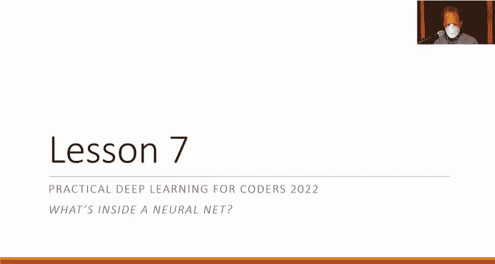

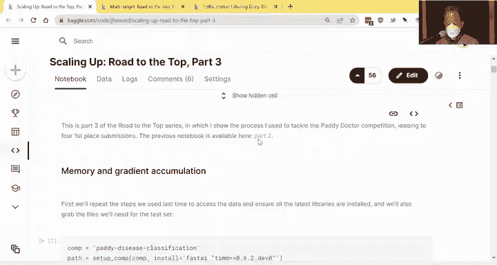


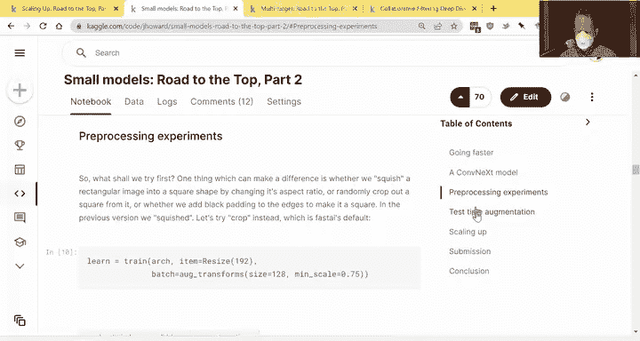


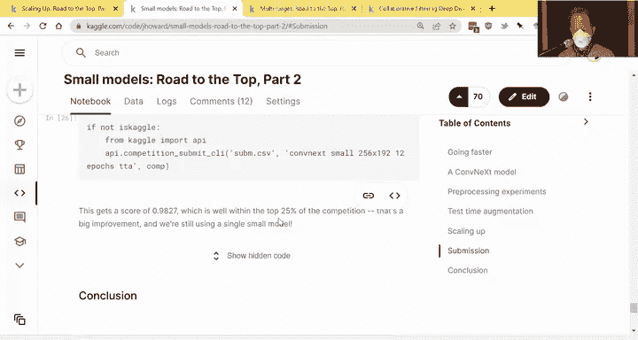


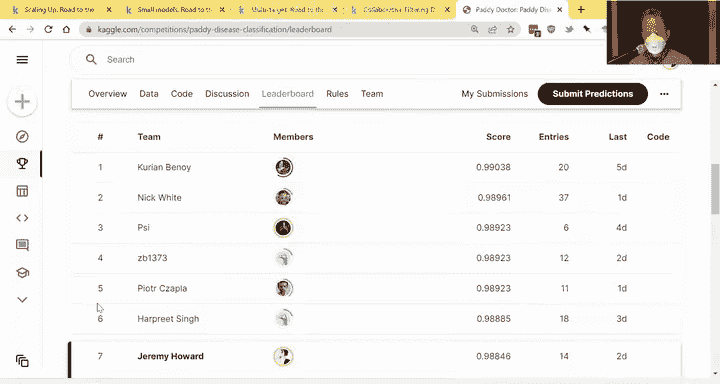


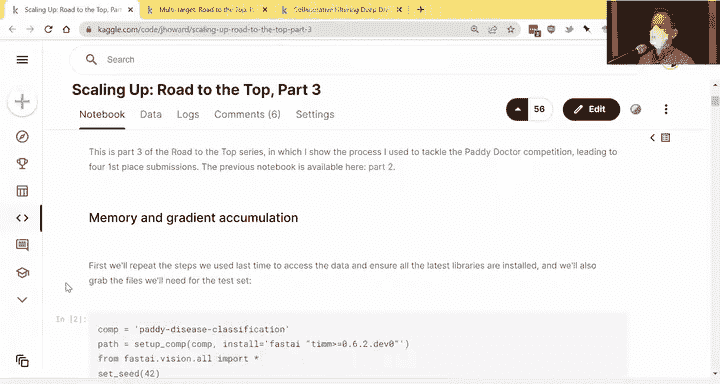

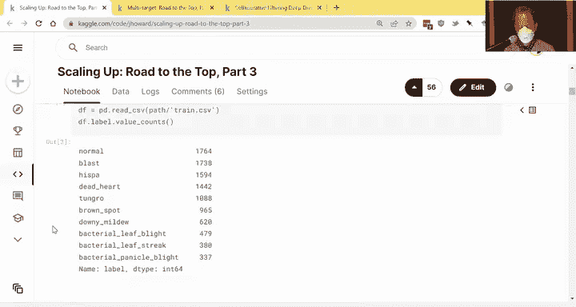

在本节课中，我们将深入探讨神经网络的内部机制，特别是如何通过梯度累积技术训练更大的模型，以及如何构建能够同时预测多个目标（如水稻病害和品种）的模型。我们还将学习协同过滤的基础知识，这是推荐系统的核心。

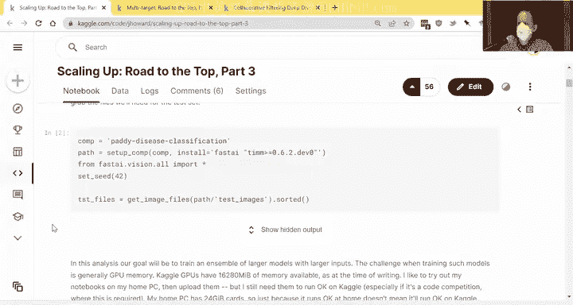

---


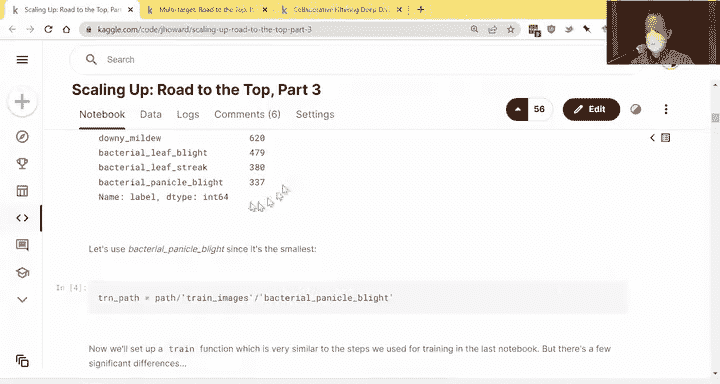

## 梯度累积：在有限内存下训练大模型 🚀

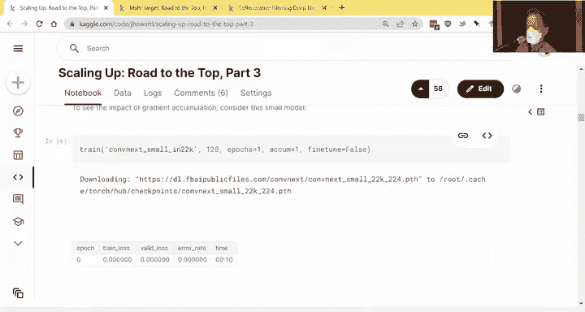

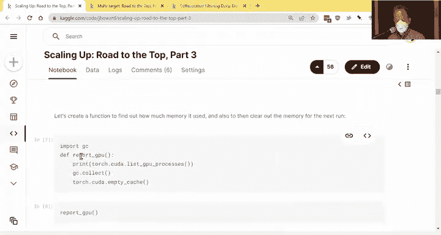


上一节我们介绍了如何通过数据增强和测试时增强提升模型性能。本节中，我们来看看一个常见的技术瓶颈：GPU内存不足。

当尝试使用参数更多、能力更强的模型时，你可能会遇到 `CUDA out of memory` 错误。这是因为更大的模型需要计算和存储更多的梯度，消耗更多GPU内存。

### 梯度累积的原理

梯度累积的核心思想是：**在不增加单次前向/反向传播内存占用的前提下，模拟更大的批次（batch）训练效果**。

标准的训练循环如下：
1.  从数据加载器获取一个小批次（mini-batch）数据。
2.  计算损失。
3.  调用 `.backward()` 计算梯度。
4.  使用梯度更新模型权重：`weights = weights - learning_rate * weights.grad`。
5.  将梯度归零：`weights.grad = None`。

在梯度累积中，我们修改了步骤4和5：
*   我们**不**在每次小批次后都更新权重和清零梯度。
*   而是让梯度在多个小批次上**累积**（相加）。
*   当累积的“虚拟批次”大小达到目标值（如64）时，才进行一次权重更新和梯度清零。

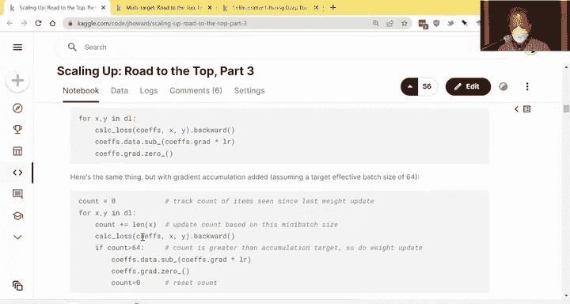

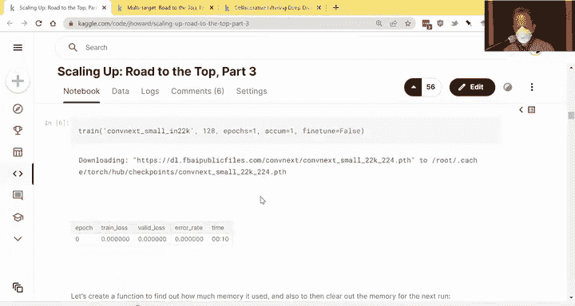


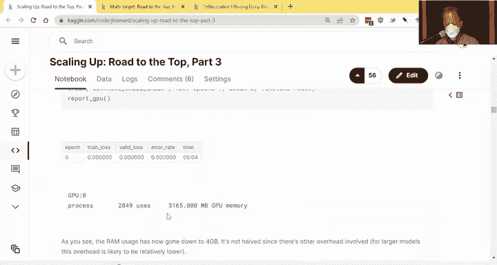


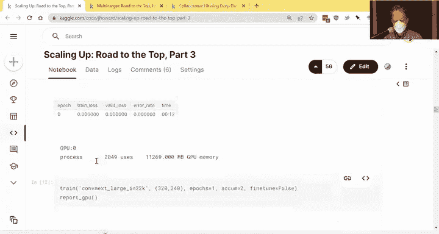

以下是其核心代码逻辑的简化表示：

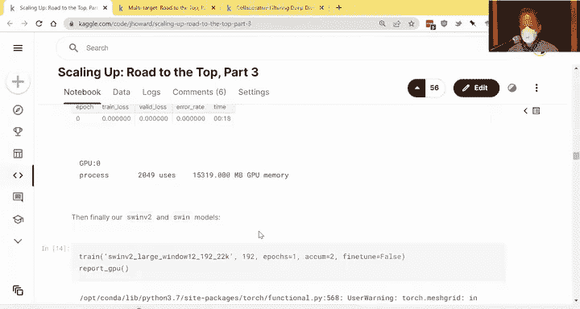

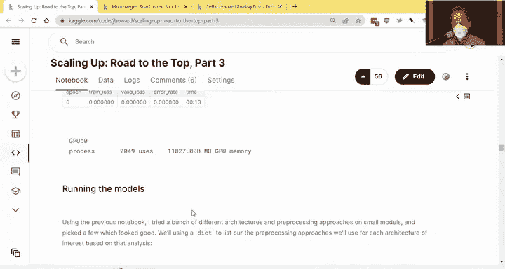


```python
count = 0
for x, y in data_loader:
    loss = calc_loss(model(x), y)
    loss.backward() # 梯度累积到现有梯度上
    count += len(x)
    if count >= desired_batch_size:
        # 使用累积的梯度更新权重
        for param in model.parameters():
            param.data -= learning_rate * param.grad
        model.zero_grad() # 清零梯度
        count = 0
```


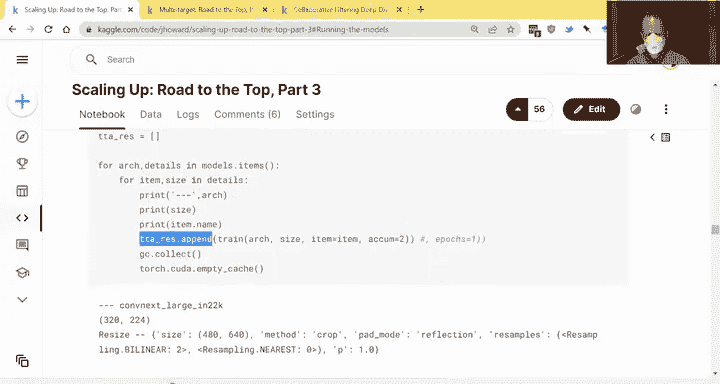

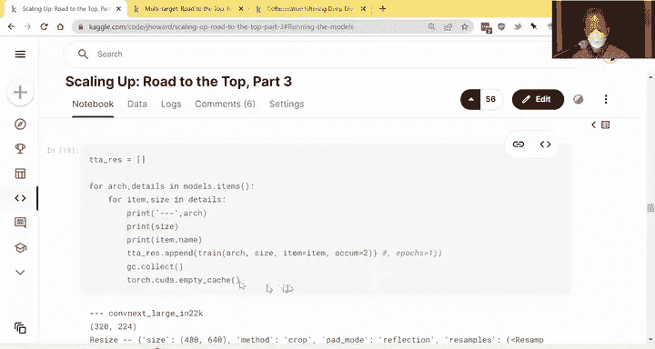


### 梯度累积的优势与注意事项


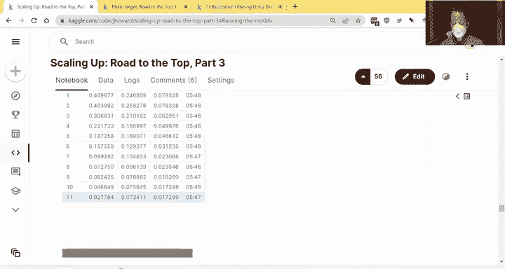


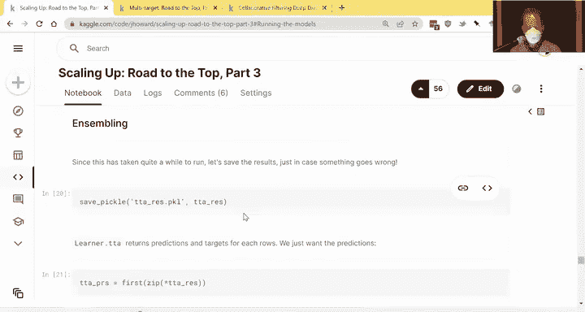

以下是使用梯度累积的关键点：

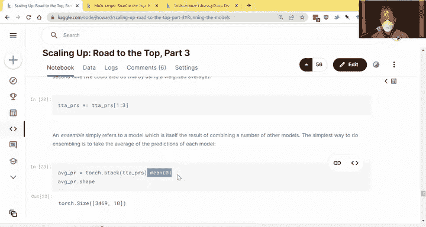

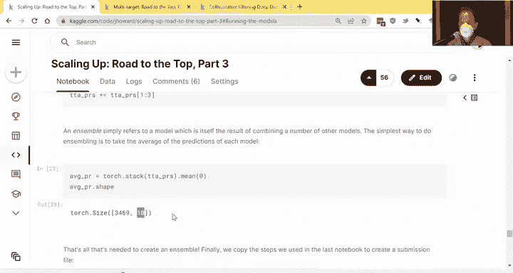


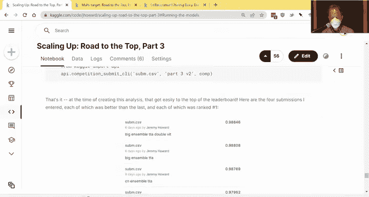


*   **内存与性能**：它允许你在内存较小的GPU上训练几乎任意大的模型，且速度损失很小。
*   **训练动态**：它保持了与使用大批次训练相似的优化动态，无需重新调整学习率等超参数。
*   **与批归一化的兼容性**：如果模型使用了**批归一化（BatchNorm）**，梯度累积会导致统计量计算不准确，可能引入额外波动。但许多现代架构（如ConvNeXt、Transformer）使用层归一化（LayerNorm），不存在此问题。
*   **实践建议**：对于大多数任务，梯度累积是比购买昂贵大内存GPU更经济高效的选择。在FastAI中，可以通过 `GradientAccumulation` 回调轻松实现。

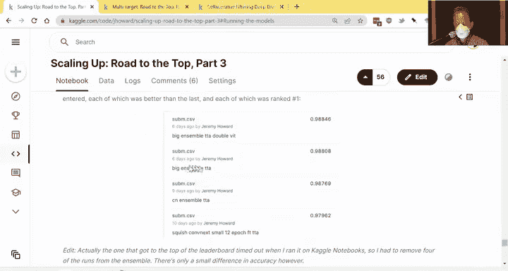

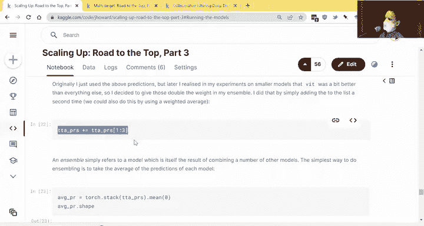


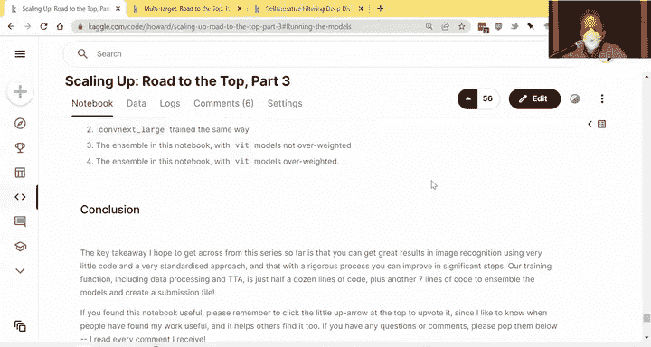

---

## 模型集成：组合多个模型的力量 🤝

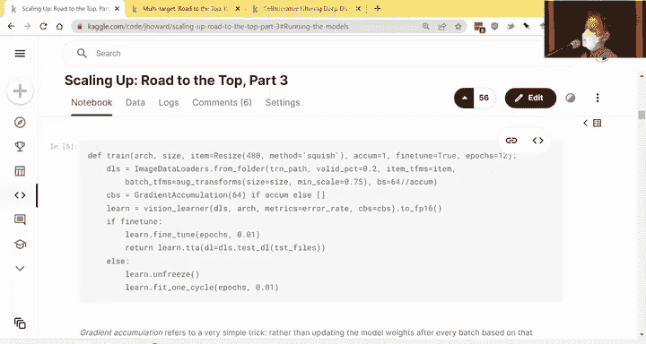

在解决了训练大模型的内存问题后，我们可以尝试多种不同的架构。但如何将它们的力量结合起来呢？答案是模型集成。


我们训练了多个不同的模型（如ConvNeXt Large, ViT Large等），每个模型都在不同的数据子集（通过随机分割获得）上训练，并使用了不同的预处理方法。


### 集成方法：Bagging

我们采用了一种称为 **Bagging** 的集成方法。虽然Bagging通常用于组合多个“弱模型”，但在这里我们组合的是强大的、多样化的模型。其思想是：
*   不同的模型可能在不同类型的数据上表现更好。
*   通过对它们的预测结果进行平均，我们可以获得一个更稳健、更准确的“集体”预测。

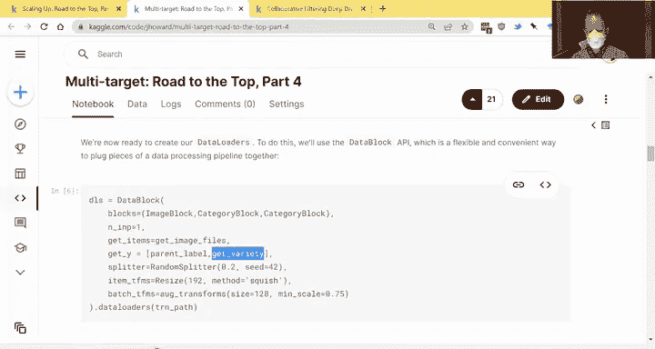

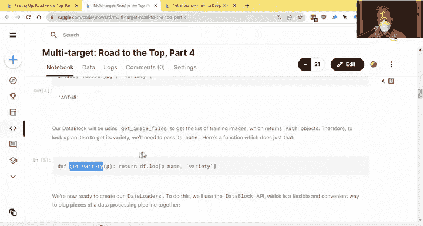

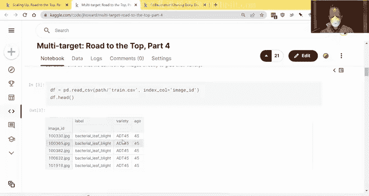

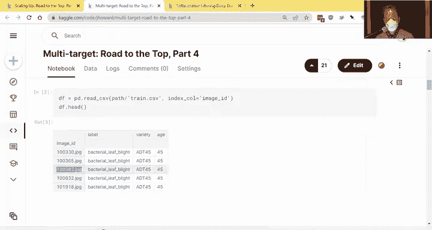


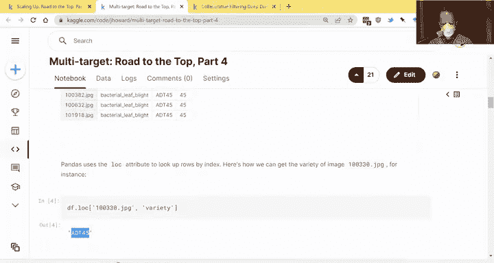

具体步骤如下：
1.  收集每个模型在测试集上的预测概率。
2.  将所有模型的预测概率堆叠起来。
3.  计算这些概率的平均值。
4.  对平均后的概率取 `argmax`，得到最终的类别预测。


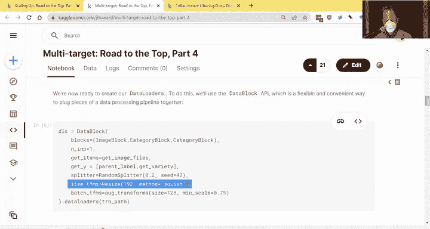

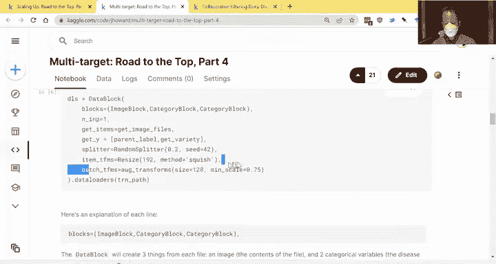

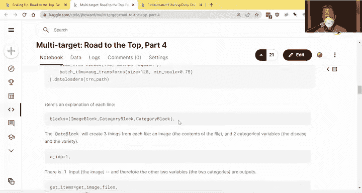

这种方法在Kaggle竞赛中非常有效，能够显著提升排行榜分数。

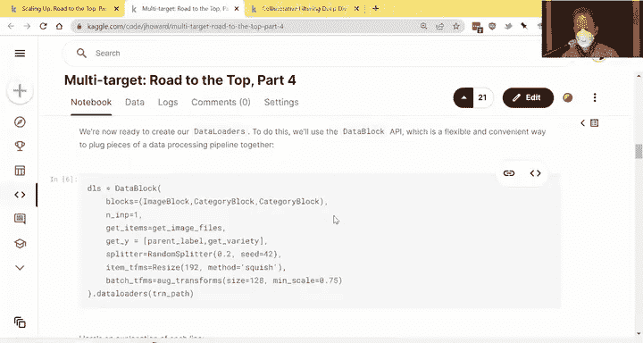

---

## 多目标模型：同时预测病害与品种 🌾

现在，让我们深入神经网络的“最后一层”，看看如何让一个模型同时学习两个任务。我们将构建一个能同时预测水稻**病害类型**和**水稻品种**的模型。

### 构建多目标数据加载器

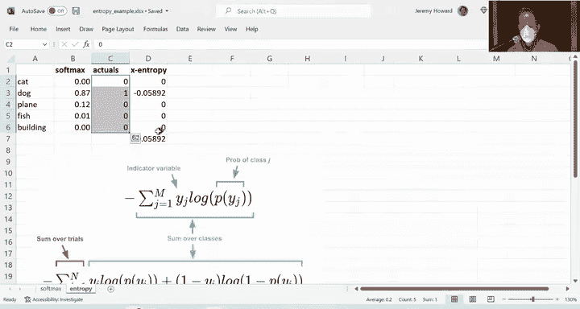

首先，我们需要一个能提供两个标签的数据加载器。在FastAI中，这可以通过 `DataBlock` 轻松实现。

关键步骤是：
*   在 `DataBlock` 中指定多个输出块：`blocks=(ImageBlock, CategoryBlock, CategoryBlock)`。
*   使用 `n_inp=1` 指明只有一个输入（图像）。
*   提供一个 `get_y` 函数，返回一个包含两个标签（病害、品种）的列表。

### 设计多目标模型的输出层与损失函数

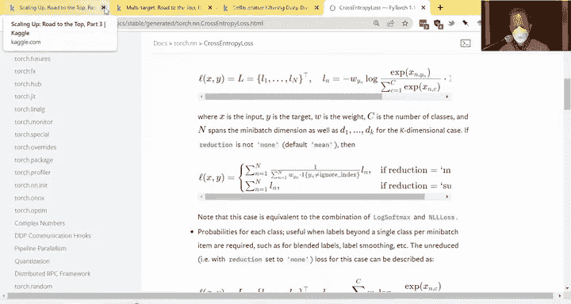

我们的模型现在需要输出20个值：前10个是10种病害的概率，后10个是10个品种的概率。

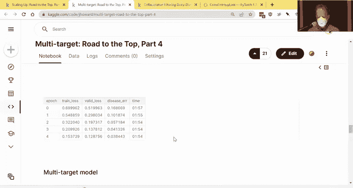

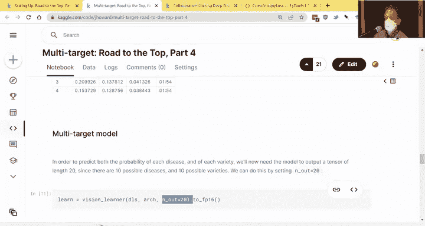

核心挑战在于设计损失函数，以同时优化这两个任务：

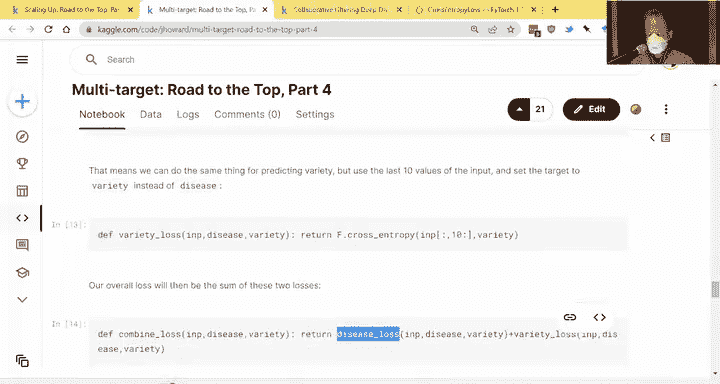

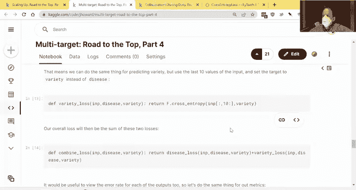

1.  **拆分输出**：将模型的20维输出拆分为两部分：`preds[:,:10]`（病害预测）和 `preds[:,10:]`（品种预测）。
2.  **计算分项损失**：分别计算病害预测的交叉熵损失和品种预测的交叉熵损失。
3.  **组合总损失**：将两个损失相加，得到模型的总损失。梯度下降将同时优化两个任务的参数。

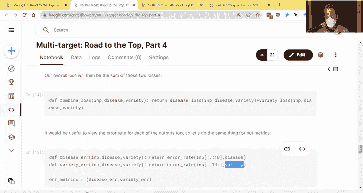

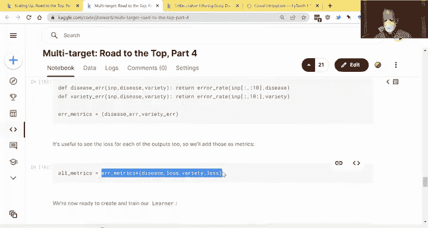

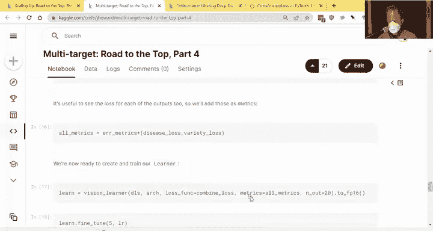

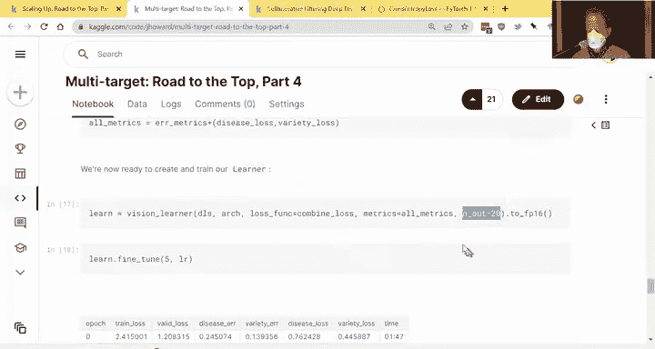

对应的损失函数代码结构如下：
```python
def combined_loss(preds, targs1, targs2):
    disease_preds = preds[:, :10]
    variety_preds = preds[:, 10:]
    loss_disease = F.cross_entropy(disease_preds, targs1)
    loss_variety = F.cross_entropy(variety_preds, targs2)
    return loss_disease + loss_variety
```

### 多目标学习的潜在优势

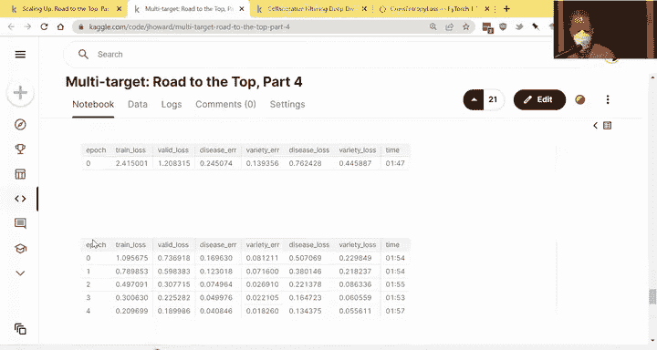


有趣的是，让模型同时学习两个相关任务，有时能比只学习单一任务获得更好的性能。这是因为：
*   学习识别水稻品种所需的特征（如纹理、形状）可能对识别病害也有帮助。
*   模型能够学习到任务之间更深层次的相关性。


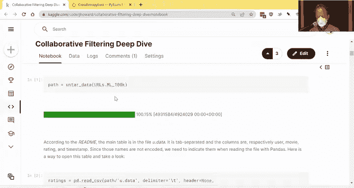

因此，多目标建模不仅适用于需要多输出的场景，也可能成为提升主任务性能的一种技巧。

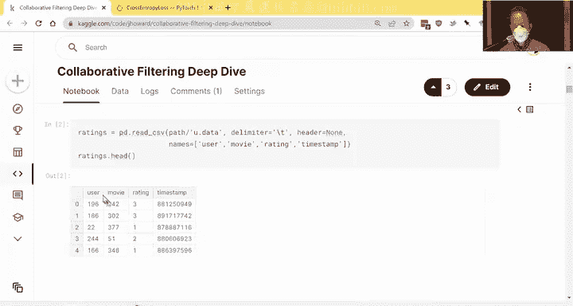

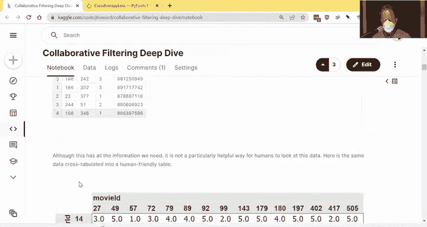


---

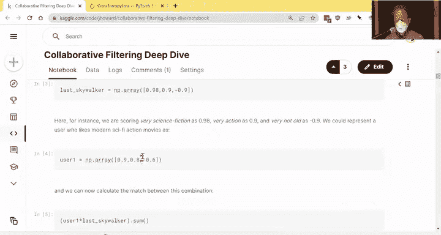

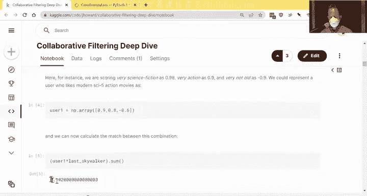

## 深入理解交叉熵损失 📉


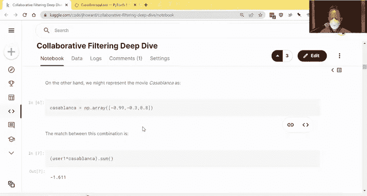


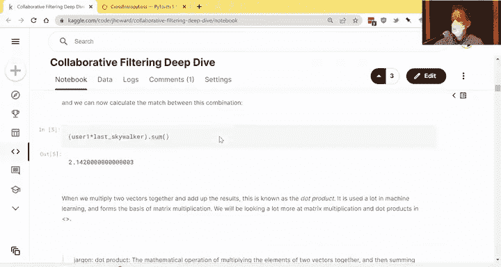

在多目标模型中，我们使用了交叉熵损失。这是分类任务中最核心的损失函数之一，理解它至关重要。

### Softmax激活函数

在交叉熵计算之前，通常先使用 **Softmax** 函数将模型的原始输出（logits）转换为概率分布。
*   **公式**：对于第 `i` 个类别的概率 \( p_i = \frac{e^{z_i}}{\sum_{j=1}^{K} e^{z_j}} \)
*   **作用**：确保所有输出概率之和为1，并且放大最大值的相对优势，使模型输出更“自信”的预测。

### 交叉熵损失计算

交叉熵损失衡量的是模型预测的概率分布与真实分布（one-hot编码）之间的差异。
*   **公式**：\( \text{Loss} = -\sum_{i=1}^{K} y_i \log(p_i) \)
*   **简化理解**：由于真实标签 \( y \) 是one-hot编码（只有一个是1，其余为0），上述求和实际上只计算了**真实类别**对应的预测概率 \( p_{\text{true}} \) 的负对数：\( \text{Loss} = -\log(p_{\text{true}}) \)。
*   **含义**：预测概率 \( p_{\text{true}} \) 越接近1，损失越接近0；预测概率越小，损失越大。

**二分类交叉熵**是交叉熵在类别数K=2时的特例，常用于二元分类任务。

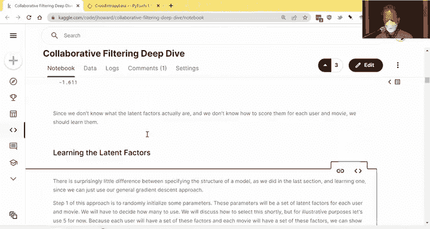


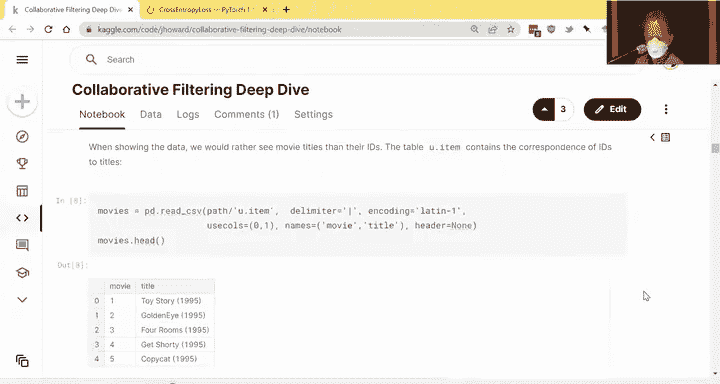

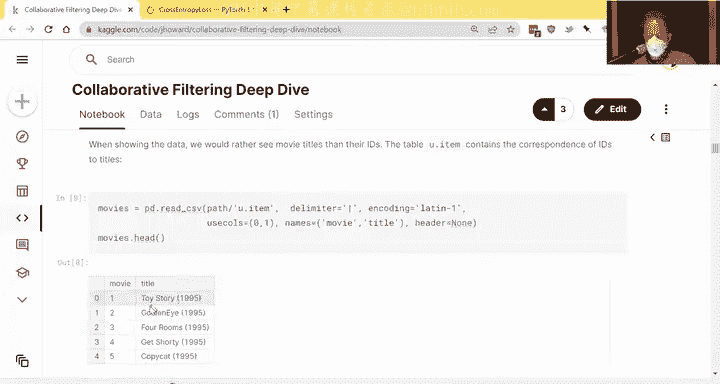

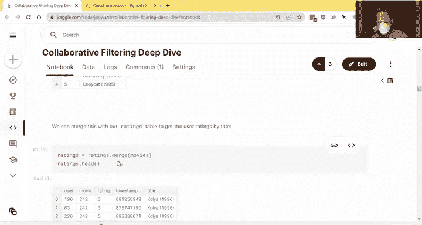

---


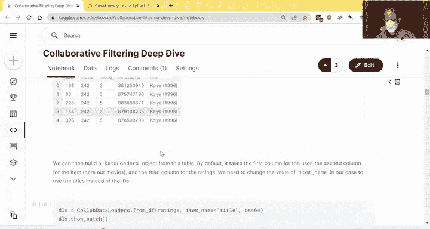

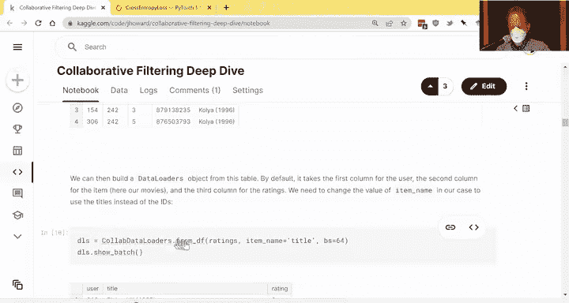

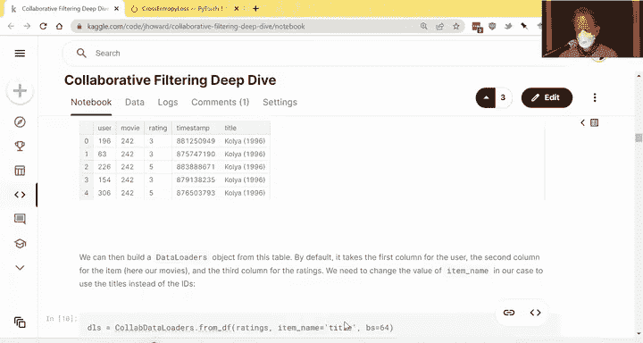

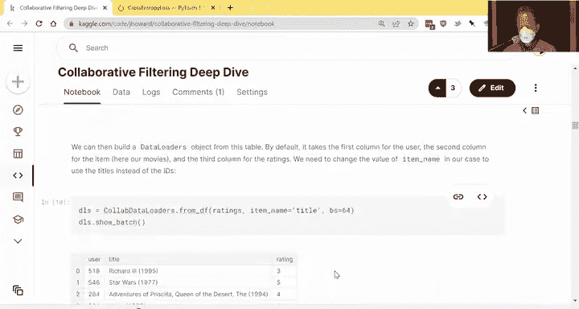


## 协同过滤入门：构建推荐系统 🎬

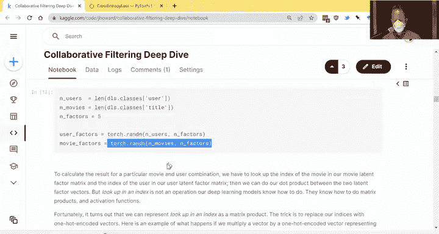

最后，我们转向第四个重要应用领域：协同过滤，它是推荐系统的基础。

### 问题定义：矩阵补全


我们使用MovieLens数据集，其中包含用户对电影的评分。数据可以看作一个巨大的、稀疏的“用户-电影”矩阵，我们的目标是**补全这个矩阵**，预测用户对未看过电影的评分。

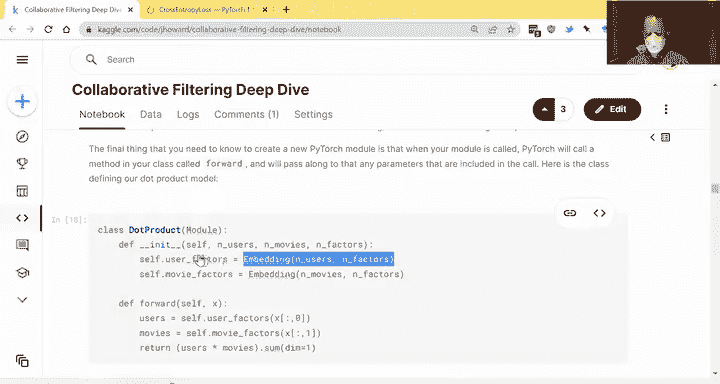


### 潜在因子模型


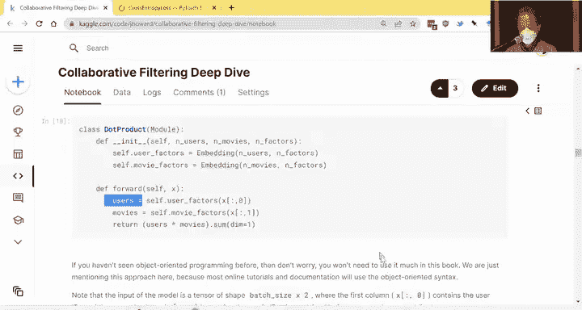

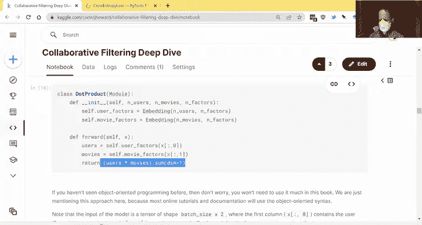

我们不知道用户喜欢什么特质，也不知道电影包含什么特质。因此，我们为每个用户和每个电影学习一组**潜在因子**（latent factors）。
*   **用户潜在因子**：表示用户的偏好向量（例如，对科幻、动作、浪漫等元素的喜爱程度）。
*   **电影潜在因子**：表示电影的特征向量（例如，包含多少科幻、动作、浪漫等元素）。
*   **预测评分**：用户对电影的预测评分，通过计算用户因子向量和电影因子向量的**点积**来估计。点积越高，表示匹配度越好，预测评分越高。

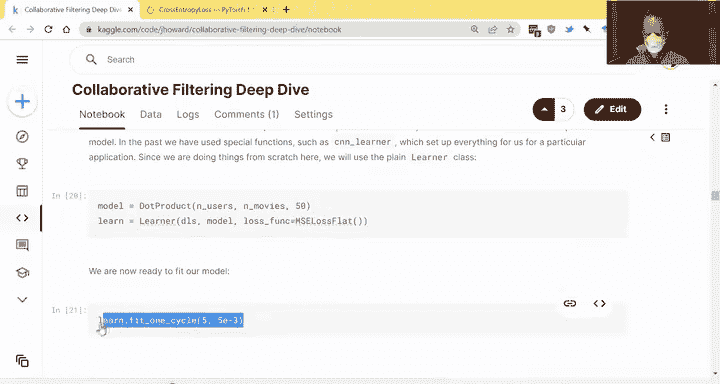

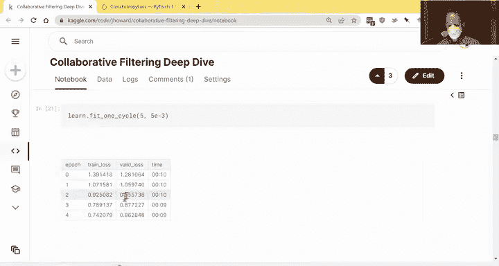

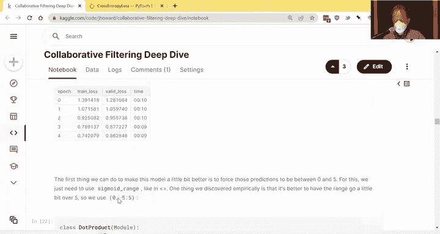

### 嵌入层：高效的查找表

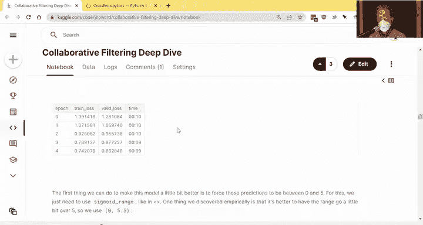

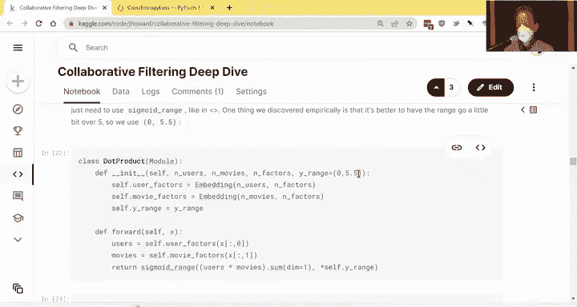


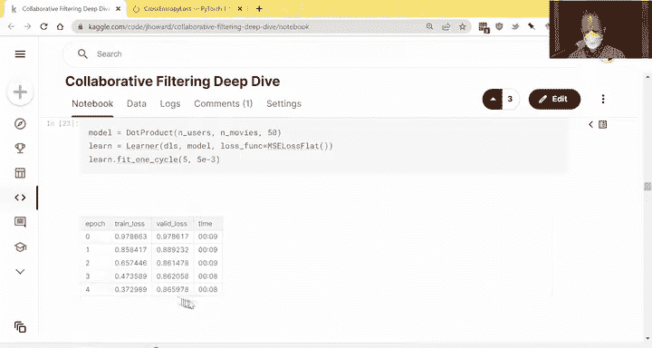

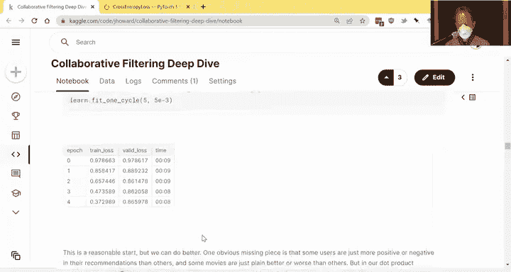


在代码中，我们使用**嵌入层**来实现潜在因子。
*   **本质**：嵌入层就是一个查找表。`用户嵌入矩阵` 的第i行就是用户i的潜在因子向量。
*   **数学等价**：通过嵌入层查找用户i的因子，等价于将用户i的one-hot编码向量与整个用户因子矩阵相乘。嵌入层是更高效的计算捷径。
*   **模型构建**：我们构建了一个PyTorch模型，包含用户嵌入、电影嵌入以及可选的用户偏置和电影偏置项。偏置项用于捕捉用户或电影本身的总体评分倾向。

### 正则化：防止过拟合

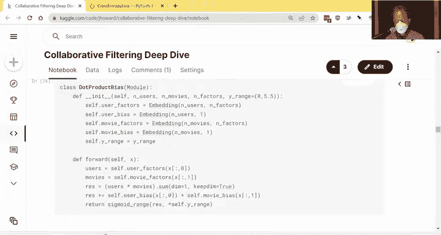

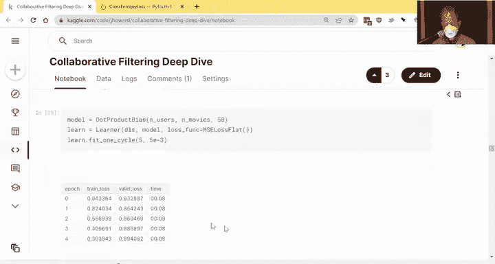

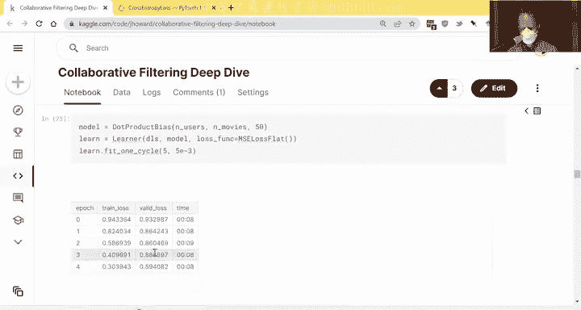


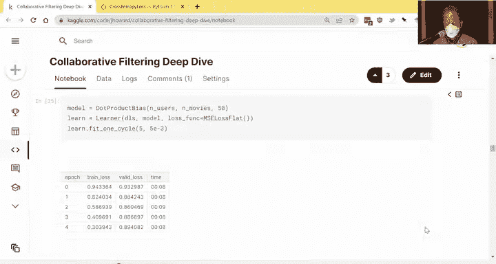

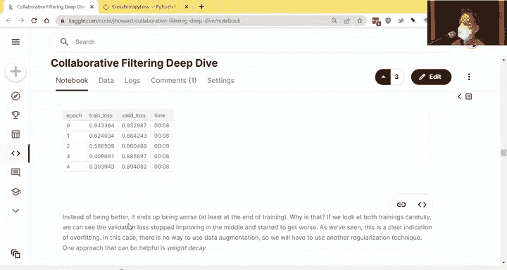

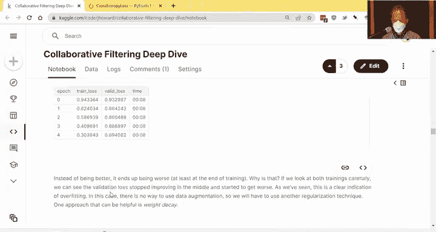

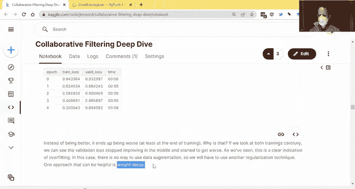

协同过滤模型参数很多（每个用户和电影都有嵌入向量），容易过拟合。我们使用 **L2正则化（权重衰减）**。
*   **方法**：在损失函数中增加模型所有权重平方和的一项：\( \text{Loss} = \text{MSE} + \text{wd} * \sum \text{weights}^2 \)。
*   **作用**：惩罚过大的权重，鼓励模型使用必要的因子进行预测，同时将不重要的因子权重推向零，从而提高模型的泛化能力。

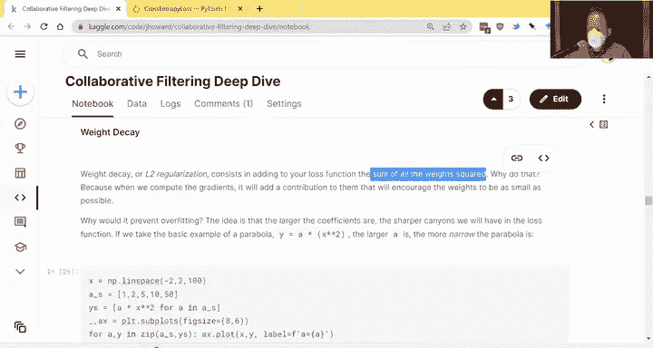

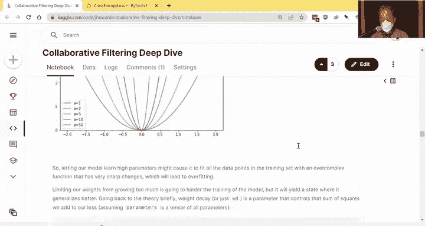

---

## 总结 🎯


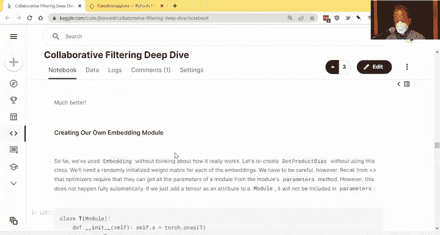

本节课中我们一起学习了：
1.  **梯度累积**：一种在有限GPU内存下训练大型模型的有效技术。
2.  **模型集成**：通过平均多个不同模型的预测来提升最终性能。
3.  **多目标建模**：如何构建一个神经网络来同时预测多个目标，并深入理解了交叉熵损失函数。
4.  **协同过滤基础**：学习了推荐系统的核心——潜在因子模型，理解了嵌入层的本质，并实践了使用PyTorch构建协同过滤模型以及应用权重衰减来防止过拟合。


这些技术涵盖了从提升训练效率、组合模型力量，到设计复杂输出层和理解推荐系统核心的广泛内容，是深度学习实践中非常实用的工具包。