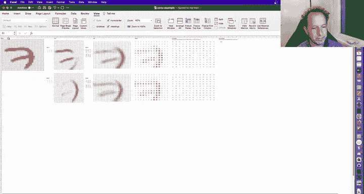
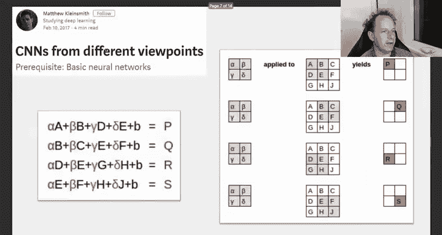
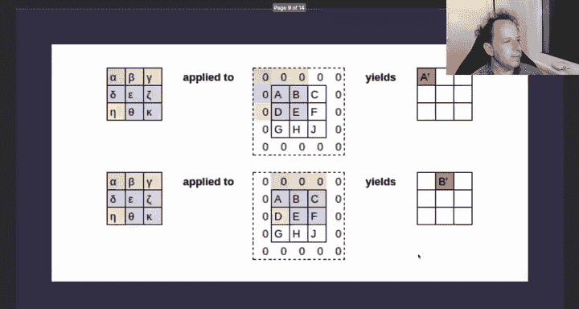
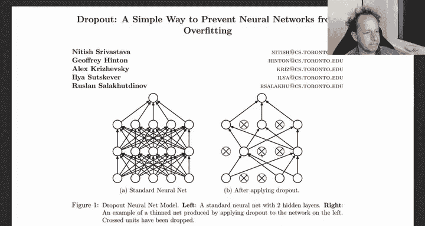
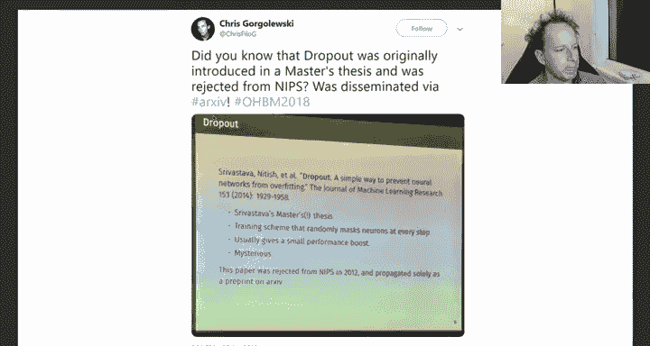
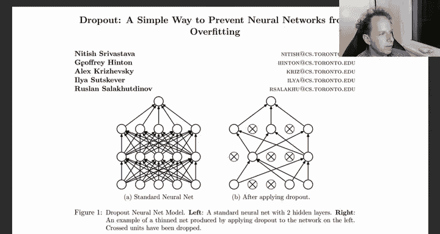
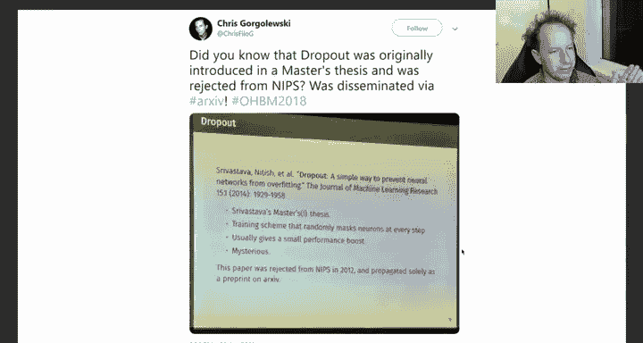
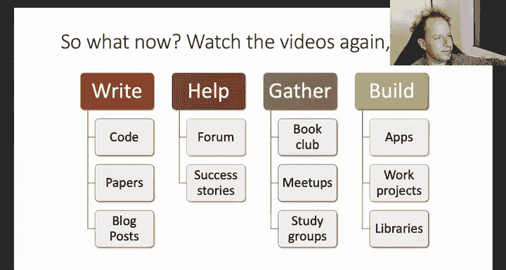
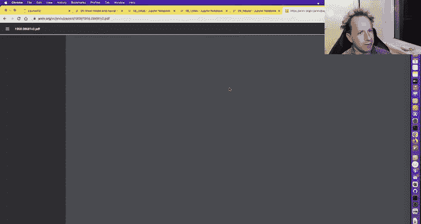
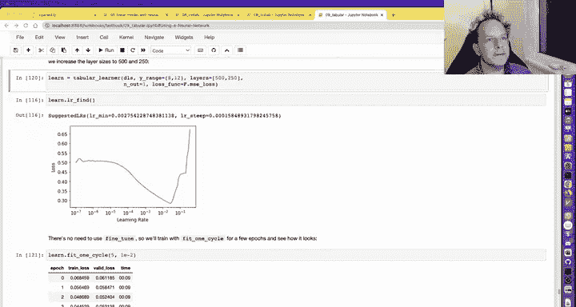

# 课程8：深度学习实践入门（下）🎓

## 概述

在本节课中，我们将继续学习深度学习的核心概念，特别是嵌入层（Embeddings）的原理与应用，并初步了解卷积神经网络（CNN）的基本思想。我们将从零开始构建一个嵌入模块，理解其背后的数学原理，并探索其在协同过滤、自然语言处理和表格数据分析等不同场景下的应用。最后，我们将简要了解卷积操作和Dropout等关键技术。

---

## 从零理解嵌入层 🔍

上一节我们介绍了协同过滤的基本概念。本节中，我们来看看如何从零开始构建一个嵌入层，这是理解深度学习模型内部工作机制的关键一步。

在开始深入之前，请确保你已经完全理解了“从零构建神经网络”笔记本中的内容。因为接下来我们将要看到的，是PyTorch和FastAI在那些基础概念之上构建的抽象层。

回想一下，在“从零构建神经网络”中，我们手动初始化系数（权重），并在训练过程中通过梯度下降更新它们。在PyTorch中，这个过程被自动化了。PyTorch通过检查我们的模块（Module），自动识别并跟踪那些看起来像神经网络参数的张量。

以下是如何告诉PyTorch哪些张量是参数：

```python
import torch
import torch.nn as nn

class ExampleModule(nn.Module):
    def __init__(self):
        super().__init__()
        # 将一个张量包装成Parameter，PyTorch才会将其识别为可训练参数
        self.a = nn.Parameter(torch.ones(3))
```

当我们实例化这个模块并查询其参数时，PyTorch会返回这个被包装的张量。`nn.Parameter`类本身几乎不包含任何代码，它的核心作用是作为一个“标记”，告诉优化器：“这个张量是需要更新的参数”。

大多数时候，我们不需要手动创建`Parameter`，因为PyTorch提供的层（如`nn.Linear`）会自动将其内部的权重张量标记为参数。

---

## 构建协同过滤模型 🎬

理解了参数机制后，我们现在可以构建一个完整的协同过滤模型。这个模型将为用户和电影分别创建嵌入矩阵和偏置项。

以下是构建模型的关键步骤：

1.  **初始化参数**：为用户和电影创建嵌入矩阵（`factors`）和偏置向量（`bias`）。嵌入矩阵的维度是（数量 × 潜在因子数）。
2.  **前向传播**：对于给定的用户-电影对，查找对应的用户嵌入向量、电影嵌入向量、用户偏置和电影偏置。预测评分是用户与电影嵌入向量的点积，加上用户偏置和电影偏置，最后通过Sigmoid函数将结果映射到评分区间（如1-5星）。

```python
class DotProductBias(nn.Module):
    def __init__(self, n_users, n_movies, n_factors):
        super().__init__()
        self.user_factors = nn.Parameter(torch.randn(n_users, n_factors) * 0.01)
        self.user_bias = nn.Parameter(torch.zeros(n_users))
        self.movie_factors = nn.Parameter(torch.randn(n_movies, n_factors) * 0.01)
        self.movie_bias = nn.Parameter(torch.zeros(n_movies))

    def forward(self, user, movie):
        # 点积 + 偏置
        return (torch.dot(self.user_factors[user], self.movie_factors[movie])
                + self.user_bias[user] + self.movie_bias[movie])
```

训练这个模型后，我们可以分析学习到的参数。例如，`movie_bias`参数揭示了电影的普遍受欢迎程度。偏置值很低的电影可能是公认的“烂片”，而偏置值很高的电影则是大众情人，即使不喜欢该类题材的观众也可能喜欢它。

同样，我们也可以分析`movie_factors`这个嵌入矩阵。它包含了电影在潜在语义空间中的表示。我们可以使用主成分分析（PCA）将高维嵌入压缩到2维或3维进行可视化，从而发现电影之间的相似性（如动作片聚集在一起，剧情片聚集在另一处）。

---

## 使用FastAI简化流程 ⚡

显然，我们不想每次都手动编写所有代码。FastAI提供了高级API来简化协同过滤模型的创建和训练。

使用`collab_learner`，只需一行代码即可创建并训练一个与上述手动构建模型功能相同的模型：

```python
from fastai.collab import *
learn = collab_learner(dls, n_factors=50, y_range=(0, 5.5))
learn.fit_one_cycle(5, 5e-3)
```

查看其源代码会发现，其底层实现与我们手动构建的模型几乎完全相同，这再次证明了深度学习模型的核心并不神秘。



---

## 嵌入层的广泛应用 🌐

嵌入层并非协同过滤的专利，它是处理类别型数据的通用且强大的工具。

**在自然语言处理（NLP）中**：单词被转换为整数ID，然后通过一个嵌入矩阵（词汇表大小 × 嵌入维度）查找，转换为密集向量。这些向量就是模型的输入。

**在表格数据分析中**：对于类别型列（如产品类型、地区），我们同样为其创建嵌入层。FastAI的`TabularLearner`会自动识别数据中的类别列和连续列，为类别列创建嵌入，并将所有嵌入向量与连续特征拼接起来，输入到一个标准的多层神经网络中。

一个有趣的发现是，在训练后的表格模型中，地区嵌入向量在空间上的接近程度，竟然能反映真实地理位置的接近程度。模型在没有地理位置信息输入的情况下，通过购物行为数据“学习”到了地理相关性。

---

## 卷积神经网络初探 🖼️

现在，让我们把目光转向计算机视觉的核心——卷积神经网络（CNN）。CNN与我们之前学的全连接网络非常相似，都由矩阵乘法和激活函数堆叠而成。但其特殊之处在于使用了**卷积**操作。

卷积可以理解为一个滑动窗口操作：
*   我们有一个小的权重矩阵（称为**卷积核**或**滤波器**），例如3x3大小。
*   将这个卷积核在输入图像（一个大的像素矩阵）上滑动。
*   在每一个位置，计算卷积核与对应图像局部区域的**点积**，得到一个输出值。
*   滑动完整个图像后，我们就得到了一个新的特征图（Feature Map）。

**为什么卷积对图像有效？**
1.  **参数共享**：一个卷积核在整个图像上共享参数，极大地减少了参数量，避免了过拟合。
2.  **局部连接**：它关注图像的局部区域（如边缘、纹理），这符合图像的语义特征。
3.  **平移不变性**：同样的特征（如猫耳朵）无论出现在图像的哪个位置，都会被同一个卷积核检测到。



在传统的CNN架构中，卷积层之后常接**池化层**（如MaxPooling），用于降低特征图的空间尺寸，增加感受野，并提供一定的平移不变性。现代架构则更倾向于使用**步长大于1的卷积**（Strided Convolution）来替代池化层进行下采样。



从数学上看，**卷积操作本质上是一种特殊的、具有稀疏性和权重共享约束的矩阵乘法**。理解这一点有助于我们统一看待神经网络中的各种线性变换。

---



## 防止过拟合：Dropout 🛡️







在训练神经网络时，一个常见问题是模型在训练集上表现很好，但在未见过的数据上表现糟糕，即**过拟合**。




**Dropout** 是一种简单而有效的正则化技术。它在训练过程中，随机“丢弃”（即临时设置为0）网络中一部分神经元（或激活值）。


```python
# 在PyTorch中，添加Dropout层非常简单
self.drop = nn.Dropout(p=0.5) # 以50%的概率丢弃激活值




def forward(self, x):
    x = self.layer1(x)
    x = self.drop(x) # 应用Dropout
    x = F.relu(x)
    return x
```



**Dropout为什么有效？**
*   **防止协同适应**：它强迫神经元不依赖于少数特定的其他神经元，必须学习更鲁棒的特征。
*   **模型平均**：可以看作是在训练时对大量共享参数的“子网络”进行平均，类似于集成学习。
*   **可以看作是一种数据增强**：它为每一层网络的激活值添加了随机噪声，增强了模型的泛化能力。

Dropout的强度由丢弃概率 `p` 控制。`p` 值越大，正则化效果越强，但可能会降低模型在训练集上的拟合能力，需要在实践中进行权衡。

---

## 总结与展望 🚀

本节课中我们一起学习了深度学习的几个核心进阶主题：

1.  **嵌入层的本质**：我们深入理解了嵌入层是如何通过查找表将类别ID转换为可训练向量的，并手动构建了一个协同过滤模型。
2.  **嵌入的应用**：我们看到了嵌入在NLP和表格数据中的强大作用，以及如何通过分析嵌入向量来理解模型学到的知识。
3.  **卷积神经网络基础**：我们了解了卷积操作如何利用图像的局部性和平移不变性，用更少的参数有效地提取特征。
4.  **正则化技术**：我们认识了Dropout这一防止模型过拟合的关键技术。

至此，你已经对深度学习的输入（嵌入、连续值）、中间层（各种矩阵乘法/卷积 + 激活函数）和输出（损失函数、激活调整）有了一个比较全面的认识。这些基础组件以不同的方式组合，构成了解决各种复杂问题的强大模型。

**下一步该做什么？**
*   **实践与巩固**：重新观看课程视频，并亲手编写和运行每一行代码。尝试修改参数，观察结果变化。
*   **阅读与交流**：阅读FastAI论坛上的成功案例和讨论，参与社区问答，帮助他人解决问题是巩固知识的最佳方式之一。
*   **开始你的项目**：找一个你感兴趣或熟悉领域的问题，尝试用深度学习来解决它。从一个小而具体的原型开始。
*   **准备第二部分**：本课程的第一部分为你打下了坚实的实践基础。第二部分将深入技术细节，使你能够阅读并实现研究论文，并将模型部署到真实场景中。

深度学习是一个广阔的领域，但请记住，你不需要了解所有最新进展。掌握坚实的基础原理和持续的学习实践能力，将使你能够快速适应任何新的技术发展。

感谢你的学习，期待在进阶课程中与你再见！