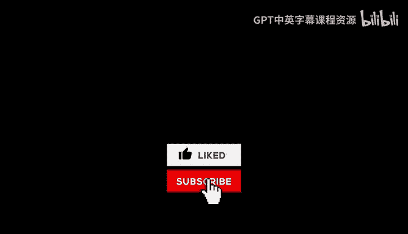
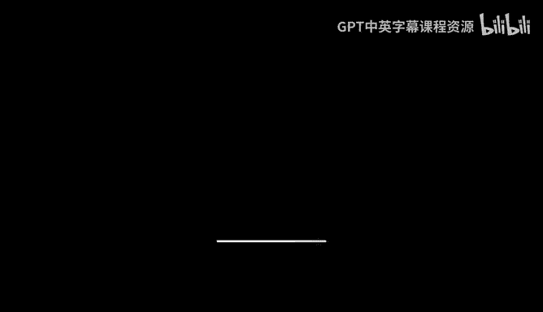

# 课程 71：谓词、不变性与智能的本质 🧠

在本节课中，我们将一起学习弗拉基米尔·瓦普尼克关于智能本质的核心思想。我们将探讨“谓词”和“不变性”这两个关键概念，理解它们如何构成统计学习理论的基础，并思考如何将这些哲学和数学思想应用于构建更智能的机器学习系统。

---

## 对话背景与人物介绍

以下是与弗拉基米尔·瓦普尼克的第二次播客对话。他是支持向量机、支持向量聚类、VC理论以及统计学习中许多基础思想的共同发明者。

他出生于苏联，曾在莫斯科控制科学研究所工作，之后在美国的AT&T、贝尔实验室、Facebook人工智能研究所工作，现在是哥伦比亚大学的教授。他的著作被引用超过20万次。

这次对话发生在他进行了一场题为“学习的完整统计理论”的讲座之后，该讲座是麻省理工学院深度学习与人工智能系列讲座的一部分。讲座内容技术性很强，数学密集。因此，如果你打算两者都看，建议先听这个播客，因为它可能更容易理解。

---

## 工程智能与智能科学

上一节我们介绍了对话的背景。本节中，我们来看看瓦普尼克对“工程智能”与“智能科学”这两个路径的区分。

他认为这是两个完全不同的故事。工程是关于模仿人类活动，目标是制造一个行为像人类的设备，完成人类的所有功能，而不管是如何实现的。但理解智能是什么，则是一个完全不同的问题。

瓦普尼克认为，这与我们昨天讨论的“谓词”概念有关。他提到了弗拉基米尔·普罗普的观点。普罗普在1920年出版了《民间故事形态学》一书，描述了31个“谓词”（或叙事单元），这些单元构成了许多故事（如俄罗斯民间传说）的序列结构。

---

## 模仿与理解

上一节我们区分了工程与科学。本节中，我们来探讨“模仿”与“理解”之间的关系。

瓦普尼克认为，模仿和理解的目标不同。模仿的目标是创造有用的东西，这很伟大，并且已经取得了许多成就（如自动驾驶汽车）。但理解则非常困难，它更接近于一个哲学范畴。

他相信柏拉图的观点：存在一个“理念世界”。智能就是理念的宝库。这些纯粹的理念与现实结合，就创造了“不变性”。他认为，理念的组合、构建和传达不变性的方式，就是智能。

关于谓词，他认为数量可能并不多。例如，普罗普用31个谓词来描述人类行为的故事，这并不算多。一个谓词可以应用于不同的数据，构造出许多不同的不变性。

---

## 什么是谓词？

上一节我们提到了谓词的概念。本节中，我们来具体看看瓦普尼克如何定义“谓词”。

在最简单的层面上，谓词是关于某事物为真的陈述。在瓦普尼克的定义中，谓词是一个**函数**。你可以使用这个函数进行内积运算，这就是一个谓词。

输入是现实中的某种东西（例如，在数字识别中，输入是像素空间）。输出是该函数的值。他认为存在几个对理解图像很重要的函数，其中之一是**对称性**，尽管其构造并不简单。

另一个概念是图像的“结构化”程度，但这很难形式化定义。这些是普遍的、概念性的东西，就像音乐评论家用特定的词汇（谓词）来描述音乐的本质一样。

---

## 柏拉图、理念世界与不变性

上一节我们定义了谓词。本节中，我们来看看瓦普尼克如何将柏拉图哲学与机器学习联系起来。

瓦普尼克从柏拉图、黑格尔、维格纳的思想中汲取灵感。柏拉图有“型相论”（Theory of Forms），即存在一个理念世界和一个现实世界。理念世界可能很小，而现实世界可以任意大，现实世界是理念世界的投影。

智能的本质在于，虽然我们只能观察现实世界（事物），但要尝试提出关于理念世界的假设。不变性就是这种投影在具体例子上的体现，它创造了特定对象的特征。

---

## 发现好的谓词

上一节我们将智能与理念世界联系起来。本节中，我们来探讨一个核心问题：如何发现“好的谓词”？

瓦普尼克认为，智能的本质就是发现好的谓词。但这是否可以自动化呢？他表示不确定。根据弱收敛理论，希尔伯特空间中的任何函数都可以作为谓词，因此存在无限多的谓词，但你不知道哪些是好的。

普罗普的工作之所以是突破，就在于它表明覆盖世界上大多数情况的谓词并不多。存在一个谓词的海洋，但只有一小部分对世界上发生的事情有用。好的谓词能显著减少“可容许函数集”的大小。

那么，机器如何发现好的谓词？瓦普尼克提出了一个方法：寻找矛盾。就像在物理学中，寻找现有理论无法解释的情况。在机器学习中，就是寻找某个谓词函数无法保持“不变性”的情况，然后纳入这个谓词，重新解决问题以消除矛盾。但这可能是一种“暴力”的方法。

他并不看好基于逻辑的符号AI或专家系统，认为“仅仅逻辑是不够的”。要发现好的谓词，你需要了解现实，了解生活，需要“常识”，而常识不仅仅是规则。

---

## 深度学习与谓词

上一节我们讨论了发现谓词的挑战。本节中，我们来看看瓦普尼克如何看待当前的主流方法——深度学习。

瓦普尼克主要知道扬·勒昆的卷积神经网络。他认为，卷积本质上就是一个单一的谓词——平移不变性。这是一个很好的谓词，但问题是，自25年前提出以来，深度学习并没有增加太多新的、清晰的谓词。

深度学习的工程工作在于构建架构，给定训练数据后，能够收敛到一个泛化能力好的函数。但从数学角度看，神经网络只是**分段线性函数**的集合。当你引入卷积网络时，你是在创建一个可容许的函数子集，这个子集保持了平移不变性。

瓦普尼克认为，更好的方法是直接明确你想要保持哪些不变性（谓词），从而定义你的可容许函数集。每加入一个新的不变性，函数集就变得更小、更精确，但所有这些不变性都需要由人类来指定。

---

## 手写数字识别挑战

上一节我们比较了深度学习与谓词方法。本节中，我们聚焦于瓦普尼克提出的一个具体挑战：手写数字识别。

瓦普尼克相信，要使用比当前少得多（例如100倍）的样本（MNIST数据集使用6万个样本）达到顶尖的识别准确率，就需要谓词。这些谓词并非专门针对数字识别，而是理解视觉图像的通用谓词，例如**对称性**及其程度。

对称性有多种：垂直对称、水平对称、对角线对称、反对称等。通过应用这些关于对称性的谓词，你可以从庞大的函数集中选择一个更小的、可容许的函数集，从而用更少的数据进行学习。

他认为，解决这个挑战将揭示用于图像理解的通用谓词，这是迈向智能的一步。这个挑战是“尽可能简单，但又不至于过于简单”的问题。

---

## 弱收敛与强收敛

上一节我们探讨了具体挑战。本节中，我们回到理论基础，理解瓦普尼克认为最强大的数学思想：**弱收敛**。

在统计学中，有“大数定律”：对于任何函数，其经验平均值会收敛于期望值。但如果你有一个函数集，你需要的是**一致收敛**（均匀收敛），即对于函数集中的所有函数，这种收敛同时发生。学习理论需要一致收敛来保证。

然而，瓦普尼克认为更强大的是**弱收敛**。强收敛关注函数本身的收敛（例如，两个函数平方差的积分很小）。而弱收敛关注的是**函数泛函**的收敛：对于希尔伯特空间中的任意函数 φ，目标函数 F 与 φ 的内积值收敛。

在机器学习中，谓词就是这些 φ 函数。通过选择那些能保持特定谓词（即内积值相同）的函数，我们就在缩小可容许函数集。这就是利用弱收敛来构建学习模型的核心。

---

## 艺术、语言与谓词发现

上一节我们深入了收敛理论。本节中，我们换个角度，看看瓦普尼克如何从艺术和语言中寻找发现谓词的灵感。

瓦普尼克认为，我们应该向音乐评论家、文学批评家学习。他们用特定的词汇（谓词）来描述音乐或文学作品的高层理念。这些描述背后就是柏拉图式的理念。

他举例说，一位研究俄罗斯诗歌的朋友，曾从诗歌意象的角度描述手写数字图像。这种“诗意的描述”作为一种“特权信息”，在算法中加以利用后，可以提高学习性能。

他建议，可以收集音乐评论、艺术批评中使用的描述性词汇，分析其中的共性，这些共性可能就对应着理解图像（乃至世界）的抽象谓词。巴赫和肖邦的音乐评论可能使用不同的词汇，但都在试图解释音乐背后的理念。

---

## 总结与思考

本节课中，我们一起学习了弗拉基米尔·瓦普尼克关于智能的深刻见解。

我们从区分工程智能与智能科学开始，探讨了“谓词”作为描述世界真相的函数的核心概念，以及“不变性”作为理念在现实数据中投影的思想。瓦普尼克将柏拉图哲学与统计学习理论相联系，认为智能在于从大量数据（现实世界）中发现少数关键的、通用的谓词（理念世界）。

我们审视了当前深度学习的局限性，并了解了他提出的著名挑战：用极少样本实现顶尖的手写数字识别，以此作为发现通用视觉谓词的突破口。最后，我们探讨了从弱收敛理论到艺术批评等多种寻找谓词的途径。

瓦普尼克的思想提醒我们，在追求更强大的人工智能时，不应只满足于工程上的模仿和性能提升，还应深入思考其背后的科学原理，从哲学、数学乃至人文艺术中汲取灵感，去发现那些构成智能基础的、简洁而有力的“理念”。