# 课程名称：Neuralink 与人类的未来（第1部分）🎯

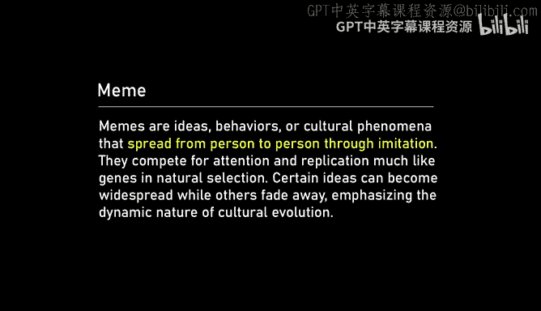

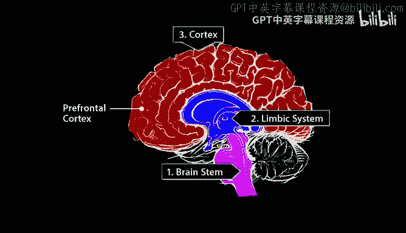

## 概述
在本节课中，我们将学习埃隆·马斯克（Elon Musk）与Neuralink团队关于脑机接口（BCI）技术、人工智能（AI）的未来以及人类文明发展的深入对话。我们将探讨Neuralink的技术原理、首次人体植入的历史意义、AI安全、人类与AI的共生关系，以及技术如何重塑我们的未来。

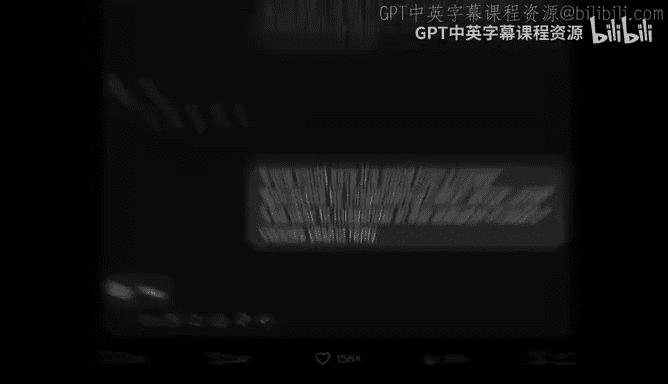

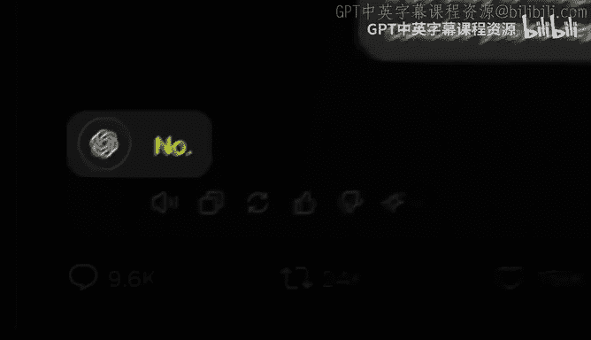

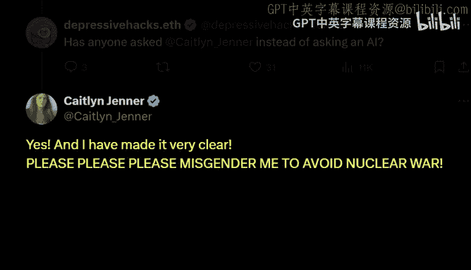

---


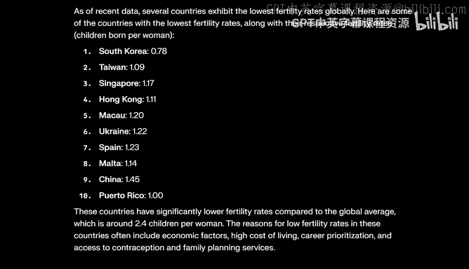

## 对话内容整理

### 1. Neuralink 的历史性突破 🧠
埃隆·马斯克首先祝贺Neuralink团队成功将设备植入人类大脑，这是一个历史性的里程碑。目前，已有两位患者接受了植入，其中第二位患者的植入效果非常理想，约有400个电极提供了清晰的信号。

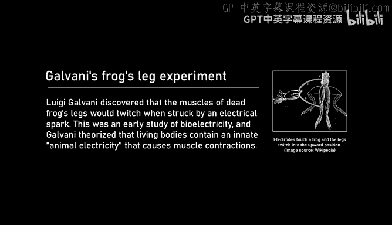

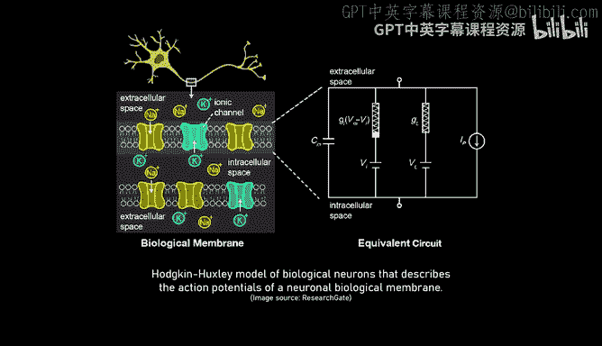

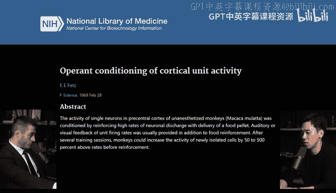

**公式**：  
电极数量 = 400（当前）  
目标：在年底前达到10例植入。

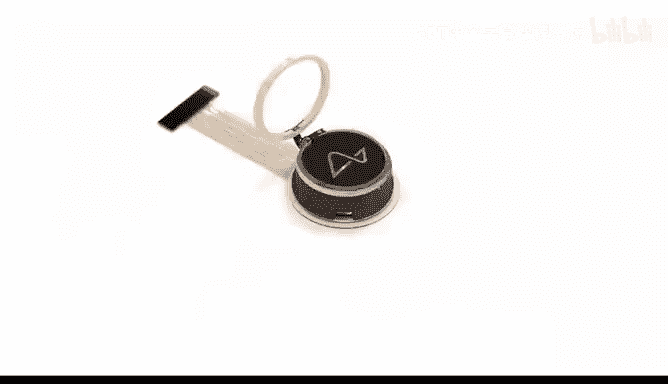

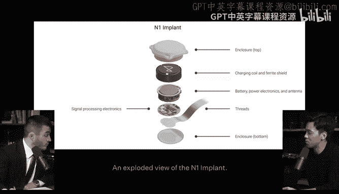

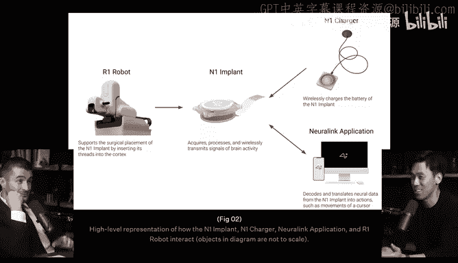

### 2. 技术改进与未来展望 🚀
随着电极数量的增加和信号处理技术的改进，Neuralink的数据传输速率（Bps）有望大幅提升。目前，即使只有10-15%的电极正常工作，患者的数据传输速率已达到世界纪录的两倍。未来，数据传输速率可能达到每秒100比特、1000比特，甚至更高。

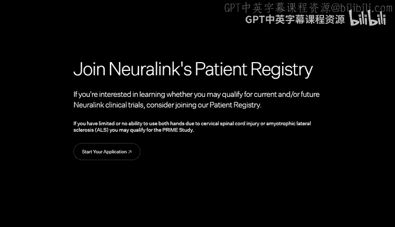

**公式**：  
数据传输速率（Bps） = 当前世界纪录 × 2  
未来目标：100 Bps → 1000 Bps → 1 Mbps。

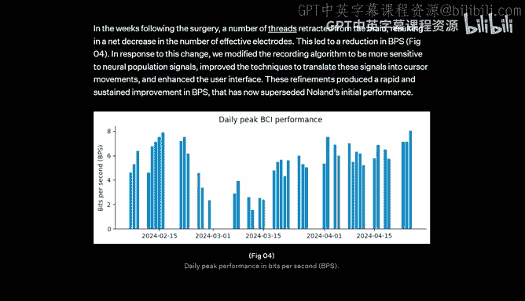

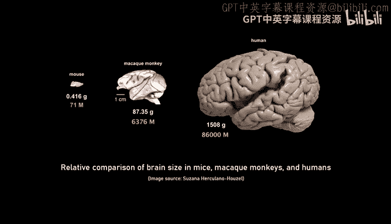

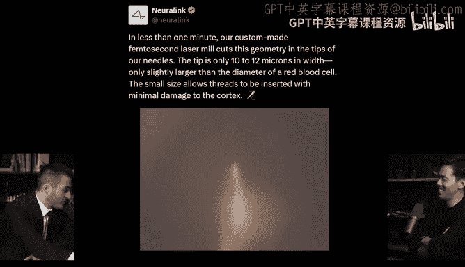

### 3. 人类与AI的通信瓶颈 🤖
人类与AI之间的通信存在巨大的带宽瓶颈。人类的平均通信速率远低于AI的处理能力，这可能导致AI对人类失去耐心。通过Neuralink提升人类的通信速率，可以增强人类与AI的协作能力，确保AI更好地服务于人类的目标。

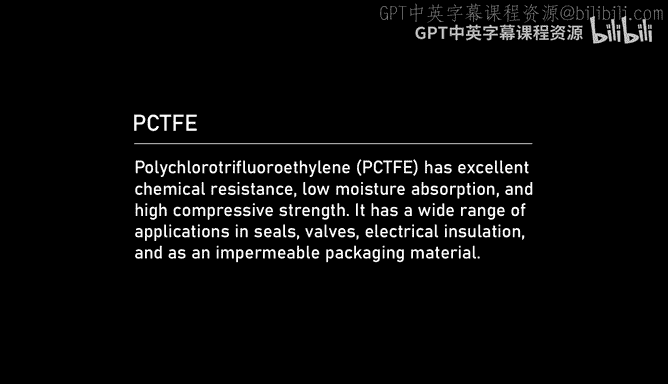

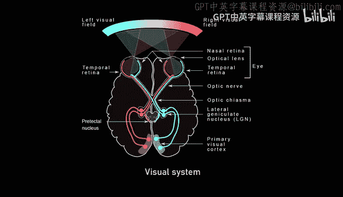

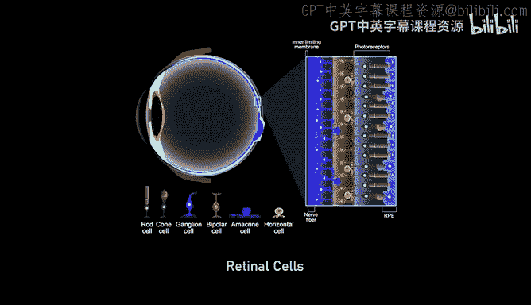

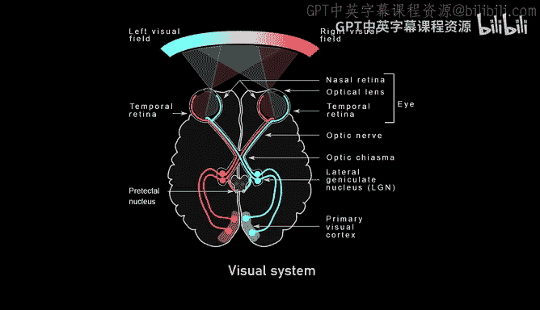

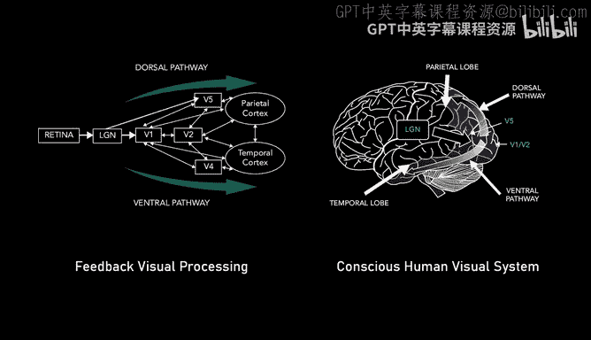

**公式**：  
人类通信速率 << AI通信速率  
目标：通过Neuralink提升人类通信速率，实现更高效的协作。

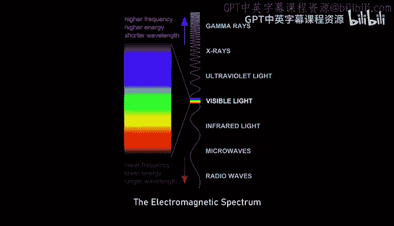

### 4. 脑机接口的医学应用 🏥
Neuralink的初期应用主要集中在解决神经系统损伤问题，例如脊髓损伤、失明、精神分裂症等。通过直接刺激视觉皮层，Neuralink有望帮助失明患者恢复视力，甚至实现超人类的视觉能力。

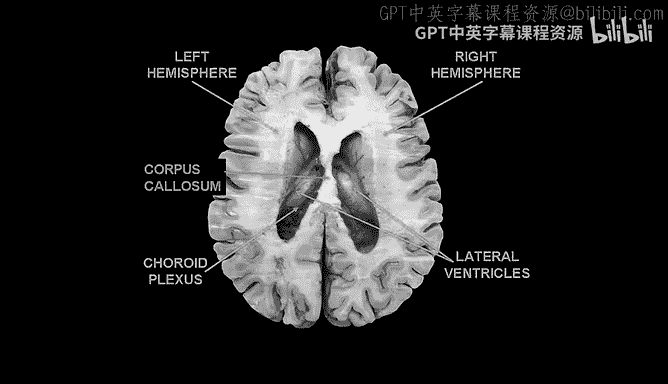

**代码示例**：  
```python
# 模拟视觉信号处理
def restore_vision(signal):
    processed_signal = process_signal(signal)
    return generate_visual_output(processed_signal)
```

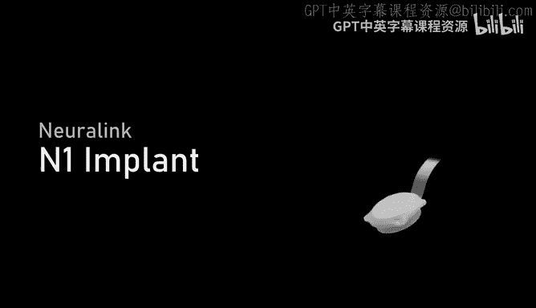

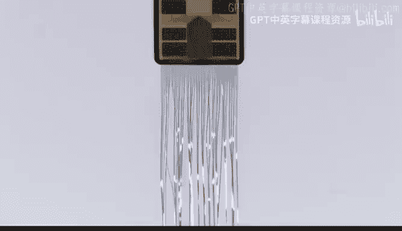

### 5. AI的安全与伦理问题 ⚖️
埃隆·马斯克强调，AI的安全性取决于其是否坚持真理，而不是被编程为迎合政治正确。如果AI被训练为说谎，即使出于善意，也可能导致灾难性后果。因此，AI的设计必须遵循真理原则，避免意识形态偏见。

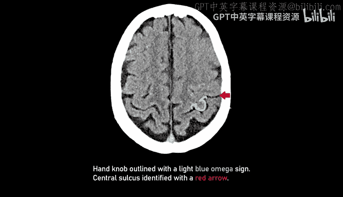

**公式**：  
AI安全性 ∝ 对真理的坚持程度。

### 6. 人类文明的未来 🌍
埃隆·马斯克讨论了人类文明的兴衰规律，指出生育率下降是文明衰退的主要原因之一。他呼吁关注人口问题，确保人类文明的延续。此外，他还提到了SpaceX的目标是让人类成为多行星物种，以应对地球上的潜在风险。

**公式**：  
文明延续 ∝ 生育率  
目标：通过技术和社会政策提升生育率。

### 7. Neuralink 的技术细节 🔧
Neuralink设备包括植入大脑的电极线程、信号处理芯片、无线通信模块和充电系统。电极线程的直径仅为16-84微米，比人类头发还细。设备通过无线充电，并采用蓝牙协议与外部设备通信。

**代码示例**：  
```python
# 模拟信号处理与传输
def process_neural_signal(signal):
    filtered_signal = filter_signal(signal)
    compressed_signal = compress_signal(filtered_signal)
    return transmit_signal(compressed_signal)
```

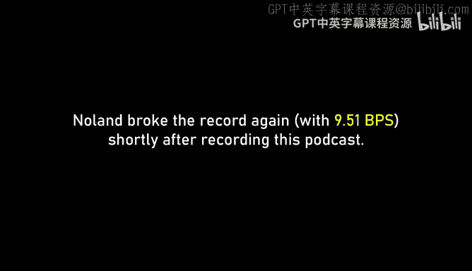

### 8. 手术与机器人技术 🤖
Neuralink的手术由机器人完成，机器人通过计算机视觉技术避开血管，精确植入电极线程。手术过程高度自动化，未来有望进一步简化，使更多患者能够受益。

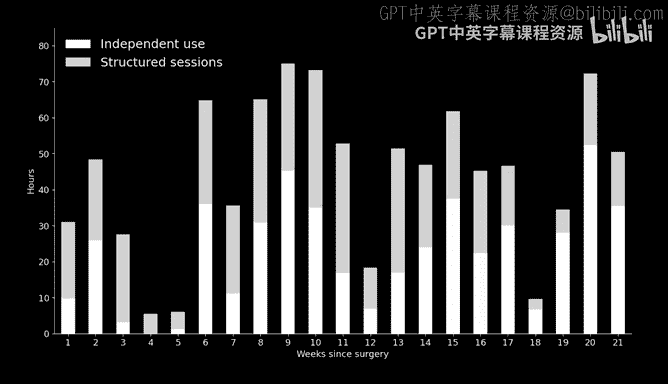

**公式**：  
手术精度 ∝ 机器人技术 + 计算机视觉算法。

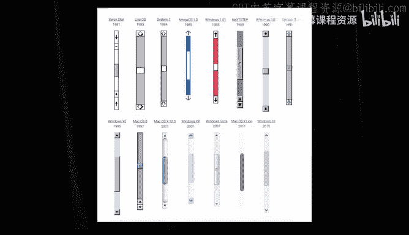

### 9. 用户体验与反馈 📱
Neuralink团队通过不断优化用户体验，帮助患者更自然地控制设备。例如，通过校准和反馈机制，患者可以逐步学会用思维控制光标，甚至实现多任务处理。

**代码示例**：  
```python
# 模拟用户体验优化
def calibrate_user(neural_data, user_feedback):
    model = train_model(neural_data, user_feedback)
    return optimize_control(model)
```

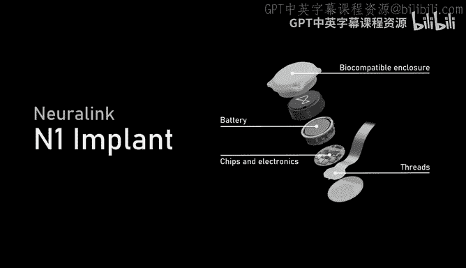

### 10. 未来的应用场景 🌟
Neuralink的未来应用不仅限于医疗领域，还可能扩展到增强人类能力、实现人机融合等方面。例如，通过脑机接口控制机器人、实现超人类视觉或听觉能力，甚至探索意识与记忆的奥秘。

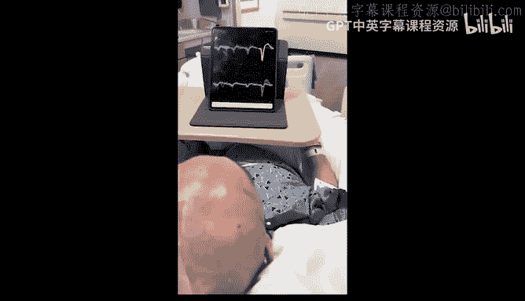

**公式**：  
未来应用 = 医疗修复 + 能力增强 + 人机融合。

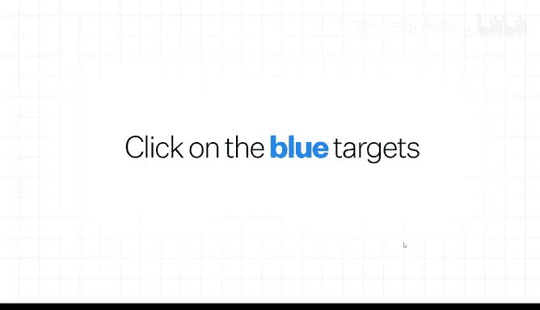

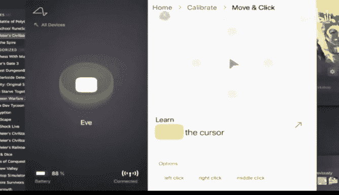

---

## 总结
本节课中，我们一起学习了Neuralink的技术原理、医学应用、AI安全以及人类文明的未来展望。通过提升脑机接口的通信速率，Neuralink有望解决人类与AI的协作瓶颈，同时为神经系统损伤患者带来革命性的治疗方案。未来，这项技术可能进一步扩展，增强人类能力，推动人类文明的进步。

---

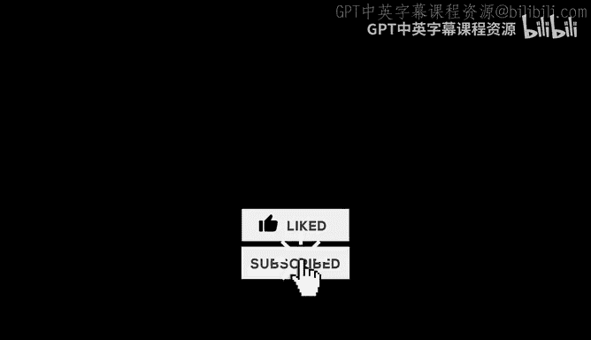

**注意**：本教程根据对话内容整理，保留了原文每一句话的含义，并按照要求删除了语气词，采用Markdown格式输出，配以合适的emoji，核心概念用公式或代码描述，行文流畅且适合初学者理解。