# 课程名称：数学与物理中最难的问题及人工智能的未来（第1部分）🎓

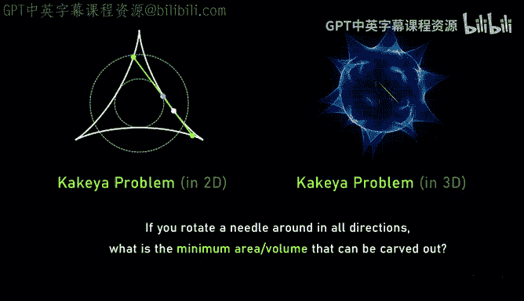

## 概述
在本节课中，我们将要学习数学与物理中一些最具挑战性的问题，并探讨人工智能在解决这些问题中的潜在作用。我们将跟随数学家陶哲轩的视角，了解他如何思考诸如纳维-斯托克斯方程、黎曼猜想、庞加莱猜想等难题，以及他如何看待数学研究方法的演变和人工智能的未来。

---

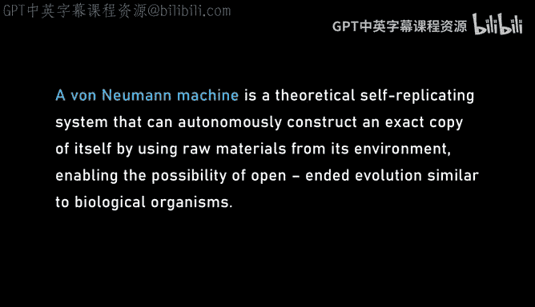

## 数学与物理中的难题

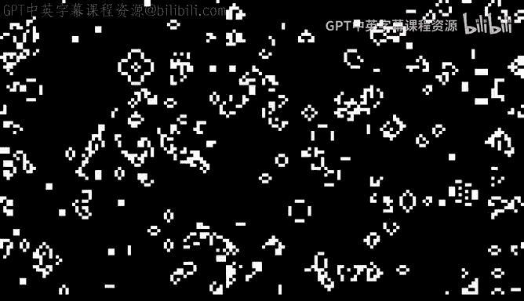

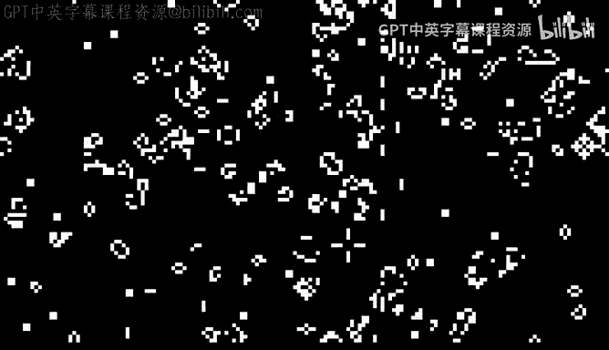

### 纳维-斯托克斯方程与奇点问题
上一节我们介绍了课程的整体框架，本节中我们来看看流体力学中的核心难题——纳维-斯托克斯方程。这组方程描述了不可压缩流体（如水）的运动。一个关键的未解问题是：从一个光滑的初始速度场开始，流体是否会在某个点形成速度无穷大的奇点？这种现象被称为“爆破”。

在现实中，我们不会看到水在浴缸里爆炸或达到光速。但数学上，对于某些特殊的初始配置，奇点是有可能形成的。克莱数学研究所将此列为七个“千禧年大奖难题”之一，悬赏一百万美元求解。

纳维-斯托克斯方程的困难之处在于它是一个“超临界”方程。在非常小的尺度上，非线性输运项的影响远大于线性耗散（粘性）项。耗散项会使流动平静下来，而输运项则会导致湍流等不可预测的复杂行为。在二维情况下，方程是“临界的”，耗散和输运效应强度相当，因此可以证明不会发生爆破。但在三维的超临界情况下，情况就变得非常棘手。

陶哲轩在2016年的一篇论文中，通过构造一个“平均化”的纳维-斯托克斯方程，人为地制造了爆破。他关闭了方程中某些特定的相互作用通道，迫使能量以特定的方式级联到更小的尺度，从而在有限时间内产生奇点。这项工作为理解真实方程的爆破可能性提供了“障碍”，排除了某些证明路径。

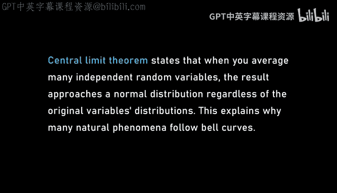

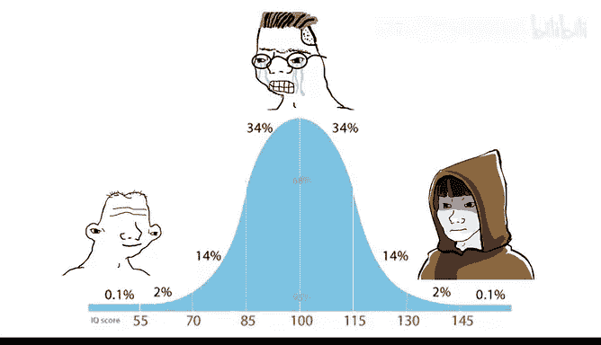

### 从流体方程到“液体图灵机”
为了在三维平均方程中实现爆破，陶哲轩需要设计一种延迟机制，让能量逐级传递，而不是同时分散到多个尺度。这启发他思考：如果真实的流体方程支持计算，会怎样？

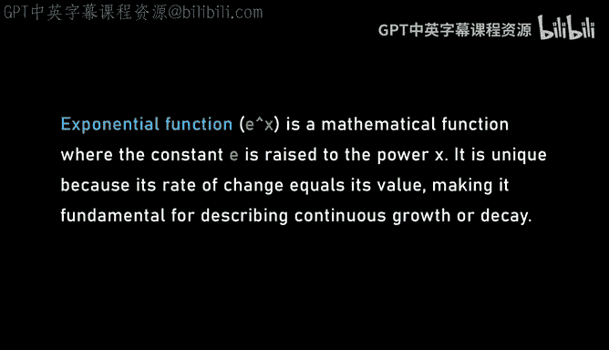

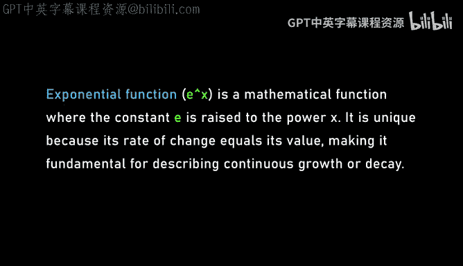

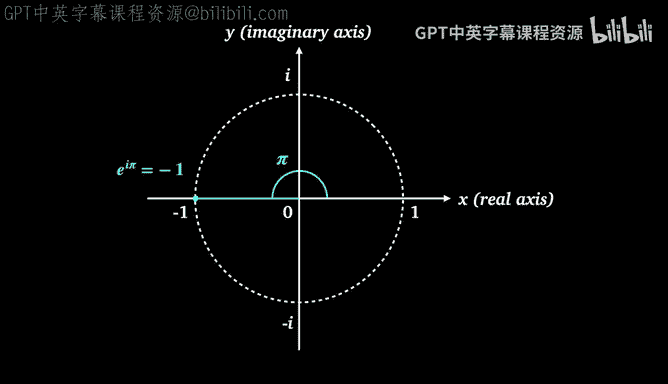

他设想了一种由水构成的“流体计算机”。在这种设想中，水脉冲的特定速度和构型可以代表比特（0或1）。当两股水流碰撞时，可能会产生类似“与门”或“或门”的逻辑输出。通过将这些基本单元链接起来，理论上可以构建一个图灵机，进而创造一个能够自我复制的“流体机器人”。

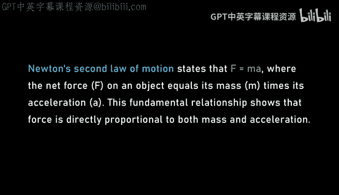

这个“流体冯·诺依曼机”会制造一个更小的自身副本，然后将所有能量转移到这个小副本中并关闭自身。由于方程具有尺度对称性，这个过程可以无限迭代下去，从而在理论上为真实的纳维-斯托克斯方程创造出一个爆破解。这虽然目前还是一个“白日梦”，但它从原理上展示了可能性，并为解决这个千禧年难题提供了一条路线图。这个想法受到了康威“生命游戏”中能够构建逻辑门和自我复制结构的启发。

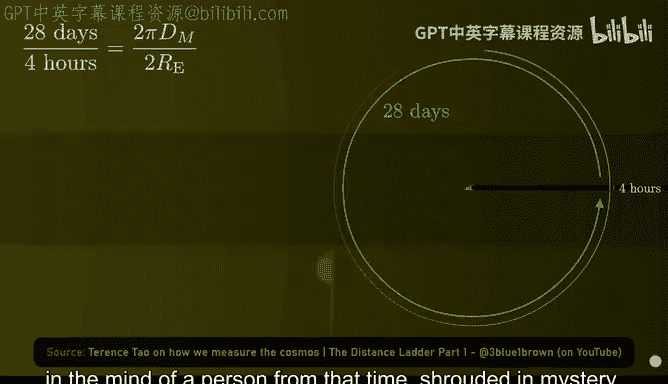

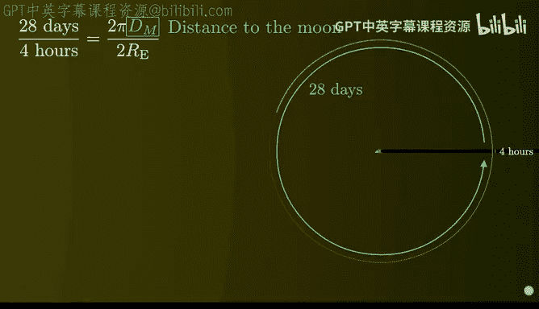

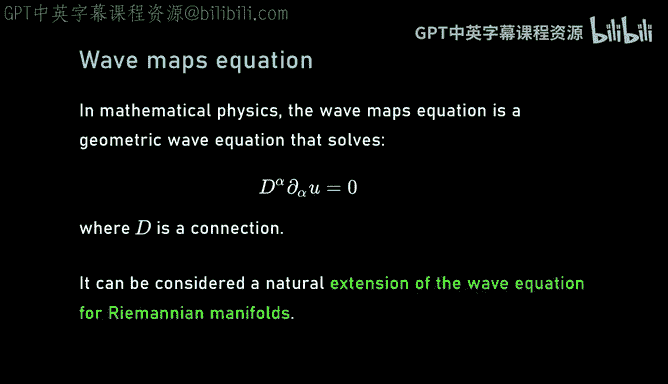

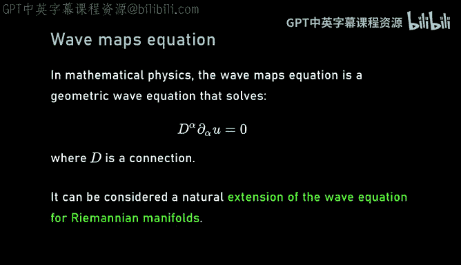

---

## 数学中的结构与随机性

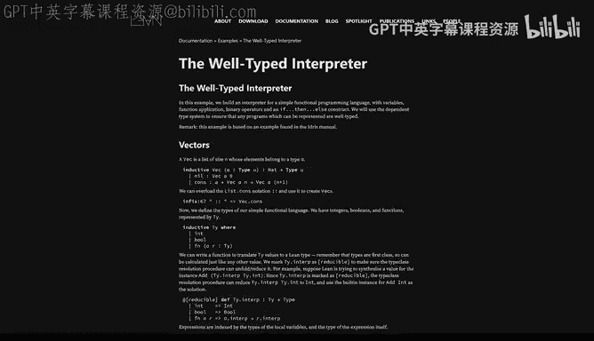

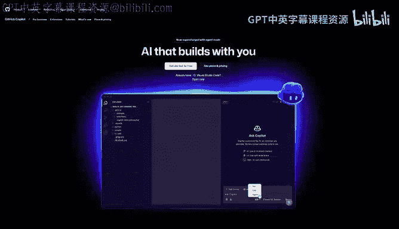

### 结构-随机性二分法
在数学中，我们经常面临“结构”与“随机性”的二分法。大多数数学对象看起来是随机的，比如我们相信圆周率π的各位数字没有固定模式。但也有一小部分对象具有明显的结构。

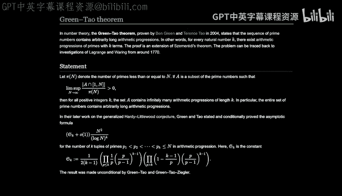

数学家的一个重要工作是证明“逆定理”或“结构定理”。这类定理提供了一种测试方法：如果一个函数或序列表现出某种近似结构（例如“几乎可加”），那么它必然与某个完全结构化的数学对象密切相关。这种二分法意味着，研究对象要么完全没有结构，要么与某种结构化的东西相关。无论哪种情况，我们都能取得进展。

一个著名的例子是塞迈雷迪定理。该定理指出，任何具有正密度的整数集都包含任意长度的等差数列。对于高度结构化的集合（如奇数集），这很容易证明。但对于一个完全随机的集合（比如随机抛硬币保留一半的奇数），仅仅由于随机波动，它仍然会包含大量的等差数列。这类似于“无限猴子定理”：只要有无限的时间，随机打字的猴子几乎必然能打出《哈姆雷特》全文。

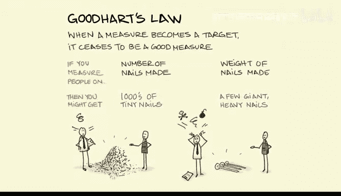

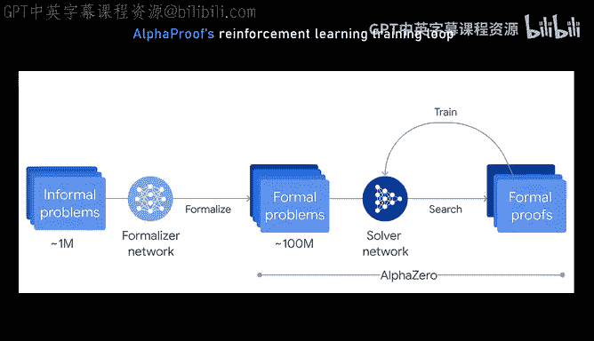

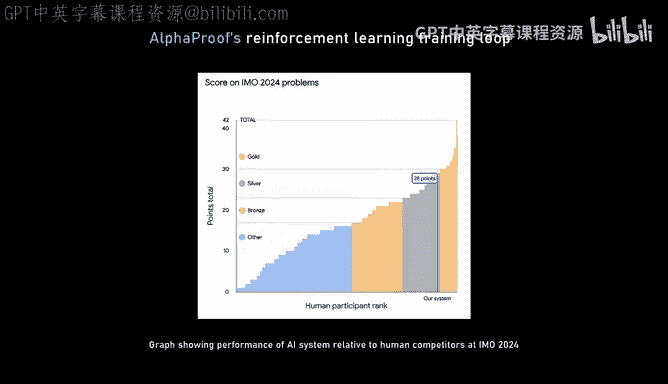

### 质数的随机性与难题
质数常被称为“数学的原子”。从加法角度看，自然数很容易生成（不断加1）。从乘法角度看，所有自然数（除了1）都可以由质数相乘得到。单独处理加法或乘法的问题相对容易，但将两者结合起来（比如涉及质数加法的命题）就变得极其困难。

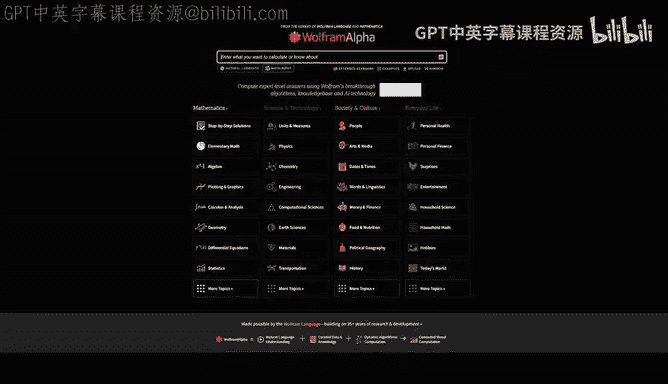

例如，孪生质数猜想（是否存在无穷多对相差2的质数）之所以困难，是因为质数在整体上表现得非常随机，但孪生质数模式又极其稀疏和脆弱。你可以通过精心删改一小部分质数（比如0.01%），就彻底破坏所有孪生质数对，同时让剩下的质数集在统计上看起来依然像原始的质数集。这意味着，任何证明真实质数中存在无穷多孪生质数的方法，在面对这些被篡改的质数集时都会失败。因此，证明必须依赖于真实质数中某种非常微妙、无法仅从统计中获得的特性。

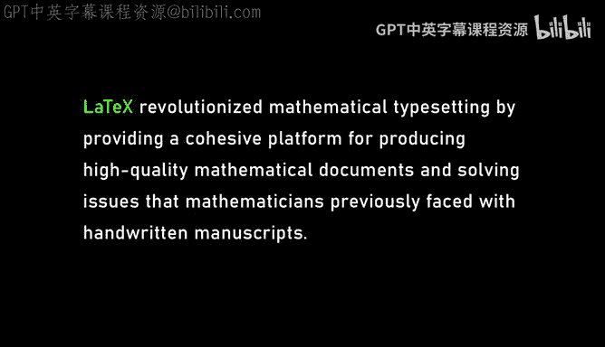

相比之下，等差数列在质数中的存在性（格林-陶定理）则“健壮”得多。即使你删除质数集中99%的质数，剩下的集合仍然可能包含任意长的等差数列。证明这类定理通常依赖于结构-随机性二分法：一个集合要么是结构化的（如周期性），要么是随机的，在这两种情况下都能找到等差数列。

黎曼猜想是另一个关于质数随机性的深刻表述。它断言质数分布的波动程度就像完全随机集合一样，遵循“平方根抵消”的统计规律。但同样，我们缺乏工具来证明这种“真正的随机性”。大多数现有技术无法跨越所谓的“奇偶障碍”，这也是孪生质数猜想和哥德巴赫猜想等问题的核心障碍之一。

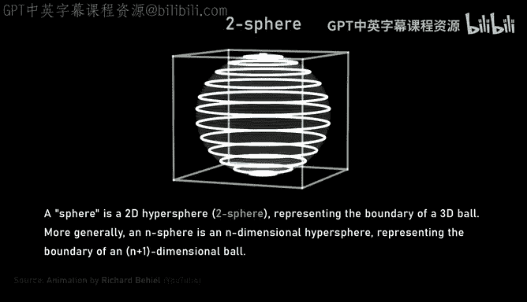

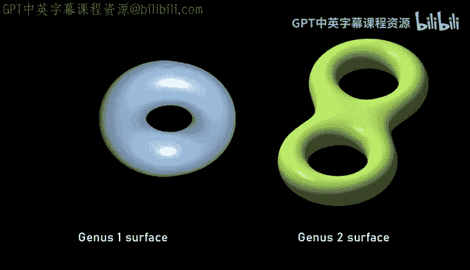

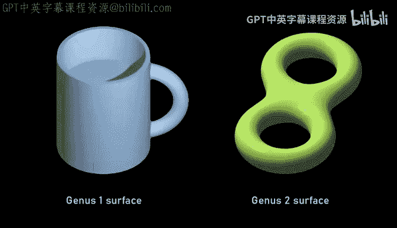

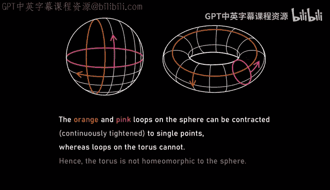

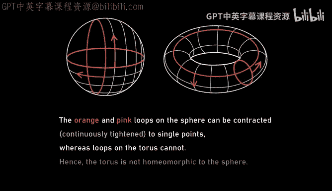

---

## 人工智能与数学的未来

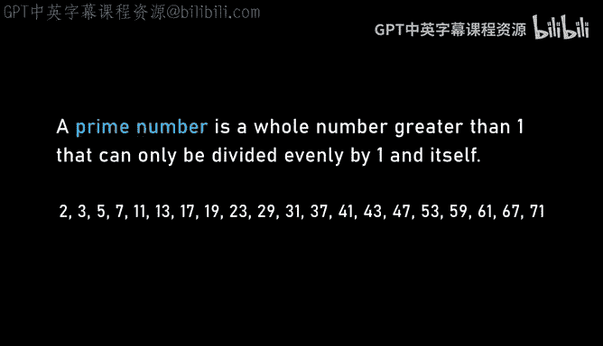

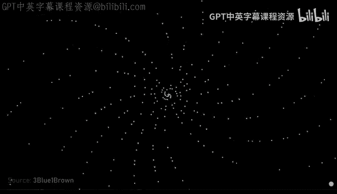

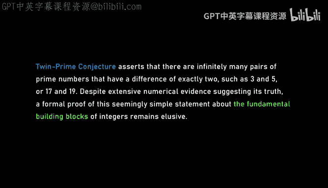

### 形式化证明与Lean语言
近年来，计算机辅助证明，特别是形式化证明，正在改变数学研究的方式。Lean是一种形式化证明编程语言。与Python等生成可执行代码的语言不同，Lean可以生成带有证明步骤“证书”的代码，为数学论证的正确性提供100%的保证（前提是信任Lean编译器）。

使用Lean将非形式化的数学证明转化为形式化代码，目前大约需要10倍的时间。它就像一个极其挑剔的同事，会追问每一个细节和类型。但它的优势也显而易见：
*   **可协作性**：多人可以原子级别地协作于同一个证明的不同部分，所有上下文都是可追溯的。
*   **可验证性**：证明的正确性由机器保证，无需人工逐行检查。
*   **可维护性**：当需要修改证明中的常数或假设时，Lean可以快速定位受影响的代码部分，大大简化更新过程。

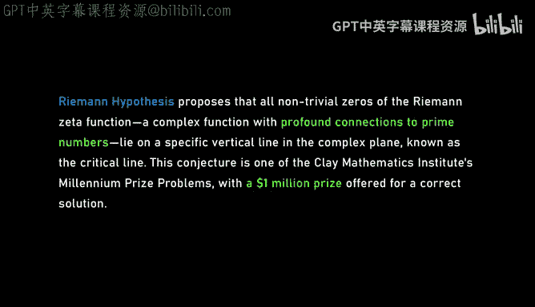

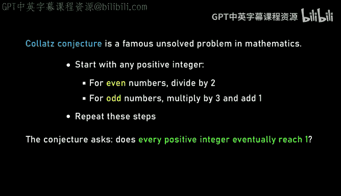

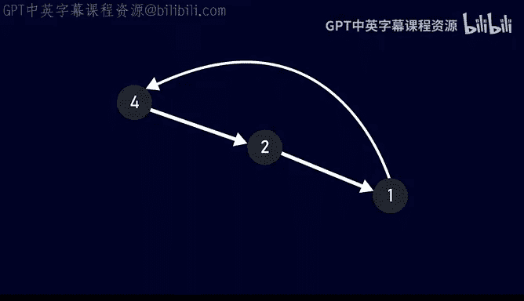

陶哲轩参与了一个名为“EAL理论项目”的大规模形式化实验。该项目生成了约2200万个关于抽象代数定律的蕴含关系问题（例如，交换律是否蕴含结合律？）。通过Lean和社区协作，他们几乎完成了所有问题的判定，论文作者多达50余人。这展示了形式化工具使大规模、可信任的“实验数学”成为可能。

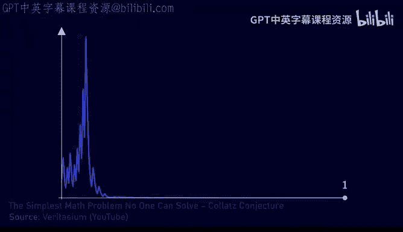

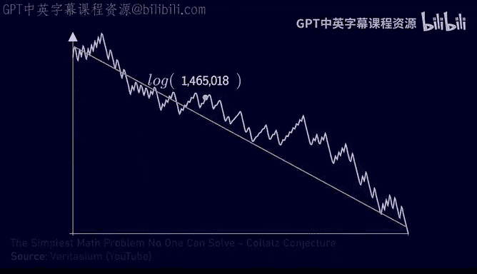

### 人工智能作为数学助手
以DeepMind的AlphaProof为代表，人工智能已经开始在解决数学问题上展示潜力，例如在国际数学奥林匹克（IMO）级别的问题上取得成绩。然而，当前的大型语言模型在数学推理上存在明显局限：
*   **错误难以察觉**：AI生成的证明可能表面看起来完美，但内含细微而愚蠢的错误，缺乏人类数学家的“嗅觉”来判断某个思路是否可行。
*   **组合爆炸**：证明步骤越多，AI每一步犯错的累积概率就越大，导致最终难以得到正确证明。
*   **缺乏负样本数据**：AI的训练数据主要来自已发表的成功证明，缺乏数学家们在探索过程中尝试过但失败了的“负样本”数据，这限制了其学习有效策略的能力。

尽管如此，AI在特定方面已能提供实质性帮助：
*   **降低摩擦**：作为高级自动补全工具，可以快速生成代码片段或建议可能的引理。
*   **文献回顾**：帮助搜索相关文献和已知结论。
*   **填补技能缺口**：帮助数学家完成他们不擅长的编程或计算任务。

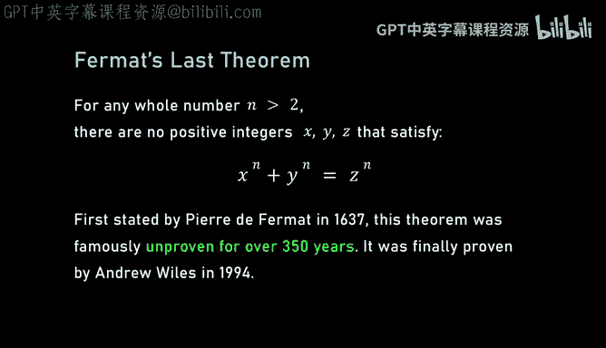

陶哲轩设想，未来数学家可能与AI进行自由对话式的协作。AI可以评估人类提出的思路，提出自己的建议，执行大规模的案例检查，或在人类卡壳时提供新的视角。当形式化证明的成本因AI辅助而降低到某个临界点以下时，数学的写作和发表方式可能会发生范式转移。

---

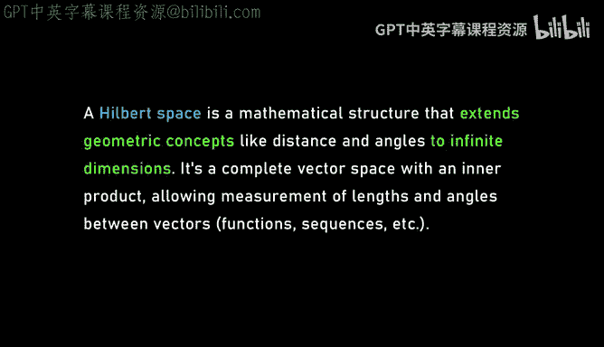

## 总结
本节课中我们一起学习了数学与物理中几个最深刻的问题，从流体方程的奇点、质数的深层结构，到数学研究本身的范式演变。我们看到，解决这些难题不仅需要深刻的数学洞察（如将超临界问题转化为临界问题，或利用结构-随机性二分法），也需要拥抱新的工具和方法。

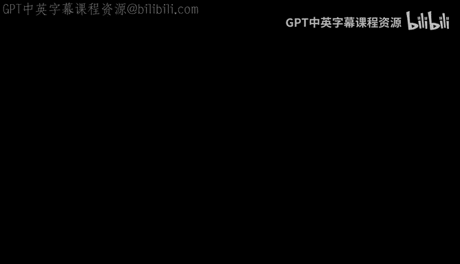

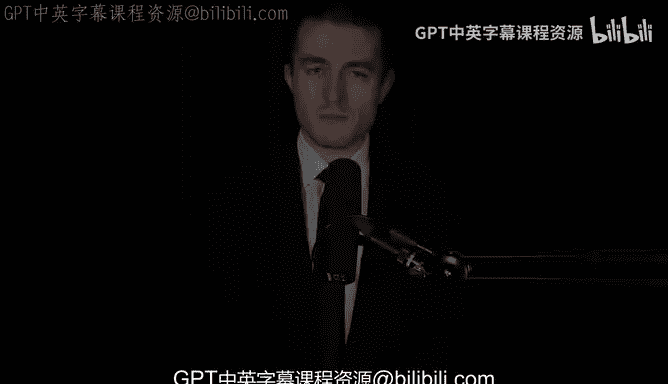

形式化证明语言如Lean和人工智能的兴起，正在将数学从一门几乎完全理论化的学科，转变为一个可以大规模、可验证、协作进行的“实验性”事业。虽然AI目前还无法独立完成高层次的数学创造，但它作为助手的潜力巨大，有望与人类数学家形成强大的共生关系，共同探索数学宇宙中那些尚未被照亮的角落。