# 课程 01：人工智能的未来、现实的模拟、物理学与电子游戏 🧠🎮🌌

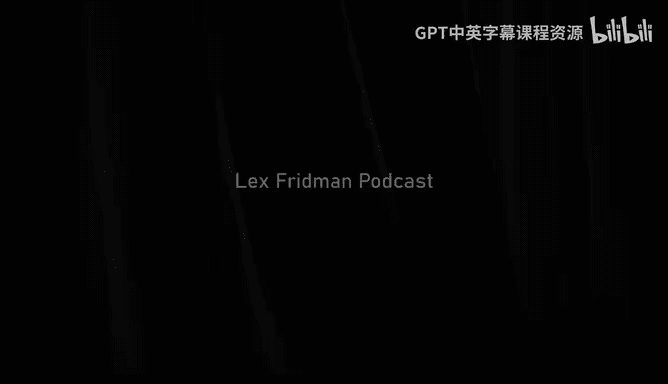

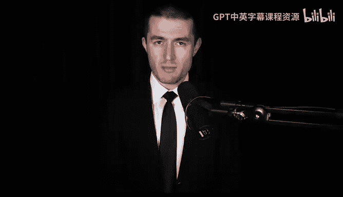

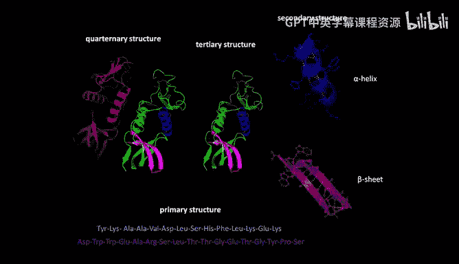

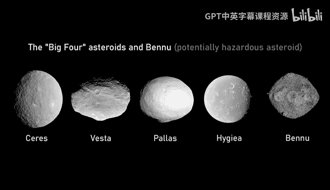

在本节课中，我们将学习人工智能如何模拟和理解复杂的物理世界，探讨自然系统是否都能被经典学习算法高效建模，并展望AI在科学发现和电子游戏等领域的未来。

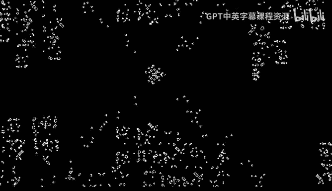

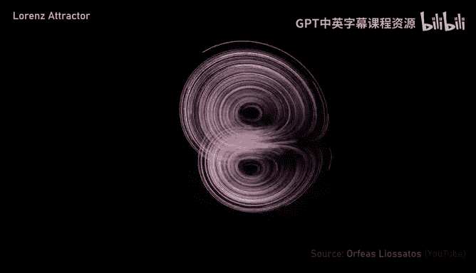

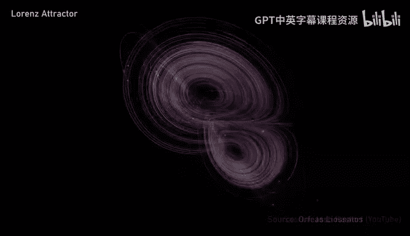

---

## 自然系统的可学习性猜想 🧩

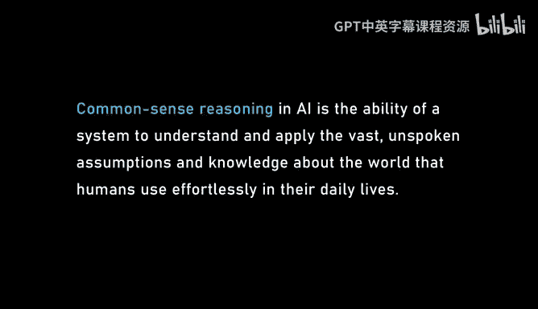

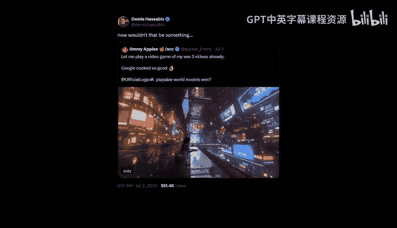

上一节我们介绍了课程主题，本节中我们来看看德米斯·哈萨比斯提出的一个核心猜想。

在诺贝尔奖演讲中，德米斯·哈萨比斯提出了一个非常有趣的猜想：“自然界中任何能够产生或发现的模式，都可以被经典学习算法高效地发现和建模。”

以下是该猜想涵盖的可能系统：
*   **生物学**：例如蛋白质折叠。
*   **化学**：分子相互作用。
*   **物理学**：流体动力学、材料行为。
*   **宇宙学**：行星轨道、小行星形状。
*   **神经科学**：大脑功能。

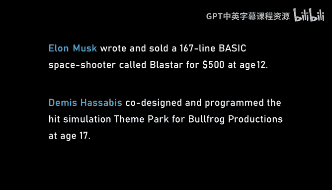

这个猜想的核心思想是，自然系统并非随机，它们经历了进化或类似的选择过程（如地质风化、天体演化），从而形成了内在结构。这种结构使得它们可以被逆向学习，并通过一个**低维流形**来高效搜索解决方案。

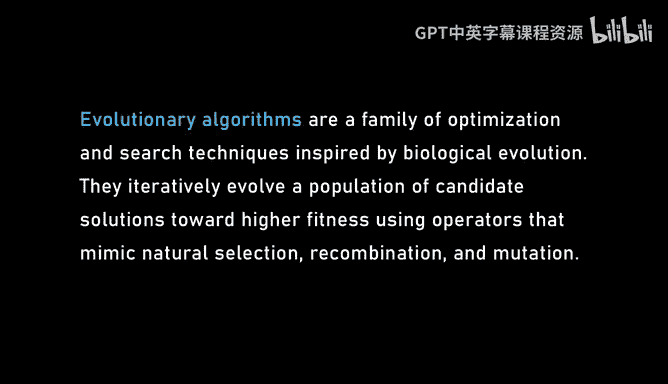

**公式/核心概念**：`可学习的自然系统 ≈ 具有进化/选择历史结构的系统`

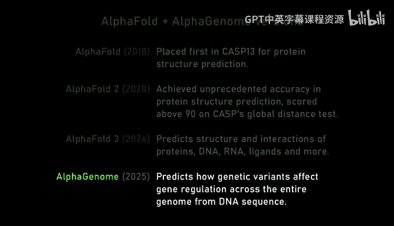

---

## 从游戏到通用人工智能的桥梁 🎲➡️🤖

上一节我们探讨了自然系统的结构，本节中我们来看看德米斯如何将早期在电子游戏开发中的经验，与构建通用人工智能（AGI）的愿景联系起来。

德米斯早期职业生涯致力于开发电子游戏和游戏AI。他参与制作的游戏（如《主题公园》、《黑与白》）都是开放世界模拟游戏，玩家的选择会动态改变游戏体验。这本质上是在构建一个**世界模型**——一个对世界运作机制、物理规律及其内部事物的模拟。

他认为，构建AGI所需的核心组件之一，正是这样一个能够理解世界物理规律和动态的**世界模型**。现代AI系统（如视频生成模型Veo）在模拟液体、光影和材料物理方面展现出的惊人能力，暗示它们正在从被动观察中提取关于世界底层结构的知识，形成一种“直觉物理”理解。

**代码/核心概念**：`AGI 世界模型 = 物理模拟 + 实体交互 + 动态叙事生成`

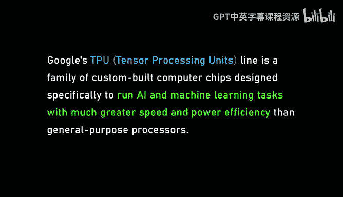

---

## 人工智能与科学发现的未来 🔬💡

上一节我们讨论了世界模型，本节中我们来看看人工智能如何推动科学发现，并挑战我们对“理解”和“创造力”的定义。

人工智能已经在特定领域的科学发现中取得突破，例如：
*   **AlphaFold**：解决了蛋白质结构预测问题。
*   **AlphaFold 3**：预测蛋白质与RNA、DNA的相互作用。
*   **AlphaDev**：发现更优的排序算法。
*   **GNoME**：预测材料稳定性。

然而，真正的科学创造力——提出全新的、深刻的猜想或研究方向（如爱因斯坦提出相对论）——仍然是当前AI系统的短板。这涉及到**研究品味**和**判断力**，即在无数可能性中识别出那个能有效分割假设空间、推动科学前进的关键问题。

未来的“AI科学家”可能需要结合大型模型与进化算法等搜索方法，在由模型构建的“认知地图”上进行探索，从而产生真正新颖的发现。

**核心概念**：`科学发现 = 提出好问题（猜想） + 高效搜索（求解）`。当前AI擅长后者，前者是未来挑战。

---

## 人工智能、能源与人类未来 🌍⚡🚀

上一节我们展望了AI在科学上的潜力，本节中我们来看看AI如何帮助解决能源等全球性挑战，并塑造人类的未来。

德米斯认为，如果AI能帮助人类解决清洁能源问题（如核聚变、高效太阳能），将开启一个“**资源极大丰富**”的时代。近乎免费的能源可以解决水资源短缺（通过海水淡化）、太空探索成本等问题，从根本上改变人类社会零和博弈的现状。

同时，AI带来的自动化也可能导致经济和社会结构的剧变。这要求我们提前思考新的经济模式（如全民基本收入）和治理体系，以确保技术进步的利益被广泛共享，并引导人类的竞争本能通过体育、游戏等建设性方式释放，而非破坏性冲突。

**核心概念**：`AI驱动繁荣 = 解决资源稀缺（能源） + 设计公平分配机制（社会经济）`

---

## 总结与展望 🎯

本节课中我们一起学习了德米斯·哈萨比斯关于人工智能未来的深刻见解。

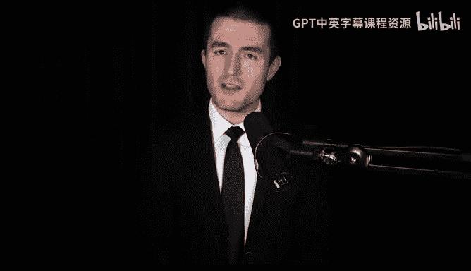

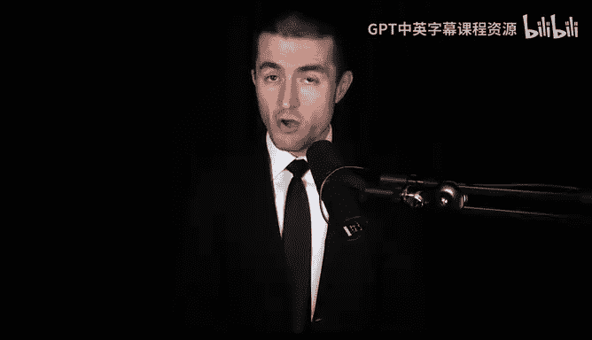

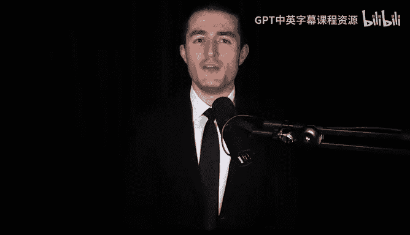

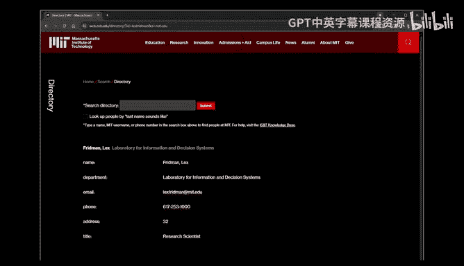

我们探讨了自然系统可被经典学习算法建模的猜想，回顾了从游戏AI到AGI世界模型的思想脉络，审视了AI在科学发现中的现状与未来挑战，并展望了AI在解决能源危机、重塑社会经济方面的巨大潜力。德米斯强调，应以“谨慎的乐观”态度推进AGI发展，全力获取其益处，同时以科学方法深入研究并缓解其风险。

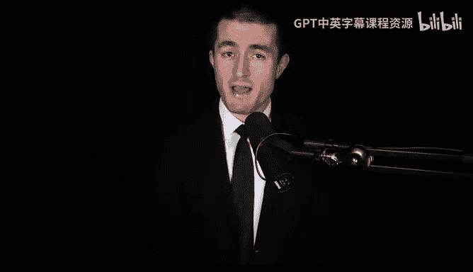

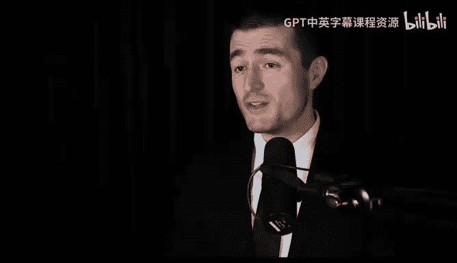

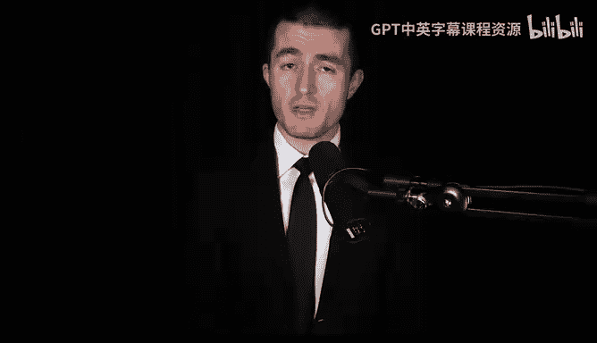

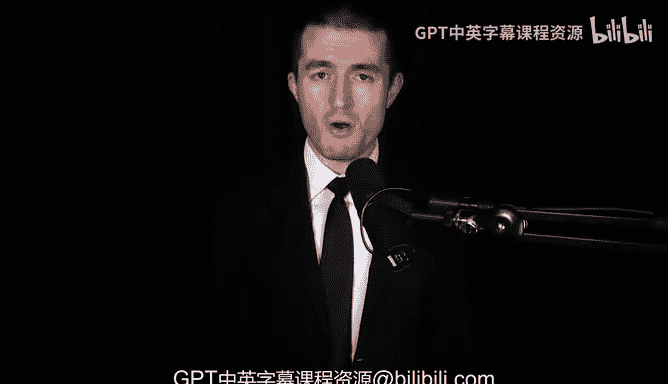

最终，AI不仅是强大的工具，也是一面镜子，帮助我们更深入地理解物理世界的规律、科学发现的本质，以及人类意识、创造力和合作精神的独特价值。