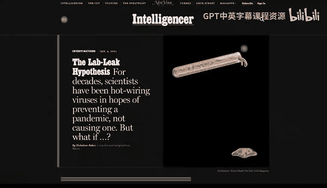
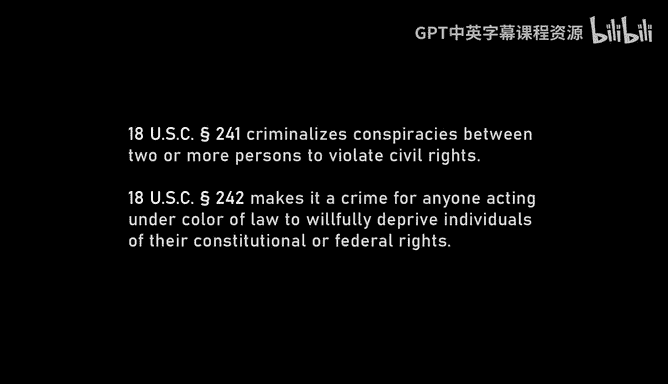
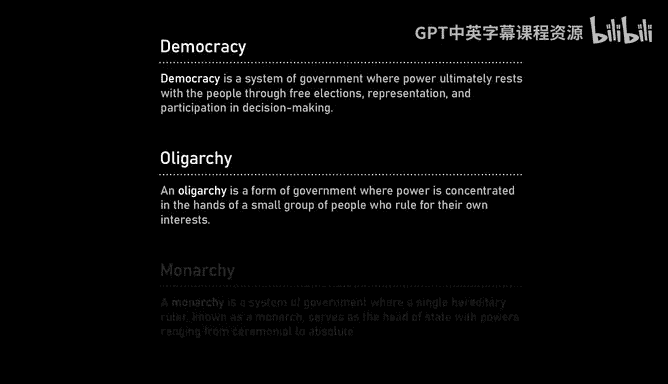
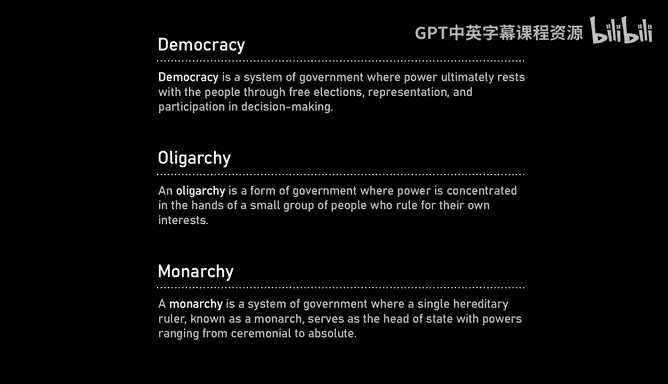
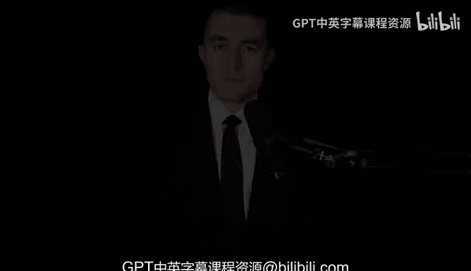

# 课程 01：美国科技、政治与未来的对话 🎙️

在本节课中，我们将一起学习并整理来自 Lex Fridman 播客第 458 期与马克·安德森对话的第一部分内容。我们将探讨科技、政治、人工智能、移民以及美国未来的核心议题。课程将严格遵循翻译和整理要求，确保内容清晰、结构完整，适合初学者理解。

---

## 概述 📋

本节课程基于对科技投资人马克·安德森的深度访谈。我们将探讨他对美国当前经济、科技发展、政治环境以及社会文化的看法，特别是他对“咆哮的二十年代”愿景的描绘，以及实现这一愿景所需的条件。

---

## 美国的经济增长与潜力 📈

上一节我们介绍了课程的整体框架，本节中我们来看看马克·安德森对美国经济增长潜力的分析。

他认为，尽管面临各种挑战，美国经济在过去几年持续增长，而许多其他国家则停滞甚至倒退。他将此归因于几个关键因素：

*   **地理与资源**：美国拥有得天独厚的地理安全和丰富的自然资源，能够实现能源独立。
*   **人口活力**：美国吸引了全球最具进取心和能力的人才，形成了充满活力的社会。
*   **技术领导力**：在软件、人工智能、生物科技等先进领域，美国处于全球领先地位。

这些条件为美国实现“怪物级”的经济繁荣奠定了基础。

---

## 美国精神与企业家精神 🇺🇸

在分析了经济增长的客观条件后，我们转向更主观的文化因素。本节探讨是什么塑造了独特的美国企业家精神。

马克认为，美国精神是多种文化融合的结果，包括东北部扬基人的坚韧、苏格兰-爱尔兰裔的进取心、南部和德克萨斯州的强悍性格，以及加州兼具创新与工程精神的混合体。这种精神在经历低谷后总能复苏，就像上世纪80年代里根时期那样，关键在于有人站出来说“是时候建设了”。

核心在于对**自由**和**个人主义**的崇尚。这种精神在美国内战结束到1930年代期间达到顶峰，推动了第二次工业革命，并使美国取得了全球领导地位。

---

## 传统、进步与社会结构 🏛️

理解了驱动美国的精神内核后，我们需要思考这种精神与历史传统的关系。马克引用了一本重要的历史著作《古代城市》。

这本书通过研究印欧祖先的社会结构，揭示了早期人类社会在生存压力下形成的模式：

*   **三层结构**：家庭、部落、城市。个人权利概念为零。
*   **道德观**：强即善，弱即恶的“主人道德”。
*   **社会形态**：**最大限度的法西斯主义**（绝对自上而下的控制）结合**最大限度的共产主义**（无市场经济，一切共享）。

有趣的是，马克指出，现代西方社会在宣称进入后宗教的世俗时代后，某种程度上又“演化”回了类似的宗教结构：身份政治类似于祖先崇拜，环保主义类似于自然崇拜。这提醒我们，完全抛弃传统、试图每一代都彻底重塑社会是危险且不切实际的。

---

## 政府监管与“软性威权主义” 🚫

从历史视角回到现实，我们来看看当前阻碍发展的具体问题。马克认为，过去十年美国笼罩在一种“软性威权主义”之下。

以下是其主要表现：

*   **监管重压**：繁琐的规则和“否决制”官僚体系，使得任何进步都举步维艰。
*   **负面叙事**：弥漫着“进步是坏的”、“科技是坏的”、“资本主义是坏的”的社会氛围，打压成功者（“高罂粟综合症”）。
*   **具体政策**：审查制度、取消银行服务、故意削弱关键产业、释放罪犯等社会政策。

他认为，仅仅是解除这种压制性的氛围，就能释放出巨大的能量，推动增长和精神的复兴。目前已经能看到科技界和好莱坞等领域出现的“氛围转变”。

---

## 偏好伪装与社会变革 🎭

氛围的转变涉及人们公开表达与私下想法之间的差异。本节引入“偏好伪装”的概念来解释这一社会动态。

“偏好伪装”是指人们公开表达与自己私下信念不符的观点，或者被迫说出自己并不相信的话。这会导致两个问题：

1.  个体被迫撒谎，造成道德感的侵蚀。
2.  社会无法知晓真实想法的分布，每个人都害怕第一个站出来。

社会变革的机制往往始于一个“反精英”人物（如埃隆·马斯克）公开说出真相。如果他没有受到惩罚，就会有第二个人、第四个人跟进，形成滚雪球效应。当沉默的大多数意识到自己并非少数时，变革就会迅速发生。

马克估计，社会中的分布可能是：20% 当前意识形态的“真正信徒”，20% 坚定的反对者，60% 沉默的、随大流的中间派。变革的关键在于这60%的人最终选择跟随哪一方。

---

## 审查制度的历史与反思 🔒

社会变革需要自由的言论环境，但过去十年我们见证了审查制度的加强。马克回顾了这段历史。

早期互联网几乎没有审查。转折点大约在2012-2013年，随着“觉醒”一代进入科技公司以及政治力量的介入，审查机器开始被用于远超出法律要求（如恐怖主义、儿童色情）的范畴。

审查主要围绕两个概念展开：
*   **仇恨言论**：从禁止种族歧视性词汇开始，定义逐渐模糊，最终演变为“任何让人不舒服的言论”。
*   **虚假信息**：在“通俄门”和新冠疫情时期被滥用，用于压制某些观点（如实验室泄漏论），其本质是自封“真理部”，是深刻的反西方和威权行为。

Substack和埃隆·马斯克收购推特（现X）是打破这种审查机制的关键突破。约翰·斯图尔特在电视上质疑新冠起源的言论，也是一个重要的催化时刻。

---

## 领导力、压力与“权力之戒” 💍

运营大型科技公司并承受内外部压力，对领导者是极大的考验。马克以马克·扎克伯格为例进行了分析。

领导者本质上是孤独的，他们的言论分量很重，面临复杂问题和巨大压力，且常常无人可以倾诉。公司可以承受大多数外部压力（如股价下跌、负面报道），只要内部团队保持团结。但无法承受的是**内部团队的裂痕**，一旦发生，局面将急转直下。

最特殊的压力来自**政府压力**。当政府动用行政权力、监管威胁甚至直接致电施压时，任何CEO都无法抗衡。马克指出，过去几年政府的行为在许多方面明显违宪且涉嫌犯罪（如剥夺言论自由、正当程序权利）。

“审查机器”就像《指环王》中的“权力之戒”，本身具有无限的诱惑力和腐蚀性。一旦存在，就会被用于越来越多的目的，最终腐蚀使用者的灵魂。

---

## 精英、大众与权力力学 ⚖️

权力如何在实际中运作？本节引入“寡头铁律”和“马基雅维利主义”的视角。

“寡头铁律”指出，民主在结构上几乎总是虚假的。大众无法有效组织，只有少数人能组织起来。因此，人类历史上所有的政治结构，本质上都是**组织起来的少数精英统治分散的多数大众**。

美国的开国元勋们深刻理解这一点，因此设计了一套**制衡体系**（三权分立、参众两院），旨在精英内部实现权力平衡，而非真正的直接民主。理解权力实际如何运作，而非理想中应如何运作，是思考如何维护自由的关键。

---

## 移民、人才与公平竞争 🧑‍🎓

最后，我们探讨一个充满争议的议题：高技能移民。马克提出了一个复杂而 nuanced 的观点。

他承认高技能移民（如H-1B签证）的传统论点有其道理：吸引全球人才，促进创新，创造更多就业，对美国有利。

然而，他指出了被忽视的另一面：
*   **国内人才的忽视**：美国中西部、南部等“特朗普票仓”地区有大量人才，但似乎没有渠道进入高科技领域。
*   **平权行动（DEI）的影响**：大学录取和公司招聘中的“多元化”政策，实际上系统性地排除或降低了特定群体（亚裔、犹太人、美国本土黑人、白人）的机会，而偏好外国出生的特定族裔。这造成了国内人才与高技能移民之间的对立。
*   **全球“人才虹吸”**：美国、加拿大、英国、澳大利亚持续从全球吸引最聪明的人才，这对输出国可能造成长期损害，类似于历史上的“资源掠夺”。

他认为，解决方案不是二选一，而是**双管齐下**：在欢迎高技能移民的同时，必须改革教育和工作体系，确保国内所有背景的顶尖人才都能获得公平的机会。例如，可以重启类似“国家优秀奖学金”的全国性人才搜寻计划。

---

## 总结 🎯

本节课中，我们一起学习了马克·安德森对美国未来（“咆哮的二十年代”）的乐观展望，其基础在于美国独特的地理资源、人口活力、技术领导力以及坚韧的个人主义精神。同时，我们也深入探讨了实现这一愿景需要克服的障碍：过度的政府监管和“软性威权主义”、基于“偏好伪装”的社会僵局、侵蚀自由的审查制度，以及移民与国内人才政策之间的紧张关系。最后，我们从权力运作的机制出发，理解了社会变革和制度设计的复杂性。这为我们思考科技、政治与社会的互动提供了丰富的视角。