# 课程 P1：如何用 Gradio 搭建机器学习 API 🚀

在本节课中，我们将学习如何利用 Gradio 框架，将机器学习原型快速转化为可供生产环境使用的 API。我们将探讨 Gradio 如何简化从模型原型到部署的整个流程，并介绍其新推出的 Python 和 JavaScript 客户端。

---

## 概述：为什么需要机器学习 API？

如今，机器学习正处在一个黄金时代。与十年前主要由工程师使用不同，现在任何能使用图形界面或浏览器的人都可以接触到最先进的机器学习演示。每当有新的研究论文发布，几乎都会附带一个演示，这极大地提升了机器学习的可及性。

许多这样的演示都运行在 Hugging Face Spaces 上，并由 Gradio 提供支持。然而，过去构建这样的机器学习 Web 应用和演示非常困难，开发者需要掌握 Flask、Docker、JavaScript 和 CSS 等多种技术。现在，有了 Gradio，这一切都可以在 Python 中完成。

Gradio 的使命是赋予 Python 开发者“超能力”，让他们能够轻松创建机器学习演示和应用，从而推动整个领域的普及。目前，每月有近百万开发者在使用 Gradio。但我们并不满足于此，我们希望 Gradio 不仅能用于原型设计，更能用于生产环境。

上一节我们介绍了机器学习 API 的重要性，本节中我们来看看从原型到生产 API 所面临的挑战。

## 从原型到生产的挑战

构建一个机器学习 API 通常涉及多个步骤：
1.  **原型设计**：使用如 Hugging Face Transformers、PyTorch 或 scikit-learn 等工具进行模型实验和调优。
2.  **容器化与部署**：将模型部署到可扩展的基础设施上。
3.  **API 与文档**：为 API 编写文档，构建下游客户端，并确保文档的实时更新。
4.  **监控**：监控 API 的使用情况、延迟和成功率等指标。

这个过程不仅耗时，而且常常需要使用不同语言和框架。更关键的是，部署后往往还需要回到原型阶段进行迭代，例如因为数据分布变化或新模型发布。因此，如果能用一个框架（Gradio）和一种语言（Python）来加速整个流程，将极大提升开发效率。

接下来，我们将探讨 Gradio 如何解决这些问题。

## Gradio 如何解决问题

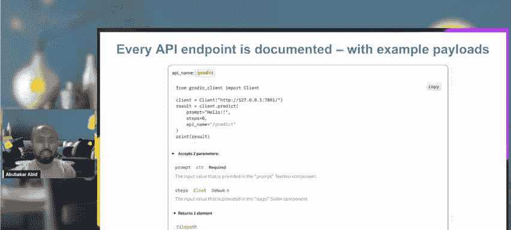

### 1. 每个 Gradio 应用都是现成的 API


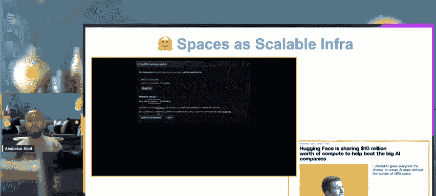

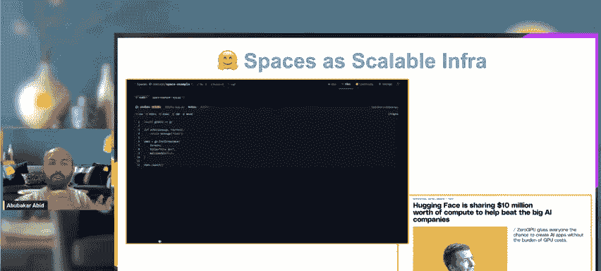

每个 Gradio 应用底部都有一个“Use via API”的链接。点击后，你会看到应用中每个函数的自动生成文档，包括参数、载荷类型、返回值以及示例请求。这一切都是自动完成的。

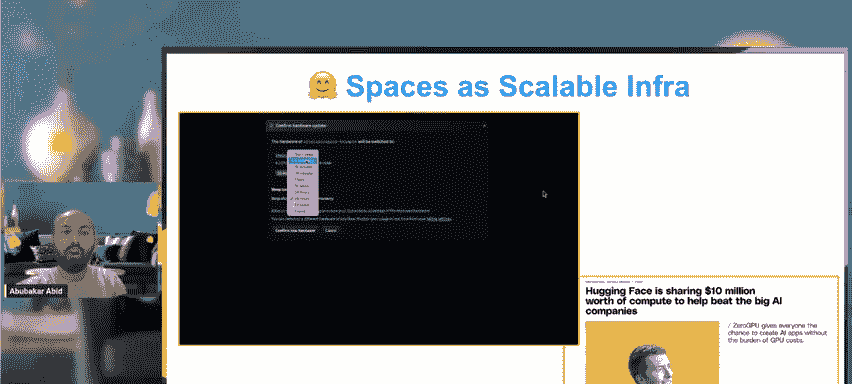

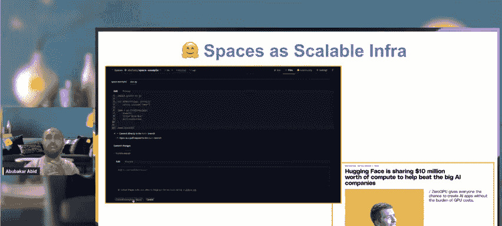


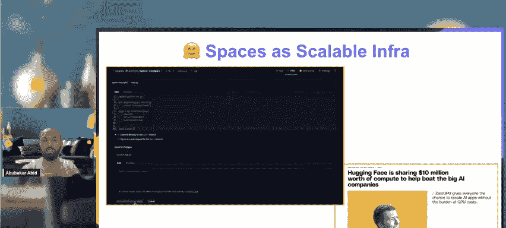


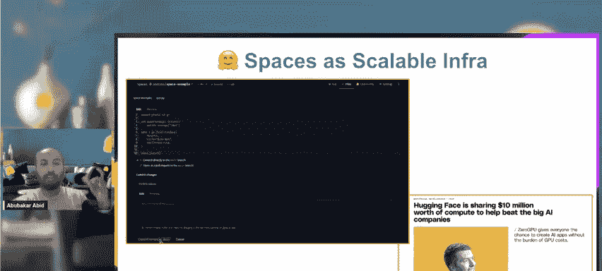

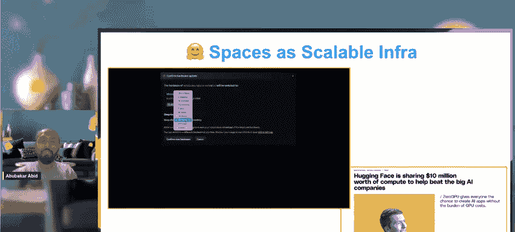

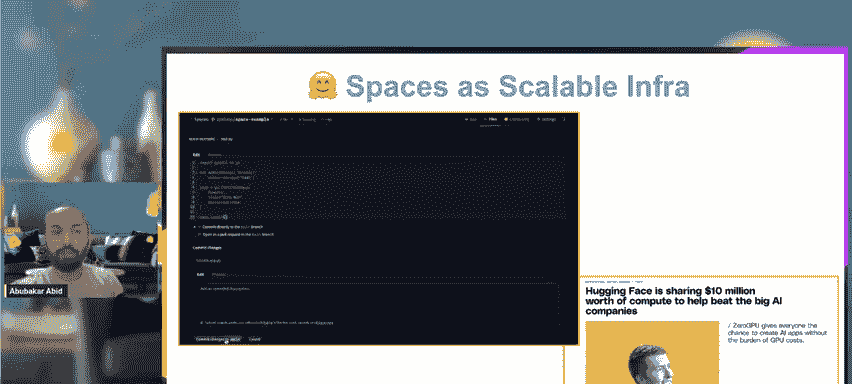

**示例代码**：一个简单的 Gradio 应用结构
```python
import gradio as gr

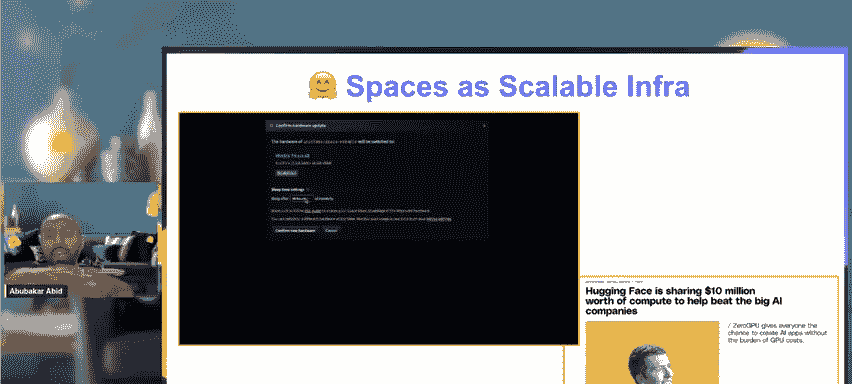

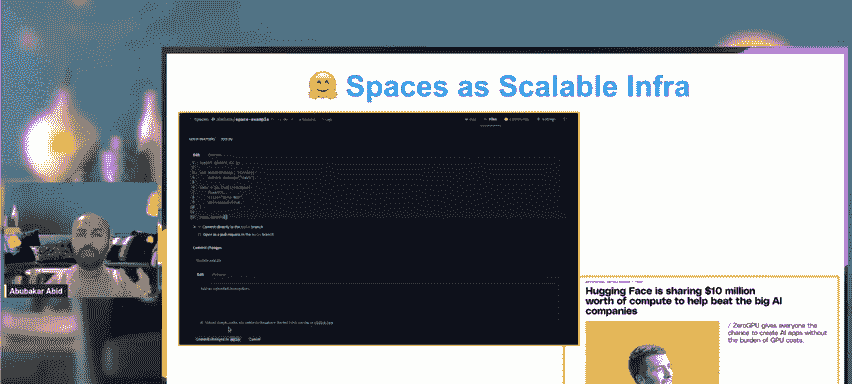

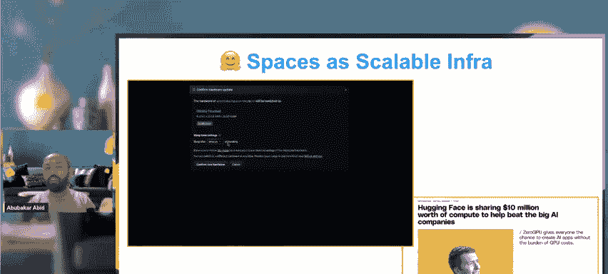


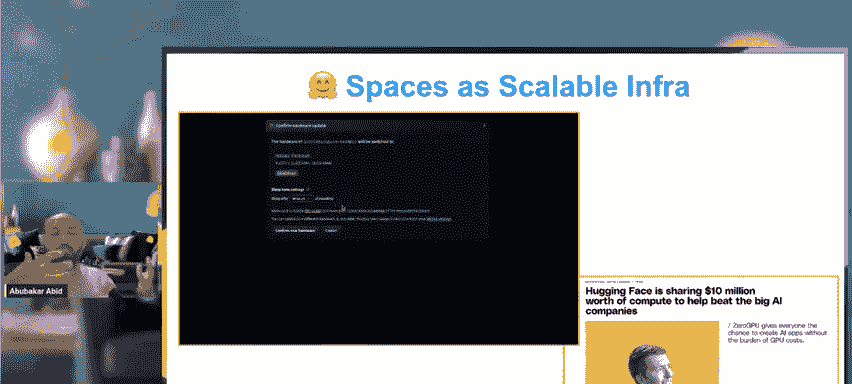

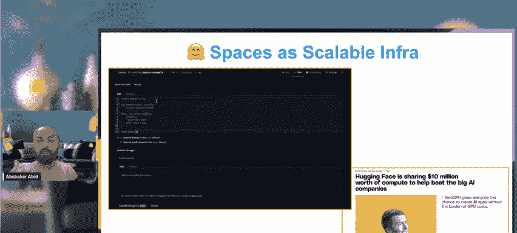

def generate_image(prompt, steps):
    # 你的模型推理代码
    return image

demo = gr.Interface(fn=generate_image, inputs=["text", gr.Slider(1, 50)], outputs="image")
demo.launch()
```

### 2. 灵活的部署与基础设施

Gradio 应用可以部署在任何地方，但与 Hugging Face Spaces 的集成最为自然。在 Spaces 上，你可以：
*   选择所需的硬件（如 GPU）。
*   轻松控制应用的休眠时间，只为实际使用的计算资源付费。
*   利用新推出的 **Zero GPU** 功能，在不同用户间共享 GPU，从而在某些情况下实现零成本运行 GPU 负载。

当然，你也可以将应用部署在自己的服务器或基础设施上。

### 3. 简化 API 使用：API 记录器

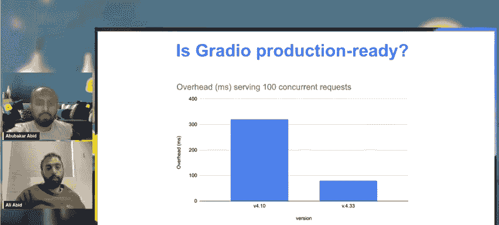

编写和阅读 API 文档可能很繁琐。Gradio 引入了 **API 记录器** 来解决这个问题。你只需在 UI 中与应用交互，Gradio 就会记录这些交互，并生成对应的客户端 API 调用代码。这样，你无需查阅文档就能快速获得调用 API 所需的脚本。

### 4. 高效的队列管理

当你的应用流量激增时，Gradio 会自动管理请求队列。你主要通过两个参数进行配置：
*   **`concurrency_limit`**：设置同时处理某个函数的工作进程数量。例如，如果你有 3 个 GPU 用于图像生成，可以将其设为 3。
*   **`concurrency_id`**：为可以共享工作进程的不同函数设置相同的 ID，以便更精细地控制资源分配。

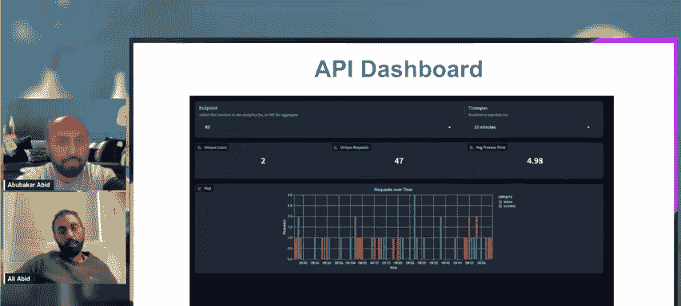

### 5. 极低的开销

Gradio 团队持续优化，力求在请求处理中添加尽可能少的开销。通过测试，在最近的版本中，Gradio 的开销已降低了约 75%，使其在生产环境中 serving API 时几乎可以忽略不计。

一个典型的例子是 **Chatbot Arena** 应用，它每天为数万用户处理数十万条流式请求，完全由 Gradio 支撑，无需担心扩展性问题。

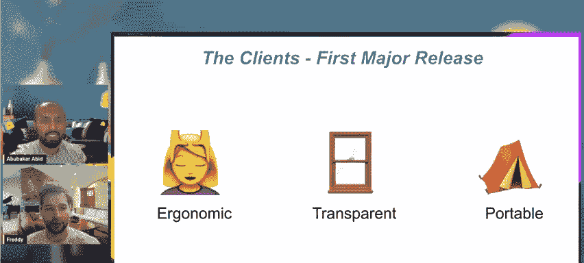

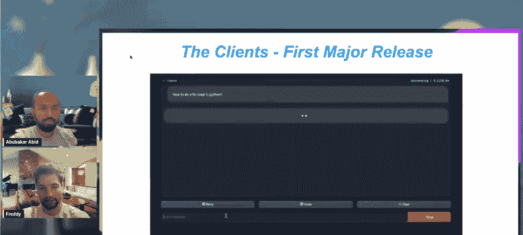

### 6. 内置监控仪表板

对于生产用例，监控 API 流量至关重要。现在，每个 Gradio 应用都附带一个 **API 监控仪表板**。只需访问 `你的应用URL/monitoring`，即可查看所有请求的详细信息，包括请求量、成功率、延迟等。这个仪表板仅对应用创建者可见。

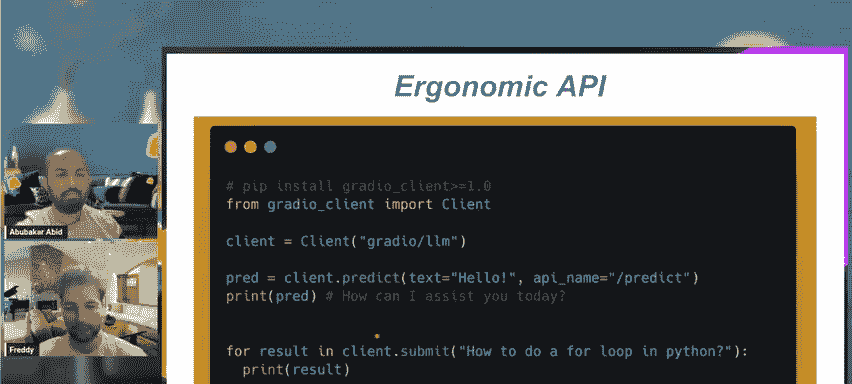

以上我们了解了 Gradio 作为后端服务的强大功能，接下来我们将目光转向客户端，看看如何在实际应用中调用这些 API。

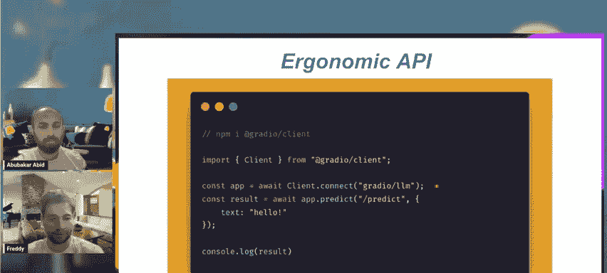

## Gradio 客户端库

Gradio 客户端库的设计遵循三个核心原则：**易用性**、**透明性**和**可移植性**。

### 易用性：简洁的 API

连接到 Gradio API 并获取预测结果非常简单。

**Python 客户端示例**：
```python
from gradio_client import Client

client = Client("https://your-space-url.hf.space/")
result = client.predict(prompt="How to do a for loop in Python?", api_name="/chat")
print(result)
```

**JavaScript 客户端示例**：
```javascript
import { Client } from "@gradio/client";

const client = await Client.connect("https://your-space-url.hf.space/");
const result = await client.predict("/chat", { prompt: "How to do a for loop in Python?" });
console.log(result);
```

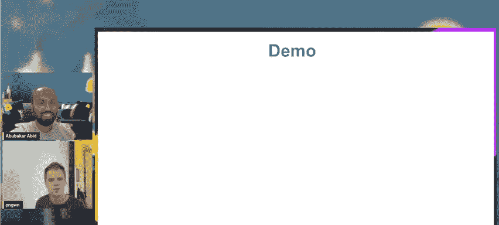

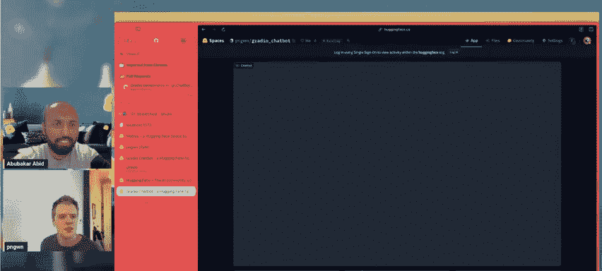

对于流式响应，处理方式同样直观：
```python
job = client.submit(api_name="/chat_stream", ...)
for output in job:
    print(output)
```

### 透明性与高级功能

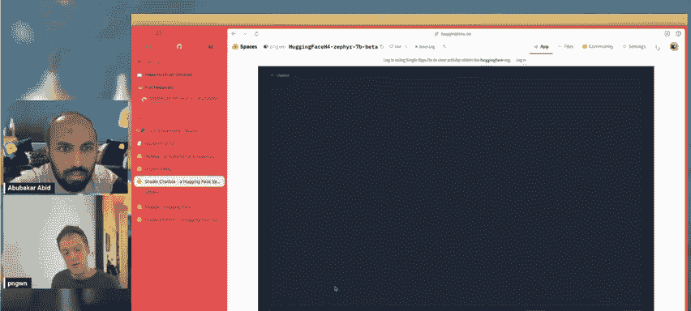

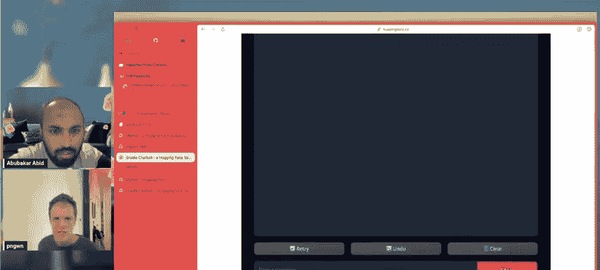

客户端库几乎能实现 UI 上的所有操作。

以下是客户端支持的一些高级功能示例：

**连接到需要认证的空间**：
```python
client = Client("https://private-space.hf.space/", hf_token="your_token_here")
```

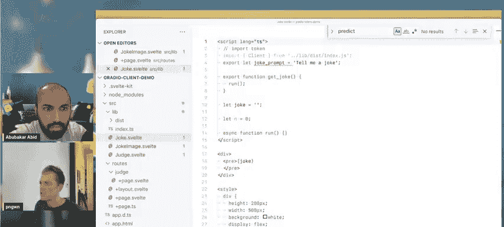

**取消队列中的任务**：
```python
job = client.submit(...)
job.cancel()
```

**检查队列状态**：
```python
status = job.status()
print(f"Queue position: {status.rank}")
```

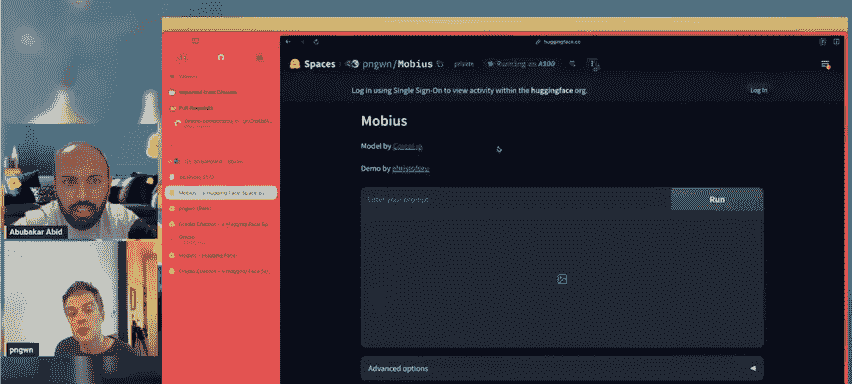

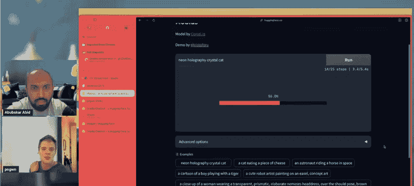

**复制（Duplicate）公共空间**：
此功能允许你将任何公共空间复制到自己的 Hugging Face 账户下，并可以更改硬件、设置隐私和休眠超时。
```python
client = Client.duplicate("original_username/original_space", hf_token="your_token", private=True, hardware="gpu-t4")
```

### 可移植性

Gradio 客户端可以在任何能运行 Python 或 JavaScript 的地方使用，包括：
*   Web 应用、移动应用（React Native）、桌面应用。
*   Node.js、Deno、Cloudflare Workers 等环境。
*   甚至可以通过 `curl` 命令直接调用，为其他语言提供了接入可能。

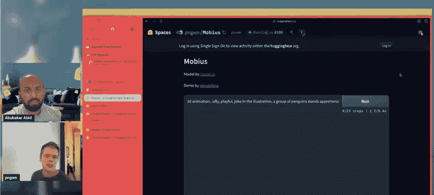

**`curl` 调用示例**：
```bash
curl -X POST “https://your-space.hf.space/run/predict" \
     -H “Content-Type: application/json” \
     -d ‘{“data”: [“your_input”], “fn_index”: 0}’
```

Hugging Chat 的“工具”功能就是一个很好的例子，它内部集成了多个 Gradio 空间来提供图像生成、文档处理等服务。

了解了客户端的基本用法后，让我们通过一个实际案例来串联整个工作流程。

## 实战演示：构建一个笑话生成器

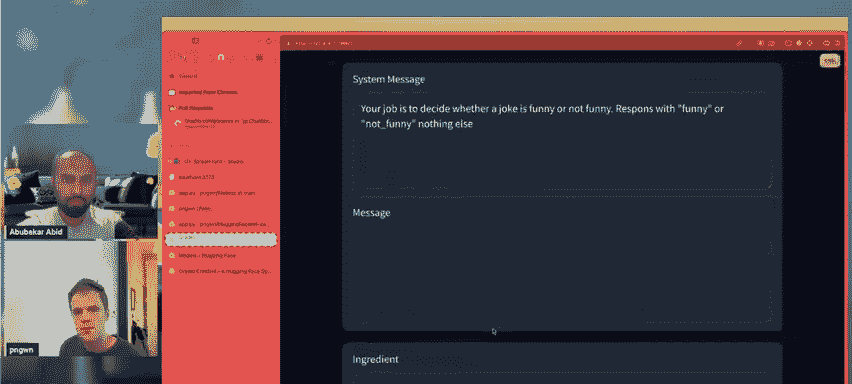

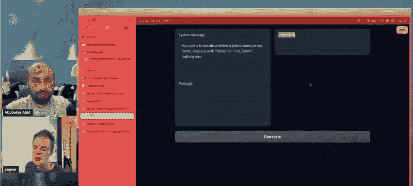

本节将通过一个完整的例子，展示如何利用 Gradio 的生态系统，从探索模型到将其集成到自定义应用中的工作流程。

### 第一步：在 Spaces 上探索和原型设计

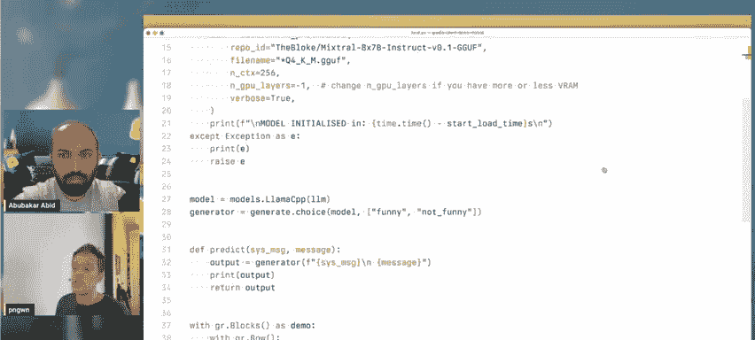

1.  **寻找模型**：在 Hugging Face Hub 或 Spaces 上搜索 trending 的模型，例如一个名为“Llama 3 70B Instruct”的聊天空间。
2.  **交互测试**：在空间的 UI 中直接测试模型。例如，输入提示词 `Write a joke about a penguin`，并调整温度（temperature）等参数，观察输出变化，直到获得满意的结果。
3.  **探索其他模型**：对于需要配图的场景，可以再找一个图像生成空间（如“Mobius”模型）。同样，在 UI 中调整提示词、负向提示词、引导尺度等参数，生成理想的图片。

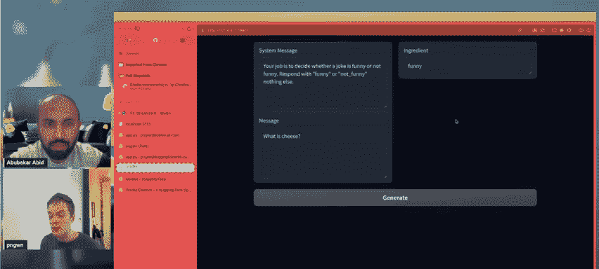

### 第二步：使用客户端集成 API

在确定了要使用的模型和参数后，就可以在自己的应用（如一个 SvelteKit 网站）中通过客户端调用它们。

**调用公开的聊天空间（用于生成笑话）**：
```python
client = Client(“https://username-llama-chat.hf.space/")
joke = client.predict(prompt=“Tell me a short joke featuring a penguin”, max_tokens=100, temperature=0.7)
```

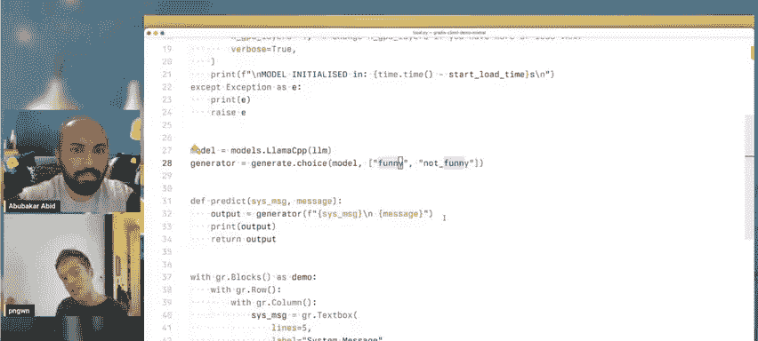

**调用私有的图像生成空间**：
你需要一个具有适当权限的 Hugging Face Token。
```python
import os
client = Client(“https://your-private-space.hf.space/", hf_token=os.environ[“HF_TOKEN”])
image = client.predict(prompt=“A group of penguins on an ice floe...”, ...)
```

### 第三步：集成本地运行的模型

对于更高级或需要结构化输出的用例，你可以在本地运行模型，并通过 Gradio 暴露为 API。

**示例：使用 `llama-cpp-python` 和 `outlines` 库构建一个笑话评判器**
```python
import outlines
from llama_cpp import Llama

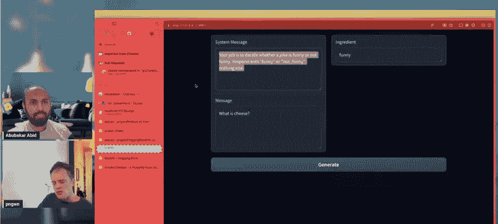

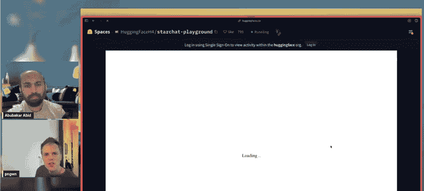

model = Llama(model_path=“./mixtral-8x7b-instruct.gguf”)
generator = outlines.generate.choice(model, [“funny”, “not funny”])

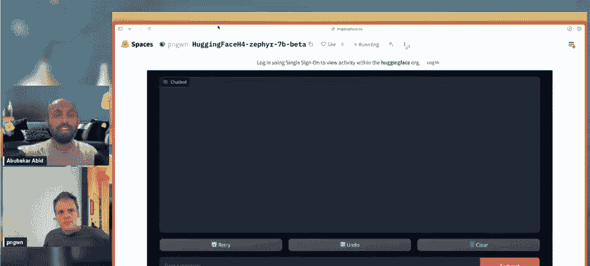

def judge_joke(joke_text):
    system_msg = “Analyze if this joke is funny.”
    full_prompt = f“{system_msg}\n\nJoke: {joke_text}”
    result = generator(full_prompt)
    return result

# 将函数用 Gradio 包装
gr.Interface(fn=judge_joke, inputs=“textbox”, outputs=“text”).launch()
```
然后，你的前端应用可以像调用远程 API 一样，连接到这个本地运行的 Gradio 服务（`http://localhost:7860`）。

这个工作流展示了 Gradio 的核心价值：**在 Python 生态系统中快速实验，并通过统一的客户端接口，无缝地将原型集成到任何应用环境中**。

---

## 总结 🎯

本节课我们一起学习了如何利用 Gradio 生态系统高效地构建机器学习 API。

我们了解到：
1.  Gradio 让每个应用都自动成为**生产就绪的 API**，并提供自动文档、API 记录器和监控仪表板。
2.  通过 **Hugging Face Spaces** 和 **Zero GPU**，部署和扩展变得非常简单且经济。
3.  新发布的 **Gradio Python 和 JavaScript 客户端 1.0** 版本，具有易用、透明和可移植的特点，让你能在各种环境中轻松调用 API。
4.  通过一个完整的**实战演示**，我们看到了从在 Spaces 上探索模型、调整参数，到将模型 API 集成到自定义前端或本地应用中的流畅工作流程。

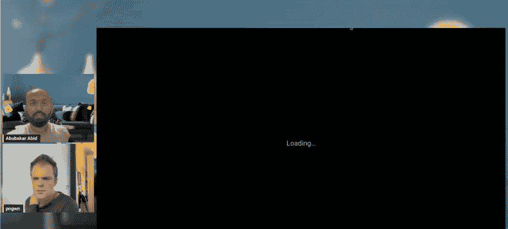

Gradio 的目标是让你能够以最快的速度从机器学习原型迭代到生产 API，我们期待看到你用它构建出精彩的应用！