# 课程01：机器学习领域令人激动的趋势 🚀

在本节课中，我们将学习谷歌Jeff Dean关于机器学习领域最新趋势的演讲。我们将探讨机器学习如何改变我们对计算机能力的认知，以及硬件、算法和数据规模如何共同推动这一领域的飞速发展。课程将涵盖从图像识别、语音处理到大型语言模型和多模态AI的演进，并展望其对社会和科学研究的广泛影响。

---

## 从感知到理解：计算机能力的演变

在过去的十年里，机器学习极大地改变了我们对计算机能力的期望。

回想10到15年前，语音识别虽然存在，但远非无缝，错误率很高。计算机无法从像素层面真正理解图像内容。自然语言处理领域虽有研究，但远未达到对语言概念和多语言数据的深刻理解。

如今，我们已经进入了一个新阶段，我们期望计算机能够以比十年前好得多的方式“看见”和感知我们周围的世界。这为人类几乎所有努力领域都开启了惊人的机遇。这就像动物进化出眼睛一样，我们正处于计算的这个阶段。我们现在拥有了能够“看见”和“感知”的计算机，这完全是另一回事。

另一个重要的观察是规模的不断扩大：更大规模地使用计算资源、专用计算芯片、更庞大、更有趣、更丰富的数据集，以及更大规模的机器学习模型。扩大所有这些要素的规模往往能带来更好的结果。这在过去10到15年里一直如此，每次我们扩大规模，事情都会变得更好。新的能力会突然出现，或者某个问题的准确率达到一个阈值，使其从基本不可用变得可用，从而催生新事物。

此外，由于这种新的、基于机器学习范式，我们想要运行的计算类型与传统的、手写的C++代码有很大不同。因此，我们需要不同类型的硬件来更高效地运行这些计算。从某种意义上说，我们可以专注于一组更狭窄但希望计算机能做得极好、极高效的事情，从而使规模的扩大变得更加可能。

---

## 十年进步：从识别到生成

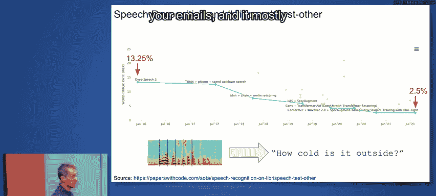

过去十年，计算机能力取得了惊人的进步。

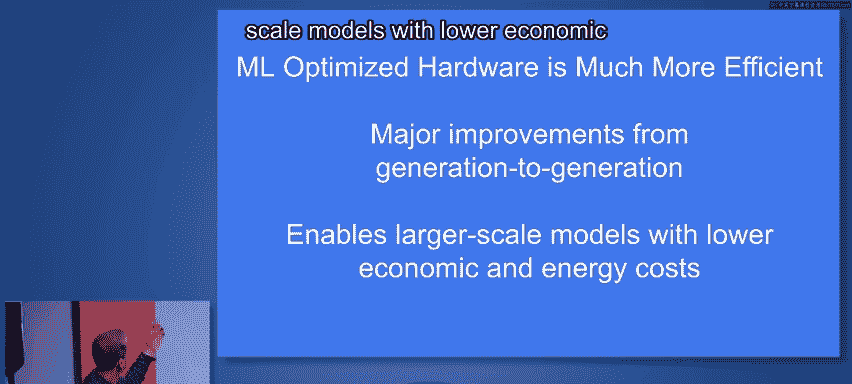

以下是几个关键领域的进展：
*   **图像识别**：从图像的原始像素，到识别出1万或1000个不同类别中的一个分类标签。十年前计算机还做不到，现在可以了。
*   **语音识别**：从音频波形，到识别出5秒音频中说了什么。我们在这方面取得了巨大进步。
*   **机器翻译**：从“Hello, how are you?”到“Bonjour, comment allez-vous?”，将一种人类语言翻译成另一种，是计算机能为我们提供的极其有用的能力。
*   **图像描述**：甚至能从一张“一辆吉普车顶上放着一袋奇多”的照片，生成对该场景的描述，而不仅仅是“豹子”这样的分类标签。

更令人惊讶的是，在最近几年，我们已经能够逆转许多上述箭头。
*   **文本生成图像**：从一个分类标签（如“豹子”）出发，计算机可以生成50或100张不同的豹子图像。
*   **文本生成语音**：从“外面有多冷？”到音频波形（文本转语音），这项技术已存在一段时间，但改进很大。
*   **反向翻译**：翻译的逆转并不奇怪，但效果越来越好。
*   **描述生成媒体**：甚至可以从对所需图像的简短描述，生成图像，有时甚至是短视频片段；或者从对声音的语言描述，生成音频片段。

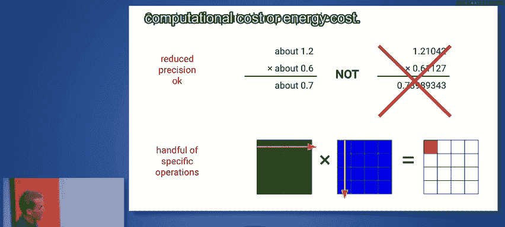

这些能力正在开始涌现，我认为这非常令人兴奋，它展示了我们现在能用计算机构建什么，这与十年前截然不同。

---

## 规模与效率：硬件驱动的进步

扩大规模实际上提高了这些模型的质量。因此，我们需要能够让我们更高效扩大规模的硬件。我们如何用相同的计算硬件成本或相同的能源，获得更高质量的模型？因为它更高效。

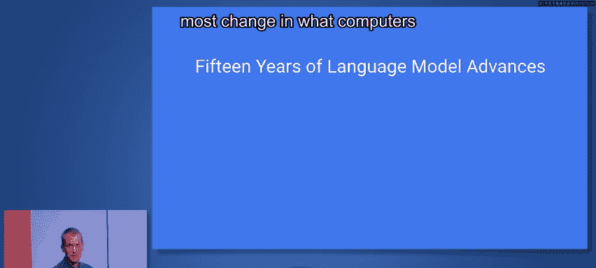

这真正改变了我们设计计算机的方式。机器学习优化的硬件效率要高得多，并且代际之间取得了重大改进。这使得我们能够以更低的经济和能源成本构建更大规模的模型。

神经网络（当今每个人都在使用的机器学习模型）有两个非常好的特性：
1.  **降低精度是可以接受的**：在机器学习模型计算中，使用一到两位十进制数字的精度，而不是六位，通常没问题。有时，这些模型的优化算法甚至会显式引入噪声以使模型学习得更好。因此，降低精度在某种意义上可以被视为为学习过程添加一点噪声，有时效果反而更好。
2.  **计算本质是线性代数**：所有你听到的算法，在某种意义上，都只是组装不同线性代数运算（如矩阵乘法、各种向量运算）的不同方式。这些算法本质上就是大量不同线性代数原语的重复应用。

因此，如果你能制造一台真正擅长**低精度线性代数**的计算机，那正是你以较低计算成本或能源成本学习这些高质量模型所需要的。

---

## 专用硬件：TPU的演进

谷歌在这方面已经进行了很长时间。我们看到系统中确实需要构建这样的系统。最初版本的**张量处理单元（TPU）** 正是为低精度线性代数设计的架构。

我们构建的第一代TPU用于**推理**，即当你已经拥有训练好的机器学习模型，并希望在产品环境中应用它时。第一代TPU是一张单卡系统，与当时的CPU相比，在能效和计算性能上带来了约30到80倍的提升。

后来的TPU世代，我们专注于由多个芯片组成、为**训练和推理**两者设计的大规模系统。这些系统可以组装成我们称为“Pod”的更大规模集群。Pod的规模随着世代更迭而增加，网络连接也采用简单但高带宽的2D网格拓扑，以实现高速、低成本的芯片间通信。

最新的V5系列TPU有两种变体：一种用于推理（256芯片的Pod），另一种V5P则拥有每芯片更多内存、芯片间更高带宽和内存带宽，计算能力接近每芯片0.5 petaflops（16位浮点性能）。

---

## 语言的革命：从统计到理解

我们讨论了图像识别和语音识别的进步，但语言实际上是人们看到计算机能力变化最大的领域之一。

我对语言模型一直感到兴奋，甚至在神经网络流行之前就是如此。早期，我们与谷歌翻译团队合作，构建了一个服务于N-gram模型的系统。它存储了2万亿个词元中每个五词序列出现频率的统计数据，产生了约3000亿个独特的5-gram。我们将其存储在一批机器的内存中，并行查找以翻译句子。我们提出了一种名为“Stupid Backoff”的创新算法，它忽略了一些复杂的数学处理，采用了更简单的方法，效果相当好。从这个经验中得到的一个启示是：**基于大量数据的简单技术非常有效**。

后来，我的同事Tomas Mikolov对分布式表示感兴趣。我们不再将单词表示为离散事物，而是将其表示为非常高维的向量（例如100维）。通过训练过程，我们尝试使出现在相似上下文中的单词在向量空间中彼此靠近，而将出现在不同上下文中的单词推远。在数万亿词元的数据上训练后，我们得到了很好的特性：在这个高维空间中，相似的词（如“mountain”、“hill”、“cliff”）会彼此靠近。更有趣的是，**方向**在这个高维空间中也有意义。例如，从“king”到“queen”的向量方向，大致等同于从“man”到“woman”的方向。从动词现在时到过去时也是一个不同的方向。这表明这些分布式表示蕴含着巨大的力量，它们在代表单词的高维向量中编码了许多不同类型的信息。

我的同事Ilya Sutskever和Quoc Le开发了一个名为**序列到序列学习**的模型。以翻译为例，你逐个单词输入一个英语句子，系统通过循环神经网络（如长短期记忆网络LSTM）更新其内部状态，构建一个对已见句子的分布式表示。当遇到句子结束标记时，模型开始训练以输出正确的翻译句子。通过大量成对的训练数据重复此过程，你可以使用神经编码器对输入序列进行编码，初始化解码器的状态，然后逐个单词解码出正确的翻译句子。扩大这个模型的规模，它就能工作，并在翻译准确率上带来重大改进。

Sutskever和Quoc后来发表了一篇研讨会论文，表明除了翻译，该模型还可以用于多轮对话的上下文。基本上，将你与一方互动的序列（以及计算机模型的回应）作为上下文，可以训练模型生成在先前多轮互动背景下合适的回复。这是同一个序列到序列模型，但现在序列是用所有已发生的对话轮次上下文初始化的。这使得使用神经语言模型进行有效的多轮互动成为可能，这非常巧妙。

---

## Transformer：并行化的突破

随后，一群谷歌研究人员和实习生提出了一个名为**Transformer**的模型。

在之前的循环模型中，你有一些状态，接收下一个词元，进行一些处理以更新状态来吸收该词元，然后用新状态继续处理下一个词元。这是一个非常**顺序化**的过程。在计算机中，我们更喜欢并行处理。

Transformer模型的做法是：并行处理输入中的所有单词，然后通过“注意力”机制关注其中的不同部分，而不是试图强制将所有信息压缩到一个按顺序更新的单一分布式表示中。这意味着保存所有已见词元或单词的所有表示，然后在翻译句子的这一部分或那一部分时，关注那些有意义的片段。这种方法不仅获得了更高的准确率，而且所需的计算量增加了10到100倍以上。

请记住我之前提到的关于计算机硬件改进和专用硬件的内容，它们带来了巨大的、持续的改进。但同时，我们也看到了像Transformer这样的算法改进。这些改进与硬件改进**相乘**，使得我们现在能够通过算法进步加上机器学习硬件，训练规模大得多的模型，从而获得能力更强的模型。

---

## 大型语言模型的演进

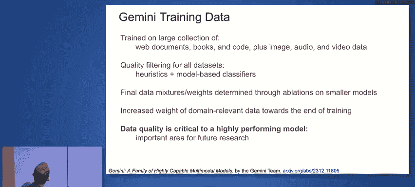

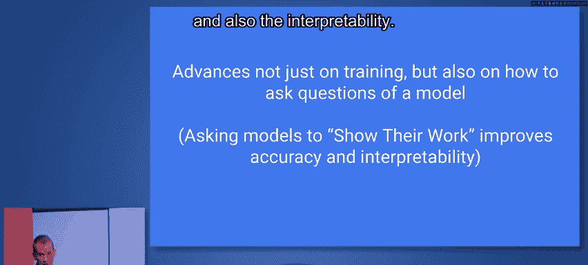

随后，一组研究人员决定使用Transformer模型（而非循环模型）扩大规模，并在对话式数据上进行训练，这产生了相当好的结果。评估方式也得到改进，确保回应既合理又具体，避免过于模糊。

神经语言模型和神经对话模型都在不断演进。从序列到序列工作，到OpenAI的GPT-2，再到谷歌的T5（110亿参数），Transformer架构成为这些大型语言模型的基础。随后出现了GPT-3、DeepMind的Gopher、谷歌的PaLM、DeepMind的Chinchilla、谷歌的PaLM 2、OpenAI的GPT-4，以及**Gemini**。

Gemini是我与同事Oriol Vinyals共同领导的项目。我们的目标不仅是构建理解文本的语言模型，更是构建能够同时处理所有不同模态的模型。你可以输入文本加图像，或音频加一些文本，要求它做某事，它能够流畅、连贯地处理你提供的任何模态组合。我们从项目开始（大约一年前）的目标就是训练世界上最好的多模态模型，并在谷歌各处使用它们。

---

## Gemini：原生多模态模型

Gemini从一开始就是真正的多模态模型。我们不仅想处理文本，还想处理图像、视频和音频。我们将这些模态转化为一系列词元，然后在其上训练基于Transformer的模型。我们有几个不同的解码路径：一个训练用于生成文本词元；另一个则用Transformer学习到的状态初始化解码器，然后可以从该状态生成完整的图像像素集。

我们支持交错这些文本序列。输入不是简单的“一段文本加一张图像”，你可以交错排列。对于视频，你可以输入一个视频帧和一些描述文本，然后是另一个视频帧和一些文本（或音频的字幕），让Transformer利用其在训练中接触过所有这些模态的事实，为你提供的所有不同模态构建共同的表示。

Gemini V1有三种不同规模：**Ultra**是最大规模、能力最强的模型；**Pro**是适合在数据中心运行的良好规模，我们在许多产品环境中使用它；**Nano**模型则非常高效，可以运行在手机或笔记本电脑等设备上。

---

## 大规模训练基础设施

关于我们的训练基础设施，我们希望拥有一个高度可扩展的架构，能够处理高级计算描述，并将其映射到可用的硬件上。例如，你可能将计算描述为两个部分，由底层的Pathways软件系统决定将它们放在哪里（可能一部分在一个Pod上，另一部分在另一个Pod上）。系统知道芯片的位置和它们之间的拓扑与带宽，从而高效地处理通信。

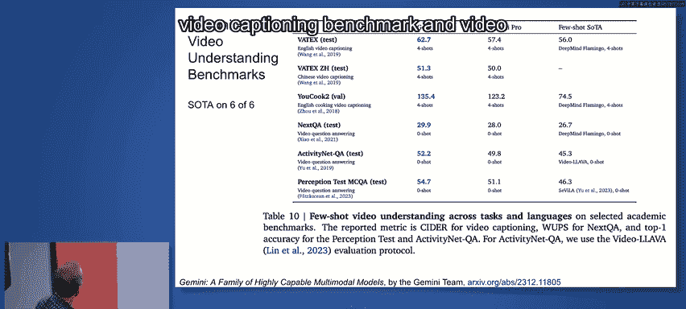

训练大规模模型时，随着规模扩大，故障会发生。最小化故障非常重要。有些故障几乎是人为造成的。例如，我们曾采用滚动升级内核的方式，这对于独立计算没问题，但对于涉及数千台机器的同一计算任务，我们更倾向于同时关闭所有机器、升级所有内核，然后同时重启。优化修复和升级流程后，我们还需要最小化恢复时间。我们使用一个称为“良率”的指标，即模型训练实际取得有用进展的时间百分比。我们采用从其他机器内存中的模型状态副本快速恢复的策略，而不是从分布式文件系统的检查点恢复，这将恢复时间从几分钟缩短到5-10秒。

---

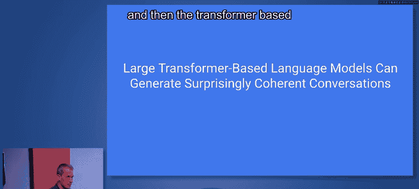

## 数据质量与训练策略

在训练数据方面，我们希望模型是多模态的，因此我们在大量网络文档、各类书籍、多种编程语言的代码以及图像、音频和视频数据上进行训练。我们使用启发式方法过滤这些数据集，有些是手写的启发式规则，有些是基于模型的分类器（用于判断文档质量）。最终的训练数据混合比例是通过在较小模型上进行消融实验确定的。我们还做了一些事情，比如在训练后期增加领域相关数据的权重，以提升多语言能力。

我认为数据质量是一个非常重要且有趣的研究领域。拥有高质量数据对模型在你关心任务上的性能有巨大影响。从某种意义上说，这比模型架构本身更重要。自动学习课程、识别高质量和低质量示例等，是未来研究的重要领域。

---

## 提示工程：激发模型最佳表现

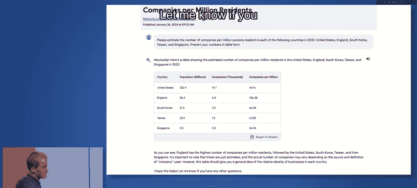

不仅在训练这些模型方面取得了进展，在如何激发模型最佳品质、如何以更有效的方式提问方面也有进展。例如，要求模型**展示其工作过程**（思维链），可以提高模型的准确性和可解释性。

我的同事们提出了一种名为**思维链提示**的技术。这就像小学数学老师鼓励你展示解题步骤一样。如果你直接问模型一个问题，它可能给出错误答案。但如果你在提示中演示如何一步步思考，模型就会模仿这种增量推理步骤，从而更可能得到正确答案。这是一个相当显著的效果。当模型规模足够大时，使用思维链提示的准确率会大幅提升。这表明，如何提问是一门有趣的学问，它既能提高模型的可解释性，又能增加得到正确答案的可能性。

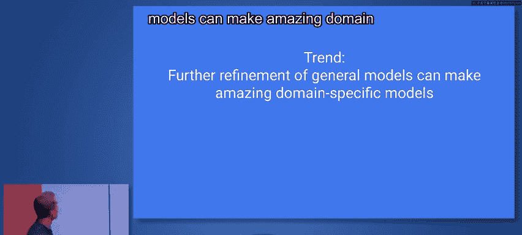

---

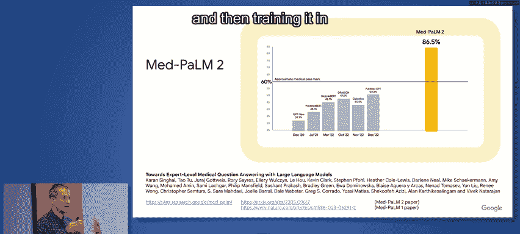

## 多模态推理示例

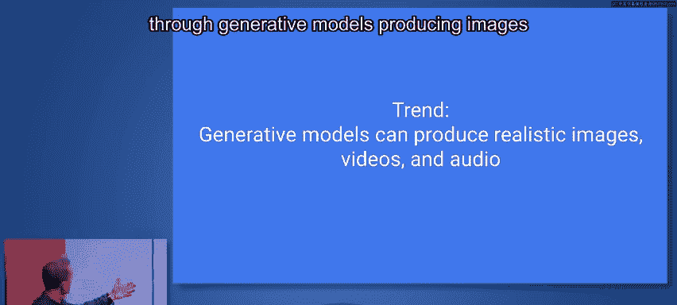

让我们看看Gemini模型的多模态推理能力。一个例子是很好的理解方式。

**提示**：“这是一位学生解答的物理问题（附上手写答案和问题示意图）。请逐步推理这个问题。学生答案正确吗？如果错了，请解释错误并解决问题，确保对数学部分使用LaTeX，最终答案四舍五入到两位小数。”

**模型输出**：“学生答案不正确。学生在计算斜坡起点的势能时犯了错误……正确解法是……（此处为LaTeX渲染的数学推导）……因此，最终答案是（四舍五入到两位小数）。”

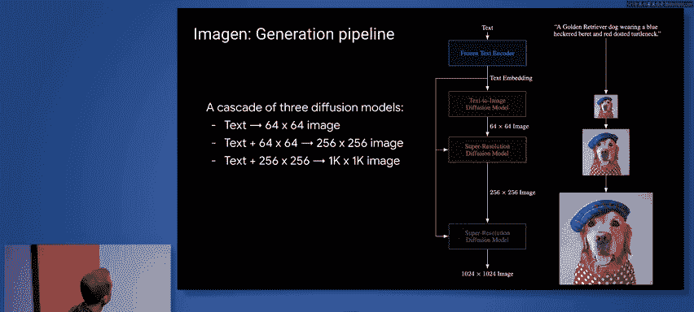

想想这意味着什么。突然间，我们可以给模型提供复杂的多模态输入（如白板照片和问题），并要求它做一些事情，而它能够做到。这可以成为一个惊人的教育工具。个性化辅导的效果比大规模课堂教学高出两个标准差。我认为，通过这种技术实现接近个性化辅导的可能性，已在我们集体的掌握之中。

---

## 模型评估与性能

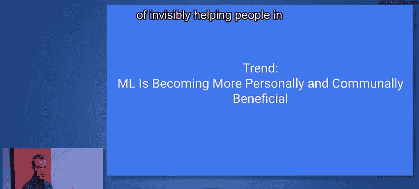

除了定性示例，我们也通过大量基准测试来评估Gemini的能力。评估帮助我们识别模型的优势和弱点，理解训练是否顺利，并做出调整决策（例如，如果数学性能较低，是否应在训练混合中增加数学数据）。这涉及许多复杂的权衡。

最高层次的总结是：在32个学术基准测试中，Gemini在30个上取得了最先进的性能。在文本、通用推理、数学、编码、图像理解、视频理解和音频识别（如语音识别、语音翻译）等多个领域，Gemini Ultra都达到了最先进的水平。特别是在MMLU（大规模多任务语言理解）基准测试中，涵盖了57个不同学科，Gemini取得了约90%的准确率，超过了人类专家水平（约89.8%）。我们的评估团队为此付出了巨大努力。

---

## 实际应用与对话能力

这些大型Transformer模型可以生成令人惊讶的连贯对话。例如，在（当时的）Bard（现已更名为Gemini）中，你可以要求它“为我反转‘hot chips’和‘tensor processing units’的字母”。它不仅完成了任务，还主动提供了实现此功能的Python代码并解释了代码逻辑。这展示了其教育潜力。

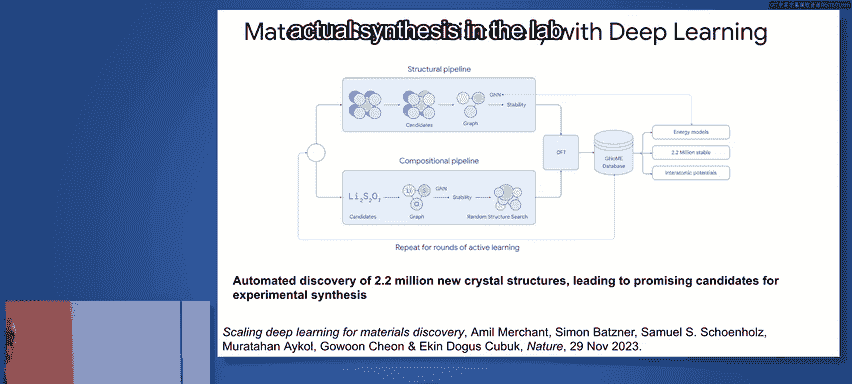

聊天机器人可以有不同的个性。Bard被设计成乐于助人的朋友。我们将Gemini Pro集成到Bard/Gemini中。在第三方评估平台（如LMSys Chatbot Arena）上，用户匿名比较不同聊天机器人的输出，通过Elo评分进行排名。Gemini Pro模型取得了第二高的Elo分数，表现非常出色。

有用户分享了与Bard的互动：他要求模型估算美国、英国、韩国、中国台湾和新加坡每百万居民的公司数量，并以表格形式呈现。Bard不仅提供了表格和解释，在被追问数据来源时，还能透明地列出所使用的具体数据库和统计机构，并指出不同来源的定义差异。这表明模型能够理解细微差别并利用外部知识。

---

## 领域专用模型与生成式AI

另一个重要趋势是：对这些通用模型进行进一步精炼，可以创造出惊人的领域专用模型。

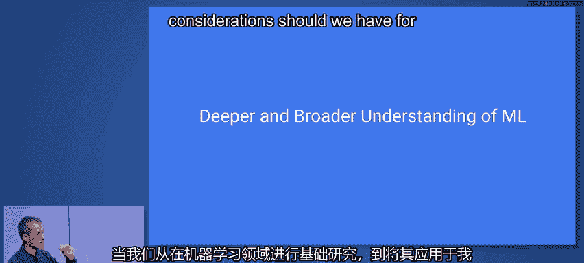

例如，一些同事在通用的PaLM和PaLM 2模型基础上，用医学数据和问题进行进一步训练，得到了Med-PaLM模型。第一个版本就超过了医学执照考试的及格线，而基于PaLM 2的Med-PaLM 2甚至在该任务上达到了专家级水平。这展示了拥有一个强大的通用模型，然后针对特定问题进行领域特定训练的能力。

生成式模型在图像和视频生成方面也取得了显著进展。例如，通过文本提示（如“一辆蒸汽火车穿过一座宏伟的图书馆，伦勃朗风格的油画”），模型可以生成符合描述的图像。这项技术现已集成到Bard中。图像生成过程通常涉及：首先将文本提示编码为分布式向量表示，然后基于此，模型生成一个小尺度图像，再通过另一个模型在文本嵌入和低分辨率图像的条件下提升分辨率，最终生成全尺寸图像。

**规模效应**在生成质量中非常明显。用不同参数规模（从3.5亿到200亿）的模型处理同一个复杂提示时，更大规模的模型在细节、保真度（如文本渲染）和整体一致性上表现要好得多。这表明，规模和更好的训练方法、算法共同促成了更高质量的结果。

---

## 隐形助手与科学应用

机器学习也在许多方面“隐形地”帮助着人们，尤其是在手机上。许多现代智能手机的相机功能通过计算摄影和机器学习方法的结合得到了显著提升，例如人像模式、夜景模式、天文摄影、魔术橡皮擦（去除照片中不想要的物体）等。

还有许多功能涉及模态转换：**来电筛查**（让AI语音接听并转录内容）、**实时字幕**（为手机播放的任何视频生成字幕）。这些功能对于识字能力有限的人群或需要语言翻译的场景具有巨大帮助。

机器学习也开始深刻影响科学领域，特别是材料科学。通过机器学习，可以创建比传统高性能计算模拟快10万倍的快速模拟器，从而能够搜索数以千万计的可能材料，识别出具有有趣特性的候选者。DeepMind的同事利用图神经网络和组合管道，自动发现了220万种新的晶体结构，为实验室合成和测试提供了大量有趣的候选材料。

---

## 医疗健康领域的潜力

机器学习在医疗健康的各个方面都有巨大潜力。我们在医学影像和诊断领域已经进行了相当多的工作，问题范围从2D图像到3D MRI或CT扫描体积，从单一视图到多视图高分辨率病理图像。

我们长期研究的一个领域是**糖尿病视网膜病变**筛查